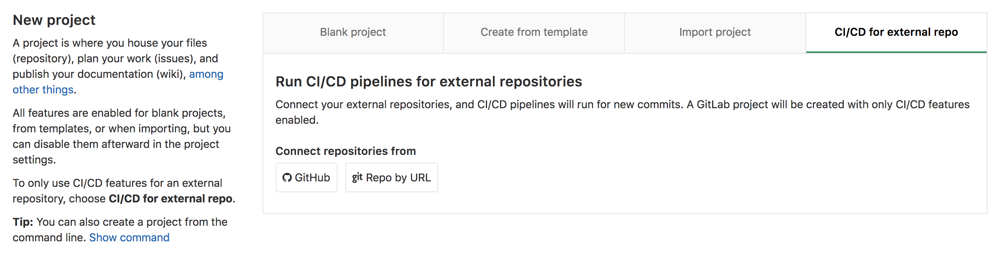

# GitLab CI/CD for external repositories **(PREMIUM)**

>[Introduced](https://gitlab.com/gitlab-org/gitlab/-/merge_requests/4642) in [GitLab Premium](https://about.gitlab.com/pricing/) 10.6.

GitLab CI/CD can be used with:

- [GitHub](github_integration.md).
- [Bitbucket Cloud](bitbucket_integration.md).
- Any other Git server.

Instead of moving your entire project to GitLab, you can connect your
external repository to get the benefits of GitLab CI/CD.

Connecting an external repository sets up [repository mirroring](../../user/project/repository/repository_mirroring.md)
and create a lightweight project with issues, merge requests, wiki, and
snippets disabled. These features
[can be re-enabled later](../../user/project/settings/index.md#sharing-and-permissions).

To connect to an external repository:

<!-- vale gitlab.Spelling = NO -->

1. From your GitLab dashboard, click **New project**.
1. Switch to the **CI/CD for external repository** tab.
1. Choose **GitHub** or **Repo by URL**.
1. The next steps are similar to the [import flow](../../user/project/import/index.md).

<!-- vale gitlab.Spelling = YES -->



## Pipelines for external pull requests

> [Introduced](https://gitlab.com/gitlab-org/gitlab-foss/-/issues/65139) in GitLab Premium 12.3.

When using GitLab CI/CD with an [external repository on GitHub](github_integration.md),
it's possible to run a pipeline in the context of a Pull Request.

When you push changes to a remote branch in GitHub, GitLab CI/CD can run a pipeline for
the branch. However, when you open or update a Pull Request for that branch you may want to:

- Run extra jobs.
- Not run specific jobs.

For example:

```yaml
always-run:
  script: echo 'this should always run'

on-pull-requests:
  script: echo 'this should run on pull requests'
  only:
    - external_pull_requests

except-pull-requests:
  script: echo 'this should not run on pull requests'
  except:
    - external_pull_requests
```

### How it works

When a repository is imported from GitHub, GitLab subscribes to webhooks
for `push` and `pull_request` events. Once a `pull_request` event is received,
the Pull Request data is stored and kept as a reference. If the Pull Request
has just been created, GitLab immediately creates a pipeline for the external
pull request.

If changes are pushed to the branch referenced by the Pull Request and the
Pull Request is still open, a pipeline for the external pull request is
created.

GitLab CI/CD creates 2 pipelines in this case. One for the
branch push and one for the external pull request.

After the Pull Request is closed, no pipelines are created for the external pull
request, even if new changes are pushed to the same branch.

### Additional predefined variables

By using pipelines for external pull requests, GitLab exposes additional
[predefined variables](../variables/predefined_variables.md) to the pipeline jobs.

The variable names are prefixed with `CI_EXTERNAL_PULL_REQUEST_`.

### Limitations

This feature currently does not support Pull Requests from fork repositories. Any Pull Requests from fork repositories are ignored. [Read more](https://gitlab.com/gitlab-org/gitlab/-/issues/5667).

Given that GitLab creates 2 pipelines, if changes are pushed to a remote branch that
references an open Pull Request, both contribute to the status of the Pull Request
via GitHub integration. If you want to exclusively run pipelines on external pull
requests and not on branches you can add `except: [branches]` to the job specs.
[Read more](https://gitlab.com/gitlab-org/gitlab/-/issues/24089#workaround).
