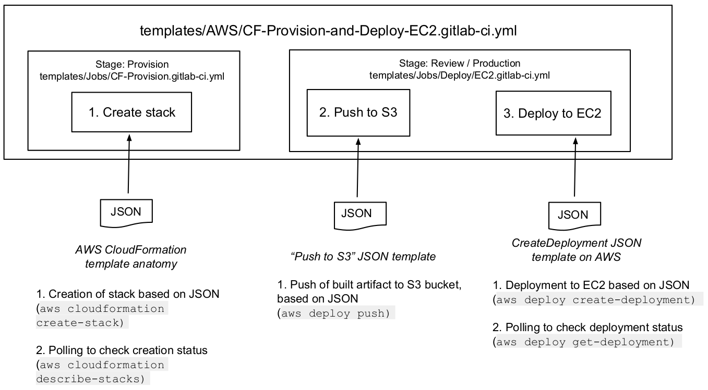

DETAILS:
**Tier:** Free, Premium, Ultimate
**Offering:** GitLab.com, GitLab Self-Managed, GitLab Dedicated

GitLab provides Docker images with the libraries and tools you need to deploy
to AWS. You can reference these images in your CI/CD pipeline.

If you're using GitLab.com and deploying to the [Amazon Elastic Container Service](https://aws.amazon.com/ecs/) (ECS),
read about [deploying to ECS](ecs/deploy_to_aws_ecs.md).

NOTE:
If you are comfortable configuring a deployment yourself and just need to retrieve
AWS credentials, consider using [ID tokens and OpenID Connect](../cloud_services/aws/_index.md).
ID tokens are more secure than storing credentials in CI/CD variables, but do not
work with the guidance on this page.

## Authenticate GitLab with AWS

To use GitLab CI/CD to connect to AWS, you must authenticate.
After you set up authentication, you can configure CI/CD to deploy.

1. Sign on to your AWS account.
1. Create [an IAM user](https://console.aws.amazon.com/iam/home#/home).
1. Select your user to access its details. Go to **Security credentials > Create a new access key**.
1. Note the **Access key ID** and **Secret access key**.
1. In your GitLab project, go to **Settings > CI/CD**. Set the following
   [CI/CD variables](../variables/_index.md):

   | Environment variable name      | Value                   |
   |:-------------------------------|:------------------------|
   | `AWS_ACCESS_KEY_ID`            | Your Access key ID.     |
   | `AWS_SECRET_ACCESS_KEY`        | Your secret access key. |
   | `AWS_DEFAULT_REGION`           | Your region code. You might want to confirm that the AWS service you intend to use is [available in the chosen region](https://aws.amazon.com/about-aws/global-infrastructure/regional-product-services/). |

1. Variables are [protected by default](../variables/_index.md#protect-a-cicd-variable).
   To use GitLab CI/CD with branches or tags that are not protected,
   clear the **Protect variable** checkbox.

## Use an image to run AWS commands

If an image contains the [AWS Command Line Interface](https://aws.amazon.com/cli/),
you can reference the image in your project's `.gitlab-ci.yml` file. Then you can run
`aws` commands in your CI/CD jobs.

For example:

```yaml
deploy:
  stage: deploy
  image: registry.gitlab.com/gitlab-org/cloud-deploy/aws-base:latest
  script:
    - aws s3 ...
    - aws create-deployment ...
  environment: production
```

GitLab provides a Docker image that includes the AWS CLI:

- Images are hosted in the GitLab container registry. The latest image is
  `registry.gitlab.com/gitlab-org/cloud-deploy/aws-base:latest`.
- [Images are stored in a GitLab repository](https://gitlab.com/gitlab-org/cloud-deploy/-/tree/master/aws).

Alternately, you can use an [Amazon Elastic Container Registry (ECR)](https://aws.amazon.com/ecr/) image.
[Learn how to push an image to your ECR repository](https://docs.aws.amazon.com/AmazonECR/latest/userguide/docker-push-ecr-image.html).

You can also use an image from any third-party registry.

## Deploy your application to ECS

You can automate deployments of your application to your [Amazon ECS](https://aws.amazon.com/ecs/)
cluster.

Prerequisites:

- [Authenticate AWS with GitLab](#authenticate-gitlab-with-aws).
- Create a cluster on Amazon ECS.
- Create related components, like an ECS service or a database on Amazon RDS.
- Create an ECS task definition, where the value for the `containerDefinitions[].name` attribute is
  the same as the `Container name` defined in your targeted ECS service. The task definition can be:
  - An existing task definition in ECS.
  - A JSON file in your GitLab project. Use the
    [template in the AWS documentation](https://docs.aws.amazon.com/AmazonECS/latest/developerguide/create-task-definition.html#task-definition-template)
    and save the file in your project. For example `<project-root>/ci/aws/task-definition.json`.

To deploy to your ECS cluster:

1. In your GitLab project, go to **Settings > CI/CD**. Set the following
   [CI/CD variables](../variables/_index.md). You can find these names by
   selecting the targeted cluster on your [Amazon ECS dashboard](https://console.aws.amazon.com/ecs/home).

   | Environment variable name      | Value                   |
   |:-------------------------------|:------------------------|
   | `CI_AWS_ECS_CLUSTER`           | The name of the AWS ECS cluster that you're targeting for your deployments. |
   | `CI_AWS_ECS_SERVICE`           | The name of the targeted service tied to your AWS ECS cluster. Ensure that this variable is scoped to the appropriate environment (`production`, `staging`, `review/*`). |
   | `CI_AWS_ECS_TASK_DEFINITION`   | If the task definition is in ECS, the name of the task definition tied to the service. |
   | `CI_AWS_ECS_TASK_DEFINITION_FILE` | If the task definition is a JSON file in GitLab, the filename, including the path. For example, `ci/aws/my_task_definition.json`. If the name of the task definition in your JSON file is the same name as an existing task definition in ECS, then a new revision is created when CI/CD runs. Otherwise, a brand new task definition is created, starting at revision 1. |

   WARNING:
   If you define both `CI_AWS_ECS_TASK_DEFINITION_FILE` and `CI_AWS_ECS_TASK_DEFINITION`,
   `CI_AWS_ECS_TASK_DEFINITION_FILE` takes precedence.

1. Include this template in `.gitlab-ci.yml`:

   ```yaml
   include:
     - template: AWS/Deploy-ECS.gitlab-ci.yml
   ```

   The `AWS/Deploy-ECS` template ships with GitLab and is available
   [on GitLab.com](https://gitlab.com/gitlab-org/gitlab/-/blob/master/lib/gitlab/ci/templates/AWS/Deploy-ECS.gitlab-ci.yml).

1. Commit and push your updated `.gitlab-ci.yml` to your project's repository.

Your application Docker image is rebuilt and pushed to the GitLab container registry.
If your image is located in a private registry, make sure your task definition is
[configured with a `repositoryCredentials` attribute](https://docs.aws.amazon.com/AmazonECS/latest/developerguide/private-auth.html).

The targeted task definition is updated with the location of the new
Docker image, and a new revision is created in ECS as result.

Finally, your AWS ECS service is updated with the new revision of the
task definition, making the cluster pull the newest version of your
application.

NOTE:
ECS deploy jobs wait for the rollout to complete before exiting. To disable this behavior,
set `CI_AWS_ECS_WAIT_FOR_ROLLOUT_COMPLETE_DISABLED` to a non-empty value.

WARNING:
The [`AWS/Deploy-ECS.gitlab-ci.yml`](https://gitlab.com/gitlab-org/gitlab/-/blob/master/lib/gitlab/ci/templates/AWS/Deploy-ECS.gitlab-ci.yml)
template includes two templates: [`Jobs/Build.gitlab-ci.yml`](https://gitlab.com/gitlab-org/gitlab/-/blob/master/lib/gitlab/ci/templates/Jobs/Build.gitlab-ci.yml)
and [`Jobs/Deploy/ECS.gitlab-ci.yml`](https://gitlab.com/gitlab-org/gitlab/-/blob/master/lib/gitlab/ci/templates/Jobs/Deploy/ECS.gitlab-ci.yml). Do not include these templates on their own. Only include the
`AWS/Deploy-ECS.gitlab-ci.yml` template. These other templates are designed to be
used only with the main template. They may move or change unexpectedly. Also, the job names within
these templates may change. Do not override these job names in your own pipeline,
because the override stops working when the name changes.

## Deploy your application to EC2

GitLab provides a template, called `AWS/CF-Provision-and-Deploy-EC2`,
to assist you in deploying to Amazon EC2.

When you configure related JSON objects and use the template, the pipeline:

1. **Creates the stack**: Your infrastructure is provisioned by using
   the [AWS CloudFormation](https://aws.amazon.com/cloudformation/) API.
1. **Pushes to an S3 bucket**: When your build runs, it creates an artifact.
   The artifact is pushed to an [AWS S3](https://aws.amazon.com/s3/) bucket.
1. **Deploys to EC2**: The content is deployed on an [AWS EC2](https://aws.amazon.com/ec2/) instance.



### Configure the template and JSON

To deploy to EC2, complete the following steps.

1. Create JSON for your stack. Use the [AWS template](https://docs.aws.amazon.com/AWSCloudFormation/latest/UserGuide/template-anatomy.html).
1. Create JSON to push to S3. Include the following details.

   ```json
   {
     "applicationName": "string",
     "source": "string",
     "s3Location": "s3://your/bucket/project_built_file...]"
   }
   ```

   The `source` is the location where a `build` job built your application.
   The build is saved to [`artifacts:paths`](../yaml/_index.md#artifactspaths).

1. Create JSON to deploy to EC2. Use the [AWS template](https://docs.aws.amazon.com/codedeploy/latest/APIReference/API_CreateDeployment.html).
1. Make the JSON objects accessible to your pipeline:
   - If you want these JSON objects saved in your repository, save the objects as three
     separate files.

     In your `.gitlab-ci.yml` file, add [CI/CD variables](../variables/_index.md)
     that point to the file paths relative to the project root. For example,
     if your JSON files are in a `<project_root>/aws` folder:

     ```yaml
     variables:
       CI_AWS_CF_CREATE_STACK_FILE: 'aws/cf_create_stack.json'
       CI_AWS_S3_PUSH_FILE: 'aws/s3_push.json'
       CI_AWS_EC2_DEPLOYMENT_FILE: 'aws/create_deployment.json'
     ```

   - If you do not want these JSON objects saved in your repository, add each object
     as a separate [file type CI/CD variable](../variables/_index.md#use-file-type-cicd-variables)
     in the project settings. Use the same variable names as above.

1. In your `.gitlab-ci.yml` file, create a CI/CD variable for the name of the stack. For example:

   ```yaml
   variables:
     CI_AWS_CF_STACK_NAME: 'YourStackName'
   ```

1. In your `.gitlab-ci.yml` file, add the CI template:

   ```yaml
   include:
     - template: AWS/CF-Provision-and-Deploy-EC2.gitlab-ci.yml
   ```

1. Run the pipeline.

   - Your AWS CloudFormation stack is created based on the content of your
     `CI_AWS_CF_CREATE_STACK_FILE` variable.
     If your stack already exists, this step is skipped, but the `provision`
     job it belongs to still runs.
   - Your built application is pushed to your S3 bucket then and deployed to your EC2 instance, based
     on the related JSON object's content. The deployment job finishes when the deployment to EC2
     is done or has failed.

## Troubleshooting

### Error `'ascii' codec can't encode character '\uxxxx'`

This error can occur when the response from the `aws-cli` utility used by the Cloud Deploy images contains a Unicode character. The Cloud Deploy images we provide do not have a defined locale and default to using ASCII. To resolve this error, add the following CI/CD variable:

```yaml
variables:
  LANG: "UTF-8"
```
