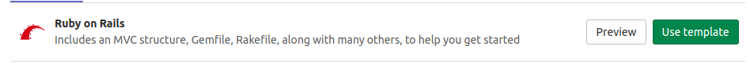
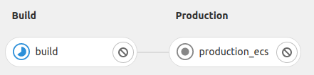
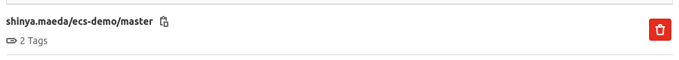
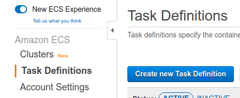
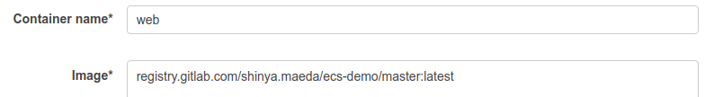
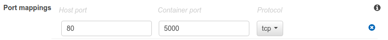
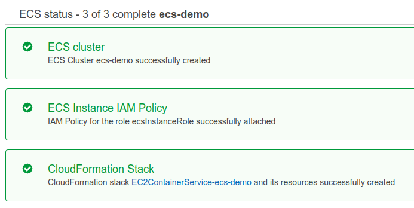
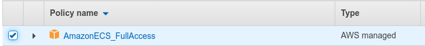

# Getting started with Continuous Deployment to AWS Elastic Container Service **(FREE)**

This step-by-step guide helps you use [Continuous Deployment to ECS](../index.md#deploy-your-application-to-the-aws-elastic-container-service-ecs)
that deploys a project hosted on GitLab.com to [Elastic Container Service](https://aws.amazon.com/ecs/)
(ECS) on AWS.

In this guide, you begin by creating an ECS cluster manually using the AWS console. You create and
deploy a simple application that you create from a GitLab template.

These instructions work for both SaaS and self-managed GitLab instances.
Ensure your own [runners are configured](../../runners/index.md).

## Prerequisites

- An [AWS account](https://aws.amazon.com/premiumsupport/knowledge-center/create-and-activate-aws-account/).
  Sign in with an existing AWS account or create a new one.
- In this guide, you create an infrastructure in [`us-east-2` region](https://docs.aws.amazon.com/AWSEC2/latest/UserGuide/using-regions-availability-zones.html).
  You can use any region, but do not change it after you begin.

## Create an infrastructure and initial deployment on AWS

For deploying an application from GitLab, you must first create an infrastructure and initial
deployment on AWS.
This includes an [ECS cluster](https://docs.aws.amazon.com/AmazonECS/latest/developerguide/clusters.html)
and related components, such as
[ECS task definitions](https://docs.aws.amazon.com/AmazonECS/latest/developerguide/task_definitions.html),
[ECS services](https://docs.aws.amazon.com/AmazonECS/latest/developerguide/ecs_services.html),
and containerized application image.

For the first step here, you create a demo application from a project template.

### Create a new project from a template

Use a GitLab project template to get started. As the name suggests, these projects provide a
bare-bones application built on some well-known frameworks.

1. In GitLab, click the plus icon (**{plus-square}**) at the top of the navigation bar, and select
   **New project**.

1. Click the **Create from template** button, where you can choose from a Ruby on Rails, Spring, or
   NodeJS Express project. For this guide, use the Ruby on Rails template.

   

1. Give your project a name. In this example, it's named `ecs-demo`. Make it public so that you can
   take advantage of the features available in the
   [GitLab Ultimate plan](https://about.gitlab.com/pricing/).

1. Click **Create project**.

Now that you created a demo project, you must containerize the application and push it to the
container registry.

### Push a containerized application image to GitLab Container Registry

[ECS](https://aws.amazon.com/ecs/) is a container orchestration service, meaning that you must
provide a containerized application image during the infrastructure build. To do so, you can use
GitLab [Auto Build](../../../topics/autodevops/stages.md#auto-build)
and [Container Registry](../../../user/packages/container_registry/index.md).

1. Go to **ecs-demo** project on GitLab.
1. Click **Setup up CI/CD**. It brings you to a `.gitlab-ci.yml`
   creation form.
1. Copy and paste the following content into the empty `.gitlab-ci.yml`. This defines
   [a pipeline for continuous deployment to ECS](../index.md#deploy-your-application-to-the-aws-elastic-container-service-ecs).

   ```yaml
   include:
     - template: AWS/Deploy-ECS.gitlab-ci.yml
   ```

1. Click **Commit Changes**. It automatically triggers a new pipeline. In this pipeline, the `build`
   job containerizes the application and pushes the image to [GitLab Container Registry](../../../user/packages/container_registry/index.md).

   

1. Visit **Packages & Registries > Container Registry**. Make sure the application image has been
   pushed.

   

Now you have a containerized application image that can be pulled from AWS. Next, you define the
spec of how this application image is used in AWS.

Note that the `production_ecs` job fails because ECS Cluster is not connected yet. You'll fix this
later.

### Create an ECS task definition

[ECS Task definitions](https://docs.aws.amazon.com/AmazonECS/latest/developerguide/task_definitions.html)
is a specification about how the application image is started by an [ECS service](https://docs.aws.amazon.com/AmazonECS/latest/developerguide/ecs_services.html).

1. Go to **ECS > Task Definitions** on [AWS console](https://aws.amazon.com/).
1. Click **Create new Task Definition**.

   

1. Choose **EC2** as the launch type. Click **Next Step**.
1. Set `ecs_demo` to **Task Definition Name**.
1. Set `512` to **Task Size > Task memory** and **Task CPU**.
1. Click **Container Definitions > Add container**. This opens a container registration form.
1. Set `web` to **Container name**.
1. Set `registry.gitlab.com/<your-namespace>/ecs-demo/master:latest` to **Image**.
   Alternatively, you can copy and paste the image path from the [GitLab Container Registry page](#push-a-containerized-application-image-to-gitlab-container-registry).

   

1. Add a port mapping. Set `80` to **Host Port** and `5000` to **Container port**.

   

1. Click **Create**.

Now you have the initial task definition. Next, you create an actual infrastructure to run the
application image.

### Create an ECS cluster

An [ECS cluster](https://docs.aws.amazon.com/AmazonECS/latest/developerguide/clusters.html)
is a virtual group of [ECS services](https://docs.aws.amazon.com/AmazonECS/latest/developerguide/ecs_services.html).
It's also associated with EC2 or Fargate as the computation resource.

1. Go to **ECS > Clusters** on [AWS console](https://aws.amazon.com/).
1. Click **Create Cluster**.
1. Select **EC2 Linux + Networking** as the cluster template. Click **Next Step**.
1. Set `ecs-demo` to **Cluster Name**.
1. Choose the default [VPC](https://aws.amazon.com/vpc/?vpc-blogs.sort-by=item.additionalFields.createdDate&vpc-blogs.sort-order=desc)
   in **Networking**. If there are no existing VPCs, you can leave it as-is to create a new one.
1. Set all available subnets of the VPC to **Subnets**.
1. Click **Create**.
1. Make sure that the ECS cluster has been successfully created.

   

Now you can register an ECS service to the ECS cluster in the next step.

Note the following:

- Optionally, you can set a SSH key pair in the creation form. This allows you to SSH to the EC2
  instance for debugging.
- If you don't choose an existing VPC, it creates a new VPC by default. This could cause an error if
  it reaches the maximum allowed number of internet gateways on your account.
- The cluster requires an EC2 instance, meaning it costs you [according to the instance-type](https://aws.amazon.com/ec2/pricing/on-demand/).

### Create an ECS Service

[ECS service](https://docs.aws.amazon.com/AmazonECS/latest/developerguide/ecs_services.html)
is a daemon to create an application container based on the [ECS task definition](#create-an-ecs-task-definition).

1. Go to **ECS > Clusters > ecs-demo > Services** on the [AWS console](https://aws.amazon.com/)
1. Click **Deploy**. This opens a service creation form.
1. Select `EC2` in **Launch Type**.
1. Set `ecs_demo` to **Task definition**. This corresponds to [the task definition you created above](#create-an-ecs-task-definition).
1. Set `ecs_demo` to **Service name**.
1. Set `1` to **Desired tasks**.

   

1. Click **Deploy**.
1. Make sure that the created service is active.

   

Note that AWS's console UI changes from time to time. If you can't find a relevant component in the
instructions, select the closest one.

### View the demo application

Now, the demo application is accessible from the internet.

1. Go to **EC2 > Instances** on the [AWS console](https://aws.amazon.com/)
1. Search by `ECS Instance` to find the corresponding EC2 instance that [the ECS cluster created](#create-an-ecs-cluster).
1. Click the ID of the EC2 instance. This brings you to the instance detail page.
1. Copy **Public IPv4 address** and paste it in the browser. Now you can see the demo application
   running.

   

In this guide, HTTPS/SSL is **NOT** configured. You can access to the application through HTTP only
(for example, `http://<ec2-ipv4-address>`).

## Setup Continuous Deployment from GitLab

Now that you have an application running on ECS, you can set up continuous deployment from GitLab.

### Create a new IAM user as a deployer

For GitLab to access the ECS cluster, service, and task definition that you created above, You must
create a deployer user on AWS:

1. Go to **IAM > Users** on [AWS console](https://aws.amazon.com/).
1. Click **Add user**.
1. Set `ecs_demo` to **User name**.
1. Enable **Programmatic access** checkbox. Click **Next: Permissions**.
1. Select `Attach existing policies directly` in **Set permissions**.
1. Select `AmazonECS_FullAccess` from the policy list. Click **Next: Tags** and **Next: Review**.

   

1. Click **Create user**.
1. Take note of the **Access key ID** and **Secret access key** of the created user.

NOTE:
Do not share the secret access key in a public place. You must save it in a secure place.

### Setup credentials in GitLab to let pipeline jobs access to ECS

You can register the access information in [GitLab Environment Variables](../../variables/index.md#custom-cicd-variables).
These variables are injected into the pipeline jobs and can access the ECS API.

1. Go to **ecs-demo** project on GitLab.
1. Go to **Settings > CI/CD > Variables**.
1. Click **Add Variable** and set the following key-value pairs.

   |Key|Value|Note|
   |---|---|---|
   |`AWS_ACCESS_KEY_ID`|`<Access key ID of the deployer>`| For authenticating `aws` CLI. |
   |`AWS_SECRET_ACCESS_KEY`|`<Secret access key of the deployer>`| For authenticating `aws` CLI. |
   |`AWS_DEFAULT_REGION`|`us-east-2`| For authenticating `aws` CLI. |
   |`CI_AWS_ECS_CLUSTER`|`ecs-demo`| The ECS cluster is accessed by `production_ecs` job. |
   |`CI_AWS_ECS_SERVICE`|`ecs_demo`| The ECS service of the cluster is updated by `production_ecs` job. |
   |`CI_AWS_ECS_TASK_DEFINITION`|`ecs_demo`| The ECS task definition is updated by `production_ecs` job. |

### Make a change to the demo application

Change a file in the project and see if it's reflected in the demo application on ECS:

1. Go to **ecs-demo** project on GitLab.
1. Open the file at **app > views > welcome > `index.html.erb`**.
1. Click **Edit**.
1. Change the text to `You're on ECS!`.
1. Click **Commit Changes**. This automatically triggers a new pipeline. Wait until it finishes.
1. [Access the running application on the ECS cluster](#view-the-demo-application). You should see
   this:

   

Congratulations! You successfully set up continuous deployment to ECS.

## Further reading

- If you're interested in more of the continuous deployments to clouds, see [cloud deployments](../index.md).
- If you want to quickly set up DevSecOps in your project, see [Auto DevOps](../../../topics/autodevops/index.md).
- If you want to quickly set up the production-grade environment, see [the 5 Minute Production App](https://gitlab.com/gitlab-org/5-minute-production-app/deploy-template/-/blob/master/README.md).
