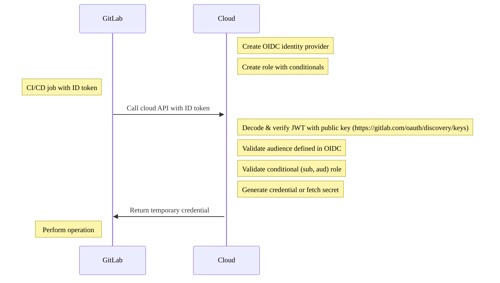

DETAILS:
**Tier:** Free, Premium, Ultimate
**Offering:** GitLab.com, GitLab Self-Managed, GitLab Dedicated

> - [ID tokens](../yaml/_index.md#id_tokens) to support any OIDC provider, including HashiCorp Vault, [introduced](https://gitlab.com/gitlab-org/gitlab/-/issues/356986) in GitLab 15.7.

WARNING:
`CI_JOB_JWT` and `CI_JOB_JWT_V2` were [deprecated in GitLab 15.9](../../update/deprecations.md#old-versions-of-json-web-tokens-are-deprecated)
and are scheduled to be removed in GitLab 17.0. Use [ID tokens](../yaml/_index.md#id_tokens) instead.

GitLab CI/CD supports [OpenID Connect (OIDC)](https://openid.net/developers/how-connect-works/) to
give your build and deployment jobs access to cloud credentials and services.
Historically, teams stored secrets in projects or applied permissions on the GitLab Runner
instance to build and deploy. OIDC capable [ID tokens](../yaml/_index.md#id_tokens) are configurable
in the CI/CD job allowing you to follow a scalable and least-privilege security approach.

In GitLab 15.6 and earlier, you must use `CI_JOB_JWT_V2` instead of an ID token, but it is not customizable.

## Prerequisites

- Account on GitLab.
- Access to a cloud provider that supports OIDC to configure authorization and create roles.

ID tokens support cloud providers with OIDC, including:

- AWS
- Azure
- GCP
- HashiCorp Vault

NOTE:
Configuring OIDC enables JWT token access to the target environments for all pipelines.
When you configure OIDC for a pipeline, you should complete a software supply chain security
review for the pipeline, focusing on the additional access. For more information about supply chain attacks, see
[How a DevOps Platform helps protect against supply chain attacks](https://about.gitlab.com/blog/2021/04/28/devops-platform-supply-chain-attacks/).

## Use cases

- Removes the need to store secrets in your GitLab group or project. Temporary credentials can be retrieved from your cloud provider through OIDC.
- Provides temporary access to cloud resources with granular GitLab conditionals including a group, project, branch, or tag.
- Enables you to define separation of duties in the CI/CD job with conditional access to environments. Historically, apps may have been deployed with a designated GitLab Runner that had only access to staging or production environments. This led to Runner sprawl as each machine had dedicated permissions.
- Allows instance runners to securely access multiple cloud accounts. The access is determined by the JWT token, which is specific to the user running the pipeline.
- Removes the need to create logic to rotate secrets by retrieving temporary credentials by default.

## How it works

Each job can be configured with ID tokens, which are provided as a CI/CD variable containing the [token payload](../secrets/id_token_authentication.md#token-payload). These JWTs can be used to authenticate with the OIDC-supported cloud provider such as AWS, Azure, GCP, or Vault.

### Authorization workflow



1. Create an OIDC identity provider in the cloud (for example, AWS, Azure, GCP, Vault).
1. Create a conditional role in the cloud service that filters to a group, project, branch, or tag.
1. The CI/CD job includes an ID token which is a JWT token. You can use this token for authorization with your cloud API.
1. The cloud verifies the token, validates the conditional role from the payload, and returns a temporary credential.

## Configure a conditional role with OIDC claims

To configure the trust between GitLab and OIDC, you must create a conditional role in the cloud provider that checks against the JWT.
The condition is validated against the JWT to create a trust specifically against two claims, the audience and subject.

- Audience or `aud`: Configured as part of the ID token:

  ```yaml
  job_needing_oidc_auth:
    id_tokens:
      OIDC_TOKEN:
        aud: https://oidc.provider.com
    script:
      - echo $OIDC_TOKEN
  ```

- Subject or `sub`: A concatenation of metadata describing the GitLab CI/CD workflow including the group, project, branch, and tag. The `sub` field is in the following format:
  - `project_path:{group}/{project}:ref_type:{type}:ref:{branch_name}`

| Filter type                                        | Example |
|----------------------------------------------------|---------|
| Filter to any branch                               | Wildcard supported. `project_path:mygroup/myproject:ref_type:branch:ref:*` |
| Filter to specific project, main branch            | `project_path:mygroup/myproject:ref_type:branch:ref:main` |
| Filter to all projects under a group               | Wildcard supported. `project_path:mygroup/*:ref_type:branch:ref:main` |
| Filter to a Git tag                                | Wildcard supported. `project_path:mygroup/*:ref_type:tag:ref:1.0` |

## OIDC authorization with your cloud provider

To connect with your cloud provider, see the following tutorials:

- [Configure OpenID Connect in AWS](aws/_index.md)
- [Configure OpenID Connect in Azure](azure/_index.md)
- [Configure OpenID Connect in Google Cloud](google_cloud/_index.md)
