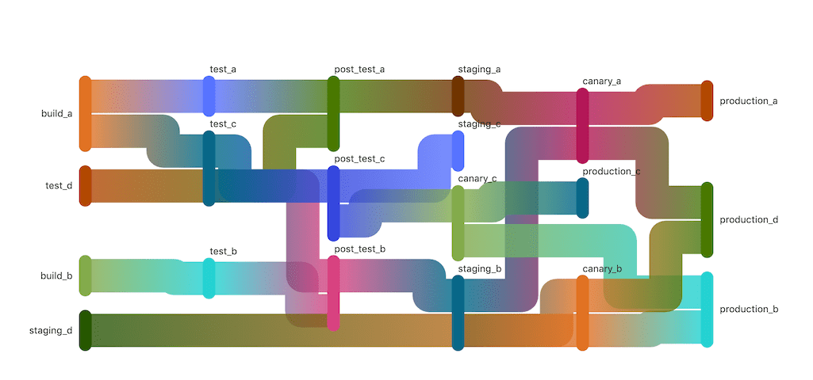
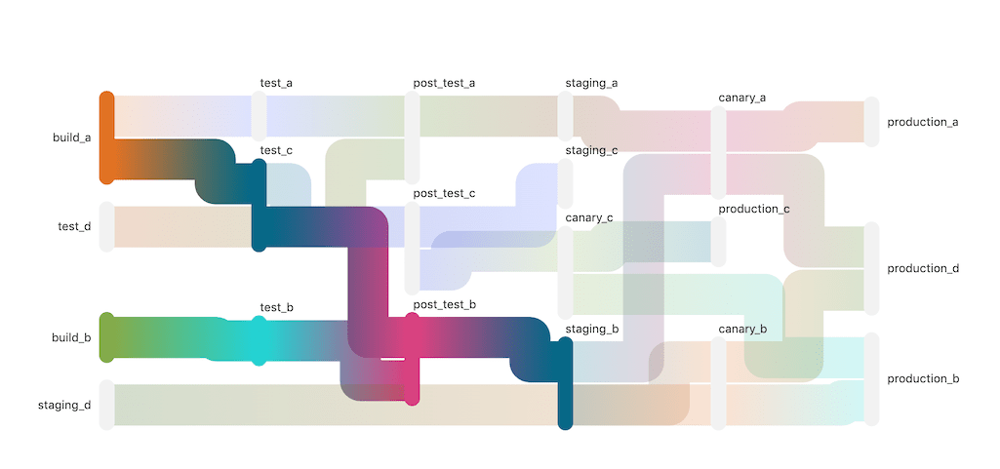

# Directed Acyclic Graph

> - [Introduced](https://gitlab.com/gitlab-org/gitlab-foss/-/issues/47063) in GitLab 12.2.
> - [Feature flag removed](https://gitlab.com/gitlab-org/gitlab/-/issues/206902) in GitLab 12.10.

A [directed acyclic graph](https://www.techopedia.com/definition/5739/directed-acyclic-graph-dag) can be
used in the context of a CI/CD pipeline to build relationships between jobs such that
execution is performed in the quickest possible manner, regardless how stages may
be set up.

For example, you may have a specific tool or separate website that is built
as part of your main project. Using a DAG, you can specify the relationship between
these jobs and GitLab executes the jobs as soon as possible instead of waiting
for each stage to complete.

Unlike other DAG solutions for CI/CD, GitLab does not require you to choose one or the
other. You can implement a hybrid combination of DAG and traditional
stage-based operation within a single pipeline. Configuration is kept very simple,
requiring a single keyword to enable the feature for any job.

Consider a monorepo as follows:

```plaintext
./service_a
./service_b
./service_c
./service_d
```

It has a pipeline that looks like the following:

| build | test | deploy |
| ----- | ---- | ------ |
| build_a | test_a | deploy_a |
| build_b | test_b | deploy_b |
| build_c | test_c | deploy_c |
| build_d | test_d | deploy_d |

Using a DAG, you can relate the `_a` jobs to each other separately from the `_b` jobs,
and even if service `a` takes a very long time to build, service `b` doesn't
wait for it and finishes as quickly as it can. In this very same pipeline, `_c` and
`_d` can be left alone and run together in staged sequence just like any normal
GitLab pipeline.

## Use cases

A DAG can help solve several different kinds of relationships between jobs within
a CI/CD pipeline. Most typically this would cover when jobs need to fan in or out,
and/or merge back together (diamond dependencies). This can happen when you're
handling multi-platform builds or complex webs of dependencies as in something like
an operating system build or a complex deployment graph of independently deployable
but related microservices.

Additionally, a DAG can help with general speediness of pipelines and helping
to deliver fast feedback. By creating dependency relationships that don't unnecessarily
block each other, your pipelines run as quickly as possible regardless of
pipeline stages, ensuring output (including errors) is available to developers
as quickly as possible.

## Usage

Relationships are defined between jobs using the [`needs:` keyword](../yaml/index.md#needs).

Note that `needs:` also works with the [parallel](../yaml/index.md#parallel) keyword,
giving you powerful options for parallelization within your pipeline.

## Limitations

A directed acyclic graph is a complicated feature, and as of the initial MVC there
are certain use cases that you may need to work around. For more information:

- [`needs` requirements and limitations](../yaml/index.md#requirements-and-limitations).
- Related epic [tracking planned improvements](https://gitlab.com/groups/gitlab-org/-/epics/1716).

## Needs Visualization

> - [Introduced](https://gitlab.com/gitlab-org/gitlab/-/issues/215517) in GitLab 13.1 as a [Beta feature](https://about.gitlab.com/handbook/product/#beta).
> - It became a [standard feature](https://gitlab.com/gitlab-org/gitlab/-/merge_requests/38517) in 13.3.
> - [Feature flag removed](https://gitlab.com/gitlab-org/gitlab/-/merge_requests/52208) in GitLab 13.9.

The needs visualization makes it easier to visualize the relationships between dependent jobs in a DAG. This graph displays all the jobs in a pipeline that need or are needed by other jobs. Jobs with no relationships are not displayed in this view.

To see the needs visualization, click on the **Needs** tab when viewing a pipeline that uses the `needs:` keyword.



Clicking a node highlights all the job paths it depends on.



You can also see `needs` relationships in [full pipeline graphs](../pipelines/index.md#view-full-pipeline-graph).
