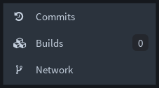
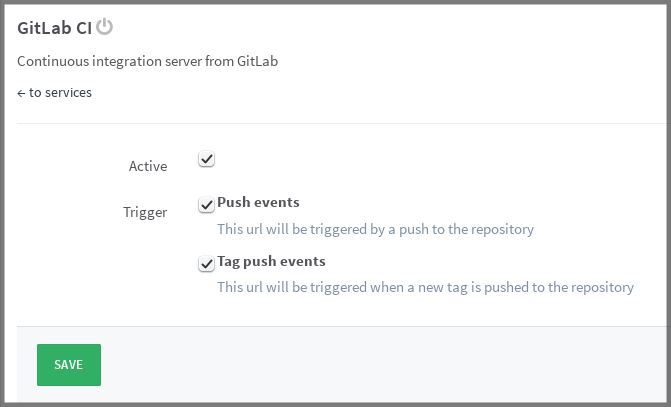

# Enable GitLab CI

GitLab Continuous Integration (CI) is fully integrated into GitLab itself as
of [version 8.0](https://about.gitlab.com/2015/09/22/gitlab-8-0-released/).

First, head over your project's page that you would like to enable GitLab CI
for. If you can see the **Builds** tab in the sidebar, then GitLab CI is
already enabled and you can skip reading the rest of this guide.

If not, there are two ways to enable it in your project.

## Use .gitlab-ci.yml to enable GitLab CI

GitLab CI will be automatically enabled if you just push a
[`.gitlab-ci.yml`](yaml/README.md) in your git repository. GitLab will
pick up the change immediately and GitLab CI will be enabled for this project.
This is the recommended way.

## Manually enable GitLab CI

The second way is to manually enable it in the project's **Services** settings
and this is also the way to disable it if needed.

Go to **Settings > Services** and search for **GitLab CI**. Its state should
be disabled.

Click on **GitLab CI** to enter its settings, mark it as active and hit
**Save**.

Do you see that green dot? Then good, the service is now enabled! You can also
check its status under **Services**.

