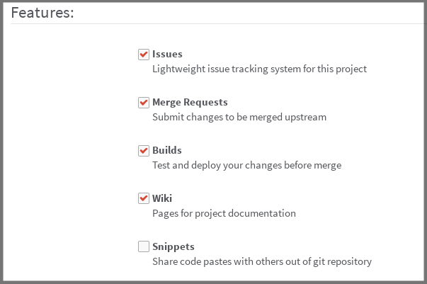

## Enable or disable GitLab CI

_To effectively use GitLab CI, you need a valid [`.gitlab-ci.yml`](yaml/README.md)
file present at the root directory of your project and a
[runner](runners/README.md) properly set up. You can read our
[quick start guide](quick_start/README.md) to get you started._

If you are using an external CI server like Jenkins or Drone CI, it is advised
to disable GitLab CI in order to not have any conflicts with the commits status
API.

---

As of GitLab 8.2, GitLab CI is mainly exposed via the `/builds` page of a
project. Disabling GitLab CI in a project does not delete any previous builds.
In fact, the `/builds` page can still be accessed, although it's hidden from
the left sidebar menu.

GitLab CI is enabled by default on new installations and can be disabled either
individually under each project's settings, or site-wide by modifying the
settings in `gitlab.yml` and `gitlab.rb` for source and Omnibus installations
respectively.

### Per-project user setting

The setting to enable or disable GitLab CI can be found with the name **Builds**
under the **Features** area of a project's settings along with **Issues**,
**Merge Requests**, **Wiki** and **Snippets**. Select or deselect the checkbox
and hit **Save** for the settings to take effect.



---

### Site-wide administrator setting

You can disable GitLab CI site-wide, by modifying the settings in `gitlab.yml`
and `gitlab.rb` for source and Omnibus installations respectively.

Two things to note:

1. Disabling GitLab CI, will affect only newly-created projects. Projects that
   had it enabled prior to this modification, will work as before.
1. Even if you disable GitLab CI, users will still be able to enable it in the
   project's settings.

---

For installations from source, open `gitlab.yml` with your editor and set
`builds` to `false`:

```yaml
## Default project features settings
default_projects_features:
  issues: true
  merge_requests: true
  wiki: true
  snippets: false
  builds: false
```

Save the file and restart GitLab: `sudo service gitlab restart`.

For Omnibus installations, edit `/etc/gitlab/gitlab.rb` and add the line:

```
gitlab_rails['gitlab_default_projects_features_builds'] = false
```

Save the file and reconfigure GitLab: `sudo gitlab-ctl reconfigure`.
