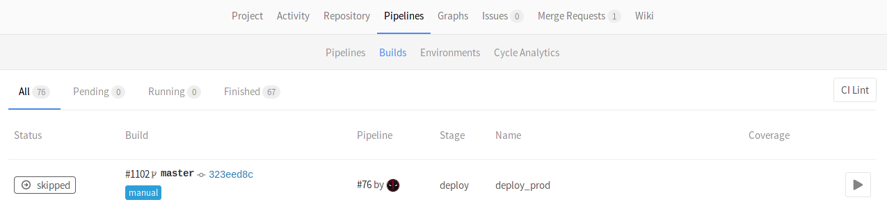

# Introduction to environments and deployments

>**Note:**
Introduced in GitLab 8.9.

During the development of software, there can be many stages until it's ready
for public consumption. You sure want to first test your code and then deploy it
in a testing or staging environment before you release it to the public. That
way you can prevent bugs not only in your software, but in the deployment
process as well.

GitLab CI is capable of not only testing or building your projects, but also
deploying them in your infrastructure, with the added benefit of giving you a
way to track your deployments. In other words, you can always know what is
currently being deployed or has been deployed on your servers.

## Overview

With environments, you can control the Continuous Deployment of your software
all within GitLab. All you need to do is define them in your project's
[`.gitlab-ci.yml`][yaml] as we will explore below. GitLab provides a full
history of your deployments per every environment.

Environments are like tags for your CI jobs, describing where code gets deployed.
Deployments are created when [jobs] deploy versions of code to environments,
so every environment can have one or more deployments. GitLab keeps track of
your deployments, so you always know what is currently being deployed on your
servers.

To better understand how environments and deployments work, let's consider an
example. We assume that you have already created a project in GitLab and set up
a Runner. The example will cover the following:

- We are developing an application
- We want to run tests and build our app on all branches
- Our default branch is `master`
- We deploy the app only when a pipeline on `master` branch is run

Let's see how it all ties together.

## Defining environments

Let's consider the following `.gitlab-ci.yml` example:

```yaml
stages:
  - test
  - build
  - deploy

test:
  stage: test
  script: echo "Running tests"

build:
  stage: build
  script: echo "Building the app"

deploy_staging:
  stage: deploy
  script:
    - echo "Deploy to staging server"
  environment:
    name: staging
    url: https://staging.example.com
  only:
  - master
```

We have defined 3 [stages](yaml/README.md#stages):

- test
- build
- deploy

The jobs assigned to these stages will run in this order. If a job fails, then
the builds that are assigned to the next stage won't run, rendering the pipeline
as failed. In our case, the `test` job will run first, then the `build` and
lastly the `deploy_staging`. With this, we ensure that first the tests pass,
then our app is able to be built successfully, and lastly we deploy to the
staging server.

The `environment` keyword is just a hint for GitLab that this job actually
deploys to this environment's `name`. It can also have a `url` which, as we
will later see, is exposed in various places within GitLab. Each time a job that
has an environment specified and succeeds, a deployment is recorded, remembering
the Git SHA and environment name.

To sum up, with the above `.gitlab-ci.yml` we have achieved that:

- All branches will run the `test` and `build` jobs.
- The `deploy_staging` job will run [only](yaml/README.md#only) on the `master`
  branch which means all merge requests that are created from branches don't
  get to deploy to the staging server
- When a merge request is merged, all jobs will run and the `deploy_staging`
  in particular will deploy our code to a staging server while the deployment
  will be recorded in an environment named `staging`.

Let's now see how that information is exposed within GitLab.

## Viewing the current status of an environment

The environment list under your project's **Pipelines ➔ Environments**, is
where you can find information of the last deployment status of an environment.

Here's how the Environments page looks so far.


There's a bunch of information there, specifically you can see:

- The environment's name with a link to its deployments
- The last deployment ID number and who performed it
- The build ID of the last deployment with its respective job name
- The commit information of the last deployment such as who committed, to what
  branch and the Git SHA of the commit
- The exact time the last deployment was performed
- A button that takes you to the URL that you have defined under the
  `environment` keyword in `.gitlab-ci.yml`
- A button that re-deploys the latest deployment, meaning it runs the job
  defined by the environment name for that specific commit

>**Notes:**
- While you can create environments manually in the web interface, we recommend
  that you define your environments in `.gitlab-ci.yml` first. They will
  be automatically created for you after the first deploy.
- The environments page can only be viewed by Reporters and above. For more
  information on the permissions, see the [permissions documentation][permissions].
- Only deploys that happen after your `.gitlab-ci.yml` is properly configured
  will show up in the "Environment" and "Last deployment" lists.

The information shown in the Environments page is limited to the latest
deployments, but as you may have guessed an environment can have multiple
deployments.

## Viewing the deployment history of an environment

GitLab keeps track of your deployments, so you always know what is currently
being deployed on your servers. That way you can have the full history of your
deployments per every environment right in your browser. Clicking on an
environment will show the history of its deployments. Assuming you have deployed
multiple times already, here's how a specific environment's page looks like.


We can see the same information as when in the Environments page, but this time
all deployments are shown. As you may have noticed, apart from the **Re-deploy**
button there are now **Rollback** buttons for each deployment. Let's see how
that works.

## Rolling back changes

You can't control everything, so sometimes things go wrong. When that unfortunate
time comes GitLab has you covered. Simply by clicking the **Rollback** button
that can be found in the deployments page
(**Pipelines ➔ Environments ➔ `environment name`**) you can relaunch the
job with the commit associated with it.

>**Note:**
Bare in mind that your mileage will vary and it's entirely up to how you define
the deployment process in the job's `script` whether the rollback succeeds or not.
GitLab CI is just following orders.

Thankfully that was the staging server that we had to rollback, and since we
learn from our mistakes, we decided to not make the same again when we deploy
to the production server. Enter manual actions for deployments.

## Manually deploying to environments

Turning a job from running automatically to a manual action is as simple as
adding `when: manual` to it. To expand on our previous example, let's add
another job that this time deploys our app to a production server and is
tracked by a `production` environment. The `.gitlab-ci.yml` looks like this
so far:

```yaml
stages:
  - test
  - build
  - deploy

test:
  stage: test
  script: echo "Running tests"

build:
  stage: build
  script: echo "Building the app"

deploy_staging:
  stage: deploy
  script:
    - echo "Deploy to staging server"
  environment:
    name: staging
    url: https://staging.example.com
  only:
  - master

deploy_prod:
  stage: deploy
  script:
    - echo "Deploy to production server"
  environment:
    name: production
    url: https://example.com
  when: manual
  only:
  - master
```

The `when: manual` action exposes a play button in GitLab's UI and the
`deploy_prod` job will only be triggered if and when we click that play button.
You can find it in the pipeline, build, environment, and deployment views.

| Pipelines | Single pipeline | Environments | Deployments | Builds |
| --------- | ----------------| ------------ | ----------- | -------|
|  |  |  |  |  |

Clicking on the play button in either of these places will trigger the
`deploy_prod` job, and the deployment will be recorded under a new
environment named `production`.

While this is fine for deploying to some stable environments like staging or
production, what happens for branches? So far we haven't defined anything
regarding deployments for branches other than `master`. Dynamic environments
will help us achieve that.

## Dynamic environments

As the name suggests, it is possible to create environments on the fly by just
declaring their names dynamically in `.gitlab-ci.yml`.

GitLab Runner exposes various [environment variables][variables] when a job runs,
and as such you can use them

```
review:
  stage: deploy
  script:
    - rsync -av --delete public /srv/nginx/pages/$CI_BUILD_REF_NAME
  environment:
    name: review/$CI_BUILD_REF_NAME
    url: https://$CI_BUILD_REF_NAME.example.com
```

## Closing an environment

```
review:
  stage: deploy
  script:
    - rsync -av --delete public /srv/nginx/pages/$CI_BUILD_REF_NAME
  environment:
    name: review/$CI_BUILD_REF_NAME
    url: http://$CI_BUILD_REF_NAME.$APPS_DOMAIN
    on_stop: stop_review

stop_review:
  script: rm -rf /srv/nginx/pages/$CI_BUILD_REF_NAME
  when: manual
  environment:
    name: review/$CI_BUILD_REF_NAME
    action: stop
```

## Checkout deployments locally

Since 8.13, a reference in the git repository is saved for each deployment. So
knowing what the state is of your current environments is only a `git fetch`
away.

In your git config, append the `[remote "<your-remote>"]` block with an extra
fetch line:

```
fetch = +refs/environments/*:refs/remotes/origin/environments/*
```

## Further reading

Below are some links you may find interesting:

- [The `.gitlab-ci.yml` definition of environments](yaml/README.md#environment)
- [A blog post on Deployments & Environments](https://about.gitlab.com/2016/08/26/ci-deployment-and-environments/)
- [Review Apps](review_apps.md) Expand dynamic environments to deploy your code for every branch


## TODO

Actions

- View environments +
- View deployments +
   - Rollback deployments +
   - Run deployments +
- View link to environment URL
- View last commit message of deployment +
- View person who performed the deployment +
- View commit SHA that triggered the deployment +
- View branch the deployment was based on +
- View time ago the deployment was performed +

[Pipelines]: pipelines.md
[jobs]: yaml/README.md#jobs
[yaml]: yaml/README.md
[environments]: #environments
[deployments]: #deployments
[permissions]: ../user/permissions.md
[variables]: variables/README.md
