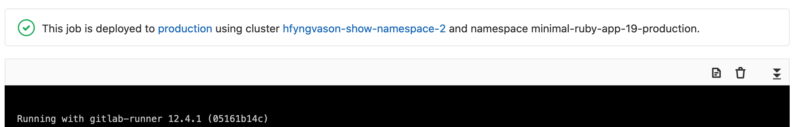

DETAILS:
**Tier:** Free, Premium, Ultimate
**Offering:** GitLab.com, GitLab Self-Managed, GitLab Dedicated

WARNING:
This feature was [deprecated](https://gitlab.com/groups/gitlab-org/configure/-/epics/8) in GitLab 14.5.

If you are deploying to a [Kubernetes cluster](../../user/infrastructure/clusters/_index.md)
associated with your project, you can configure these deployments from your
`.gitlab-ci.yml` file.

NOTE:
Kubernetes configuration isn't supported for Kubernetes clusters
[managed by GitLab](../../user/project/clusters/gitlab_managed_clusters.md).

The following configuration options are supported:

- [`namespace`](https://kubernetes.io/docs/concepts/overview/working-with-objects/namespaces/)

In the following example, the job deploys your application to the
`production` Kubernetes namespace.

```yaml
deploy:
  stage: deploy
  script:
    - echo "Deploy to production server"
  environment:
    name: production
    url: https://example.com
    kubernetes:
      namespace: production
  rules:
    - if: $CI_COMMIT_BRANCH == $CI_DEFAULT_BRANCH
```

When you use the GitLab Kubernetes integration to deploy to a Kubernetes cluster,
you can view cluster and namespace information. On the deployment
job page, it's displayed above the job trace:



## Configure incremental rollouts

Learn how to release production changes to only a portion of your Kubernetes pods with
[incremental rollouts](../environments/incremental_rollouts.md).

## Related topics

- [Deploy boards (deprecated)](../../user/project/deploy_boards.md)
