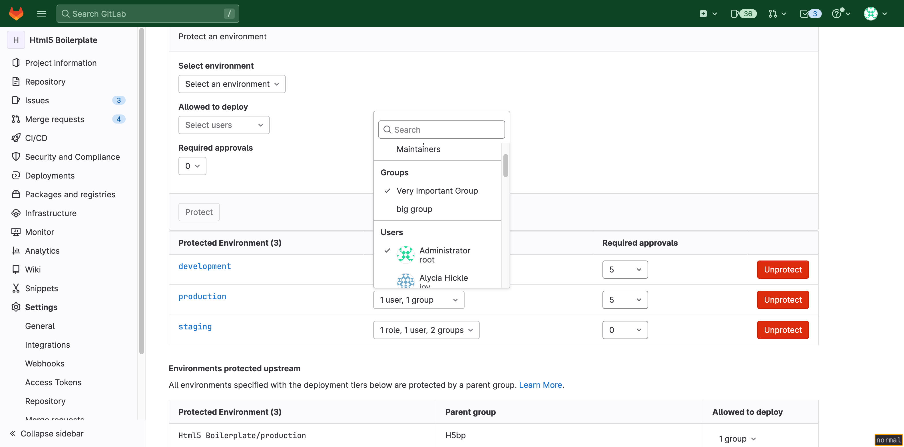
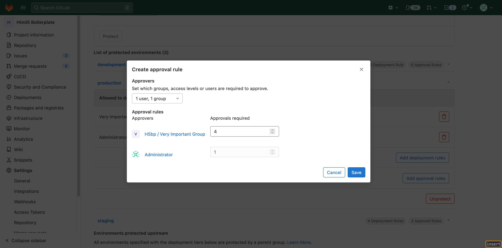

# Deployment approvals

DETAILS:
**Tier:** Premium, Ultimate
**Offering:** GitLab.com, Self-managed, GitLab Dedicated

> - [Introduced](https://gitlab.com/gitlab-org/gitlab/-/issues/343864) in GitLab 14.7 with a flag named `deployment_approvals`. Disabled by default.
> - [Generally available](https://gitlab.com/gitlab-org/gitlab/-/issues/347342) in GitLab 14.8. Feature flag `deployment_approvals` removed.

You can require additional approvals for deployments to protected
environments. Deployments are blocked until all required approvals are
given.

Use deployment approvals to accommodate testing,
security, or compliance processes. For example, you might want to
require approvals for deployments to production environments.

## Configure deployment approvals

You can require approvals for deployments to protected environments in
a project.

Prerequisites:

- To update an environment, you must have at least the Maintainer role.

To configure deployment approvals for a project:

1. Create a deployment job in the `.gitlab-ci.yml` file of your project:

   ```yaml
   stages:
     - deploy

   production:
     stage: deploy
     script:
       - 'echo "Deploying to ${CI_ENVIRONMENT_NAME}"'
     environment:
       name: ${CI_JOB_NAME}
       action: start
   ```

   The job does not need to be manual (`when: manual`).

1. Add the required [approval rules](#add-multiple-approval-rules).

The environments in your project require approval before deployment.

### Add multiple approval rules

> - [Introduced](https://gitlab.com/gitlab-org/gitlab/-/issues/345678) in GitLab 14.10 with a flag named `deployment_approval_rules`. Disabled by default.
> - [Generally available](https://gitlab.com/gitlab-org/gitlab/-/issues/345678) in GitLab 15.0. [Feature flag `deployment_approval_rules`](https://gitlab.com/gitlab-org/gitlab/-/issues/345678) removed.
> - UI configuration [introduced](https://gitlab.com/gitlab-org/gitlab/-/issues/378445) in GitLab 15.11.

Add multiple approval rules to control who can approve and execute deployment jobs.

To configure multiple approval rules, use the [CI/CD settings](protected_environments.md#protecting-environments).
You can [also use the API](../../api/group_protected_environments.md#protect-a-single-environment).

All jobs deploying to the environment are blocked and wait for approvals before running.
Make sure the number of required approvals is less than the number of users allowed to deploy.

After a deployment job is approved, you must [run the job manually](../jobs/job_control.md#run-a-manual-job).

<!--- start_remove The following content will be removed on remove_date: '2024-05-22' -->

### Unified approval setting (deprecated)

> - UI configuration [removed](https://gitlab.com/gitlab-org/gitlab/-/issues/378447) in GitLab
>   15.11.

WARNING:
This feature was [deprecated](https://gitlab.com/groups/gitlab-org/-/epics/9662) in GitLab 16.1 and is planned for removal
in 17.0. Use [multiple approval rules](https://gitlab.com/gitlab-org/gitlab/-/issues/404579) instead. This change
is a breaking change.

To configure approvals for a protected environment:

- Using the [REST API](../../api/protected_environments.md#protect-a-single-environment),
  set the `required_approval_count` field to 1 or more.

After this setting is configured, all jobs deploying to this environment automatically go into a blocked state and wait for approvals before running. Ensure that the number of required approvals is less than the number of users allowed to deploy.

Example:

```shell
curl --header 'Content-Type: application/json' --request POST \
     --data '{"name": "production", "deploy_access_levels": [{"group_id": 9899826}], "required_approval_count": 1}' \
     --header "PRIVATE-TOKEN: <your_access_token>" \
     "https://gitlab.example.com/api/v4/projects/22034114/protected_environments"
```

### Migrate to multiple approval rules

You can migrate a protected environment from unified approval rules to multiple
approval rules. Unified approval rules allow all entities that can deploy to an
environment to approve deployment jobs. To migrate to multiple approval rules,
create a new approval rule for each entity allowed to deploy to the environment.

To migrate to multiple approval rules:

1. On the left sidebar, select **Search or go to** and find your project.
1. Select **Settings > CI/CD**.
1. Expand **Protected environments**.
1. From the **Environment** list, select your environment.
1. For each entity allowed to deploy to the environment:
   1. Select **Add approval rules**.
   1. On the dialog, select which entity is allowed to approve the
      deployment job.
   1. Enter the number of required approvals.
   1. Select **Save**.

Each deployment requires the specified number of approvals from each entity.

For example, the `Production` environment below requires five total approvals,
and allows deployments from only the group `Very Important Group` and the user
`Administrator`:



To migrate, create rules for the `Very Important Group` and `Administrator`. To
preserve the number of required approvals, set the number of required approvals
for `Very Important Group` to four and `Administrator` to one. The new rules
require `Administrator` to approve every deployment job in `Production`.



<!--- end_remove -->

### Allow self-approval

> - [Introduced](https://gitlab.com/gitlab-org/gitlab/-/issues/381418) in GitLab 15.8.
> - Automatic approval [removed](https://gitlab.com/gitlab-org/gitlab/-/merge_requests/124638) in GitLab 16.2 due to [usability issues](https://gitlab.com/gitlab-org/gitlab/-/issues/391258).

By default, the user who triggers a deployment pipeline can't also approve the deployment job.

A GitLab administrator can approve or reject all deployments.

To allow self-approval of a deployment job:

1. On the left sidebar, select **Search or go to** and find your project.
1. Select **Settings > CI/CD**.
1. Expand **Protected environments**.
1. From the **Approval options**, select the **Allow pipeline triggerer to approve deployment** checkbox.

## Approve or reject a deployment

> - [Introduced](https://gitlab.com/gitlab-org/gitlab/-/issues/342180/) in GitLab 14.9

In an environment with multiple approval rules, you can:

- Approve a deployment to allow it to proceed.
- Reject a deployment to prevent it.

Prerequisites:

- You have permission to deploy to the protected environment.

To approve or reject a deployment:

1. On the left sidebar, select **Search or go to** and find your project.
1. Select **Operate > Environments**.
1. Select the environment's name.
1. In the deployment's row, select **Approval options** (**{thumb-up}**).
   Before you approve or reject the deployment, you can view the deployment's approval details.
1. Optional. Add a comment which describes your reason for approving or rejecting the deployment.
1. Select **Approve** or **Reject**.

You can also [use the API](../../api/deployments.md#approve-or-reject-a-blocked-deployment).

The corresponding deployment job does not run automatically after a deployment is approved.

### View the approval details of a deployment

Prerequisites:

- You have permission to deploy to the protected environment.

A deployment to a protected environment can proceed only after all required approvals have been
granted.

To view the approval details of a deployment:

1. On the left sidebar, select **Search or go to** and find your project.
1. Select **Operate > Environments**.
1. Select the environment's name.
1. In the deployment's row, select **Approval options** (**{thumb-up}**).

The approval status details are shown:

- Eligible approvers
- Number of approvals granted, and number of approvals required
- Users who have granted approval
- History of approvals or rejections

## View blocked deployments

Review the status of your deployments, including whether a deployment is blocked.

To view your deployments:

1. On the left sidebar, select **Search or go to** and find your project.
1. Select **Operate > Environments**.
1. Select the environment being deployed to.

A deployment with the **blocked** label is blocked.

To view your deployments, you can also [use the API](../../api/deployments.md#get-a-specific-deployment).
The `status` field indicates whether a deployment is blocked.

## Related topics

- [Deployment approvals feature epic](https://gitlab.com/groups/gitlab-org/-/epics/6832)

<!-- ## Troubleshooting

Include any troubleshooting steps that you can foresee. If you know beforehand what issues
one might have when setting this up, or when something is changed, or on upgrading, it's
important to describe those, too. Think of things that may go wrong and include them here.
This is important to minimize requests for support, and to avoid doc comments with
questions that you know someone might ask.

Each scenario can be a third-level heading, for example `### Getting error message X`.
If you have none to add when creating a doc, leave this section in place
but commented out to help encourage others to add to it in the future. -->
