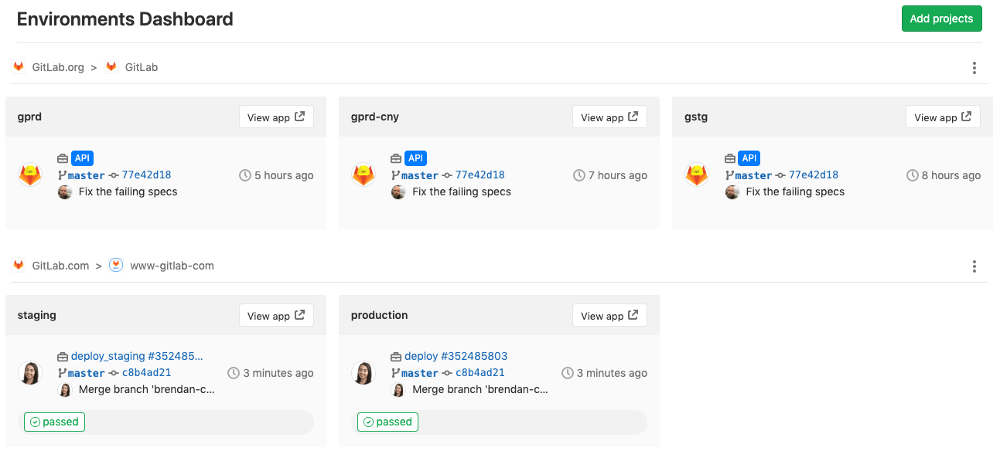

# Environments Dashboard **(PREMIUM)**

> [Introduced](https://gitlab.com/gitlab-org/gitlab/issues/3713) in [GitLab Premium](https://about.gitlab.com/pricing/) 12.5.

The Environments Dashboard provides a cross-project
environment-based view that lets you see the big picture
of what is going on in each environment. From a single
location, you can track the progress as changes flow
from development to staging, and then to production (or
through any series of custom environment flows you can set up).
With an at-a-glance view of multiple projects, you can instantly
see which pipelines are green and which are red allowing you to
diagnose if there is a block at a particular point, or if there’s
a more systemic problem you need to investigate.

You can access the dashboard from the top bar by clicking
**More > Environments**.

The Environments Dashboard displays a maximum of 7 projects
and 3 environments per project.

The listed environments for each project are unique, such as
"production", "staging", etc. Review apps and other grouped
environments are not displayed.

## Adding a project to the dashboard

To add a project to the dashboard:

1. Click the **Add projects** button in the homescreen of the dashboard.
1. Search and add one or more projects using the **Search your projects** field.
1. Click the **Add projects** button.

Once added, you can see a summary of each project's environment operational
health, including the latest commit, pipeline status, and deployment time.

The Environments and [Operations](../../user/operations_dashboard/index.md)
dashboards share the same list of projects. When you add or remove a
project from one, GitLab adds or removes the project from the other.

## Environment dashboards on GitLab.com

GitLab.com users can add public projects to the Environments
Dashboard for free. If your project is private, the group it belongs
to must have a [GitLab Silver](https://about.gitlab.com/pricing/) plan.
