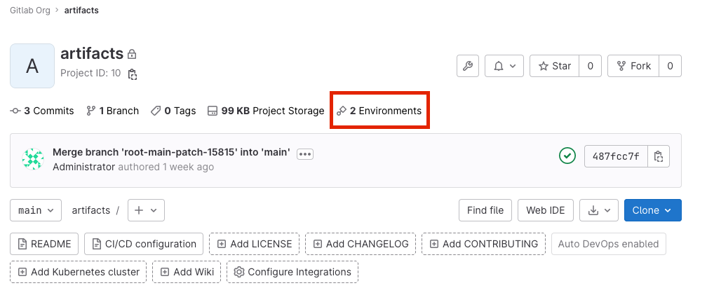
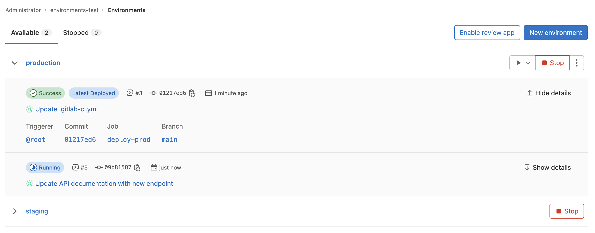
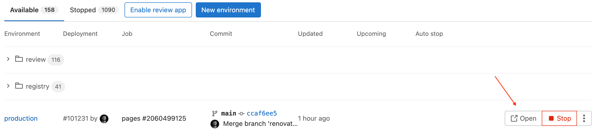
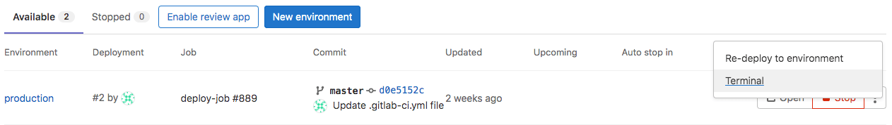

# Environments and deployments

DETAILS:
**Tier:** Free, Premium, Ultimate
**Offering:** GitLab.com, Self-managed, GitLab Dedicated

Environments describe where code is deployed.

Each time [GitLab CI/CD](../index.md) deploys a version of code to an environment,
a deployment is created.

GitLab:

- Provides a full history of deployments to each environment.
- Tracks your deployments, so you always know what is deployed on your
  servers.

If you have a deployment service like [Kubernetes](../../user/infrastructure/clusters/index.md)
associated with your project, you can use it to assist with your deployments.

## View environments and deployments

Prerequisites:

- In a private project, you must have at least the Reporter role. See [Environment permissions](#environment-permissions).

There are a few ways to view a list of environments for a given project:

- On the project's overview page, if at least one environment is available (that is, not stopped).
  

- On the left sidebar, select **Operate > Environments**.
  The environments are displayed.

  

- To view a list of deployments for an environment, select the environment name,
  for example, `staging`.

  

Deployments show up in this list only after a deployment job has created them.

## Search environments

> - [Introduced](https://gitlab.com/gitlab-org/gitlab/-/issues/10754) in GitLab 15.5.
> - [Searching environments within a folder](https://gitlab.com/gitlab-org/gitlab/-/issues/373850) was introduced in GitLab 15.7 with [Feature flag `enable_environments_search_within_folder`](https://gitlab.com/gitlab-org/gitlab/-/issues/382108). Enabled by default.

To search environments by name:

1. On the left sidebar, select **Search or go to** and find your project.
1. Select **Operate > Environments**.
1. In the search bar, enter your search term.
   - The length of your **search term should be 3 or more characters**.
   - Matching applies from the beginning of the environment name.
     - For example, `devel` matches the environment name `development`, but `elop` does not.
   - For environments with a folder name format, matching applies after the base folder name.
     - For example when the name is `review/test-app`, search term `test` matches `review/test-app`.
     - Also searching with the folder name prefixed like `review/test` matches `review/test-app`.

## CI/CD variables

To customize your environments and deployments, you can use any of the
[predefined CI/CD variables](../../ci/variables/predefined_variables.md),
and define custom CI/CD variables.

## Environment states

An environment state indicates whether an environment's [stop job](../../ci/yaml/index.md#environmenton_stop) has run.
There are three states:

- `available`: The environment exists. There might be a deployment.
- `stopping`: The _on stop job_ has started. This state does not apply when there is no on stop job defined.
- `stopped`: Either the _on stop job_ has run, or a user manually stopped the job.

## Types of environments

An environment is either static or dynamic:

- Static environment
  - Usually reused by successive deployments.
  - Has a static name - for example, `staging` or `production`.
  - Created manually or as part of a CI/CD pipeline.
- Dynamic environment
  - Usually created in a CI/CD pipeline and used by only a single deployment, then either stopped or
    deleted.
  - Has a dynamic name, usually based on the value of a CI/CD variable.
  - A feature of [review apps](../review_apps/index.md).

### Create a static environment

You can create a static environment in the UI or in your `.gitlab-ci.yml` file.

#### In the UI

Prerequisites:

- You must have at least the Developer role.

To create a static environment in the UI:

1. On the left sidebar, select **Search or go to** and find your project.
1. Select **Operate > Environments**.
1. Select **Create an environment**.
1. Complete the fields.
1. Select **Save**.

#### In your `.gitlab-ci.yml` file

Prerequisites:

- You must have at least the Developer role.

To create a static environment, in your `.gitlab-ci.yml` file:

1. Define a job in the `deploy` stage.
1. In the job, define the environment `name` and `url`. If an
   environment of that name doesn't exist when the pipeline runs, it is created.

NOTE:
Some characters cannot be used in environment names. For more information about the
`environment` keywords, see the [`.gitlab-ci.yml` keyword reference](../yaml/index.md#environment).

For example, to create an environment named `staging`, with URL `https://staging.example.com`:

```yaml
deploy_staging:
  stage: deploy
  script:
    - echo "Deploy to staging server"
  environment:
    name: staging
    url: https://staging.example.com
```

### Create a dynamic environment

To create a dynamic environment, you use [CI/CD variables](#cicd-variables) that are
unique to each pipeline.

Prerequisites:

- You must have at least the Developer role.

To create a dynamic environment, in your `.gitlab-ci.yml` file:

1. Define a job in the `deploy` stage.
1. In the job, define the following environment attributes:
   - `name`: Use a related CI/CD variable like `$CI_COMMIT_REF_SLUG`. Optionally, add a static
     prefix to the environment's name, which [groups in the UI](#group-similar-environments) all
     environments with the same prefix.
   - `url`: Optional. Prefix the hostname with a related CI/CD variable like `$CI_ENVIRONMENT_SLUG`.

NOTE:
Some characters cannot be used in environment names. For more information about the
`environment` keywords, see the [`.gitlab-ci.yml` keyword reference](../yaml/index.md#environment).

In the following example, every time the `deploy_review_app` job runs the environment's name and
URL are defined using unique values.

```yaml
deploy_review_app:
  stage: deploy
  script: make deploy
  environment:
    name: review/$CI_COMMIT_REF_SLUG
    url: https://$CI_ENVIRONMENT_SLUG.example.com
  rules:
    - if: $CI_COMMIT_BRANCH == "main"
      when: never
    - if: $CI_COMMIT_BRANCH
```

#### Set a dynamic environment URL

Some external hosting platforms generate a random URL for each deployment, for example:
`https://94dd65b.amazonaws.com/qa-lambda-1234567`. That makes it difficult to reference the URL in
the `.gitlab-ci.yml` file.

To address this problem, you can configure a deployment job to report back a set of
variables. These variables include the URL that was dynamically generated by the external service.
GitLab supports the [dotenv (`.env`)](https://github.com/bkeepers/dotenv) file format,
and expands the `environment:url` value with variables defined in the `.env` file.

To use this feature, specify the
[`artifacts:reports:dotenv`](../yaml/artifacts_reports.md#artifactsreportsdotenv) keyword in `.gitlab-ci.yml`.

You can also specify a static part of the URL at `environment:url`, such as
`https://$DYNAMIC_ENVIRONMENT_URL`. If the value of `DYNAMIC_ENVIRONMENT_URL` is `example.com`, the
final result is `https://example.com`.

The assigned URL for the `review/your-branch-name` environment is visible in the UI.

<i class="fa fa-youtube-play youtube" aria-hidden="true"></i>
For an overview, see [Set dynamic URLs after a job finished](https://youtu.be/70jDXtOf4Ig).

In the following example a review app creates a new environment for each merge request:

- The `review` job is triggered by every push, and creates or updates an environment named
  `review/your-branch-name`. The environment URL is set to `$DYNAMIC_ENVIRONMENT_URL`.
- When the `review` job finishes, GitLab updates the `review/your-branch-name` environment's URL.
  It parses the `deploy.env` report artifact, registers a list of variables as runtime-created,
  expands the `environment:url: $DYNAMIC_ENVIRONMENT_URL` and sets it to the environment
  URL.

```yaml
review:
  script:
    - DYNAMIC_ENVIRONMENT_URL=$(deploy-script)                                 # In script, get the environment URL.
    - echo "DYNAMIC_ENVIRONMENT_URL=$DYNAMIC_ENVIRONMENT_URL" >> deploy.env    # Add the value to a dotenv file.
  artifacts:
    reports:
      dotenv: deploy.env                                                       # Report back dotenv file to rails.
  environment:
    name: review/$CI_COMMIT_REF_SLUG
    url: $DYNAMIC_ENVIRONMENT_URL                                              # and set the variable produced in script to `environment:url`
    on_stop: stop_review

stop_review:
  script:
    - ./teardown-environment
  when: manual
  environment:
    name: review/$CI_COMMIT_REF_SLUG
    action: stop
```

Note the following:

- `stop_review` doesn't generate a dotenv report artifact, so it doesn't recognize the
  `DYNAMIC_ENVIRONMENT_URL` environment variable. Therefore you shouldn't set `environment:url` in the
  `stop_review` job.
- If the environment URL isn't valid (for example, the URL is malformed), the system doesn't update
  the environment URL.
- If the script that runs in `stop_review` exists only in your repository and therefore can't use
  `GIT_STRATEGY: none`, configure [merge request pipelines](../../ci/pipelines/merge_request_pipelines.md)
  for these jobs. This ensures that runners can fetch the repository even after a feature branch is
  deleted. For more information, see [Ref Specs for Runners](../pipelines/index.md#ref-specs-for-runners).

NOTE:
For Windows runners, you should use the PowerShell `Add-Content` command to write to `.env` files.

```powershell
Add-Content -Path deploy.env -Value "DYNAMIC_ENVIRONMENT_URL=$DYNAMIC_ENVIRONMENT_URL"
```

### Rename an environment

> - Renaming an environment by using the API was [deprecated](https://gitlab.com/gitlab-org/gitlab/-/issues/338897) in GitLab 15.9.
> - Renaming an environment with the API [removed](https://gitlab.com/gitlab-org/gitlab/-/issues/338897) in GitLab 16.0.

You cannot rename an environment.

To achieve the same result as renaming an environment:

1. [Stop the existing environment](#stop-an-environment-by-using-the-ui).
1. [Delete the existing environment](#delete-an-environment).
1. [Create a new environment](#create-a-static-environment) with the desired name.

## Deployment tier of environments

Sometimes, instead of using an [industry standard](https://en.wikipedia.org/wiki/Deployment_environment)
environment name, like `production`, you might want to use a code name, like `customer-portal`.
While there is no technical reason not to use a name like `customer-portal`, the name
no longer indicates that the environment is used for production. This can affect how metrics
like [deployment frequency](../../user/analytics/dora_metrics.md#how-deployment-frequency-is-calculated)
are calculated.

To indicate that a specific environment is for a specific use,
you can use tiers:

| Environment tier | Environment name examples                          |
|------------------|----------------------------------------------------|
| `production`     | Production, Live                                   |
| `staging`        | Staging, Model, Demo                               |
| `testing`        | Test, QC                                           |
| `development`    | Dev, [Review apps](../review_apps/index.md), Trunk |
| `other`          |                                                    |

By default, GitLab assumes a tier based on [the environment name](../yaml/index.md#environmentname).
You cannot set an environment tier using the UI.
Instead, you can use the [`deployment_tier` keyword](../yaml/index.md#environmentdeployment_tier) to specify a tier.

## Configure manual deployments

You can create a job that requires someone to manually start the deployment.
For example:

```yaml
deploy_prod:
  stage: deploy
  script:
    - echo "Deploy to production server"
  environment:
    name: production
    url: https://example.com
  rules:
    - if: $CI_COMMIT_BRANCH == $CI_DEFAULT_BRANCH
      when: manual
```

The `when: manual` action:

- Exposes the **Run** (**{play}**) button for the job in the GitLab UI, with the text **Can be manually deployed to &lt;environment&gt;**.
- Means the `deploy_prod` job must be triggered manually.

You can find **Run** (**{play}**) in the pipelines, environments, deployments, and jobs views.

## Track newly included merge requests per deployment

GitLab can track newly included merge requests per deployment.
When a deployment succeeds, the system calculates commit-diffs between the latest deployment and the previous deployment.
You can fetch tracking information with the [Deployment API](../../api/deployments.md#list-of-merge-requests-associated-with-a-deployment)
or view it at a post-merge pipeline in [merge request pages](../../user/project/merge_requests/index.md).

To enable tracking configure your environment so either:

- The [environment name](../yaml/index.md#environmentname) doesn't use folders with `/` (long-lived or top-level environments).
- The [environment tier](#deployment-tier-of-environments) is either `production` or `staging`.

  Here are some example configurations using the [`environment` keyword](../yaml/index.md#environment) in `.gitlab-ci.yml`:

  ```yaml
  # Trackable
  environment: production
  environment: production/aws
  environment: development

  # Non Trackable
  environment: review/$CI_COMMIT_REF_SLUG
  environment: testing/aws
  ```

Configuration changes apply only to new deployments. Existing deployment records do not have merge requests linked or unlinked from them.

## Working with environments

Once environments are configured, GitLab provides many features for working with them,
as documented below.

### Environment rollback

When you roll back a deployment on a specific commit,
a _new_ deployment is created. This deployment has its own unique job ID.
It points to the commit you're rolling back to.

For the rollback to succeed, the deployment process must be defined in
the job's `script`.

Only the [deployment jobs](../jobs/index.md#deployment-jobs) are run.
In cases where a previous job generates artifacts that must be regenerated
on deploy, you must manually run the necessary jobs from the pipelines page.
For example, if you use Terraform and your `plan` and `apply` commands are separated
into multiple jobs, you must manually run the jobs to deploy or roll back.

#### Retry or roll back a deployment

If there is a problem with a deployment, you can retry it or roll it back.

To retry or roll back a deployment:

1. On the left sidebar, select **Search or go to** and find your project.
1. Select **Operate > Environments**.
1. Select the environment.
1. To the right of the deployment name:
   - To retry a deployment, select **Re-deploy to environment**.
   - To roll back to a deployment, next to a previously successful deployment, select **Rollback environment**.

NOTE:
If you have [prevented outdated deployment jobs](deployment_safety.md#prevent-outdated-deployment-jobs) in your project,
the rollback buttons might be hidden or disabled.
In this case, see [job retries for rollback deployments](deployment_safety.md#job-retries-for-rollback-deployments).

### Environment URL

> - [Changed](https://gitlab.com/gitlab-org/gitlab/-/issues/337417) to persist arbitrary URLs in GitLab 15.2 [with a flag](../../administration/feature_flags.md) named `soft_validation_on_external_url`. Disabled by default.
> - [Generally available](https://gitlab.com/gitlab-org/gitlab/-/issues/337417) in GitLab 15.3. [Feature flag `soft_validation_on_external_url`](https://gitlab.com/gitlab-org/gitlab/-/issues/367206) removed.

The [environment URL](../yaml/index.md#environmenturl) is displayed in a few
places in GitLab:

- In a merge request as a link:
  
- In the Environments view as a button:
  
- In the Deployments view as a button:
  

You can see this information in a merge request if:

- The merge request is eventually merged to the default branch (usually `main`).
- That branch also deploys to an environment (for example, `staging` or `production`).

For example:


#### Go from source files to public pages

With GitLab [Route Maps](../review_apps/index.md#route-maps), you can go directly
from source files to public pages in the environment set for review apps.

### Stopping an environment

Stopping an environment means its deployments are not accessible on the target server. You must stop
an environment before it can be deleted.

#### Stop an environment when a branch is deleted

You can configure environments to stop when a branch is deleted.

In the following example, a `deploy_review` job calls a `stop_review` job to clean up and stop the
environment.

- Both jobs must have the same [`rules`](../yaml/index.md#rules)
  or [`only/except`](../yaml/index.md#only--except) configuration. Otherwise,
  the `stop_review` job might not be included in all pipelines that include the
  `deploy_review` job, and you cannot trigger `action: stop` to stop the environment automatically.
- The job with [`action: stop` might not run](#the-job-with-action-stop-doesnt-run)
  if it's in a later stage than the job that started the environment.
- If you can't use [merge request pipelines](../pipelines/merge_request_pipelines.md),
  set the [`GIT_STRATEGY`](../runners/configure_runners.md#git-strategy) to `none` in the
  `stop_review` job. Then the [runner](https://docs.gitlab.com/runner/) doesn't
  try to check out the code after the branch is deleted.

```yaml
deploy_review:
  stage: deploy
  script:
    - echo "Deploy a review app"
  environment:
    name: review/$CI_COMMIT_REF_SLUG
    url: https://$CI_ENVIRONMENT_SLUG.example.com
    on_stop: stop_review

stop_review:
  stage: deploy
  script:
    - echo "Remove review app"
  environment:
    name: review/$CI_COMMIT_REF_SLUG
    action: stop
  when: manual
```

#### Stop an environment when a merge request is merged or closed

When you use the [merge request pipelines](../pipelines/merge_request_pipelines.md) configuration,
the `stop` trigger is automatically enabled.

In the following example, the `deploy_review` job calls a `stop_review` job to clean up and stop
the environment.

```yaml
deploy_review:
  stage: deploy
  script:
    - echo "Deploy a review app"
  environment:
    name: review/$CI_COMMIT_REF_SLUG
    on_stop: stop_review
  rules:
    - if: $CI_MERGE_REQUEST_ID

stop_review:
  stage: deploy
  script:
    - echo "Remove review app"
  environment:
    name: review/$CI_COMMIT_REF_SLUG
    action: stop
  rules:
    - if: $CI_MERGE_REQUEST_ID
      when: manual
```

#### Run a pipeline job when environment is stopped

> - Feature flag `environment_stop_actions_include_all_finished_deployments` [introduced](https://gitlab.com/gitlab-org/gitlab/-/issues/435128) in GitLab 16.9. Disabled by default.
> - Feature flag `environment_stop_actions_include_all_finished_deployments` [removed](https://gitlab.com/gitlab-org/gitlab/-/merge_requests/150932) in GitLab 17.0.

You can define a stop job for the environment with an [`on_stop` action](../yaml/index.md#environmenton_stop) in the environment's deploy job.

The stop jobs of finished deployments in the latest finished pipeline are run when an environment is stopped. A deployment or pipeline is _finished_ if it has the successful, canceled, or failed status.

Prerequisites:

- Both the deploy and stop jobs must have the same rules or only/except configuration.
- The stop job must have the following keywords defined:
  - `when`, defined at either:
    - [The job level](../yaml/index.md#when).
    - [In a rules clause](../yaml/index.md#rules). If you use `rules` and `when: manual`, you should
      also set [`allow_failure: true`](../yaml/index.md#allow_failure) so the pipeline can complete
      even if the job doesn't run.
  - `environment:name`
  - `environment:action`

In the following example:

- A `review_app` job calls a `stop_review_app` job after the first job is finished.
- The `stop_review_app` is triggered based on what is defined under `when`. In this
  case, it is set to `manual`, so it needs a
  [manual action](../jobs/job_control.md#create-a-job-that-must-be-run-manually)
  from the GitLab UI to run.
- The `GIT_STRATEGY` is set to `none`. If the `stop_review_app` job is
  [automatically triggered](../environments/index.md#stopping-an-environment),
  the runner doesn't try to check out the code after the branch is deleted.

```yaml
review_app:
  stage: deploy
  script: make deploy-app
  environment:
    name: review/$CI_COMMIT_REF_SLUG
    url: https://$CI_ENVIRONMENT_SLUG.example.com
    on_stop: stop_review_app

stop_review_app:
  stage: deploy
  variables:
    GIT_STRATEGY: none
  script: make delete-app
  when: manual
  environment:
    name: review/$CI_COMMIT_REF_SLUG
    action: stop
```

#### Stop an environment after a certain time period

You can set an environment to stop automatically after a certain time period.

NOTE:
Due to resource limitations, a background worker for stopping environments runs only once every
hour. This means that environments may not be stopped after the exact time period specified, but are
instead stopped when the background worker detects expired environments.

In your `.gitlab-ci.yml` file, specify the [`environment:auto_stop_in`](../yaml/index.md#environmentauto_stop_in)
keyword. Specify the time period in natural language, such as `1 hour and 30 minutes` or `1 day`.
After the time period passes, GitLab automatically triggers a job to stop the environment.

In the following example:

- Each commit on a merge request triggers a `review_app` job that deploys the latest change to the
  environment and resets its expiry period.
- If the environment is inactive for more than a week, GitLab automatically triggers the
  `stop_review_app` job to stop the environment.

```yaml
review_app:
  script: deploy-review-app
  environment:
    name: review/$CI_COMMIT_REF_SLUG
    on_stop: stop_review_app
    auto_stop_in: 1 week
  rules:
    - if: $CI_MERGE_REQUEST_ID

stop_review_app:
  script: stop-review-app
  environment:
    name: review/$CI_COMMIT_REF_SLUG
    action: stop
  rules:
    - if: $CI_MERGE_REQUEST_ID
      when: manual
```

##### View an environment's scheduled stop date and time

When a environment has been [scheduled to stop after a specified time period](#stop-an-environment-after-a-certain-time-period),
you can view its expiration date and time.

To view an environment's expiration date and time:

1. On the left sidebar, select **Search or go to** and find your project.
1. Select **Operate > Environments**.
1. Select the name of the environment.

The expiration date and time is displayed in the upper-left corner, next to the environment's name.

##### Override an environment's scheduled stop date and time

When a environment has been [scheduled to stop after a specified time period](#stop-an-environment-after-a-certain-time-period),
you can override its expiration.

To override an environment's expiration in the UI:

1. On the left sidebar, select **Search or go to** and find your project.
1. Select **Operate > Environments**.
1. Select the deployment name.
1. in the upper-right corner, select the thumbtack (**{thumbtack}**).

To override an environment's expiration in the `.gitlab-ci.yml`:

1. Open the project's `.gitlab-ci.yml`.
1. Update the `auto_stop_in` setting of the corresponding deploy job to `auto_stop_in: never`.

The `auto_stop_in` setting is overridden and the environment remains active until it's stopped
manually.

#### Stop an environment without running the `on_stop` action

There may be times when you want to stop an environment without running the defined
[`on_stop`](../yaml/index.md#environmenton_stop) action. For example, you want to delete many
environments without using [compute quota](../pipelines/compute_minutes.md).

To stop an environment without running the defined `on_stop` action, execute the
[Stop an environment API](../../api/environments.md#stop-an-environment) with the parameter
`force=true`.

#### Stop an environment by using the UI

NOTE:
To trigger an `on_stop` action and manually stop an environment from the
Environments view, the stop and deploy jobs must be in the same
[`resource_group`](../yaml/index.md#resource_group).

To stop an environment in the GitLab UI:

1. On the left sidebar, select **Search or go to** and find your project.
1. Select **Operate > Environments**.
1. Next to the environment you want to stop, select **Stop**.
1. On the confirmation dialog, select **Stop environment**.

#### Multiple stop actions for an environment

> - [Generally available](https://gitlab.com/gitlab-org/gitlab/-/issues/358911) in GitLab 15.0. [Feature flag `environment_multiple_stop_actions`](https://gitlab.com/gitlab-org/gitlab/-/merge_requests/86685) removed.

To configure multiple **parallel** stop actions on an environment, specify the
[`on_stop`](../yaml/index.md#environmenton_stop) keyword across multiple
[deployment jobs](../jobs/index.md#deployment-jobs) for the same `environment`, as defined in the
`.gitlab-ci.yml` file.

When an environment is stopped, the matching `on_stop` actions from only successful deployment jobs are run in parallel, in no particular order.

NOTE:
All `on_stop` actions for an environment must belong to the same pipeline. To use multiple `on_stop` actions in
[downstream pipelines](../pipelines/downstream_pipelines.md), you must configure the environment actions in
the parent pipeline. For more information, see [downstream pipelines for deployments](../pipelines/downstream_pipelines.md#advanced-example).

In the following example, for the `test` environment there are two deployment jobs:

- `deploy-to-cloud-a`
- `deploy-to-cloud-b`

When the environment is stopped, the system runs `on_stop` actions `teardown-cloud-a` and
`teardown-cloud-b` in parallel.

```yaml
deploy-to-cloud-a:
  script: echo "Deploy to cloud a"
  environment:
    name: test
    on_stop: teardown-cloud-a

deploy-to-cloud-b:
  script: echo "Deploy to cloud b"
  environment:
    name: test
    on_stop: teardown-cloud-b

teardown-cloud-a:
  script: echo "Delete the resources in cloud a"
  environment:
    name: test
    action: stop
  when: manual

teardown-cloud-b:
  script: echo "Delete the resources in cloud b"
  environment:
    name: test
    action: stop
  when: manual
```

### Delete an environment

Delete an environment when you want to remove it and all its deployments.

Prerequisites:

- You must have at least the Developer role.
- You must [stop](#stopping-an-environment) the environment before it can be deleted.

To delete an environment:

1. On the left sidebar, select **Search or go to** and find your project.
1. Select **Operate > Environments**.
1. Select the **Stopped** tab.
1. Next to the environment you want to delete, select **Delete environment**.
1. On the confirmation dialog, select **Delete environment**.

### Access an environment for preparation or verification purposes

You can define a job that accesses an environment for various purposes, such as verification or preparation. This
effectively bypasses deployment creation, so that you can adjust your CD workflow more accurately.

To do so, add either `action: prepare`, `action: verify`, or `action: access` to the `environment` section of your job:

```yaml
build:
  stage: build
  script:
    - echo "Building the app"
  environment:
    name: staging
    action: prepare
    url: https://staging.example.com
```

This gives you access to environment-scoped variables, and can be used to protect builds from unauthorized access. Also,
it's effective to avoid the [prevent outdated deployment jobs](deployment_safety.md#prevent-outdated-deployment-jobs) feature.

### Group similar environments

You can group environments into collapsible sections in the UI.

For example, if all of your environments start with the name `review`,
then in the UI, the environments are grouped under that heading:


The following example shows how to start your environment names with `review`.
The `$CI_COMMIT_REF_SLUG` variable is populated with the branch name at runtime:

```yaml
deploy_review:
  stage: deploy
  script:
    - echo "Deploy a review app"
  environment:
    name: review/$CI_COMMIT_REF_SLUG
```

### Environment incident management

Production environments can go down unexpectedly, including for reasons outside
of your control. For example, issues with external dependencies, infrastructure,
or human error can cause major issues with an environment. Things like:

- A dependent cloud service goes down.
- A 3rd party library is updated and it's not compatible with your application.
- Someone performs a DDoS attack to a vulnerable endpoint in your server.
- An operator misconfigures infrastructure.
- A bug is introduced into the production application code.

You can use [incident management](../../operations/incident_management/index.md)
to get alerts when there are critical issues that need immediate attention.

#### View the latest alerts for environments

DETAILS:
**Tier:** Ultimate
**Offering:** GitLab.com, Self-managed, GitLab Dedicated

If you [set up alerts for Prometheus metrics](../../operations/incident_management/integrations.md#configuration),
alerts for environments are shown on the environments page. The alert with the highest
severity is shown, so you can identify which environments need immediate attention.


When the issue that triggered the alert is resolved, it is removed and is no
longer visible on the environments page.

If the alert requires a [rollback](#retry-or-roll-back-a-deployment), you can select the
deployment tab from the environment page and select which deployment to roll back to.

#### Auto Rollback

DETAILS:
**Tier:** Ultimate
**Offering:** GitLab.com, Self-managed, GitLab Dedicated

In a typical Continuous Deployment workflow, the CI pipeline tests every commit before deploying to
production. However, problematic code can still make it to production. For example, inefficient code
that is logically correct can pass tests even though it causes severe performance degradation.
Operators and SREs monitor the system to catch these problems as soon as possible. If they find a
problematic deployment, they can roll back to a previous stable version.

GitLab Auto Rollback eases this workflow by automatically triggering a rollback when a
[critical alert](../../operations/incident_management/alerts.md)
is detected.
For GitLab to select the appropriate environment for the rollback, the alert should contain a `gitlab_environment_name` key with the name of the environment.
GitLab selects and redeploys the most recent successful deployment.

Limitations of GitLab Auto Rollback:

- The rollback is skipped if a deployment is running when the alert is detected.
- A rollback can happen only once in three minutes. If multiple alerts are detected at once, only
  one rollback is performed.

GitLab Auto Rollback is turned off by default. To turn it on:

1. On the left sidebar, select **Search or go to** and find your project.
1. Select **Settings > CI/CD**.
1. Expand **Automatic deployment rollbacks**.
1. Select the checkbox for **Enable automatic rollbacks**.
1. Select **Save changes**.

### Web terminals (deprecated)

WARNING:
This feature was [deprecated](https://gitlab.com/groups/gitlab-org/configure/-/epics/8) in GitLab 14.5.

If you deploy to your environments with the help of a deployment service (for example,
the [Kubernetes integration](../../user/infrastructure/clusters/index.md)), GitLab can open
a terminal session to your environment. You can then debug issues without leaving your web browser.

The Web terminal is a container-based deployment, which often lack basic tools (like an editor),
and can be stopped or restarted at any time. If this happens, you lose all your
changes. Treat the Web terminal as a debugging tool, not a comprehensive online IDE.

Web terminals:

- Are available to project Maintainers and Owners only.
- Must [be enabled](../../administration/integration/terminal.md).

In the UI, you can view the Web terminal by selecting **Terminal** from the actions menu:



You can also access the terminal button from the page for a specific environment:


Select the button to establish the terminal session:


This works like any other terminal. You're in the container created
by your deployment so you can:

- Run shell commands and get responses in real time.
- Check the logs.
- Try out configuration or code tweaks.

You can open multiple terminals to the same environment. They each get their own shell
session and even a multiplexer like `screen` or `tmux`.

### Check out deployments locally

A reference in the Git repository is saved for each deployment, so
knowing the state of your current environments is only a `git fetch` away.

In your Git configuration, append the `[remote "<your-remote>"]` block with an extra
fetch line:

```plaintext
fetch = +refs/environments/*:refs/remotes/origin/environments/*
```

### Archive Old Deployments

When a new deployment happens in your project,
GitLab creates [a special Git-ref to the deployment](#check-out-deployments-locally).
Since these Git-refs are populated from the remote GitLab repository,
you could find that some Git operations, such as `git-fetch` and `git-pull`,
become slower as the number of deployments in your project increases.

To maintain the efficiency of your Git operations, GitLab keeps
only recent deployment refs (up to 50,000) and deletes the rest of the old deployment refs.
Archived deployments are still available, in the UI or by using the API, for auditing purposes.
Also, you can still fetch the deployed commit from the repository
with specifying the commit SHA (for example, `git checkout <deployment-sha>`), even after archive.

NOTE:
GitLab preserves all commits as [`keep-around` refs](../../user/project/repository/reducing_the_repo_size_using_git.md)
so that deployed commits are not garbage collected, even if it's not referenced by the deployment refs.

### Limit the environment scope of a CI/CD variable

By default, all [CI/CD variables](../variables/index.md) are available to all jobs in a pipeline.
If a test tool in a job becomes compromised, the tool could attempt to retrieve all
CI/CD variables available to the job. To help mitigate this kind of supply chain attack,
you should limit the environment scope of sensitive variables to only the jobs that require them.

Limit the environment scope of a CI/CD variable by defining which environments it
can be available for. The default environment scope is the `*` wildcard, so any job
can access the variable.

You can use specific matching to select a particular environment. For example, set
the variable's environment scope to `production` to only allow jobs with an [environment](../yaml/index.md#environment)
of `production` to access the variable.

You can also use wildcard matching (`*`) to select a particular environment group,
like all [review apps](../review_apps/index.md) with `review/*`.

For example, with these four environments:

- `production`
- `staging`
- `review/feature-1`
- `review/feature-2`

These environment scopes match as follows:

| ↓ Scope / Environment → | `production` | `staging` | `review/feature-1` | `review/feature-2` |
|:------------------------|:-------------|:----------|:-------------------|:-------------------|
| `*`                     | Match        | Match     | Match              | Match              |
| `production`            | Match        |           |                    |                    |
| `staging`               |              | Match     |                    |                    |
| `review/*`              |              |           | Match              | Match              |
| `review/feature-1`      |              |           | Match              |                    |

You should not use environment-scoped variables with [`rules`](../yaml/index.md#rules)
or [`include`](../yaml/index.md#include). The variables might not be defined when
GitLab validates the pipeline configuration at pipeline creation.

## Environment permissions

Depending on your role, you can interact with environments in public
and private projects.

### View environments

- In public projects, anyone can view a list of environments, including non-members.
- In private projects, you must have at least the Reporter role to view a list of environments.

### Create and update environments

- You must have at least the Developer role to create a new environment, or update an existing unprotected environment.
- If an existing environment is protected and you don't have access to it, you cannot update the environment.

### Stop and delete environments

- You must have at least the Developer role to stop or delete an unprotected environment.
- If an environment is protected and you don't have access to it, you cannot stop or delete the environment.

### Run deployment jobs in protected environments

If you can push or merge to the protected branch:

- You must have at least the Reporter role.

If you can't push to the protected branch:

- You must be a part of a group with the Reporter role.

See [Deployment-only access to protected environments](protected_environments.md#deployment-only-access-to-protected-environments).

## Related topics

- [Dashboard for Kubernetes](kubernetes_dashboard.md)
- [Downstream pipelines for deployments](../pipelines/downstream_pipelines.md#downstream-pipelines-for-deployments)
- [Deploy to multiple environments with GitLab CI/CD (blog post)](https://about.gitlab.com/blog/2021/02/05/ci-deployment-and-environments/)
- [Review apps](../review_apps/index.md)
- [Protected environments](protected_environments.md)
- [Environments Dashboard](../environments/environments_dashboard.md)
- [Deployment safety](deployment_safety.md#restrict-write-access-to-a-critical-environment)
- [Track deployments of an external deployment tool](external_deployment_tools.md)
- [Configure Kubernetes deployments (deprecated)](configure_kubernetes_deployments.md)

## Troubleshooting

### The job with `action: stop` doesn't run

In some cases, environments do not stop despite an `on_stop` job being configured. This happens when the job
with the `action: stop` is not in a runnable state due to its `stages:` or `needs:` configuration.

For example:

- The environment might start in a stage that also has a job that failed.
  Then the jobs in later stages job don't start. If the job with the `action: stop`
  for the environment is also in a later stage, it can't start and the environment isn't deleted.
- The job with the `action: stop` might have a dependency on a job that has not yet completed.

To ensure the `action: stop` can always run when needed, you can:

- Put both jobs in the same stage:

  ```yaml
  stages:
    - build
    - test
    - deploy

  ...

  deploy_review:
    stage: deploy
    environment:
      name: review/$CI_COMMIT_REF_SLUG
      url: https://$CI_ENVIRONMENT_SLUG.example.com
      on_stop: stop_review

  stop_review:
    stage: deploy
    environment:
      name: review/$CI_COMMIT_REF_SLUG
      action: stop
    when: manual
  ```

- Add a [`needs`](../yaml/index.md#needs) entry to the `action: stop` job so the
  job can start out of stage order:

  ```yaml
  stages:
    - build
    - test
    - deploy
    - cleanup

  ...

  deploy_review:
    stage: deploy
    environment:
      name: review/$CI_COMMIT_REF_SLUG
      url: https://$CI_ENVIRONMENT_SLUG.example.com
      on_stop: stop_review

  stop_review:
    stage: cleanup
    needs:
      - deploy_review
    environment:
      name: review/$CI_COMMIT_REF_SLUG
      action: stop
    when: manual
  ```

### Error: "This job could not be executed because it would create an environment with an invalid parameter"

If your project is configured to [create a dynamic environment](#create-a-dynamic-environment),
you might encounter this error in a deployment job because the dynamically generated parameter can't be used for creating an environment.

For example, your project has the following `.gitlab-ci.yml`:

```yaml
deploy:
  script: echo
  environment: production/$ENVIRONMENT
```

Since `$ENVIRONMENT` variable does not exist in the pipeline, GitLab tries to
create an environment with a name `production/`, which is invalid in
[the environment name constraint](../yaml/index.md#environmentname).

To fix this, use one of the following solutions:

- Remove `environment` keyword from the deployment job. GitLab has already been
  ignoring the invalid keyword, therefore your deployment pipelines stay intact
  even after the keyword removal.
- Ensure the variable exists in the pipeline. Review the
  [limitation on supported variables](../variables/where_variables_can_be_used.md#gitlab-ciyml-file).

#### If you get this error on review apps

For example, if you have the following in your `.gitlab-ci.yml`:

```yaml
review:
  script: deploy review app
  environment: review/$CI_COMMIT_REF_NAME
```

When you create a new merge request with a branch name `bug-fix!`,
the `review` job tries to create an environment with `review/bug-fix!`.
However, the `!` is an invalid character for environments, so the
deployment job fails since it was about to run without an environment.

To fix this, use one of the following solutions:

- Re-create your feature branch without the invalid characters,
  such as `bug-fix`.
- Replace the `CI_COMMIT_REF_NAME`
  [predefined variable](../variables/predefined_variables.md) with
  `CI_COMMIT_REF_SLUG` which strips any invalid characters:

  ```yaml
  review:
    script: deploy review app
    environment: review/$CI_COMMIT_REF_SLUG
  ```

### Deployment refs are not found

GitLab [deletes old deployment refs](#archive-old-deployments)
to keep your Git repository performant.

If you have to restore archived Git-refs, ask an administrator of your self-managed GitLab instance
to execute the following command on Rails console:

```ruby
Project.find_by_full_path(<your-project-full-path>).deployments.where(archived: true).each(&:create_ref)
```

GitLab might drop this support in the future for the performance concern.
You can open an issue in [GitLab Issue Tracker](https://gitlab.com/gitlab-org/gitlab/-/issues/new)
to discuss the behavior of this feature.
