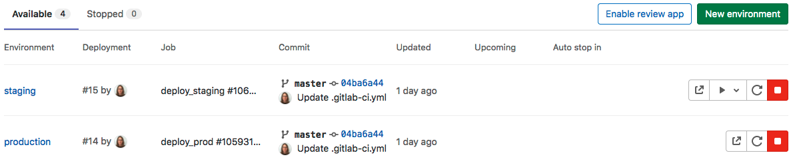
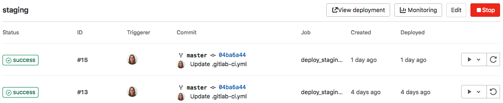
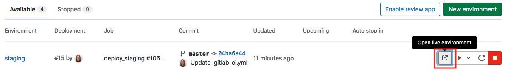
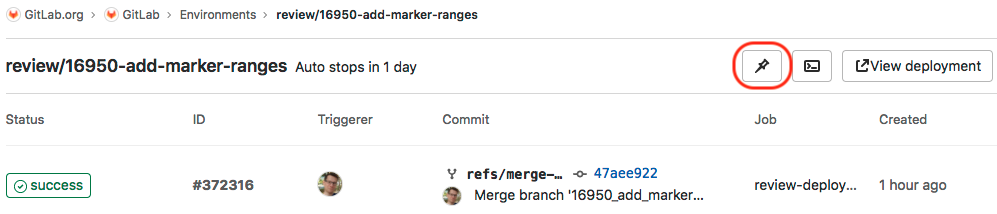
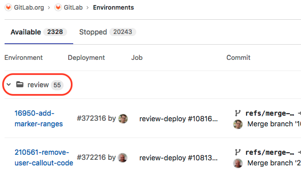
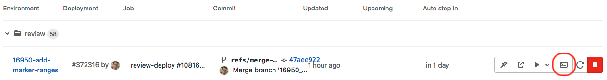
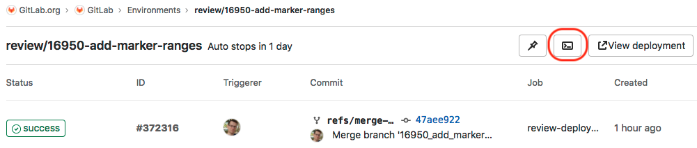

# Environments and deployments **(FREE)**

Environments describe where code is deployed.

Each time [GitLab CI/CD](../yaml/index.md) deploys a version of code to an environment,
a deployment is created.

GitLab:

- Provides a full history of deployments to each environment.
- Tracks your deployments, so you always know what is deployed on your
  servers.

If you have a deployment service like [Kubernetes](../../user/project/clusters/index.md)
associated with your project, you can use it to assist with your deployments.
You can even access a [web terminal](#web-terminals) for your environment from within GitLab.

## View environments and deployments

Prerequisites:

- You must have a minimum of [Reporter permission](../../user/permissions.md#project-members-permissions).

To view a list of environments and deployments:

1. Go to the project's **Deployments > Environments** page.
   The environments are displayed.

   

1. To view a list of deployments for an environment, select the environment name,
   for example, `staging`.

   

Deployments show up in this list only after a deployment job has created them.

## Types of environments

There are two types of environments:

- Static environments have static names, like `staging` or `production`.
- Dynamic environments have dynamic names. Dynamic environments
  are a fundamental part of [Review apps](../review_apps/index.md).

### Create a static environment

You can create an environment and deployment in the UI or in your `.gitlab-ci.yml` file.

In the UI:

1. Go to the project's **Deployments > Environments** page.
1. Select **New environment**.
1. Enter a name and external URL.
1. Select **Save**.

In your `.gitlab-ci.yml` file:

1. Specify a name for the environment and optionally, a URL, which determines the deployment URL.
   For example:

   ```yaml
   deploy_staging:
     stage: deploy
     script:
       - echo "Deploy to staging server"
     environment:
       name: staging
       url: https://staging.example.com
   ```

1. Trigger a deployment. (For example, by creating and pushing a commit.)

When the job runs, the environment and deployment are created.

NOTE:
Some characters cannot be used in environment names.
For more information about the `environment` keywords, see
[the `.gitlab-ci.yml` keyword reference](../yaml/index.md#environment).

### Create a dynamic environment

To create a dynamic name and URL for an environment, you can use
[predefined CI/CD variables](../variables/predefined_variables.md). For example:

```yaml
deploy_review:
  stage: deploy
  script:
    - echo "Deploy a review app"
  environment:
    name: review/$CI_COMMIT_REF_NAME
    url: https://$CI_ENVIRONMENT_SLUG.example.com
  rules:
    - if: $CI_COMMIT_BRANCH == $CI_DEFAULT_BRANCH
      when: never
    - if: $CI_COMMIT_BRANCH
```

In this example:

- The `name` is `review/$CI_COMMIT_REF_NAME`. Because the [environment name](../yaml/index.md#environmentname)
  can contain slashes (`/`), you can use this pattern to distinguish between dynamic and static environments.
- For the `url`, you could use `$CI_COMMIT_REF_NAME`, but because this value
  may contain a `/` or other characters that would not be valid in a domain name or URL,
  use `$CI_ENVIRONMENT_SLUG` instead. The `$CI_ENVIRONMENT_SLUG` variable is guaranteed to be unique.

You do not have to use the same prefix or only slashes (`/`) in the dynamic environment name.
However, when you use this format, you can [group similar environments](#group-similar-environments).

NOTE:
Some variables cannot be used as environment names or URLs.
For more information about the `environment` keywords, see
[the `.gitlab-ci.yml` keyword reference](../yaml/index.md#environment).

## Deployment tier of environments

> [Introduced](https://gitlab.com/gitlab-org/gitlab/-/issues/300741) in GitLab 13.10.

Sometimes, instead of using an [industry standard](https://en.wikipedia.org/wiki/Deployment_environment)
environment name, like `production`, you might want to use a code name, like `customer-portal`.
While there is no technical reason not to use a name like `customer-portal`, the name
no longer indicates that the environment is used for production.

To indicate that a specific environment is for a specific use,
you can use tiers:

| Environment tier | Environment name examples                          |
|------------------|----------------------------------------------------|
| `production`     | Production, Live                                   |
| `staging`        | Staging, Model, Demo                               |
| `testing`        | Test, QC                                           |
| `development`    | Dev, [Review apps](../review_apps/index.md), Trunk |
| `other`          |                                                    |

By default, GitLab assumes a tier based on [the environment name](../yaml/index.md#environmentname).
Instead, you can use the [`deployment_tier` keyword](../yaml/index.md#environmentdeployment_tier) to specify a tier.

## Configure manual deployments

You can create a job that requires someone to manually start the deployment.
For example:

```yaml
deploy_prod:
  stage: deploy
  script:
    - echo "Deploy to production server"
  environment:
    name: production
    url: https://example.com
  when: manual
  rules:
    - if: $CI_COMMIT_BRANCH == $CI_DEFAULT_BRANCH
```

The `when: manual` action:

- Exposes a play button for the job in the GitLab UI.
- Means the `deploy_prod` job is only triggered when the play button is clicked.

You can find the play button in the pipelines, environments, deployments, and jobs views.

## Configure Kubernetes deployments

> [Introduced](https://gitlab.com/gitlab-org/gitlab/-/issues/27630) in GitLab 12.6.

If you are deploying to a [Kubernetes cluster](../../user/project/clusters/index.md)
associated with your project, you can configure these deployments from your
`gitlab-ci.yml` file.

NOTE:
Kubernetes configuration isn't supported for Kubernetes clusters that are
[managed by GitLab](../../user/project/clusters/index.md#gitlab-managed-clusters).
To follow progress on support for GitLab-managed clusters, see the
[relevant issue](https://gitlab.com/gitlab-org/gitlab/-/issues/38054).

The following configuration options are supported:

- [`namespace`](https://kubernetes.io/docs/concepts/overview/working-with-objects/namespaces/)

In the following example, the job deploys your application to the
`production` Kubernetes namespace.

```yaml
deploy:
  stage: deploy
  script:
    - echo "Deploy to production server"
  environment:
    name: production
    url: https://example.com
    kubernetes:
      namespace: production
  rules:
    - if: $CI_COMMIT_BRANCH == $CI_DEFAULT_BRANCH
```

When you use the GitLab Kubernetes integration to deploy to a Kubernetes cluster,
you can view cluster and namespace information. On the deployment
job page, it's displayed above the job trace:


### Configure incremental rollouts

Learn how to release production changes to only a portion of your Kubernetes pods with
[incremental rollouts](../environments/incremental_rollouts.md).

## CI/CD variables for environments and deployments

When you create an environment, you specify the name and URL.

If you want to use the name or URL in another job, you can use:

- `$CI_ENVIRONMENT_NAME`. The name defined in the `.gitlab-ci.yml` file.
- `$CI_ENVIRONMENT_SLUG`. A "cleaned-up" version of the name, suitable for use in URL and DNS, for example.
  This variable is guaranteed to be unique.
- `$CI_ENVIRONMENT_URL`. The environment's URL, which was specified in the
  `.gitlab-ci.yml` file or automatically assigned.

If you change the name of an existing environment, the:

- `$CI_ENVIRONMENT_NAME` variable is updated with the new environment name.
- `$CI_ENVIRONMENT_SLUG` variable remains unchanged to prevent unintended side
  effects.

## Set dynamic environment URLs after a job finishes

> [Introduced](https://gitlab.com/gitlab-org/gitlab/-/issues/17066) in GitLab 12.9.

In a job script, you can specify a static environment URL.
However, there may be times when you want a dynamic URL. For example,
if you deploy a Review App to an external hosting
service that generates a random URL per deployment, like `https://94dd65b.amazonaws.com/qa-lambda-1234567`.
In this case, you don't know the URL before the deployment script finishes.
If you want to use the environment URL in GitLab, you would have to update it manually.

To address this problem, you can configure a deployment job to report back a set of
variables. These variables include the URL that was dynamically-generated by the external service.
GitLab supports the [dotenv (`.env`)](https://github.com/bkeepers/dotenv) file format,
and expands the `environment:url` value with variables defined in the `.env` file.

To use this feature, specify the
[`artifacts:reports:dotenv`](../yaml/index.md#artifactsreportsdotenv) keyword in `.gitlab-ci.yml`.

<i class="fa fa-youtube-play youtube" aria-hidden="true"></i>
For an overview, see [Set dynamic URLs after a job finished](https://youtu.be/70jDXtOf4Ig).

### Example of setting dynamic environment URLs

The following example shows a Review App that creates a new environment
for each merge request. The `review` job is triggered by every push, and
creates or updates an environment named `review/your-branch-name`.
The environment URL is set to `$DYNAMIC_ENVIRONMENT_URL`:

```yaml
review:
  script:
    - DYNAMIC_ENVIRONMENT_URL=$(deploy-script)                                 # In script, get the environment URL.
    - echo "DYNAMIC_ENVIRONMENT_URL=$DYNAMIC_ENVIRONMENT_URL" >> deploy.env    # Add the value to a dotenv file.
  artifacts:
    reports:
      dotenv: deploy.env                                                       # Report back dotenv file to rails.
  environment:
    name: review/$CI_COMMIT_REF_SLUG
    url: $DYNAMIC_ENVIRONMENT_URL                                              # and set the variable produced in script to `environment:url`
    on_stop: stop_review

stop_review:
  script:
    - ./teardown-environment
  when: manual
  environment:
    name: review/$CI_COMMIT_REF_SLUG
    action: stop
```

As soon as the `review` job finishes, GitLab updates the `review/your-branch-name`
environment's URL.
It parses the `deploy.env` report artifact, registers a list of variables as runtime-created,
uses it for expanding `environment:url: $DYNAMIC_ENVIRONMENT_URL` and sets it to the environment URL.
You can also specify a static part of the URL at `environment:url:`, such as
`https://$DYNAMIC_ENVIRONMENT_URL`. If the value of `DYNAMIC_ENVIRONMENT_URL` is
`example.com`, the final result is `https://example.com`.

The assigned URL for the `review/your-branch-name` environment is visible in the UI.

Note the following:

- `stop_review` doesn't generate a dotenv report artifact, so it doesn't recognize the
  `DYNAMIC_ENVIRONMENT_URL` environment variable. Therefore you shouldn't set `environment:url:` in the
  `stop_review` job.
- If the environment URL isn't valid (for example, the URL is malformed), the system doesn't update
  the environment URL.
- If the script that runs in `stop_review` exists only in your repository and therefore can't use
  `GIT_STRATEGY: none`, configure [pipelines for merge requests](../../ci/pipelines/merge_request_pipelines.md)
  for these jobs. This ensures that runners can fetch the repository even after a feature branch is
  deleted. For more information, see [Ref Specs for Runners](../pipelines/index.md#ref-specs-for-runners).

## Working with environments

Once environments are configured, GitLab provides many features for working with them,
as documented below.

### Environment rollback

When you roll back a deployment on a specific commit,
a _new_ deployment is created. This deployment has its own unique job ID.
It points to the commit you're rolling back to.

For the rollback to succeed, the deployment process must be defined in
the job's `script`.

#### Retry or roll back a deployment

If there is a problem with a deployment, you can retry it or roll it back.

To retry or rollback a deployment:

1. Go to the project's **Deployments > Environments**.
1. Select the environment.
1. To the right of the deployment name:
   - To retry a deployment, select **Re-deploy to environment**.
   - To roll back to a deployment, next to a previously successful deployment, select **Rollback environment**.

### Environment URL

The [environment URL](../yaml/index.md#environmenturl) is displayed in a few
places in GitLab:

- In a merge request as a link:
  
- In the Environments view as a button:
  
- In the Deployments view as a button:
  

You can see this information in a merge request if:

- The merge request is eventually merged to the default branch (usually `main`).
- That branch also deploys to an environment (for example, `staging` or `production`).

For example:


#### Going from source files to public pages

With GitLab [Route Maps](../review_apps/index.md#route-maps), you can go directly
from source files to public pages in the environment set for Review Apps.

### Stopping an environment

When you stop an environment:

- On the **Environments** page, it moves from the list of **Available** environments
  to the list of **Stopped** environments.
- An [`on_stop` action](../yaml/index.md#environmenton_stop), if defined, is executed.

Dynamic environments stop automatically when their associated branch is
deleted.

#### Stop an environment when a branch is deleted

You can configure environments to stop when a branch is deleted.

The following example shows a `deploy_review` job that calls a `stop_review` job
to clean up and stop the environment.

```yaml
deploy_review:
  stage: deploy
  script:
    - echo "Deploy a review app"
  environment:
    name: review/$CI_COMMIT_REF_NAME
    url: https://$CI_ENVIRONMENT_SLUG.example.com
    on_stop: stop_review
  rules:
    - if: $CI_MERGE_REQUEST_ID

stop_review:
  stage: deploy
  script:
    - echo "Remove review app"
  environment:
    name: review/$CI_COMMIT_REF_NAME
    action: stop
  rules:
    - if: $CI_MERGE_REQUEST_ID
      when: manual
```

Both jobs must have the same [`rules`](../yaml/index.md#only--except)
or [`only/except`](../yaml/index.md#only--except) configuration. Otherwise,
the `stop_review` job might not be included in all pipelines that include the
`deploy_review` job, and you cannot trigger `action: stop` to stop the environment automatically.

The job with [`action: stop` might not run](#the-job-with-action-stop-doesnt-run)
if it's in a later stage than the job that started the environment.

If you can't use [pipelines for merge requests](../pipelines/merge_request_pipelines.md),
set the [`GIT_STRATEGY`](../runners/configure_runners.md#git-strategy) to `none` in the
`stop_review` job. Then the [runner](https://docs.gitlab.com/runner/) doesn't
try to check out the code after the branch is deleted.

Read more in the [`.gitlab-ci.yml` reference](../yaml/index.md#environmenton_stop).

#### Stop an environment after a certain time period

> [Introduced](https://gitlab.com/gitlab-org/gitlab/-/issues/20956) in GitLab 12.8.

You can set environments to stop automatically after a certain time period.

In your `.gitlab-ci.yml` file, specify the [`environment:auto_stop_in`](../yaml/index.md#environmentauto_stop_in)
keyword. You can specify a human-friendly date as the value, such as `1 hour and 30 minutes` or `1 day`.
After the time period passes, GitLab automatically triggers a job to stop the environment.

Due to resource limitations, a background worker for stopping environments only runs once
every hour. This means that environments aren't stopped at the exact timestamp specified, but are
instead stopped when the hourly cron worker detects expired environments.

In the following example, each merge request creates a Review App environment.
Each push triggers the `review_app` job and an environment named `review/your-branch-name`
is created or updated. The environment runs until `stop_review_app` is executed:

```yaml
review_app:
  script: deploy-review-app
  environment:
    name: review/$CI_COMMIT_REF_NAME
    on_stop: stop_review_app
    auto_stop_in: 1 week
  rules:
    - if: $CI_MERGE_REQUEST_ID

stop_review_app:
  script: stop-review-app
  environment:
    name: review/$CI_COMMIT_REF_NAME
    action: stop
  rules:
    - if: $CI_MERGE_REQUEST_ID
      when: manual
```

As long as the merge request is active and keeps getting new commits,
the Review App doesn't stop. Developers don't need to worry about
re-initiating Review App.

Because `stop_review_app` is set to `auto_stop_in: 1 week`,
if a merge request is inactive for more than a week,
GitLab automatically triggers the `stop_review_app` job to stop the environment.

#### View a deployment's scheduled stop time

You can view a deployment's expiration date in the GitLab UI.

1. Go to the project's **Deployments > Environments** page.
1. Select the name of the deployment.

In the top left, next to the environment name, the expiration date is displayed.

#### Override a deployment's scheduled stop time

You can manually override a deployment's expiration date.

1. Go to the project's **Deployments > Environments** page.
1. Select the deployment name.
1. On the top right, select the thumbtack (**{thumbtack}**).



The `auto_stop_in` setting is overwritten and the environment remains active until it's stopped manually.

#### Delete a stopped environment

> [Introduced](https://gitlab.com/gitlab-org/gitlab/-/issues/20620) in GitLab 12.10.

You can delete [stopped environments](#stopping-an-environment) in the GitLab UI or by using
[the API](../../api/environments.md#delete-an-environment).

To delete a stopped environment in the GitLab UI:

1. Go to the project's **Deployments > Environments** page.
1. Select the **Stopped** tab.
1. Next to the environment you want to delete, select **Delete environment**.
1. On the confirmation dialog box, select **Delete environment**.

### Prepare an environment without creating a deployment

> [Introduced](https://gitlab.com/gitlab-org/gitlab/-/issues/208655) in GitLab 13.2.

By default, when GitLab CI/CD runs a job for a specific environment, it
triggers a deployment and [(optionally) cancels outdated
deployments](deployment_safety.md#ensure-only-one-deployment-job-runs-at-a-time).

To use an environment without creating a new deployment, and without
cancelling outdated deployments, append the keyword `action: prepare` to your
job:

```yaml
build:
  stage: build
  script:
    - echo "Building the app"
  environment:
    name: staging
    action: prepare
    url: https://staging.example.com
```

This gives you access to [environment-scoped variables](#scoping-environments-with-specs),
and can be used to [protect builds from unauthorized access](protected_environments.md).

### Group similar environments

You can group environments into collapsible sections in the UI.

For example, if all of your environments start with the name `review`,
then in the UI, the environments are grouped under that heading:



The following example shows how to start your environment names with `review`.
The `$CI_COMMIT_REF_NAME` variable is populated with the branch name at runtime:

```yaml
deploy_review:
  stage: deploy
  script:
    - echo "Deploy a review app"
  environment:
    name: review/$CI_COMMIT_REF_NAME
```

### Environment incident management

Production environments can go down unexpectedly, including for reasons outside
of your control. For example, issues with external dependencies, infrastructure,
or human error can cause major issues with an environment. Things like:

- A dependent cloud service goes down.
- A 3rd party library is updated and it's not compatible with your application.
- Someone performs a DDoS attack to a vulnerable endpoint in your server.
- An operator misconfigures infrastructure.
- A bug is introduced into the production application code.

You can use [incident management](../../operations/incident_management/index.md)
to get alerts when there are critical issues that need immediate attention.

#### View the latest alerts for environments **(ULTIMATE)**

> [Introduced](https://gitlab.com/gitlab-org/gitlab/-/issues/214634) in [GitLab Ultimate](https://about.gitlab.com/pricing/) 13.4.

If you [set up alerts for Prometheus metrics](../../operations/metrics/alerts.md),
alerts for environments are shown on the environments page. The alert with the highest
severity is shown, so you can identify which environments need immediate attention.


When the issue that triggered the alert is resolved, it is removed and is no
longer visible on the environments page.

If the alert requires a [rollback](#retry-or-roll-back-a-deployment), you can select the
deployment tab from the environment page and select which deployment to roll back to.

#### Auto Rollback **(ULTIMATE)**

> [Introduced](https://gitlab.com/gitlab-org/gitlab/-/issues/35404) in [GitLab Ultimate](https://about.gitlab.com/pricing/) 13.7.

In a typical Continuous Deployment workflow, the CI pipeline tests every commit before deploying to
production. However, problematic code can still make it to production. For example, inefficient code
that is logically correct can pass tests even though it causes severe performance degradation.
Operators and SREs monitor the system to catch these problems as soon as possible. If they find a
problematic deployment, they can roll back to a previous stable version.

GitLab Auto Rollback eases this workflow by automatically triggering a rollback when a
[critical alert](../../operations/incident_management/alerts.md)
is detected. GitLab selects and redeploys the most recent successful deployment.

Limitations of GitLab Auto Rollback:

- The rollback is skipped if a deployment is running when the alert is detected.
- A rollback can happen only once in three minutes. If multiple alerts are detected at once, only
  one rollback is performed.

GitLab Auto Rollback is turned off by default. To turn it on:

1. Go to **Project > Settings > CI/CD > Automatic deployment rollbacks**.
1. Select the checkbox for **Enable automatic rollbacks**.
1. Select **Save changes**.

### Monitoring environments

To monitor the behavior of your app as it runs in each environment,
enable [Prometheus for monitoring system and response metrics](../../user/project/integrations/prometheus.md).
For the monitoring dashboard to appear, configure Prometheus to collect at least one
[supported metric](../../user/project/integrations/prometheus_library/index.md).

All deployments to an environment are shown on the monitoring dashboard.
You can view changes in performance for each version of your application.

GitLab attempts to retrieve [supported performance metrics](../../user/project/integrations/prometheus_library/index.md)
for any environment that has had a successful deployment. If monitoring data was
successfully retrieved, a **Monitoring** button appears for each environment.

To view the last eight hours of performance data, select the **Monitoring** button.
It may take a minute or two for data to appear after initial deployment.


#### Embedding metrics in GitLab Flavored Markdown

Metric charts can be embedded in GitLab Flavored Markdown. See [Embedding Metrics in GitLab Flavored Markdown](../../operations/metrics/embed.md) for more details.

### Web terminals

If you deploy to your environments with the help of a deployment service (for example,
the [Kubernetes integration](../../user/project/clusters/index.md)), GitLab can open
a terminal session to your environment. You can then debug issues without leaving your web browser.

The Web terminal is a container-based deployment, which often lack basic tools (like an editor),
and can be stopped or restarted at any time. If this happens, you lose all your
changes. Treat the Web terminal as a debugging tool, not a comprehensive online IDE.

Web terminals:

- Are available to project Maintainers and Owners only.
- Must [be enabled](../../administration/integration/terminal.md).

In the UI, you can view the Web terminal by selecting a **Terminal** button:



You can also access the terminal button from the page for a specific environment:



Select the button to establish the terminal session:


This works like any other terminal. You're in the container created
by your deployment so you can:

- Run shell commands and get responses in real time.
- Check the logs.
- Try out configuration or code tweaks.

You can open multiple terminals to the same environment. They each get their own shell
session and even a multiplexer like `screen` or `tmux`.

### Check out deployments locally

A reference in the Git repository is saved for each deployment, so
knowing the state of your current environments is only a `git fetch` away.

In your Git configuration, append the `[remote "<your-remote>"]` block with an extra
fetch line:

```plaintext
fetch = +refs/environments/*:refs/remotes/origin/environments/*
```

### Scoping environments with specs

> - [Introduced](https://gitlab.com/gitlab-org/gitlab/-/merge_requests/2112) in [GitLab Premium](https://about.gitlab.com/pricing/) 9.4.
> - [Environment scoping for CI/CD variables was moved to all tiers](https://gitlab.com/gitlab-org/gitlab-foss/-/merge_requests/30779) in GitLab 12.2.
> - [Environment scoping for Group CI/CD variables](https://gitlab.com/gitlab-org/gitlab/-/issues/2874) added to GitLab Premium in 13.11.

You can limit the environment scope of a CI/CD variable by
defining which environments it can be available for.
For example, if the environment scope is `production`, then only the jobs
with the environment `production` defined would have this specific variable.

The default environment scope is a wildcard (`*`), which means that
any job can have this variable, regardless of whether an environment is defined.

If the environment scope is `review/*`, then jobs with environment names starting
with `review/` would have that variable available.

Some GitLab features can behave differently for each environment.
For example, you can
[create a project CI/CD variable to be injected only into a production environment](../variables/index.md#limit-the-environment-scope-of-a-cicd-variable).

In most cases, these features use the _environment specs_ mechanism, which offers
an efficient way to implement scoping in each environment group.

For example, if there are four environments:

- `production`
- `staging`
- `review/feature-1`
- `review/feature-2`

Each environment can be matched with the following environment spec:

| Environment Spec | `production` | `staging` | `review/feature-1` | `review/feature-2` |
|:-----------------|:-------------|:----------|:-------------------|:-------------------|
| *                | Matched      | Matched   | Matched            | Matched            |
| production       | Matched      |           |                    |                    |
| staging          |              | Matched   |                    |                    |
| review/*         |              |           | Matched            | Matched            |
| review/feature-1 |              |           | Matched            |                    |

You can use specific matching to select a particular environment.
You can also use wildcard matching (`*`) to select a particular environment group,
like [Review Apps](../review_apps/index.md) (`review/*`).

The most specific spec takes precedence over the other wildcard matching. In this case,
the `review/feature-1` spec takes precedence over `review/*` and `*` specs.

## Related topics

- [Use GitLab CI to deploy to multiple environments (blog post)](https://about.gitlab.com/blog/2021/02/05/ci-deployment-and-environments/)
- [Review Apps](../review_apps/index.md): Use dynamic environments to deploy your code for every branch.
- [Deploy Boards](../../user/project/deploy_boards.md): View the status of your applications running on Kubernetes.
- [Protected environments](protected_environments.md): Determine who can deploy code to your environments.
- [Environments Dashboard](../environments/environments_dashboard.md): View a summary of each
  environment's operational health. **(PREMIUM)**
- [Deployment safety](deployment_safety.md#restrict-write-access-to-a-critical-environment): Secure your deployments.

## Troubleshooting

### The job with `action: stop` doesn't run

In some cases, environments do not [stop when a branch is deleted](#stop-an-environment-when-a-branch-is-deleted).

For example, the environment might start in a stage that also has a job that failed.
Then the jobs in later stages job don't start. If the job with the `action: stop`
for the environment is also in a later stage, it can't start and the environment isn't deleted.

To ensure the `action: stop` can always run when needed, you can:

- Put both jobs in the same stage:

  ```yaml
  stages:
    - build
    - test
    - deploy

  ...

  deploy_review:
    stage: deploy
    environment:
      name: review/$CI_COMMIT_REF_NAME
      url: https://$CI_ENVIRONMENT_SLUG.example.com
      on_stop: stop_review

  stop_review:
    stage: deploy
    environment:
      name: review/$CI_COMMIT_REF_NAME
      action: stop
    when: manual
  ```

- Add a [`needs`](../yaml/index.md#needs) entry to the `action: stop` job so the
  job can start out of stage order:

  ```yaml
  stages:
    - build
    - test
    - deploy
    - cleanup

  ...

  deploy_review:
    stage: deploy
    environment:
      name: review/$CI_COMMIT_REF_NAME
      url: https://$CI_ENVIRONMENT_SLUG.example.com
      on_stop: stop_review

  stop_review:
    stage: cleanup
    needs:
      - deploy_review
    environment:
      name: review/$CI_COMMIT_REF_NAME
      action: stop
    when: manual
  ```
