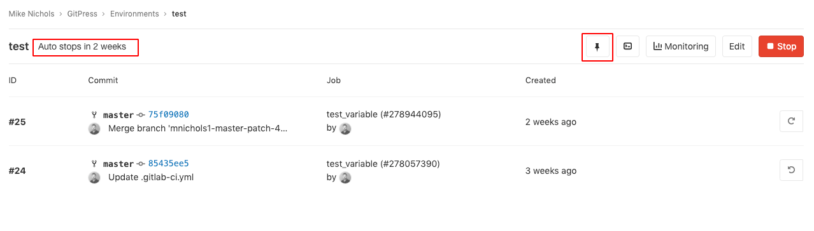

# Environments and deployments

> Introduced in GitLab 8.9.

Environments allow control of the continuous deployment of your software,
all within GitLab.

## Introduction

There are many stages required in the software development process before the software is ready
for public consumption.

For example:

1. Develop your code.
1. Test your code.
1. Deploy your code into a testing or staging environment before you release it to the public.

This helps find bugs in your software, and also in the deployment process as well.

GitLab CI/CD is capable of not only testing or building your projects, but also
deploying them in your infrastructure, with the added benefit of giving you a
way to track your deployments. In other words, you will always know what is
currently being deployed or has been deployed on your servers.

It's important to know that:

- Environments are like tags for your CI jobs, describing where code gets deployed.
- Deployments are created when [GitLab CI/CD](../yaml/README.md) is used to deploy versions of code to environments.

GitLab:

- Provides a full history of your deployments for each environment.
- Keeps track of your deployments, so you always know what is currently being deployed on your
  servers.

If you have a deployment service such as [Kubernetes](../../user/project/clusters/index.md)
associated with your project, you can use it to assist with your deployments, and
can even access a [web terminal](#web-terminals) for your environment from within GitLab!

## Configuring environments

Configuring environments involves:

1. Understanding how [pipelines](../pipelines/index.md) work.
1. Defining environments in your project's [`.gitlab-ci.yml`](../yaml/README.md) file.
1. Creating a job configured to deploy your application. For example, a deploy job configured with [`environment`](../yaml/README.md#environment) to deploy your application to a [Kubernetes cluster](../../user/project/clusters/index.md).

The rest of this section illustrates how to configure environments and deployments using
an example scenario. It assumes you have already:

- Created a [project](../../gitlab-basics/create-project.md) in GitLab.
- Set up [a runner](../runners/README.md).

In the scenario:

- We are developing an application.
- We want to run tests and build our app on all branches.
- Our default branch is `master`.
- We deploy the app only when a pipeline on `master` branch is run.

### Defining environments

Let's consider the following `.gitlab-ci.yml` example:

```yaml
stages:
  - test
  - build
  - deploy

test:
  stage: test
  script: echo "Running tests"

build:
  stage: build
  script: echo "Building the app"

deploy_staging:
  stage: deploy
  script:
    - echo "Deploy to staging server"
  environment:
    name: staging
    url: https://staging.example.com
  only:
    - master
```

We have defined three [stages](../yaml/README.md#stages):

- `test`
- `build`
- `deploy`

The jobs assigned to these stages will run in this order. If any job fails, then
the pipeline fails and jobs that are assigned to the next stage won't run.

In our case:

- The `test` job will run first.
- Then the `build` job.
- Lastly the `deploy_staging` job.

With this configuration, we:

- Check that the tests pass.
- Ensure that our app is able to be built successfully.
- Lastly we deploy to the staging server.

Note that the `environment` keyword defines where the app is deployed. The environment `name` and
`url` is exposed in various places within GitLab. Each time a job that has an environment specified
succeeds, a deployment is recorded along with the Git SHA and environment name.

CAUTION: **Caution:**
Some characters are not allowed in environment names. Use only letters,
numbers, spaces, and `-`, `_`, `/`, `{`, `}`, or `.`. Also, it must not start nor end with `/`.

In summary, with the above `.gitlab-ci.yml` we have achieved the following:

- All branches will run the `test` and `build` jobs.
- The `deploy_staging` job will run [only](../yaml/README.md#onlyexcept-basic) on the `master`
  branch, which means all merge requests that are created from branches don't
  get deployed to the staging server.
- When a merge request is merged, all jobs will run and the `deploy_staging`
  job will deploy our code to a staging server while the deployment
  will be recorded in an environment named `staging`.

#### Environment variables and runners

Starting with GitLab 8.15, the environment name is exposed to the runner in
two forms:

- `$CI_ENVIRONMENT_NAME`. The name given in `.gitlab-ci.yml` (with any variables
  expanded).
- `$CI_ENVIRONMENT_SLUG`. A "cleaned-up" version of the name, suitable for use in URLs,
  DNS, etc.

If you change the name of an existing environment, the:

- `$CI_ENVIRONMENT_NAME` variable will be updated with the new environment name.
- `$CI_ENVIRONMENT_SLUG` variable will remain unchanged to prevent unintended side
  effects.

Starting with GitLab 9.3, the environment URL is exposed to the runner via
`$CI_ENVIRONMENT_URL`. The URL is expanded from either:

- `.gitlab-ci.yml`.
- The external URL from the environment if not defined in `.gitlab-ci.yml`.

#### Set dynamic environment URLs after a job finishes

> [Introduced](https://gitlab.com/gitlab-org/gitlab/-/issues/17066) in GitLab 12.9.

In a job script, you can specify a static [environment URL](#using-the-environment-url).
However, there may be times when you want a dynamic URL. For example,
if you deploy a Review App to an external hosting
service that generates a random URL per deployment, like `https://94dd65b.amazonaws.com/qa-lambda-1234567`,
you don't know the URL before the deployment script finishes.
If you want to use the environment URL in GitLab, you would have to update it manually.

To address this problem, you can configure a deployment job to report back a set of
variables, including the URL that was dynamically-generated by the external service.
GitLab supports the [dotenv (`.env`)](https://github.com/bkeepers/dotenv) file format,
and expands the `environment:url` value with variables defined in the `.env` file.

To use this feature, specify the
[`artifacts:reports:dotenv`](../pipelines/job_artifacts.md#artifactsreportsdotenv) keyword in `.gitlab-ci.yml`.

<i class="fa fa-youtube-play youtube" aria-hidden="true"></i>
For an overview, see [Set dynamic URLs after a job finished](https://youtu.be/70jDXtOf4Ig).

##### Example of setting dynamic environment URLs

The following example shows a Review App that creates a new environment
per merge request. The `review` job is triggered by every push, and
creates or updates an environment named `review/your-branch-name`.
The environment URL is set to `$DYNAMIC_ENVIRONMENT_URL`:

```yaml
review:
  script:
    - DYNAMIC_ENVIRONMENT_URL=$(deploy-script)                                 # In script, get the environment URL.
    - echo "DYNAMIC_ENVIRONMENT_URL=$DYNAMIC_ENVIRONMENT_URL" >> deploy.env    # Add the value to a dotenv file.
  artifacts:
    reports:
      dotenv: deploy.env                                                       # Report back dotenv file to rails.
  environment:
    name: review/$CI_COMMIT_REF_SLUG
    url: $DYNAMIC_ENVIRONMENT_URL                                              # and set the variable produced in script to `environment:url`
    on_stop: stop_review

stop_review:
  script:
    - ./teardown-environment
  when: manual
  environment:
    name: review/$CI_COMMIT_REF_SLUG
    action: stop
```

As soon as the `review` job finishes, GitLab updates the `review/your-branch-name`
environment's URL.
It parses the `deploy.env` report artifact, registers a list of variables as runtime-created,
uses it for expanding `environment:url: $DYNAMIC_ENVIRONMENT_URL` and sets it to the environment URL.
You can also specify a static part of the URL at `environment:url:`, such as
`https://$DYNAMIC_ENVIRONMENT_URL`. If the value of `DYNAMIC_ENVIRONMENT_URL` is
`example.com`, the final result will be `https://example.com`.

The assigned URL for the `review/your-branch-name` environment is [visible in the UI](#using-the-environment-url).

Note the following:

- `stop_review` doesn't generate a dotenv report artifact, so it won't recognize the
  `DYNAMIC_ENVIRONMENT_URL` variable. Therefore you shouldn't set `environment:url:` in the
  `stop_review` job.
- If the environment URL isn't valid (for example, the URL is malformed), the system doesn't update
  the environment URL.
- If the script that runs in `stop_review` exists only in your repository and therefore can't use
  `GIT_STRATEGY: none`, configure [pipelines for merge requests](../../ci/merge_request_pipelines/index.md)
  for these jobs. This ensures that runners can fetch the repository even after a feature branch is
  deleted. For more information, see [Ref Specs for Runners](../pipelines/index.md#ref-specs-for-runners).

### Configuring manual deployments

Adding `when: manual` to an automatically executed job's configuration converts it to
a job requiring manual action.

To expand on the [previous example](#defining-environments), the following includes
another job that deploys our app to a production server and is
tracked by a `production` environment.

The `.gitlab-ci.yml` file for this is as follows:

```yaml
stages:
  - test
  - build
  - deploy

test:
  stage: test
  script: echo "Running tests"

build:
  stage: build
  script: echo "Building the app"

deploy_staging:
  stage: deploy
  script:
    - echo "Deploy to staging server"
  environment:
    name: staging
    url: https://staging.example.com
  only:
    - master

deploy_prod:
  stage: deploy
  script:
    - echo "Deploy to production server"
  environment:
    name: production
    url: https://example.com
  when: manual
  only:
    - master
```

The `when: manual` action:

- Exposes a "play" button in GitLab's UI for that job.
- Means the `deploy_prod` job will only be triggered when the "play" button is clicked.

You can find the "play" button in the pipelines, environments, deployments, and jobs views.

| View            | Screenshot                                                                     |
|:----------------|:-------------------------------------------------------------------------------|
| Pipelines       |        |
| Single pipeline |  |
| Environments    |  |
| Deployments     |    |
| Jobs            |                |

Clicking the play button in any view triggers the `deploy_prod` job. The deployment is recorded as a
new environment named `production`.

If your environment's name is `production` (all lowercase), it's recorded in
[Value Stream Analytics](../../user/analytics/value_stream_analytics.md).

### Configuring dynamic environments

Regular environments are good when deploying to "stable" environments like staging or production.

However, for environments for branches other than `master`, dynamic environments
can be used. Dynamic environments make it possible to create environments on the fly by
declaring their names dynamically in `.gitlab-ci.yml`.

Dynamic environments are a fundamental part of [Review apps](../review_apps/index.md).

#### Allowed variables

The `name` and `url` keywords for dynamic environments can use most available CI/CD variables,
including:

- [Predefined environment variables](../variables/README.md#predefined-environment-variables)
- [Project and group variables](../variables/README.md#gitlab-cicd-environment-variables)
- [`.gitlab-ci.yml` variables](../yaml/README.md#variables)

However, you cannot use variables defined:

- Under `script`.
- On the runner's side.

There are also other variables that are unsupported in the context of `environment:name`.
For more information, see [Where variables can be used](../variables/where_variables_can_be_used.md).

#### Example configuration

Runners expose various [environment variables](../variables/README.md) when a job runs, so
you can use them as environment names.

In the following example, the job will deploy to all branches except `master`:

```yaml
deploy_review:
  stage: deploy
  script:
    - echo "Deploy a review app"
  environment:
    name: review/$CI_COMMIT_REF_NAME
    url: https://$CI_ENVIRONMENT_SLUG.example.com
  only:
    - branches
  except:
    - master
```

In this example:

- The job's name is `deploy_review` and it runs on the `deploy` stage.
- We set the `environment` with the `environment:name` as `review/$CI_COMMIT_REF_NAME`.
  Since the [environment name](../yaml/README.md#environmentname) can contain slashes (`/`), we can
  use this pattern to distinguish between dynamic and regular environments.
- We tell the job to run [`only`](../yaml/README.md#onlyexcept-basic) on branches,
  [`except`](../yaml/README.md#onlyexcept-basic) `master`.

For the value of:

- `environment:name`, the first part is `review`, followed by a `/` and then `$CI_COMMIT_REF_NAME`,
  which receives the value of the branch name.
- `environment:url`, we want a specific and distinct URL for each branch. `$CI_COMMIT_REF_NAME`
  may contain a `/` or other characters that would be invalid in a domain name or URL,
  so we use `$CI_ENVIRONMENT_SLUG` to guarantee that we get a valid URL.

  For example, given a `$CI_COMMIT_REF_NAME` of `100-Do-The-Thing`, the URL will be something
  like `https://100-do-the-4f99a2.example.com`. Again, the way you set up
  the web server to serve these requests is based on your setup.

  We have used `$CI_ENVIRONMENT_SLUG` here because it is guaranteed to be unique. If
  you're using a workflow like [GitLab Flow](../../topics/gitlab_flow.md), collisions
  are unlikely and you may prefer environment names to be more closely based on the
  branch name. In that case, you could use `$CI_COMMIT_REF_NAME` in `environment:url` in
  the example above: `https://$CI_COMMIT_REF_NAME.example.com`, which would give a URL
  of `https://100-do-the-thing.example.com`.

You aren't required to use the same prefix or only slashes (`/`) in the dynamic environments' names.
However, using this format enables the [grouping similar environments](#grouping-similar-environments)
feature.

### Configuring Kubernetes deployments

> [Introduced](https://gitlab.com/gitlab-org/gitlab/-/issues/27630) in GitLab 12.6.

If you are deploying to a [Kubernetes cluster](../../user/project/clusters/index.md)
associated with your project, you can configure these deployments from your
`gitlab-ci.yml` file.

NOTE: **Note:**
Kubernetes configuration isn't supported for Kubernetes clusters that are
[managed by GitLab](../../user/project/clusters/index.md#gitlab-managed-clusters).
To follow progress on support for GitLab-managed clusters, see the
[relevant issue](https://gitlab.com/gitlab-org/gitlab/-/issues/38054).

The following configuration options are supported:

- [`namespace`](https://kubernetes.io/docs/concepts/overview/working-with-objects/namespaces/)

In the following example, the job will deploy your application to the
`production` Kubernetes namespace.

```yaml
deploy:
  stage: deploy
  script:
    - echo "Deploy to production server"
  environment:
    name: production
    url: https://example.com
    kubernetes:
      namespace: production
  only:
    - master
```

When deploying to a Kubernetes cluster using GitLab's Kubernetes integration,
information about the cluster and namespace will be displayed above the job
trace on the deployment job page:


#### Configuring incremental rollouts

Learn how to release production changes to only a portion of your Kubernetes pods with
[incremental rollouts](../environments/incremental_rollouts.md).

### Deployment safety

Deployment jobs can be more sensitive than other jobs in a pipeline,
and might need to be treated with an extra care. There are multiple features
in GitLab that helps maintain deployment security and stability.

- [Restrict write-access to a critical environment](deployment_safety.md#restrict-write-access-to-a-critical-environment)
- [Limit the job-concurrency for deployment jobs](deployment_safety.md#ensure-only-one-deployment-job-runs-at-a-time)
- [Skip outdated deployment jobs](deployment_safety.md#skip-outdated-deployment-jobs)
- [Prevent deployments during deploy freeze windows](deployment_safety.md#prevent-deployments-during-deploy-freeze-windows)

### Complete example

The configuration in this section provides a full development workflow where your app is:

- Tested.
- Built.
- Deployed as a Review App.
- Deployed to a staging server after the merge request is merged.
- Finally, able to be manually deployed to the production server.

The following combines the previous configuration examples, including:

- Defining [simple environments](#defining-environments) for testing, building, and deployment to staging.
- Adding [manual actions](#configuring-manual-deployments) for deployment to production.
- Creating [dynamic environments](#configuring-dynamic-environments) for deployments for reviewing.

```yaml
stages:
  - test
  - build
  - deploy

test:
  stage: test
  script: echo "Running tests"

build:
  stage: build
  script: echo "Building the app"

deploy_review:
  stage: deploy
  script:
    - echo "Deploy a review app"
  environment:
    name: review/$CI_COMMIT_REF_NAME
    url: https://$CI_ENVIRONMENT_SLUG.example.com
  only:
    - branches
  except:
    - master

deploy_staging:
  stage: deploy
  script:
    - echo "Deploy to staging server"
  environment:
    name: staging
    url: https://staging.example.com
  only:
    - master

deploy_prod:
  stage: deploy
  script:
    - echo "Deploy to production server"
  environment:
    name: production
    url: https://example.com
  when: manual
  only:
    - master
```

A more realistic example would also include copying files to a location where a
webserver (for example, NGINX) could then access and serve them.

The example below will copy the `public` directory to `/srv/nginx/$CI_COMMIT_REF_SLUG/public`:

```yaml
review_app:
  stage: deploy
  script:
    - rsync -av --delete public /srv/nginx/$CI_COMMIT_REF_SLUG
  environment:
    name: review/$CI_COMMIT_REF_NAME
    url: https://$CI_COMMIT_REF_SLUG.example.com
```

This example requires that NGINX and GitLab Runner are set up on the server this job will run on.

See the [limitations](#limitations) section for some edge cases regarding the naming of your
branches and Review Apps.

The complete example provides the following workflow to developers:

- Create a branch locally.
- Make changes and commit them.
- Push the branch to GitLab.
- Create a merge request.

Behind the scenes, the runner will:

- Pick up the changes and start running the jobs.
- Run the jobs sequentially as defined in `stages`:
  - First, run the tests.
  - If the tests succeed, build the app.
  - If the build succeeds, the app is deployed to an environment with a name specific to the
    branch.

So now, every branch:

- Gets its own environment.
- Is deployed to its own unique location, with the added benefit of:
  - Having a [history of deployments](#viewing-deployment-history).
  - Being able to [rollback changes](#retrying-and-rolling-back) if needed.

For more information, see [Using the environment URL](#using-the-environment-url).

### Protected environments

Environments can be "protected", restricting access to them.

For more information, see [Protected environments](protected_environments.md).

## Working with environments

Once environments are configured, GitLab provides many features for working with them,
as documented below.

### Viewing environments and deployments

A list of environments and deployment statuses is available on each project's **Operations > Environments** page.

For example:


This example shows:

- The environment's name with a link to its deployments.
- The last deployment ID number and who performed it.
- The job ID of the last deployment with its respective job name.
- The commit information of the last deployment, such as who committed it, to what
  branch, and the Git SHA of the commit.
- The exact time the last deployment was performed.
- A button that takes you to the URL that you defined under the `environment` keyword
  in `.gitlab-ci.yml`.
- A button that re-deploys the latest deployment, meaning it runs the job
  defined by the environment name for that specific commit.

The information shown in the **Environments** page is limited to the latest
deployments, but an environment can have multiple deployments.

> **Notes:**
>
> - While you can create environments manually in the web interface, we recommend
>   that you define your environments in `.gitlab-ci.yml` first. They will
>   be automatically created for you after the first deploy.
> - The environments page can only be viewed by users with [Reporter permission](../../user/permissions.md#project-members-permissions)
>   and above. For more information on permissions, see the [permissions documentation](../../user/permissions.md).
> - Only deploys that happen after your `.gitlab-ci.yml` is properly configured
>   will show up in the **Environment** and **Last deployment** lists.

### Viewing deployment history

GitLab keeps track of your deployments, so you:

- Always know what is currently being deployed on your servers.
- Can have the full history of your deployments for every environment.

Clicking on an environment shows the history of its deployments. Here's an example **Environments** page
with multiple deployments:


This view is similar to the **Environments** page, but all deployments are shown. Also in this view
is a **Rollback** button. For more information, see [Retrying and rolling back](#retrying-and-rolling-back).

### Retrying and rolling back

If there is a problem with a deployment, you can retry it or roll it back.

To retry or rollback a deployment:

1. Navigate to **Operations > Environments**.
1. Click on the environment.
1. In the deployment history list for the environment, click the:
   - **Retry** button next to the last deployment, to retry that deployment.
   - **Rollback** button next to a previously successful deployment, to roll back to that deployment.

#### What to expect with a rollback

Pressing the **Rollback** button on a specific commit triggers a _new_ deployment with its own
unique job ID. This means that you will see a new deployment that points to the commit you're
rolling back to.

Note that the defined deployment process in the job's `script` determines whether the rollback
succeeds.

### Using the environment URL

The [environment URL](../yaml/README.md#environmenturl) is exposed in a few
places within GitLab:

- In a merge request widget as a link:
  
- In the Environments view as a button:
  
- In the Deployments view as a button:
  

You can see this information in a merge request itself if:

- The merge request is eventually merged to the default branch (usually `master`).
- That branch also deploys to an environment (for example, `staging` or `production`).

For example:


#### Going from source files to public pages

With GitLab's [Route Maps](../review_apps/index.md#route-maps) you can go directly
from source files to public pages in the environment set for Review Apps.

### Stopping an environment

Stopping an environment:

- Moves it from the list of **Available** environments to the list of **Stopped**
  environments on the [**Environments** page](#viewing-environments-and-deployments).
- Executes an [`on_stop` action](../yaml/README.md#environmenton_stop), if defined.

This is often used when multiple developers are working on a project at the same time,
each of them pushing to their own branches, causing many dynamic environments to be created.

Starting with GitLab 8.14, dynamic environments stop automatically when their associated branch is
deleted.

#### Automatically stopping an environment

Environments can be stopped automatically using special configuration.

Consider the following example where the `deploy_review` job calls `stop_review`
to clean up and stop the environment:

```yaml
deploy_review:
  stage: deploy
  script:
    - echo "Deploy a review app"
  environment:
    name: review/$CI_COMMIT_REF_NAME
    url: https://$CI_ENVIRONMENT_SLUG.example.com
    on_stop: stop_review
  rules:
    - if: $CI_MERGE_REQUEST_ID

stop_review:
  stage: deploy
  script:
    - echo "Remove review app"
  environment:
    name: review/$CI_COMMIT_REF_NAME
    action: stop
  rules:
    - if: $CI_MERGE_REQUEST_ID
      when: manual
```

If you can't use [Pipelines for merge requests](../merge_request_pipelines/index.md),
setting the [`GIT_STRATEGY`](../runners/README.md#git-strategy) to `none` is necessary in the
`stop_review` job so that the [runner](https://docs.gitlab.com/runner/) won't
try to check out the code after the branch is deleted.

When you have an environment that has a stop action defined (typically when
the environment describes a Review App), GitLab will automatically trigger a
stop action when the associated branch is deleted. The `stop_review` job must
be in the same `stage` as the `deploy_review` job in order for the environment
to automatically stop.

Additionally, both jobs should have matching [`rules`](../yaml/README.md#onlyexcept-basic)
or [`only/except`](../yaml/README.md#onlyexcept-basic) configuration. In the example
above, if the configuration is not identical, the `stop_review` job might not be
included in all pipelines that include the `deploy_review` job, and it will not be
possible to trigger the `action: stop` to stop the environment automatically.

You can read more in the [`.gitlab-ci.yml` reference](../yaml/README.md#environmenton_stop).

#### Environments auto-stop

> [Introduced](https://gitlab.com/gitlab-org/gitlab/-/issues/20956) in GitLab 12.8.

You can set an expiry time for environments and stop them automatically after a certain period.

For example, consider the use of this feature with Review App environments. When you set up Review
Apps, sometimes they keep running for a long time because some merge requests are left open and
forgotten. Such idle environments waste resources and should be terminated as soon as possible.

To address this problem, you can specify an optional expiration date for Review App environments.
When the expiry time is reached, GitLab automatically triggers a job to stop the environment,
eliminating the need of manually doing so. In case an environment is updated, the expiration is
renewed ensuring that only active merge requests keep running Review Apps.

To enable this feature, you must specify the [`environment:auto_stop_in`](../yaml/README.md#environmentauto_stop_in)
keyword in `.gitlab-ci.yml`. You can specify a human-friendly date as the value, such as
`1 hour and 30 minutes` or `1 day`. `auto_stop_in` uses the same format of
[`artifacts:expire_in` docs](../yaml/README.md#artifactsexpire_in).

Note that due to resource limitation, a background worker for stopping environments only runs once
every hour. This means that environments aren't stopped at the exact timestamp specified, but are
instead stopped when the hourly cron worker detects expired environments.

##### Auto-stop example

In the following example, there is a basic review app setup that creates a new environment
per merge request. The `review_app` job is triggered by every push and
creates or updates an environment named `review/your-branch-name`.
The environment keeps running until `stop_review_app` is executed:

```yaml
review_app:
  script: deploy-review-app
  environment:
    name: review/$CI_COMMIT_REF_NAME
    on_stop: stop_review_app
    auto_stop_in: 1 week
  rules:
    - if: $CI_MERGE_REQUEST_ID

stop_review_app:
  script: stop-review-app
  environment:
    name: review/$CI_COMMIT_REF_NAME
    action: stop
  rules:
    - if: $CI_MERGE_REQUEST_ID
      when: manual
```

As long as a merge request is active and keeps getting new commits,
the review app will not stop, so developers don't need to worry about
re-initiating review app.

On the other hand, since `stop_review_app` is set to `auto_stop_in: 1 week`,
if a merge request becomes inactive for more than a week,
GitLab automatically triggers the `stop_review_app` job to stop the environment.

You can also check the expiration date of environments through the GitLab UI. To do so,
go to **Operations > Environments > Environment**. You can see the auto-stop period
at the left-top section and a pin-mark button at the right-top section. This pin-mark
button can be used to prevent auto-stopping the environment. By clicking this button, the `auto_stop_in` setting is over-written
and the environment will be active until it's stopped manually.



#### Delete a stopped environment

> [Introduced](https://gitlab.com/gitlab-org/gitlab/-/issues/20620) in GitLab 12.10.

You can delete [stopped environments](#stopping-an-environment) in one of two
ways: through the GitLab UI or through the API.

##### Delete environments through the UI

To view the list of **Stopped** environments, navigate to **Operations > Environments**
and click the **Stopped** tab.

From there, you can click the **Delete** button directly, or you can click the
environment name to see its details and **Delete** it from there.

You can also delete environments by viewing the details for a
stopped environment:

  1. Navigate to **Operations > Environments**.
  1. Click on the name of an environment within the **Stopped** environments list.
  1. Click on the **Delete** button that appears at the top for all stopped environments.
  1. Finally, confirm your chosen environment in the modal that appears to delete it.

##### Delete environments through the API

Environments can also be deleted by using the [Environments API](../../api/environments.md#delete-an-environment).

### Prepare an environment

> [Introduced](https://gitlab.com/gitlab-org/gitlab/-/issues/208655) in GitLab 13.2.

By default, GitLab creates a [deployment](#viewing-deployment-history) every time a
build with the specified environment runs. Newer deployments can also
[cancel older ones](deployment_safety.md#skip-outdated-deployment-jobs).

You may want to specify an environment keyword to
[protect builds from unauthorized access](protected_environments.md), or to get
access to [scoped variables](#scoping-environments-with-specs). In these cases,
you can use the `action: prepare` keyword to ensure deployments won't be created,
and no builds would be canceled:

```yaml
build:
  stage: build
  script:
    - echo "Building the app"
  environment:
    name: staging
    action: prepare
    url: https://staging.example.com
```

### Grouping similar environments

> [Introduced](https://gitlab.com/gitlab-org/gitlab-foss/-/merge_requests/7015) in GitLab 8.14.

As documented in [Configuring dynamic environments](#configuring-dynamic-environments), you can
prepend environment name with a word, followed by a `/`, and finally the branch
name, which is automatically defined by the `CI_COMMIT_REF_NAME` variable.

In short, environments that are named like `type/foo` are all presented under the same
group, named `type`.

In our [minimal example](#example-configuration), we named the environments `review/$CI_COMMIT_REF_NAME`
where `$CI_COMMIT_REF_NAME` is the branch name. Here is a snippet of the example:

```yaml
deploy_review:
  stage: deploy
  script:
    - echo "Deploy a review app"
  environment:
    name: review/$CI_COMMIT_REF_NAME
```

In this case, if you visit the **Environments** page and the branches
exist, you should see something like:


### Environment incident management

You have successfully setup a Continuous Delivery/Deployment workflow in your project.
Production environments can go down unexpectedly, including for reasons outside
of your own control. For example, issues with external dependencies, infrastructure,
or human error can cause major issues with an environment. This could include:

- A dependent cloud service goes down.
- A 3rd party library is updated and it's not compatible with your application.
- Someone performs a DDoS attack to a vulnerable endpoint in your server.
- An operator misconfigures infrastructure.
- A bug is introduced into the production application code.

You can use [incident management](../../operations/incident_management/index.md)
to get alerts when there are critical issues that need immediate attention.

#### View the latest alerts for environments **(ULTIMATE)**

> [Introduced](https://gitlab.com/gitlab-org/gitlab/-/issues/214634) in [GitLab Ultimate](https://about.gitlab.com/pricing/) 13.4.

If you [set up alerts for Prometheus metrics](../../operations/metrics/alerts.md),
alerts for environments are shown on the environments page. The alert with the highest
severity is shown, so you can identify which environments need immediate attention.


When the issue that triggered the alert is resolved, it is removed and is no
longer visible on the environment page.

If the alert requires a [rollback](#retrying-and-rolling-back), you can select the
deployment tab from the environment page and select which deployment to roll back to.

#### Auto Rollback **(ULTIMATE)**

> [Introduced](https://gitlab.com/gitlab-org/gitlab/-/issues/35404) in [GitLab Ultimate](https://about.gitlab.com/pricing/) 13.7.

In a typical Continuous Deployment workflow, the CI pipeline tests every commit before deploying to
production. However, problematic code can still make it to production. For example, inefficient code
that is logically correct can pass tests even though it causes severe performance degradation.
Operators and SREs monitor the system to catch such problems as soon as possible. If they find a
problematic deployment, they can roll back to a previous stable version.

GitLab Auto Rollback eases this workflow by automatically triggering a rollback when a
[critical alert](../../operations/incident_management/alerts.md)
is detected. GitLab selects and redeploys the most recent successful deployment.

Limitations of GitLab Auto Rollback:

- The rollback is skipped if a deployment is running when the alert is detected.
- A rollback can happen only once in three minutes. If multiple alerts are detected at once, only
  one rollback is performed.

GitLab Auto Rollback is turned off by default. To turn it on:

1. Visit **Project > Settings > CI/CD > Automatic deployment rollbacks**.
1. Select the checkbox for **Enable automatic rollbacks**.
1. Click **Save changes**.

### Monitoring environments

If you have enabled [Prometheus for monitoring system and response metrics](../../user/project/integrations/prometheus.md),
you can monitor the behavior of your app running in each environment. For the monitoring
dashboard to appear, you need to Configure Prometheus to collect at least one
[supported metric](../../user/project/integrations/prometheus_library/index.md).

In GitLab 9.2 and later, all deployments to an environment are shown directly on the monitoring dashboard.

Once configured, GitLab will attempt to retrieve [supported performance metrics](../../user/project/integrations/prometheus_library/index.md)
for any environment that has had a successful deployment. If monitoring data was
successfully retrieved, a **Monitoring** button will appear for each environment.


Clicking on the **Monitoring** button will display a new page showing up to the last
8 hours of performance data. It may take a minute or two for data to appear
after initial deployment.

All deployments to an environment are shown directly on the monitoring dashboard,
which allows easy correlation between any changes in performance and new
versions of the app, all without leaving GitLab.


#### Embedding metrics in GitLab Flavored Markdown

Metric charts can be embedded within GitLab Flavored Markdown. See [Embedding Metrics within GitLab Flavored Markdown](../../operations/metrics/embed.md) for more details.

### Web terminals

> Web terminals were added in GitLab 8.15 and are only available to project Maintainers and Owners.

If you deploy to your environments with the help of a deployment service (for example,
the [Kubernetes integration](../../user/project/clusters/index.md)), GitLab can open
a terminal session to your environment.

This is a powerful feature that allows you to debug issues without leaving the comfort
of your web browser. To enable it, follow the instructions given in the service integration
documentation.

Note that container-based deployments often lack basic tools (like an editor), and may
be stopped or restarted at any time. If this happens, you will lose all your
changes. Treat this as a debugging tool, not a comprehensive online IDE.

Once enabled, your environments will gain a "terminal" button:


You can also access the terminal button from the page for a specific environment:


Wherever you find it, clicking the button will take you to a separate page to
establish the terminal session:


This works just like any other terminal. You'll be in the container created
by your deployment so you can:

- Run shell commands and get responses in real time.
- Check the logs.
- Try out configuration or code tweaks etc.

You can open multiple terminals to the same environment, they each get their own shell
session and even a multiplexer like `screen` or `tmux`.

### Check out deployments locally

In GitLab 8.13 and later, a reference in the Git repository is saved for each deployment, so
knowing the state of your current environments is only a `git fetch` away.

In your Git configuration, append the `[remote "<your-remote>"]` block with an extra
fetch line:

```plaintext
fetch = +refs/environments/*:refs/remotes/origin/environments/*
```

### Scoping environments with specs

> - [Introduced](https://gitlab.com/gitlab-org/gitlab/-/merge_requests/2112) in [GitLab Premium](https://about.gitlab.com/pricing/) 9.4.
> - [Scoping for environment variables was moved to Core](https://gitlab.com/gitlab-org/gitlab-foss/-/merge_requests/30779) in GitLab 12.2.

You can limit the environment scope of a variable by
defining which environments it can be available for.

Wildcards can be used, and the default environment scope is `*`, which means
any jobs will have this variable, not matter if an environment is defined or
not.

For example, if the environment scope is `production`, then only the jobs
having the environment `production` defined would have this specific variable.
Wildcards (`*`) can be used along with the environment name, therefore if the
environment scope is `review/*` then any jobs with environment names starting
with `review/` would have that particular variable.

Some GitLab features can behave differently for each environment.
For example, you can
[create a secret variable to be injected only into a production environment](../variables/README.md#limit-the-environment-scopes-of-environment-variables).

In most cases, these features use the _environment specs_ mechanism, which offers
an efficient way to implement scoping within each environment group.

Let's say there are four environments:

- `production`
- `staging`
- `review/feature-1`
- `review/feature-2`

Each environment can be matched with the following environment spec:

| Environment Spec | `production` | `staging` | `review/feature-1` | `review/feature-2` |
|:-----------------|:-------------|:----------|:-------------------|:-------------------|
| *                | Matched      | Matched   | Matched            | Matched            |
| production       | Matched      |           |                    |                    |
| staging          |              | Matched   |                    |                    |
| review/*         |              |           | Matched            | Matched            |
| review/feature-1 |              |           | Matched            |                    |

As you can see, you can use specific matching for selecting a particular environment,
and also use wildcard matching (`*`) for selecting a particular environment group,
such as [Review Apps](../review_apps/index.md) (`review/*`).

Note that the most _specific_ spec takes precedence over the other wildcard matching. In this case,
the `review/feature-1` spec takes precedence over `review/*` and `*` specs.

### Environments Dashboard **(PREMIUM)**

See [Environments Dashboard](../environments/environments_dashboard.md) for a summary of each
environment's operational health.

## Limitations

In the `environment: name`, you are limited to only the [predefined environment variables](../variables/predefined_variables.md).
Re-using variables defined inside `script` as part of the environment name will not work.

## Further reading

Below are some links you may find interesting:

- [The `.gitlab-ci.yml` definition of environments](../yaml/README.md#environment)
- [A blog post on Deployments & Environments](https://about.gitlab.com/blog/2016/08/26/ci-deployment-and-environments/)
- [Review Apps - Use dynamic environments to deploy your code for every branch](../review_apps/index.md)
- [Deploy Boards for your applications running on Kubernetes](../../user/project/deploy_boards.md) **(PREMIUM)**

<!-- ## Troubleshooting

Include any troubleshooting steps that you can foresee. If you know beforehand what issues
one might have when setting this up, or when something is changed, or on upgrading, it's
important to describe those, too. Think of things that may go wrong and include them here.
This is important to minimize requests for support, and to avoid doc comments with
questions that you know someone might ask.

Each scenario can be a third-level heading, e.g. `### Getting error message X`.
If you have none to add when creating a doc, leave this section in place
but commented out to help encourage others to add to it in the future. -->
