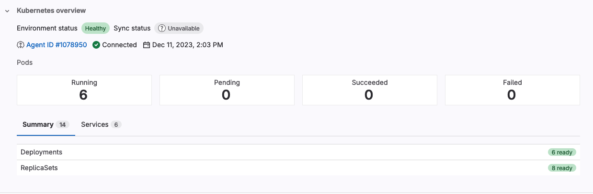

# Dashboard for Kubernetes **(FREE ALL BETA)**

> - [Introduced](https://gitlab.com/gitlab-org/gitlab/-/issues/390769) in GitLab 16.1, with [flags](../../administration/feature_flags.md) named `environment_settings_to_graphql`, `kas_user_access`, `kas_user_access_project`, and `expose_authorized_cluster_agents`. This feature is in [Beta](../../policy/experiment-beta-support.md#beta).
> - Feature flag `environment_settings_to_graphql` [removed](https://gitlab.com/gitlab-org/gitlab/-/merge_requests/124177) in GitLab 16.2.
> - Feature flags `kas_user_access`, `kas_user_access_project`, and `expose_authorized_cluster_agents` [removed](https://gitlab.com/gitlab-org/gitlab/-/merge_requests/125835) in GitLab 16.2.

Use the Dashboard for Kubernetes to understand the status of your clusters with an intuitive visual interface.
The dashboard works with every connected Kubernetes cluster, whether you deployed them
with CI/CD or GitOps.

## Configure a dashboard

> - Filtering resources by namespace [introduced](https://gitlab.com/gitlab-org/gitlab/-/issues/403618) in GitLab 16.2 [with a flag](../../administration/feature_flags.md) named `kubernetes_namespace_for_environment`. Disabled by default.
> - Filtering resources by namespace [enabled by default](https://gitlab.com/gitlab-org/gitlab/-/merge_requests/127043) in GitLab 16.3. Feature flag `kubernetes_namespace_for_environment` removed.
> - Selecting the related Flux resource [introduced](https://gitlab.com/gitlab-org/gitlab/-/merge_requests/128857) in GitLab 16.3 [with a flag](../../administration/feature_flags.md) named `flux_resource_for_environment`.
> - Selecting the related Flux resource [generally available](https://gitlab.com/gitlab-org/gitlab/-/merge_requests/130648) in GitLab 16.4. Feature flag `flux_resource_for_environment` removed.

Configure a dashboard to use it for a given environment.
You can configure dashboard for an environment that already exists, or
add one when you create an environment.

Prerequisites:

- The agent for Kubernetes must be shared with the environment's project, or its parent group, using the [`user_access`](../../user/clusters/agent/user_access.md) keyword.
- Self-managed only. KAS is running on the GitLab subdomain. For example, `kas.example.com` and `example.com`.

::Tabs

:::TabTitle The environment already exists

1. On the left sidebar, select **Search or go to** and find your project.
1. Select **Operate > Environments**.
1. Select the environment to be associated with the agent for Kubernetes.
1. Select **Edit**.
1. Select a GitLab agent for Kubernetes.
1. Optional. From the **Kubernetes namespace** dropdown list, select a namespace.
1. Optional. From the **Flux resource** dropdown list, select a Flux resource.
1. Select **Save**.

:::TabTitle The environment doesn't exist

1. On the left sidebar, select **Search or go to** and find your project.
1. Select **Operate > Environments**.
1. Select **New environment**.
1. Complete the **Name** field.
1. Select a GitLab agent for Kubernetes.
1. Optional. From the **Kubernetes namespace** dropdown list, select a namespace.
1. Optional. From the **Flux resource** dropdown list, select a Flux resource.
1. Select **Save**.

::EndTabs

## View a dashboard

> - Kubernetes watch API integration [introduced](https://gitlab.com/gitlab-org/gitlab/-/issues/422945) in GitLab 16.6 [with a flag](../../administration/feature_flags.md) named `k8s_watch_api`. Disabled by default.
> - Kubernetes watch API integration [enabled by default](https://gitlab.com/gitlab-org/gitlab/-/merge_requests/136831) in GitLab 16.7.

View a dashboard to see the status of any connected clusters.
If the `k8s_watch_api` feature flag is enabled, the status of your
Kubernetes resources and Flux reconciliation updates in real time.

To view a configured dashboard:

1. On the left sidebar, select **Search or go to** and find your project.
1. Select **Operate > Environments**.
1. Expand the environment associated with the agent for Kubernetes.
1. Expand **Kubernetes overview**.

### Flux sync status

> - [Introduced](https://gitlab.com/gitlab-org/gitlab/-/issues/391581) in GitLab 16.3.
> - Customizing the name of the Flux resource [introduced](https://gitlab.com/gitlab-org/gitlab/-/merge_requests/128857) in GitLab 16.3 [with a flag](../../administration/feature_flags.md) named `flux_resource_for_environment`.
> - Customizing the name of the Flux resource [generally available](https://gitlab.com/gitlab-org/gitlab/-/merge_requests/130648) in GitLab 16.4. Feature flag `flux_resource_for_environment` removed.

You can review the sync status of your Flux deployments from a dashboard.
To display the deployment status, your dashboard must be able to retrieve the `Kustomization` and `HelmRelease` resources,
which requires a namespace to be configured for the environment.

GitLab searches the `Kustomization` and `HelmRelease` resources specified by the **Flux resource** dropdown list in the environment settings.

A dashboard displays one of the following status badges:

| Status | Description |
|---------|-------------|
| **Reconciled** | The deployment successfully reconciled with its environment. |
| **Reconciling** | A reconciliation is in progress. |
| **Stalled** | A reconciliation is stuck because of an error that cannot be resolved without human intervention. |
| **Failed** | The deployment couldn't reconcile because of an unrecoverable error. |
| **Unknown** | The sync status of the deployment couldn't be retrieved. |
| **Unavailable** | The `Kustomization` or `HelmRelease` resource couldn't be retrieved. |

## Troubleshooting

When working with the Dashboard for Kubernetes, you might encounter the following issues.

### User cannot list resource in API group

You might get an error that states `Error: services is forbidden: User "gitlab:user:<user-name>" cannot list resource "<resource-name>" in API group "" at the cluster scope`.

This error happens when a user is not allowed to do the specified operation in the [Kubernetes RBAC](https://kubernetes.io/docs/reference/access-authn-authz/rbac/).

To resolve, check your [RBAC configuration](../../user/clusters/agent/user_access.md#configure-kubernetes-access). If the RBAC is properly configured, contact your Kubernetes administrator.
