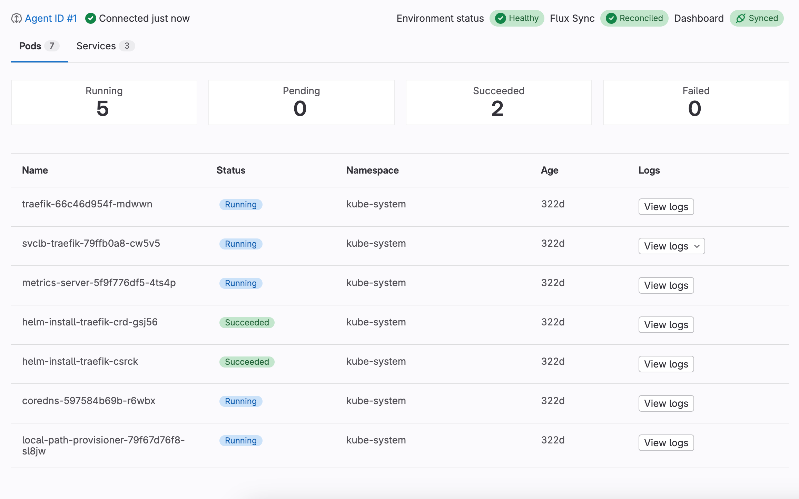
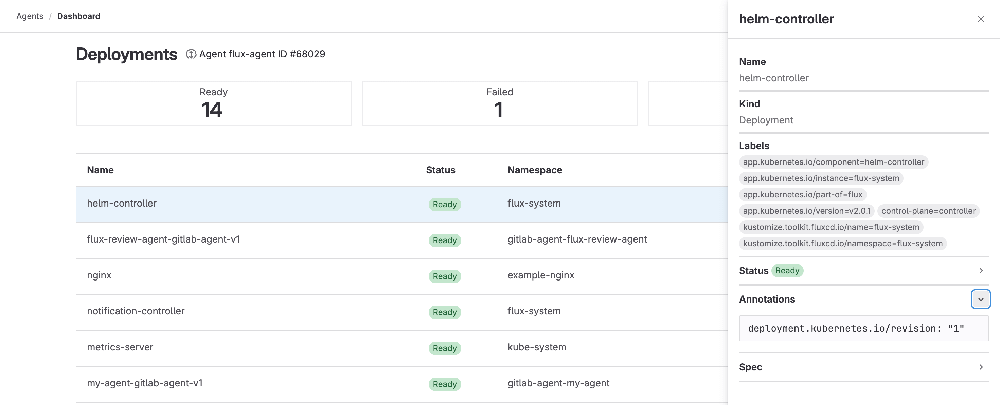

DETAILS:
**Tier:** Free, Premium, Ultimate
**Offering:** GitLab.com, GitLab Self-Managed, GitLab Dedicated
**Status:** Beta

> - [Introduced](https://gitlab.com/gitlab-org/gitlab/-/issues/390769) in GitLab 16.1, with [flags](../../administration/feature_flags.md) named `environment_settings_to_graphql`, `kas_user_access`, `kas_user_access_project`, and `expose_authorized_cluster_agents`. This feature is in [beta](../../policy/development_stages_support.md#beta).
> - Feature flag `environment_settings_to_graphql` [removed](https://gitlab.com/gitlab-org/gitlab/-/merge_requests/124177) in GitLab 16.2.
> - Feature flags `kas_user_access`, `kas_user_access_project`, and `expose_authorized_cluster_agents` [removed](https://gitlab.com/gitlab-org/gitlab/-/merge_requests/125835) in GitLab 16.2.
> - [Moved](https://gitlab.com/gitlab-org/gitlab/-/issues/431746) to the environment details page in 16.10.

Use the dashboard for Kubernetes to understand the status of your clusters with an intuitive visual interface.
The dashboard works with every connected Kubernetes cluster, whether you deployed them
with CI/CD or GitOps.



## Configure a dashboard

> - Filtering resources by namespace [introduced](https://gitlab.com/gitlab-org/gitlab/-/issues/403618) in GitLab 16.2 [with a flag](../../administration/feature_flags.md) named `kubernetes_namespace_for_environment`. Disabled by default.
> - Filtering resources by namespace [enabled by default](https://gitlab.com/gitlab-org/gitlab/-/merge_requests/127043) in GitLab 16.3. Feature flag `kubernetes_namespace_for_environment` removed.
> - Selecting the related Flux resource [introduced](https://gitlab.com/gitlab-org/gitlab/-/merge_requests/128857) in GitLab 16.3 [with a flag](../../administration/feature_flags.md) named `flux_resource_for_environment`.
> - Selecting the related Flux resource [generally available](https://gitlab.com/gitlab-org/gitlab/-/merge_requests/130648) in GitLab 16.4. Feature flag `flux_resource_for_environment` removed.

Configure a dashboard to use it for a given environment.
You can configure dashboard for an environment that already exists, or
add one when you create an environment.

Prerequisites:

- A GitLab agent for Kubernetes is [installed](../../user/clusters/agent/install/_index.md) and [`user_access`](../../user/clusters/agent/user_access.md) is configured for the environment's project or its parent group.

::Tabs

:::TabTitle The environment already exists

1. On the left sidebar, select **Search or go to** and find your project.
1. Select **Operate > Environments**.
1. Select the environment to be associated with the agent for Kubernetes.
1. Select **Edit**.
1. Select a GitLab agent for Kubernetes.
1. Optional. From the **Kubernetes namespace** dropdown list, select a namespace.
1. Optional. From the **Flux resource** dropdown list, select a Flux resource.
1. Select **Save**.

:::TabTitle The environment doesn't exist

1. On the left sidebar, select **Search or go to** and find your project.
1. Select **Operate > Environments**.
1. Select **New environment**.
1. Complete the **Name** field.
1. Select a GitLab agent for Kubernetes.
1. Optional. From the **Kubernetes namespace** dropdown list, select a namespace.
1. Optional. From the **Flux resource** dropdown list, select a Flux resource.
1. Select **Save**.

::EndTabs

### Configure a dashboard for a dynamic environment

> - [Introduced](https://gitlab.com/gitlab-org/gitlab/-/issues/467912) in GitLab 17.6.

To configure a dashboard for a dynamic environment:

- Specify the agent in your `.gitlab-ci.yml` file. You must specify the full path to the agent configuration project,
followed by a colon and the name of the agent.

For example:

```yaml
deploy_review_app:
  stage: deploy
  script: make deploy
  environment:
    name: review/$CI_COMMIT_REF_SLUG
    kubernetes:
      agent: path/to/agent/project:agent-name
```

For more information, see the [CI/CD YAML syntax reference](../yaml/_index.md#environmentkubernetes).

## View a dashboard

> - Kubernetes watch API integration [introduced](https://gitlab.com/gitlab-org/gitlab/-/issues/422945) in GitLab 16.6 [with a flag](../../administration/feature_flags.md) named `k8s_watch_api`. Disabled by default.
> - Kubernetes watch API integration [enabled by default](https://gitlab.com/gitlab-org/gitlab/-/merge_requests/136831) in GitLab 16.7.
> - [Generally available](https://gitlab.com/gitlab-org/gitlab/-/issues/427762) in GitLab 17.1. Feature flag `k8s_watch_api` removed.

View a dashboard to see the status of connected clusters.
If the `k8s_watch_api` feature flag is enabled, the status of your
Kubernetes resources and Flux reconciliation updates in real time.

To view a configured dashboard:

1. On the left sidebar, select **Search or go to** and find your project.
1. Select **Operate > Environments**.
1. Select the environment associated with the agent for Kubernetes.
1. Select the **Kubernetes overview** tab.

A list of pods is displayed. Select a pod to view its details.

### Flux sync status

> - [Introduced](https://gitlab.com/gitlab-org/gitlab/-/issues/391581) in GitLab 16.3.
> - Customizing the name of the Flux resource [introduced](https://gitlab.com/gitlab-org/gitlab/-/merge_requests/128857) in GitLab 16.3 [with a flag](../../administration/feature_flags.md) named `flux_resource_for_environment`.
> - Customizing the name of the Flux resource [generally available](https://gitlab.com/gitlab-org/gitlab/-/merge_requests/130648) in GitLab 16.4. Feature flag `flux_resource_for_environment` removed.

You can review the sync status of your Flux deployments from a dashboard.
To display the deployment status, your dashboard must be able to retrieve the `Kustomization` and `HelmRelease` resources,
which requires a namespace to be configured for the environment.

GitLab searches the `Kustomization` and `HelmRelease` resources specified by the **Flux resource** dropdown list in the environment settings.

A dashboard displays one of the following status badges:

| Status | Description |
|---------|-------------|
| **Reconciled** | The deployment successfully reconciled with its environment. |
| **Reconciling** | A reconciliation is in progress. |
| **Stalled** | A reconciliation is stuck because of an error that cannot be resolved without human intervention. |
| **Failed** | The deployment couldn't reconcile because of an unrecoverable error. |
| **Unknown** | The sync status of the deployment couldn't be retrieved. |
| **Unavailable** | The `Kustomization` or `HelmRelease` resource couldn't be retrieved. |

### Trigger Flux reconciliation

> - [Introduced](https://gitlab.com/gitlab-org/gitlab/-/issues/434248) in GitLab 17.3.

You can manually reconcile your deployment with its Flux resources.

To trigger a reconciliation:

1. On a dashboard, select the sync status badge of a Flux deployment.
1. Select **Actions** (**{ellipsis_v}**) **> Trigger reconciliation** (**{retry}**).

### Suspend or resume Flux reconciliation

> - [Introduced](https://gitlab.com/gitlab-org/gitlab/-/issues/478380) in GitLab 17.5.

You can manually suspend or resume your Flux reconciliation from the UI.

To suspend or resume reconciliation:

1. On a dashboard, select the sync status badge of a Flux deployment.
1. Select **Actions** (**{ellipsis_v}**), then choose one of the following:
   - **Suspend reconciliation** (**{stop}**) to pause the Flux reconciliation.
   - **Resume reconciliation** (**{play}**) to restart the Flux reconciliation.

### View pod logs

> - [Introduced](https://gitlab.com/groups/gitlab-org/-/epics/13793) in GitLab 17.2.

View pod logs when you want to quickly understand and troubleshoot issues across your environments from a configured dashboard. You can view logs for each container in a pod.

- Select **View logs**, then select the container you want to view logs for.

You can also view pod logs from the pod details.

### Delete a pod

> - [Introduced](https://gitlab.com/gitlab-org/gitlab/-/issues/467653) in GitLab 17.3.

To restart a failed pod, delete it from the Kubernetes dashboard.

To delete a pod:

1. On the **Kubernetes overview** tab, find the pod you want to delete.
1. Select **Actions** (**{ellipsis_v}**) **> Delete pod** (**{remove}**).

You can also delete a pod from the pod details.

## Detailed dashboard

> - [Introduced](https://gitlab.com/groups/gitlab-org/-/epics/11351) in GitLab 16.4, [with a flag](../../administration/feature_flags.md) named `k8s_dashboard`. Disabled by default.
> - [Enabled on GitLab.com](https://gitlab.com/gitlab-org/gitlab/-/issues/424237) in GitLab 16.7 for a subset of users.

FLAG:
The availability of this feature is controlled by a feature flag.
For more information, see the history.
This feature is available for testing, but not ready for production use.

The detailed dashboard provides information about the following Kubernetes resources:

- Pods
- Services
- Deployments
- ReplicaSets
- StatefulSets
- DaemonSets
- Jobs
- CronJobs

Each dashboard displays a list of resources with their statuses, namespaces, and age.
You can select a resource to open a drawer with more information, including labels
and YAML-formatted status, annotations, and spec.



Because of the focus shift described in [this issue](https://gitlab.com/gitlab-org/ci-cd/deploy-stage/environments-group/general/-/issues/53#note_1720060812), work on the detailed dashboard is paused.

To provide feedback on the detailed dashboard, see [issue 460279](https://gitlab.com/gitlab-org/gitlab/-/issues/460279).

### View a detailed dashboard

Prerequisites:

- A GitLab agent for Kubernetes is [configured](../../user/clusters/agent/install/_index.md) and shared with the environment's project, or its parent group, using the [`user_access`](../../user/clusters/agent/user_access.md) keyword.

The detailed dashboard is not linked from the sidebar navigation.
To view a detailed dashboard:

1. Find your agent for Kubernetes ID:
   1. On the left sidebar, select **Search or go to** and find your project.
   1. Select **Operate > Kubernetes clusters**.
   1. Copy the numerical ID of the agent you want to access.
1. Go to one of the following URLs, replacing `<agent_id>` with your agent ID:

   | Resource type | URL |
   | --- | --- |
   | Pods | `https://myinstance.gitlab.com/-/kubernetes/<agent_id>/pods`|
   | Services | `https://myinstance.gitlab.com/-/kubernetes/<agent_id>/services` |
   | Deployments | `https://myinstance.gitlab.com/-/kubernetes/<agent_id>/deployments` |
   | ReplicaSets | `https://myinstance.gitlab.com/-/kubernetes/<agent_id>/replicaSets` |
   | StatefulSets | `https://myinstance.gitlab.com/-/kubernetes/<agent_id>/statefulSets` |
   | DaemonSets | `https://myinstance.gitlab.com/-/kubernetes/<agent_id>/daemonSets` |
   | Jobs | `https://myinstance.gitlab.com/-/kubernetes/<agent_id>/jobs` |
   | CronJobs | `https://myinstance.gitlab.com/-/kubernetes/<agent_id>/cronJobs` |

## Troubleshooting

When working with the dashboard for Kubernetes, you might encounter the following issues.

### User cannot list resource in API group

You might get an error that states `Error: services is forbidden: User "gitlab:user:<user-name>" cannot list resource "<resource-name>" in API group "" at the cluster scope`.

This error happens when a user is not allowed to do the specified operation in the [Kubernetes RBAC](https://kubernetes.io/docs/reference/access-authn-authz/rbac/).

To resolve, check your [RBAC configuration](../../user/clusters/agent/user_access.md#configure-kubernetes-access). If the RBAC is properly configured, contact your Kubernetes administrator.

### GitLab agent dropdown list is empty

When you configure a new environment, the **GitLab agent** dropdown list might be empty, even if you have configured Kubernetes clusters.

To populate the **GitLab agent** dropdown list, grant an agent Kubernetes access with the [`user_access`](../../user/clusters/agent/user_access.md) keyword.
