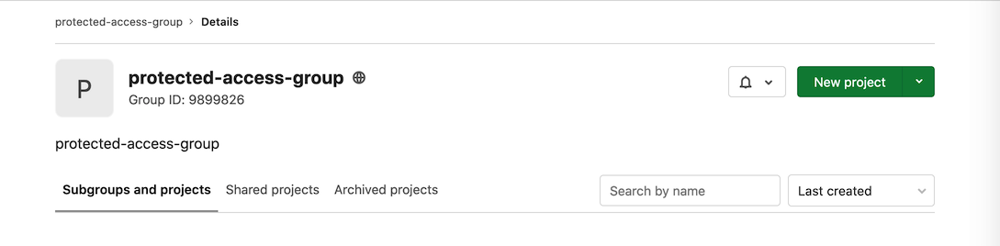

DETAILS:
**Tier:** Premium, Ultimate
**Offering:** GitLab.com, GitLab Self-Managed, GitLab Dedicated

[Environments](_index.md) can be used for both testing and
production reasons.

Because deploy jobs can be raised by different users with different roles, it's
important to be able to protect specific environments from the effects of
unauthorized users.

By default, a protected environment ensures that only people with the
appropriate privileges can deploy to it, keeping the environment safe.

NOTE:
GitLab administrators can use all environments, including protected environments.

To protect, update, or unprotect an environment, you need to have at least the
Maintainer role.

## Protecting environments

Prerequisites:

- When granting the **Allowed to deploy** permission to an approver group, the user configuring the protected environment must be a **direct member** of the approver group to be added. Otherwise, the group or subgroup does not show up in the dropdown list. For more information see [issue #345140](https://gitlab.com/gitlab-org/gitlab/-/issues/345140).
- When granting **Approvers** permissions to an approver group or project, by default only direct members of the approver group or project receive these permissions. To also grant these permissions to inherited members of the approver group or project:
  - Select the **Enable group inheritance** checkbox.
  - [Use the API](../../api/protected_environments.md#group-inheritance-types).

To protect an environment:

1. On the left sidebar, select **Search or go to** and find your project.
1. Select **Settings > CI/CD**.
1. Expand **Protected environments**.
1. Select **Protect an environment**.
1. From the **Environment** list, select the environment you want to protect.
1. In the **Allowed to deploy** list, select the role, users, or groups you
   want to give deploy access to. Keep in mind that:
   - There are two roles to choose from:
     - **Maintainers**: Allows access to all of the project's users with the Maintainer role.
     - **Developers**: Allows access to all of the project's users with the Maintainer and Developer role.
   - You can also select groups that are already [invited](../../user/project/members/sharing_projects_groups.md#invite-a-group-to-a-project) to the project. Invited groups added to the project with the Reporter role appear in the dropdown list for [deployment-only access](#deployment-only-access-to-protected-environments).
   - You can also select specific users. The users must have at least the Developer role to appear in
     the **Allowed to deploy** list.
1. In the **Approvers** list, select the role, users, or groups you
   want to give deploy access to. Keep in mind that:

   - There are two roles to choose from:
     - **Maintainers**: Allows access to all of the project's users with the Maintainer role.
     - **Developers**: Allows access to all of the project's users with the Maintainer and Developer role.
   - You can only select groups that are already [invited](../../user/project/members/sharing_projects_groups.md#invite-a-group-to-a-project) to the project.
   - Users must have at least the Developer role to appear in
     the **Approvers** list.

1. In the **Approval rules** section:

   - Ensure that this number is less than or equal to the number of members in
     the rule.
   - See [Deployment Approvals](deployment_approvals.md) for more information about this feature.

1. Select **Protect**.

The protected environment now appears in the list of protected environments.

### Use the API to protect an environment

Alternatively, you can use the API to protect an environment:

1. Use a project with a CI that creates an environment. For example:

   ```yaml
   stages:
     - test
     - deploy

   test:
     stage: test
     script:
       - 'echo "Testing Application: ${CI_PROJECT_NAME}"'

   production:
     stage: deploy
     when: manual
     script:
       - 'echo "Deploying to ${CI_ENVIRONMENT_NAME}"'
     environment:
       name: ${CI_JOB_NAME}
   ```

1. Use the UI to [create a new group](../../user/group/_index.md#create-a-group).
   For example, this group is called `protected-access-group` and has the group ID `9899826`. Note
   that the rest of the examples in these steps use this group.

   

1. Use the API to add a user to the group as a reporter:

   ```shell
   $ curl --request POST --header "PRIVATE-TOKEN: <your_access_token>" \
          --data "user_id=3222377&access_level=20" "https://gitlab.com/api/v4/groups/9899826/members"

   {"id":3222377,"name":"Sean Carroll","username":"sfcarroll","state":"active","avatar_url":"https://gitlab.com/uploads/-/system/user/avatar/3222377/avatar.png","web_url":"https://gitlab.com/sfcarroll","access_level":20,"created_at":"2020-10-26T17:37:50.309Z","expires_at":null}
   ```

1. Use the API to add the group to the project as a reporter:

   ```shell
   $ curl --request POST --header "PRIVATE-TOKEN: <your_access_token>" \
          --request POST "https://gitlab.com/api/v4/projects/22034114/share?group_id=9899826&group_access=20"

   {"id":1233335,"project_id":22034114,"group_id":9899826,"group_access":20,"expires_at":null}
   ```

1. Use the API to add the group with protected environment access:

   ```shell
   curl --header 'Content-Type: application/json' --request POST --data '{"name": "production", "deploy_access_levels": [{"group_id": 9899826}]}' \
        --header "PRIVATE-TOKEN: <your_access_token>" "https://gitlab.com/api/v4/projects/22034114/protected_environments"
   ```

The group now has access and can be seen in the UI.

## Environment access by group membership

A user may be granted access to protected environments as part of [group membership](../../user/group/_index.md). Users
with the Reporter role can only be granted access to protected environments with this
method.

## Deployment branch access

Users with the Developer role can be granted
access to a protected environment through any of these methods:

- As an individual contributor, through a role.
- Through a group membership.

If the user also has push or merge access to the branch deployed on production,
they have the following privileges:

- [Stop an environment](_index.md#stopping-an-environment).
- [Delete an environment](_index.md#delete-an-environment).
- [Create an environment terminal](_index.md#web-terminals-deprecated).

## Deployment-only access to protected environments

Users granted access to a protected environment, but not push or merge access
to the branch deployed to it, are only granted access to deploy the environment.
[Invited groups](../../user/project/members/sharing_projects_groups.md#invite-a-group-to-a-project) added
to the project with [Reporter role](../../user/permissions.md#project-members-permissions), appear in the dropdown list for deployment-only access.

To add deployment-only access:

1. Create a group with members who are granted to access to the protected environment, if it doesn't exist yet.
1. [Invite the group](../../user/project/members/sharing_projects_groups.md#invite-a-group-to-a-project) to the project with the Reporter role.
1. Follow the steps in [Protecting Environments](#protecting-environments).

## Modifying and unprotecting environments

Maintainers can:

- Update existing protected environments at any time by changing the access in the
  **Allowed to Deploy** dropdown list.
- Unprotect a protected environment by selecting the **Unprotect** button for that environment.

After an environment is unprotected, all access entries are deleted and must
be re-entered if the environment is re-protected.

After an approval rule is deleted, previously approved deployments do not show who approved the deployment.
Information on who approved a deployment is still available in the [project audit events](../../user/compliance/audit_events.md#project-audit-events).
If a new rule is added, previous deployments show the new rules without the option to approve the deployment. [Issue 506687](https://gitlab.com/gitlab-org/gitlab/-/issues/506687) proposes to show the full approval history of deployments, even if an approval rule is deleted.

For more information, see [Deployment safety](deployment_safety.md).

## Group-level protected environments

Typically, large enterprise organizations have an explicit permission boundary
between [developers and operators](https://about.gitlab.com/topics/devops/).
Developers build and test their code, and operators deploy and monitor the
application. With group-level protected environments, operators can
restrict access to critical environments from developers. Group-level protected environments
extend the [project-level protected environments](#protecting-environments)
to the group-level.

The permissions of deployments can be illustrated in the following table:

| Environment | Developer  | Operator | Category |
|-------------|------------|----------|----------|
| Development | Allowed    | Allowed  | Lower environment  |
| Testing     | Allowed    | Allowed  | Lower environment  |
| Staging     | Disallowed | Allowed  | Higher environment |
| Production  | Disallowed | Allowed  | Higher environment |

_(Reference: [Deployment environments on Wikipedia](https://en.wikipedia.org/wiki/Deployment_environment))_

### Group-level protected environments names

Contrary to project-level protected environments, group-level protected
environments use the [deployment tier](_index.md#deployment-tier-of-environments)
as their name.

A group may consist of many project environments that have unique names.
For example, Project-A has a `gprd` environment and Project-B has a `Production`
environment, so protecting a specific environment name doesn't scale well.
By using deployment tiers, both are recognized as `production` deployment tier
and are protected at the same time.

### Configure group-level memberships

> - Operators are required to have Owner+ role from the original Maintainer+ role and this role change is introduced from GitLab 15.3 [with a flag](https://gitlab.com/gitlab-org/gitlab/-/issues/369873) named `group_level_protected_environment_settings_permission`. Enabled by default.
> - [Feature flag removed](https://gitlab.com/gitlab-org/gitlab/-/issues/369873) in GitLab 15.4.

To maximize the effectiveness of group-level protected environments,
[group-level memberships](../../user/group/_index.md) must be correctly
configured:

- Operators should be given the Owner role
  for the top-level group. They can maintain CI/CD configurations for
  the higher environments (such as production) in the group-level settings page,
  which includes group-level protected environments,
  [group-level runners](../runners/runners_scope.md#group-runners), and
  [group-level clusters](../../user/group/clusters/_index.md). Those
  configurations are inherited to the child projects as read-only entries.
  This ensures that only operators can configure the organization-wide
  deployment ruleset.
- Developers should be given no more than the Developer role
  for the top-level group, or explicitly given the Owner role for a child project.
  They do *not* have access to the CI/CD configurations in the
  top-level group, so operators can ensure that the critical configuration won't
  be accidentally changed by the developers.
- For subgroups and child projects:
  - Regarding [subgroups](../../user/group/subgroups/_index.md), if a higher
    group has configured the group-level protected environment, the lower groups
    cannot override it.
  - [Project-level protected environments](#protecting-environments) can be
    combined with the group-level setting. If both group-level and project-level
    environment configurations exist, to run a deployment job, the user must be allowed in **both**
    rulesets.
  - In a project or a subgroup of the top-level group, developers can be
    safely assigned the Maintainer role to tune their lower environments (such
    as `testing`).

Having this configuration in place:

- If a user is about to run a deployment job in a project and allowed to deploy
  to the environment, the deployment job proceeds.
- If a user is about to run a deployment job in a project but disallowed to
  deploy to the environment, the deployment job fails with an error message.

### Protect critical environments under a group

To protect a group-level environment, make sure your environments have the correct
[`deployment_tier`](_index.md#deployment-tier-of-environments) defined in `.gitlab-ci.yml`.

#### Using the UI

> - [Introduced](https://gitlab.com/gitlab-org/gitlab/-/issues/325249) in GitLab 15.1.

1. On the left sidebar, select **Search or go to** and find your group.
1. Select **Settings > CI/CD**.
1. Expand **Protected environments**.
1. From the **Environment** list, select the [deployment tier of environments](_index.md#deployment-tier-of-environments) you want to protect.
1. In the **Allowed to deploy** list, select the [subgroups](../../user/group/subgroups/_index.md) you want to give deploy access to.
1. Select **Protect**.

#### Using the API

Configure the group-level protected environments by using the [REST API](../../api/group_protected_environments.md).

## Deployment approvals

Protected environments can also be used to require manual approvals before deployments. See [Deployment approvals](deployment_approvals.md) for more information.

## Troubleshooting

### Reporter can't run a trigger job that deploys to a protected environment in downstream pipeline

A user who has [deployment-only access to protected environments](#deployment-only-access-to-protected-environments) might **not** be able to run a job if it's with a [`trigger`](../yaml/_index.md#trigger) keyword. This is because the job is missing the [`environment`](../yaml/_index.md#environment) keyword definition to associate the job with the protected environment, therefore the job is recognized as a standard job that uses [regular CI/CD permission model](../../user/permissions.md#cicd).

See [this issue](https://gitlab.com/groups/gitlab-org/-/epics/8483) for more information about supporting `environment` keyword with `trigger` keyword.
