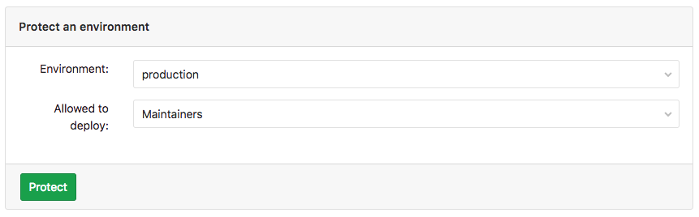
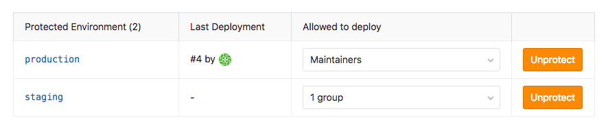

# Protected Environments

> [Introduced][6303] in [GitLab Premium][ee] 11.2.

## Overview

Environments can be used for different scopes, some of them are just for testing 
while others are for production. As deploy jobs could be raised by different users 
with different roles, it is very important that specific environments are "protected" 
to avoid unauthorized people to affect them. 

By default a protected environment does one simple thing: Ensures that only people 
with right privileges can deploy code to an environment, keeping it safe.

>**Note**:
A GitLab admin is always allowed to use environments, even if they are protected.

To protect an environment, and to update or unprotect an environment, 
you need to have at least [Maintainer permission][perm] level.

## Configuring protected environments

1. Navigate to your project's **Settings ➔ CI/CD**
1. Scroll to find the **Protected Environments** section.
1. From the **Environment** dropdown menu, select the environment you want to protect and
   click **Protect**. In the screenshot below, we chose the `production` environment
1. From the 'Allowed to Deploy' dropdown menu, you can select the role and/or the users and/or the groups
you want to have deploy access. In the screenshot below, we chose the 'maintainers'. role

    

1. Once done, the protected environment will appear in the "Protected environments" list.

    

For the 'Allowed to Deploy' dropdown, there are some considerations to have in mind:

- There are two roles to choose from:
  - *Maintainers* - Will allow access to all maintainers in the project.
  - *Developers* - Will allow access to all maintainers and all developers in the project.
- You can only select groups that are associted with the project.
- Only users that have at least Developer permimssion level will appear on 'Allowed to Deploy' dropdown menu.

## Updating protected environments access

From time to time, it may be required to update the access to a certain environment. 
[Maintainers][perm] can update existing protected environments at any time 
by changing the access on 'Allowed to Deploy' dropdown menu.

## Unprotecting a protected environment

To unprotect a protected environment, [Maintainers][perm] need to click the 'Unprotect' button
of the respective environment.

[ee]: https://about.gitlab.com/pricing/
[6303]: https://gitlab.com/gitlab-org/gitlab-ee/merge_requests/6303
[perm]: ../../user/permissions.html
