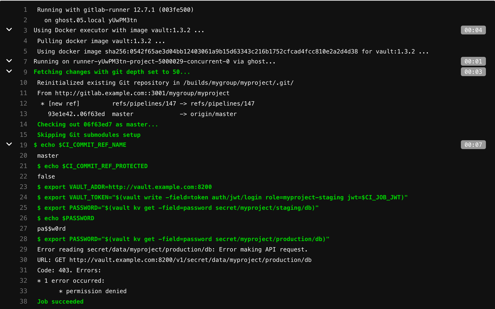
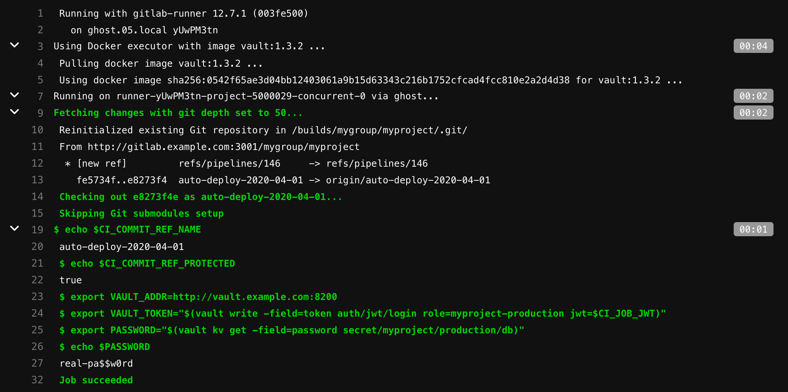

# Authenticating and Reading Secrets With HashiCorp Vault

This tutorial demonstrates how to authenticate, configure, and read secrets with HashiCorp's Vault from GitLab CI/CD.

NOTE:
[GitLab Premium](https://about.gitlab.com/pricing/) supports read access to a
HashiCorp Vault, and enables you to
[use Vault secrets in a CI job](../../secrets/index.md#use-vault-secrets-in-a-ci-job).
To learn more, read [Using external secrets in CI](../../secrets/index.md).

## Requirements

This tutorial assumes you are familiar with GitLab CI/CD and Vault.

To follow along, you must have:

- An account on GitLab.
- A running Vault server and access to it is required to configure authentication and create roles
  and policies. For HashiCorp Vaults, this can be the Open Source or Enterprise version.

NOTE:
You must replace the `vault.example.com` URL below with the URL of your Vault server, and `gitlab.example.com` with the URL of your GitLab instance.

## How it works

Each job has JSON Web Token (JWT) provided as CI/CD variable named `CI_JOB_JWT`. This JWT can be used to authenticate with Vault using the [JWT Auth](https://www.vaultproject.io/docs/auth/jwt#jwt-authentication) method.

The following fields are included in the JWT:

| Field                   | When   | Description |
| ----------------------- | ------ | ----------- |
| `jti`                   | Always | Unique identifier for this token |
| `iss`                   | Always | Issuer, the domain of your GitLab instance |
| `iat`                   | Always | Issued at |
| `nbf`                   | Always | Not valid before |
| `exp`                   | Always | Expires at |
| `sub`                   | Always | Subject (job ID) |
| `namespace_id`          | Always | Use this to scope to group or user level namespace by ID |
| `namespace_path`        | Always | Use this to scope to group or user level namespace by path |
| `project_id`            | Always | Use this to scope to project by ID |
| `project_path`          | Always | Use this to scope to project by path |
| `user_id`               | Always | ID of the user executing the job |
| `user_login`            | Always | Username of the user executing the job |
| `user_email`            | Always | Email of the user executing the job |
| `pipeline_id`           | Always | ID of this pipeline |
| `pipeline_source`       | Always | [Pipeline source](../../jobs/job_control.md#common-if-clauses-for-rules) |
| `job_id`                | Always | ID of this job |
| `ref`                   | Always | Git ref for this job |
| `ref_type`              | Always | Git ref type, either `branch` or `tag` |
| `ref_protected`         | Always | `true` if this Git ref is protected, `false` otherwise |
| `environment`           | Job is creating a deployment | Environment this job deploys to ([introduced](https://gitlab.com/gitlab-org/gitlab/-/issues/294440) in GitLab 13.9) |
| `environment_protected` | Job is creating a deployment |`true` if deployed environment is protected, `false` otherwise ([introduced](https://gitlab.com/gitlab-org/gitlab/-/issues/294440) in GitLab 13.9) |

Example JWT payload:

```json
{
  "jti": "c82eeb0c-5c6f-4a33-abf5-4c474b92b558",
  "iss": "gitlab.example.com",
  "iat": 1585710286,
  "nbf": 1585798372,
  "exp": 1585713886,
  "sub": "job_1212",
  "namespace_id": "1",
  "namespace_path": "mygroup",
  "project_id": "22",
  "project_path": "mygroup/myproject",
  "user_id": "42",
  "user_login": "myuser",
  "user_email": "myuser@example.com",
  "pipeline_id": "1212",
  "pipeline_source": "web",
  "job_id": "1212",
  "ref": "auto-deploy-2020-04-01",
  "ref_type": "branch",
  "ref_protected": "true",
  "environment": "production",
  "environment_protected": "true"
}
```

The JWT is encoded by using RS256 and signed with a dedicated private key. The expire time for the token is set to job's timeout, if specified, or 5 minutes if it is not. The key used to sign this token may change without any notice. In such case retrying the job generates new JWT using the current signing key.

You can use this JWT and your instance's JWKS endpoint (`https://gitlab.example.com/-/jwks`) to authenticate with a Vault server that is configured to allow the JWT Authentication method for authentication.

When configuring roles in Vault, you can use [bound_claims](https://www.vaultproject.io/docs/auth/jwt#bound-claims) to match against the JWT's claims and restrict which secrets each CI job has access to.

To communicate with Vault, you can use either its CLI client or perform API requests (using `curl` or another client).

## Example

WARNING:
JWTs are credentials, which can grant access to resources. Be careful where you paste them!

Let's say you have the passwords for your staging and production databases stored in a Vault server that is running on `http://vault.example.com:8200`. Your staging password is `pa$$w0rd` and your production password is `real-pa$$w0rd`.

```shell
$ vault kv get -field=password secret/myproject/staging/db
pa$$w0rd

$ vault kv get -field=password secret/myproject/production/db
real-pa$$w0rd
```

To configure your Vault server, start by enabling the [JWT Auth](https://www.vaultproject.io/docs/auth/jwt) method:

```shell
$ vault auth enable jwt
Success! Enabled jwt auth method at: jwt/
```

Then create policies that allow you to read these secrets (one for each secret):

```shell
$ vault policy write myproject-staging - <<EOF
# Policy name: myproject-staging
#
# Read-only permission on 'secret/data/myproject/staging/*' path
path "secret/data/myproject/staging/*" {
  capabilities = [ "read" ]
}
EOF
Success! Uploaded policy: myproject-staging

$ vault policy write myproject-production - <<EOF
# Policy name: myproject-production
#
# Read-only permission on 'secret/data/myproject/production/*' path
path "secret/data/myproject/production/*" {
  capabilities = [ "read" ]
}
EOF
Success! Uploaded policy: myproject-production
```

You also need roles that link the JWT with these policies.

One for staging named `myproject-staging`:

```shell
$ vault write auth/jwt/role/myproject-staging - <<EOF
{
  "role_type": "jwt",
  "policies": ["myproject-staging"],
  "token_explicit_max_ttl": 60,
  "user_claim": "user_email",
  "bound_claims": {
    "project_id": "22",
    "ref": "master",
    "ref_type": "branch"
  }
}
EOF
```

And one for production named `myproject-production`:

```shell
$ vault write auth/jwt/role/myproject-production - <<EOF
{
  "role_type": "jwt",
  "policies": ["myproject-production"],
  "token_explicit_max_ttl": 60,
  "user_claim": "user_email",
  "bound_claims_type": "glob",
  "bound_claims": {
    "project_id": "22",
    "ref_protected": "true",
    "ref_type": "branch",
    "ref": "auto-deploy-*"
  }
}
EOF
```

This example uses [bound_claims](https://www.vaultproject.io/api/auth/jwt#bound_claims) to specify that only a JWT with matching values for the specified claims is allowed to authenticate.

Combined with [protected branches](../../../user/project/protected_branches.md), you can restrict who is able to authenticate and read the secrets.

[`token_explicit_max_ttl`](https://www.vaultproject.io/api/auth/jwt#token_explicit_max_ttl) specifies that the token issued by Vault, upon successful authentication, has a hard lifetime limit of 60 seconds.

[`user_claim`](https://www.vaultproject.io/api/auth/jwt#user_claim) specifies the name for the Identity alias created by Vault upon a successful login.

[`bound_claims_type`](https://www.vaultproject.io/api-docs/auth/jwt#bound_claims_type) configures the interpretation of the `bound_claims` values. If set to `glob`, the values are interpreted as globs, with `*` matching any number of characters.

For the full list of options, see Vault's [Create Role documentation](https://www.vaultproject.io/api/auth/jwt#create-role).

WARNING:
Always restrict your roles to project or namespace by using one of the provided claims (e.g. `project_id` or `namespace_id`). Otherwise any JWT generated by this instance may be allowed to authenticate using this role.

Now, configure the JWT Authentication method:

```shell
$ vault write auth/jwt/config \
    jwks_url="https://gitlab.example.com/-/jwks" \
    bound_issuer="gitlab.example.com"
```

[bound_issuer](https://www.vaultproject.io/api/auth/jwt#inlinecode-bound_issuer) specifies that only a JWT with the issuer (that is, the `iss` claim) set to `gitlab.example.com` can use this method to authenticate, and that the JWKS endpoint (`https://gitlab.example.com/-/jwks`) should be used to validate the token.

For the full list of available configuration options, see Vault's [API documentation](https://www.vaultproject.io/api/auth/jwt#configure).

The following job, when run for the default branch, is able to read secrets under `secret/myproject/staging/`, but not the secrets under `secret/myproject/production/`:

```yaml
read_secrets:
  script:
    # Check job's ref name
    - echo $CI_COMMIT_REF_NAME
    # and is this ref protected
    - echo $CI_COMMIT_REF_PROTECTED
    # Vault's address can be provided here or as CI/CD variable
    - export VAULT_ADDR=http://vault.example.com:8200
    # Authenticate and get token. Token expiry time and other properties can be configured
    # when configuring JWT Auth - https://www.vaultproject.io/api/auth/jwt#parameters-1
    - export VAULT_TOKEN="$(vault write -field=token auth/jwt/login role=myproject-staging jwt=$CI_JOB_JWT)"
    # Now use the VAULT_TOKEN to read the secret and store it in an environment variable
    - export PASSWORD="$(vault kv get -field=password secret/myproject/staging/db)"
    # Use the secret
    - echo $PASSWORD
    # This will fail because the role myproject-staging can not read secrets from secret/myproject/production/*
    - export PASSWORD="$(vault kv get -field=password secret/myproject/production/db)"
```

NOTE:
If you're using a Vault instance provided by HashiCorp Cloud Platform,
you need to export the `VAULT_NAMESPACE` variable. Its default value is `admin`.



The following job is able to authenticate using the `myproject-production` role and read secrets under `/secret/myproject/production/`:

```yaml
read_secrets:
  script:
    # Check job's ref name
    - echo $CI_COMMIT_REF_NAME
    # and is this ref protected
    - echo $CI_COMMIT_REF_PROTECTED
    # Vault's address can be provided here or as CI/CD variable
    - export VAULT_ADDR=http://vault.example.com:8200
    # Authenticate and get token. Token expiry time and other properties can be configured
    # when configuring JWT Auth - https://www.vaultproject.io/api/auth/jwt#parameters-1
    - export VAULT_TOKEN="$(vault write -field=token auth/jwt/login role=myproject-production jwt=$CI_JOB_JWT)"
    # Now use the VAULT_TOKEN to read the secret and store it in environment variable
    - export PASSWORD="$(vault kv get -field=password secret/myproject/production/db)"
    # Use the secret
    - echo $PASSWORD
```


