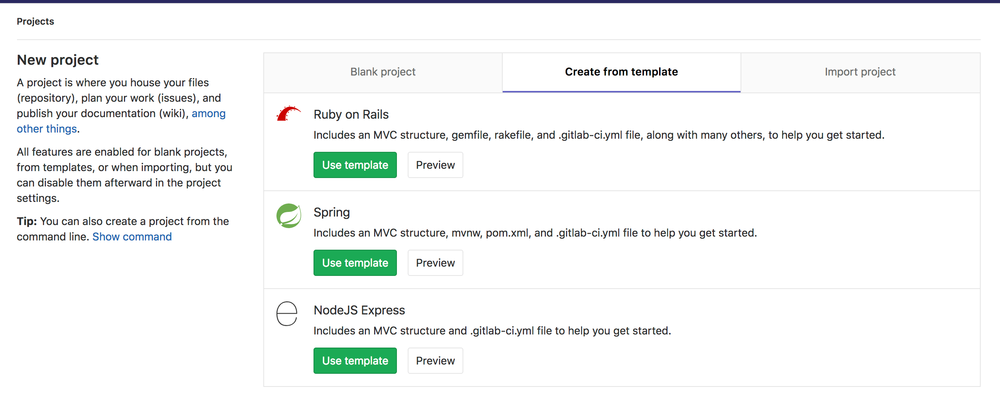
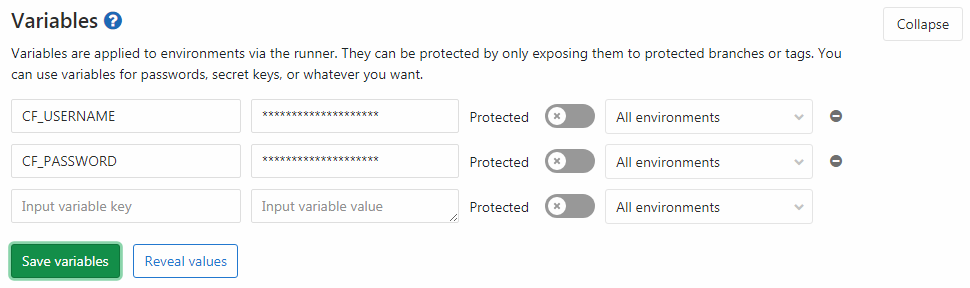

# Deploy a Spring Boot application to Cloud Foundry with GitLab CI/CD

## Introduction

In this article, we'll demonstrate how to deploy a [Spring
Boot](https://projects.spring.io/spring-boot/) application to [Cloud
Foundry (CF)](https://www.cloudfoundry.org/) with GitLab CI/CD using the [Continuous
Deployment](https://about.gitlab.com/2016/08/05/continuous-integration-delivery-and-deployment-with-gitlab/#continuous-deployment)
method.

All the code for this project can be found in this [GitLab
repo](https://gitlab.com/gitlab-examples/spring-gitlab-cf-deploy-demo).

In case you're interested in deploying Spring Boot applications to Kubernetes
using GitLab CI/CD, read through the blog post [Continuous Delivery of a Spring Boot application with GitLab CI and Kubernetes](https://about.gitlab.com/2016/12/14/continuous-delivery-of-a-spring-boot-application-with-gitlab-ci-and-kubernetes/).

## Requirements

This tutorial assumes you are familiar with Java, GitLab, Cloud Foundry, and GitLab CI/CD.

To follow along, you will need:

- An account on [Pivotal Web Services (PWS)](https://run.pivotal.io/) or any
  other Cloud Foundry (CF) instance.
- An account on GitLab.

NOTE: **Note:**
You will need to replace the `api.run.pivotal.io` URL in the all below
commands with the [API
URL](https://docs.cloudfoundry.org/running/cf-api-endpoint.html) of your CF
instance if you're not deploying to PWS.

## Create your project

To create your Spring Boot application you can use the Spring template in
GitLab when creating a new project:



## Configure the deployment to Cloud Foundry

To deploy to Cloud Foundry we need to add a `manifest.yml` file. This
is the configuration for the CF CLI we will use to deploy the application. We
will create this in the root directory of our project with the following
content:

```yaml
---
applications:
- name: gitlab-hello-world
  random-route: true
  memory: 1G
  path: target/demo-0.0.1-SNAPSHOT.jar
```

## Configure GitLab CI/CD to deploy your application

Now we need to add the GitLab CI/CD configuration file
([`.gitlab-ci.yml`](../../yaml/README.md)) to our
project's root. This is how GitLab figures out what commands need to be run whenever
code is pushed to our repository. We will add the following `.gitlab-ci.yml`
file to the root directory of the repository, GitLab will detect it
automatically and run the steps defined once we push our code:

```yaml
image: java:8

stages:
  - build
  - deploy

before_script:
  - chmod +x mvnw

build:
  stage: build
  script: ./mvnw package
  artifacts:
    paths:
      - target/demo-0.0.1-SNAPSHOT.jar

production:
  stage: deploy
  script:
  - curl --location "https://cli.run.pivotal.io/stable?release=linux64-binary&source=github" | tar zx
  - ./cf login -u $CF_USERNAME -p $CF_PASSWORD -a api.run.pivotal.io
  - ./cf push
  only:
  - master
```

We've used the `java:8` [docker
image](../../docker/using_docker_images.md) to build
our application as it provides the up-to-date Java 8 JDK on [Docker
Hub](https://hub.docker.com/). We've also added the [`only`
clause](../../yaml/README.md#onlyexcept-basic)
to ensure our deployments only happen when we push to the master branch.

Now, since the steps defined in `.gitlab-ci.yml` require credentials to login
to CF, you'll need to add your CF credentials as [environment
variables](../../variables/README.md#predefined-environment-variables)
on GitLab CI/CD. To set the environment variables, navigate to your project's
**Settings > CI/CD** and expand **Variables**. Name the variables
`CF_USERNAME` and `CF_PASSWORD` and set them to the correct values.



Once set up, GitLab CI/CD will deploy your app to CF at every push to your
repository's default branch. To see the build logs or watch your builds running
live, navigate to **CI/CD > Pipelines**.

CAUTION: **Caution:**
It is considered best practice for security to create a separate deploy
user for your application and add its credentials to GitLab instead of using
a developer's credentials.

To start a manual deployment in GitLab go to **CI/CD > Pipelines** then click
on **Run Pipeline**. Once the app is finished deploying it will display the URL
of your application in the logs for the `production` job like:

```shell
requested state: started
instances: 1/1
usage: 1G x 1 instances
urls: gitlab-hello-world-undissembling-hotchpot.cfapps.io
last uploaded: Mon Nov 6 10:02:25 UTC 2017
stack: cflinuxfs2
buildpack: client-certificate-mapper=1.2.0_RELEASE container-security-provider=1.8.0_RELEASE java-buildpack=v4.5-offline-https://github.com/cloudfoundry/java-buildpack.git#ffeefb9 java-main java-opts jvmkill-agent=1.10.0_RELEASE open-jdk-like-jre=1.8.0_1...

     state     since                    cpu      memory         disk           details
#0   running   2017-11-06 09:03:22 PM   120.4%   291.9M of 1G   137.6M of 1G
```

You can then visit your deployed application (for this example,
`https://gitlab-hello-world-undissembling-hotchpot.cfapps.io/`) and you should
see the "Spring is here!" message.
