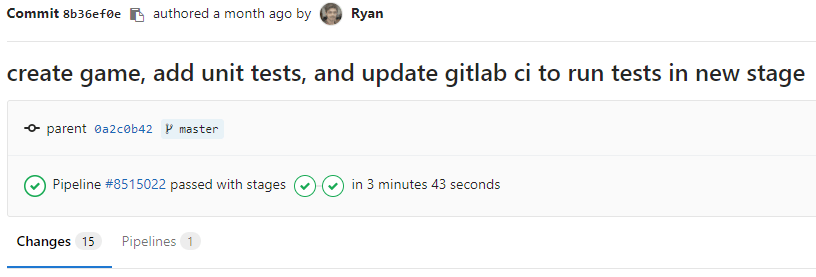
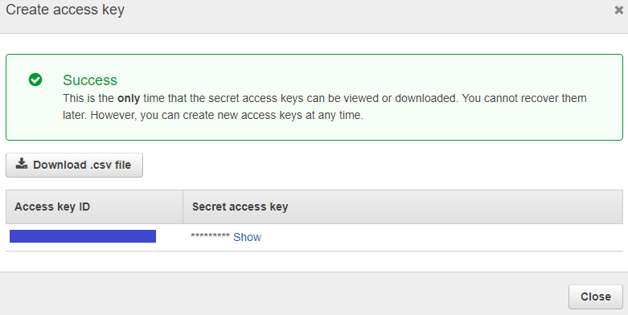
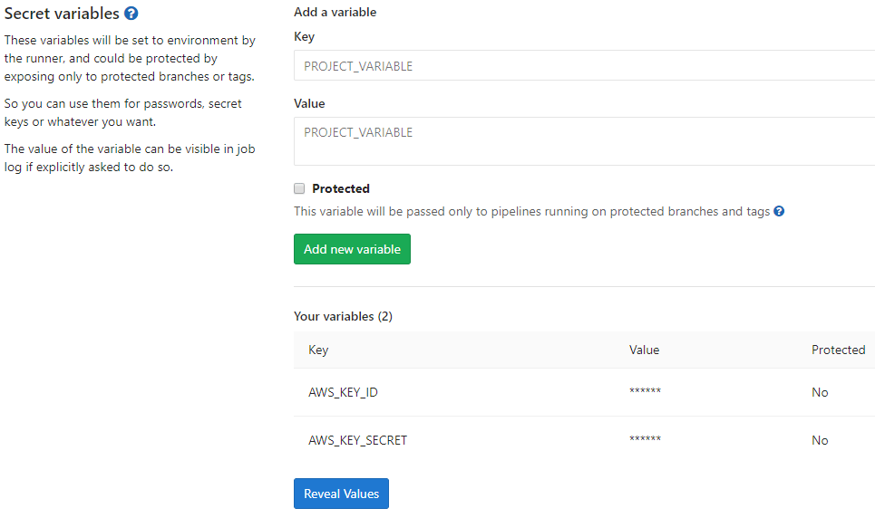

# DevOps and Game Dev with GitLab CI/CD

With advances in WebGL and WebSockets, browsers are extremely viable as game development
platforms without the use of plugins like Adobe Flash. Furthermore, by using GitLab and [AWS](https://aws.amazon.com/),
single game developers, as well as game dev teams, can easily host browser-based games online.

In this tutorial, we'll focus on DevOps, as well as testing and hosting games with Continuous
Integration/Deployment methods. We assume you are familiar with GitLab, javascript,
and the basics of game development.

## The game

Our [demo game](http://gitlab-game-demo.s3-website-us-east-1.amazonaws.com/) consists of a simple spaceship traveling in space that shoots by clicking the mouse in a given direction.

Creating a strong CI/CD pipeline at the beginning of developing another game, [Dark Nova](http://darknova.io/about),
was essential for the fast pace the team worked at. This tutorial will build upon my
[previous introductory article](https://ryanhallcs.wordpress.com/2017/03/15/devops-and-game-dev/) and go through the following steps:

1. Using code from the previous article to start with a barebones [Phaser](https://phaser.io) game built by a gulp file
1. Adding and running unit tests
1. Creating a `Weapon` class that can be triggered to spawn a `Bullet` in a given direction
1. Adding a `Player` class that uses this weapon and moves around the screen
1. Adding the sprites we will use for the `Player` and `Weapon`
1. Testing and deploying with Continuous Integration and Continuous Deployment methods

By the end, we'll have the core of a [playable game](http://gitlab-game-demo.s3-website-us-east-1.amazonaws.com/)
that's tested and deployed on every push to the `master` branch of the [codebase](https://gitlab.com/blitzgren/gitlab-game-demo).
This will also provide
boilerplate code for starting a browser-based game with the following components:

- Written in [Typescript](https://www.typescriptlang.org/) and [PhaserJs](https://phaser.io)
- Building, running, and testing with [Gulp](http://gulpjs.com/)
- Unit tests with [Chai](http://chaijs.com/) and [Mocha](https://mochajs.org/)
- CI/CD with GitLab
- Hosting the codebase on GitLab.com
- Hosting the game on AWS
- Deploying to AWS

## Requirements and setup

Please refer to my previous article [DevOps and Game Dev](https://ryanhallcs.wordpress.com/2017/03/15/devops-and-game-dev/) to learn the foundational
development tools, running a Hello World-like game, and building this game using GitLab
CI/CD from every new push to master. The `master` branch for this game's [repository](https://gitlab.com/blitzgren/gitlab-game-demo)
contains a completed version with all configurations. If you would like to follow along
with this article, you can clone and work from the `devops-article` branch:

```sh
git clone git@gitlab.com:blitzgren/gitlab-game-demo.git
git checkout devops-article
```

Next, we'll create a small subset of tests that exemplify most of the states I expect
this `Weapon` class to go through. To get started, create a folder called `lib/tests`
and add the following code to a new file `weaponTests.ts`:

```ts
import { expect } from 'chai';
import { Weapon, BulletFactory } from '../lib/weapon';

describe('Weapon', () => {
    var subject: Weapon;
    var shotsFired: number = 0;
    // Mocked bullet factory
    var bulletFactory: BulletFactory = <BulletFactory>{
        generate: function(px, py, vx, vy, rot) {
            shotsFired++;
        }
    };
    var parent: any = { x: 0, y: 0 };

    beforeEach(() => {
        shotsFired = 0;
        subject = new Weapon(bulletFactory, parent, 0.25, 1);
    });

    it('should shoot if not in cooldown', () => {
        subject.trigger(true);
        subject.update(0.1);
        expect(shotsFired).to.equal(1);
    });

    it('should not shoot during cooldown', () => {
        subject.trigger(true);
        subject.update(0.1);
        subject.update(0.1);
        expect(shotsFired).to.equal(1);
    });

    it('should shoot after cooldown ends', () => {
        subject.trigger(true);
        subject.update(0.1);
        subject.update(0.3); // longer than timeout
        expect(shotsFired).to.equal(2);
    });

    it('should not shoot if not triggered', () => {
        subject.update(0.1);
        subject.update(0.1);
        expect(shotsFired).to.equal(0);
    });
});
```

To build and run these tests using gulp, let's also add the following gulp functions
to the existing `gulpfile.js` file:

```ts
gulp.task('build-test', function () {
    return gulp.src('src/tests/**/*.ts', { read: false })
    .pipe(tap(function (file) {
      // replace file contents with browserify's bundle stream
      file.contents = browserify(file.path, { debug: true })
        .plugin(tsify, { project: "./tsconfig.test.json" })
        .bundle();
    }))
    .pipe(buffer())
    .pipe(sourcemaps.init({loadMaps: true}) )
    .pipe(gulp.dest('built/tests'));
});

gulp.task('run-test', function() {
    gulp.src(['./built/tests/**/*.ts']).pipe(mocha());
});
```

We will start implementing the first part of our game and get these `Weapon` tests to pass.
The `Weapon` class will expose a method to trigger the generation of a bullet at a given
direction and speed. Later we will implement a `Player` class that ties together the user input
to trigger the weapon. In the `src/lib` folder create a `weapon.ts` file. We'll add two classes
to it: `Weapon` and `BulletFactory` which will encapsulate Phaser's **sprite** and
**group** objects, and the logic specific to our game.

```ts
export class Weapon {
    private isTriggered: boolean = false;
    private currentTimer: number = 0;

    constructor(private bulletFactory: BulletFactory, private parent: Phaser.Sprite, private cooldown: number, private bulletSpeed: number) {
    }

    public trigger(on: boolean): void {
        this.isTriggered = on;
    }

    public update(delta: number): void {
        this.currentTimer -= delta;

        if (this.isTriggered && this.currentTimer <= 0) {
            this.shoot();
        }
    }

    private shoot(): void {
        // Reset timer
        this.currentTimer = this.cooldown;

        // Get velocity direction from player rotation
        var parentRotation = this.parent.rotation + Math.PI / 2;
        var velx = Math.cos(parentRotation);
        var vely = Math.sin(parentRotation);

        // Apply a small forward offset so bullet shoots from head of ship instead of the middle
        var posx = this.parent.x - velx * 10
        var posy = this.parent.y - vely * 10;

        this.bulletFactory.generate(posx, posy, -velx * this.bulletSpeed, -vely * this.bulletSpeed, this.parent.rotation);
    }
}

export class BulletFactory {

    constructor(private bullets: Phaser.Group, private poolSize: number) {
        // Set all the defaults for this BulletFactory's bullet object
        this.bullets.enableBody = true;
        this.bullets.physicsBodyType = Phaser.Physics.ARCADE;
        this.bullets.createMultiple(30, 'bullet');
        this.bullets.setAll('anchor.x', 0.5);
        this.bullets.setAll('anchor.y', 0.5);
        this.bullets.setAll('outOfBoundsKill', true);
        this.bullets.setAll('checkWorldBounds', true);
    }

    public generate(posx: number, posy: number, velx: number, vely: number, rot: number): Phaser.Sprite {
        // Pull a bullet from Phaser's Group pool
        var bullet = this.bullets.getFirstExists(false);

        // Set the few unique properties about this bullet: rotation, position, and velocity
        if (bullet) {
            bullet.reset(posx, posy);
            bullet.rotation = rot;
            bullet.body.velocity.x = velx;
            bullet.body.velocity.y = vely;
        }

        return bullet;
    }
}
```

Lastly, we'll redo our entry point, `game.ts`, to tie together both `Player` and `Weapon` objects
as well as add them to the update loop. Here is what the updated `game.ts` file looks like:

```ts
import { Player } from "./player";
import { Weapon, BulletFactory } from "./weapon";

window.onload = function() {
    var game = new Phaser.Game(800, 600, Phaser.AUTO, 'gameCanvas', { preload: preload, create: create, update: update });
    var player: Player;
    var weapon: Weapon;

    // Import all assets prior to loading the game
    function preload () {
        game.load.image('player', 'assets/player.png');
        game.load.image('bullet', 'assets/bullet.png');
    }

    // Create all entities in the game, after Phaser loads
    function create () {
        // Create and position the player
        var playerSprite = game.add.sprite(400, 550, 'player');
        playerSprite.anchor.setTo(0.5);
        player = new Player(game.input, playerSprite, 150);

        var bulletFactory = new BulletFactory(game.add.group(), 30);
        weapon = new Weapon(bulletFactory, player.sprite, 0.25, 1000);

        player.loadWeapon(weapon);
    }

    // This function is called once every tick, default is 60fps
    function update() {
        var deltaSeconds = game.time.elapsedMS / 1000; // convert to seconds
        player.update(deltaSeconds);
        weapon.update(deltaSeconds);
    }
}
```

Run `gulp serve` and you can run around and shoot. Wonderful! Let's update our CI
pipeline to include running the tests along with the existing build job.

## Continuous Integration

To ensure our changes don't break the build and all tests still pass, we utilize
Continuous Integration (CI) to run these checks automatically for every push.
Read through this article to understand [Continuous Integration, Continuous Delivery, and Continuous Deployment](https://about.gitlab.com/2016/08/05/continuous-integration-delivery-and-deployment-with-gitlab/),
and how these methods are leveraged by GitLab.
From the [last tutorial](https://ryanhallcs.wordpress.com/2017/03/15/devops-and-game-dev/) we already have a `gitlab-ci.yml` file set up for building our app from
every push. We need to set up a new CI job for testing, which GitLab CI/CD will run after the build job using our generated artifacts from gulp.

Please read through the [documentation on CI/CD configuration](../../../ci/yaml/README.md) file to explore its contents and adjust it to your needs.

### Build your game with GitLab CI/CD

We need to update our build job to ensure tests get run as well. Add `gulp build-test`
to the end of the `script` array for the existing `build` job. Once these commands run,
we know we will need to access everything in the `built` folder, given by GitLab CI/CD's `artifacts`.
We'll also cache `node_modules` to avoid having to do a full re-pull of those dependencies:
just pack them up in the cache. Here is the full `build` job:

```yml
build:
    stage: build
    script:
        - npm i gulp -g
        - npm i
        - gulp
        - gulp build-test
    cache:
        policy: push
        paths:
        - node_modules
    artifacts:
        paths:
        - built
```

### Test your game with GitLab CI/CD

For testing locally, we simply run `gulp run-tests`, which requires gulp to be installed
globally like in the `build` job. We pull `node_modules` from the cache, so the `npm i`
command won't have to do much. In preparation for deployment, we know we will still need
the `built` folder in the artifacts, which will be brought over as default behavior from
the previous job. Lastly, by convention, we let GitLab CI/CD know this needs to be run after
the `build` job by giving it a `test` [stage](../../../ci/yaml/README.md#stages).
Following the YAML structure, the `test` job should look like this:

```yml
test:
    stage: test
    script:
        - npm i gulp -g
        - npm i
        - gulp run-test
    cache:
        policy: push
        paths:
        - node_modules/
    artifacts:
        paths:
        - built/
```

We have added unit tests for a `Weapon` class that shoots on a specified interval.
The `Player` class implements `Weapon` along with the ability to move around and shoot. Also,
we've added test artifacts and a test stage to our GitLab CI/CD pipeline using `.gitlab-ci.yml`,
allowing us to run our tests by every push.
Our entire `.gitlab-ci.yml` file should now look like this:

```yml
image: node:6

build:
    stage: build
    script:
        - npm i gulp -g
        - npm i
        - gulp
        - gulp build-test
    cache:
        policy: push
        paths:
        - node_modules/
    artifacts:
        paths:
        - built/

test:
    stage: test
    script:
        - npm i gulp -g
        - npm i
        - gulp run-test
    cache:
        policy: pull
        paths:
        - node_modules/
    artifacts:
        paths:
        - built/
```

### Run your CI/CD pipeline

That's it! Add all your new files, commit, and push. For a reference of what our repo should
look like at this point, please refer to the [final commit related to this article on my sample repository](https://gitlab.com/blitzgren/gitlab-game-demo/commit/8b36ef0ecebcf569aeb251be4ee13743337fcfe2).
By applying both build and test stages, GitLab will run them sequentially at every push to
our repository. If all goes well you'll end up with a green check mark on each job for the pipeline:



You can confirm that the tests passed by clicking on the `test` job to enter the full build logs.
Scroll to the bottom and observe, in all its passing glory:

```sh
$ gulp run-test
[18:37:24] Using gulpfile /builds/blitzgren/gitlab-game-demo/gulpfile.js
[18:37:24] Starting 'run-test'...
[18:37:24] Finished 'run-test' after 21 ms


  Weapon
    ✓ should shoot if not in cooldown
    ✓ should not shoot during cooldown
    ✓ should shoot after cooldown ends
    ✓ should not shoot if not triggered


  4 passing (18ms)

Uploading artifacts...
built/: found 17 matching files
Uploading artifacts to coordinator... ok            id=17095874 responseStatus=201 Created token=aaaaaaaa Job succeeded
```

## Continuous Deployment

We have our codebase built and tested on every push. To complete the full pipeline with Continuous Deployment,
let's set up [free web hosting with AWS S3](https://aws.amazon.com/s/dm/optimization/server-side-test/free-tier/free_np/) and a job through which our build artifacts get
deployed. GitLab also has a free static site hosting service we could use, [GitLab Pages](https://about.gitlab.com/features/pages/),
however Dark Nova specifically uses other AWS tools that necessitates using `AWS S3`.
Read through this article that describes [deploying to both S3 and GitLab Pages](https://about.gitlab.com/2016/08/26/ci-deployment-and-environments/)
and further delves into the principles of GitLab CI/CD than discussed in this article.

### Set up S3 Bucket

1. Log into your AWS account and go to [S3](https://console.aws.amazon.com/s3/home)
1. Click the **Create Bucket** link at the top
1. Enter a name of your choosing and click next
1. Keep the default **Properties** and click next
1. Click the **Manage group permissions** and allow **Read** for the **Everyone** group, click next
1. Create the bucket, and select it in your S3 bucket list
1. On the right side, click **Properties** and enable the **Static website hosting** category
1. Update the radio button to the **Use this bucket to host a website** selection. Fill in `index.html` and `error.html` respectively

### Set up AWS Secrets

We need to be able to deploy to AWS with our AWS account credentials, but we certainly
don't want to put secrets into source code. Luckily GitLab provides a solution for this
with [Secret Variables](../../../ci/variables/README.md). This can get complicated
due to [IAM](https://aws.amazon.com/iam/) management. As a best practice, you shouldn't
use root security credentials. Proper IAM credential management is beyond the scope of this
article, but AWS will remind you that using root credentials is unadvised and against their
best practices, as they should. Feel free to follow best practices and use a custom IAM user's
credentials, which will be the same two credentials (Key ID and Secret). It's a good idea to
fully understand [IAM Best Practices in AWS](http://docs.aws.amazon.com/IAM/latest/UserGuide/best-practices.html). We need to add these credentials to GitLab:

1. Log into your AWS account and go to the [Security Credentials page](https://console.aws.amazon.com/iam/home#/security_credential)
1. Click the **Access Keys** section and **Create New Access Key**. Create the key and keep the id and secret around, you'll need them later
    
1. Go to your GitLab project, click **Settings > CI/CD** on the left sidebar
1. Expand the **Secret Variables** section
    
1. Add a key named `AWS_KEY_ID` and copy the key id from Step 2 into the **Value** textbox
1. Add a key named `AWS_KEY_SECRET` and copy the key secret from Step 2 into the **Value** textbox

### Deploy your game with GitLab CI/CD

To deploy our build artifacts, we need to install the [AWS CLI](https://aws.amazon.com/cli/) on
the Shared Runner. The Shared Runner also needs to be able to authenticate with your AWS
account to deploy the artifacts. By convention, AWS CLI will look for `AWS_ACCESS_KEY_ID`
and `AWS_SECRET_ACCESS_KEY`. GitLab's CI gives us a way to pass the secret variables we
set up in the prior section using the `variables` portion of the `deploy` job. At the end,
we add directives to ensure deployment `only` happens on pushes to `master`. This way, every
single branch still runs through CI, and only merging (or committing directly) to master will
trigger the `deploy` job of our pipeline. Put these together to get the following:

```yml
deploy:
    stage: deploy
    variables:
        AWS_ACCESS_KEY_ID: "$AWS_KEY_ID"
        AWS_SECRET_ACCESS_KEY: "$AWS_KEY_SECRET"
    script:
        - apt-get update
        - apt-get install -y python3-dev python3-pip
        - easy_install3 -U pip
        - pip3 install --upgrade awscli
        - aws s3 sync ./built s3://gitlab-game-demo --region "us-east-1" --grants read=uri=http://acs.amazonaws.com/groups/global/AllUsers --cache-control "no-cache, no-store, must-revalidate" --delete
    only:
        - master
```

Be sure to update the region and S3 URL in that last script command to fit your setup.
Our final configuration file `.gitlab-ci.yml` looks like:

```yml
image: node:6

build:
    stage: build
    script:
        - npm i gulp -g
        - npm i
        - gulp
        - gulp build-test
    cache:
        policy: push
        paths:
        - node_modules/
    artifacts:
        paths:
        - built/

test:
    stage: test
    script:
        - npm i gulp -g
        - gulp run-test
    cache:
        policy: pull
        paths:
        - node_modules/
    artifacts:
        paths:
        - built/

deploy:
    stage: deploy
    variables:
        AWS_ACCESS_KEY_ID: "$AWS_KEY_ID"
        AWS_SECRET_ACCESS_KEY: "$AWS_KEY_SECRET"
    script:
        - apt-get update
        - apt-get install -y python3-dev python3-pip
        - easy_install3 -U pip
        - pip3 install --upgrade awscli
        - aws s3 sync ./built s3://gitlab-game-demo --region "us-east-1" --grants read=uri=http://acs.amazonaws.com/groups/global/AllUsers --cache-control "no-cache, no-store, must-revalidate" --delete
    only:
        - master
```

## Conclusion

Within the [demo repository](https://gitlab.com/blitzgren/gitlab-game-demo) you can also find a handful of boilerplate code to get
[Typescript](https://www.typescriptlang.org/), [Mocha](https://mochajs.org/), [Gulp](http://gulpjs.com/) and [Phaser](https://phaser.io) all playing
together nicely with GitLab CI/CD, which is the result of lessons learned while making [Dark Nova](http://darknova.io/).
Using a combination of free and open source software, we have a full CI/CD pipeline, a game foundation,
and unit tests, all running and deployed at every push to master - with shockingly little code.
Errors can be easily debugged through GitLab's build logs, and within minutes of a successful commit,
you can see the changes live on your game.

Setting up Continous Integration and Continuous Deployment from the start with Dark Nova enables
rapid but stable development. We can easily test changes in a separate [environment](../../../ci/environments.md#introduction-to-environments-and-deployments),
or multiple environments if needed. Balancing and updating a multiplayer game can be ongoing
and tedious, but having faith in a stable deployment with GitLab CI/CD allows
a lot of breathing room in quickly getting changes to players.

## Further settings

Here are some ideas to further investigate that can speed up or improve your pipeline:

- [Yarn](https://yarnpkg.com) instead of npm
- Setup a custom [Docker](../../../ci/docker/using_docker_images.md#define-image-and-services-from-gitlab-ci-yml) image that can preload dependencies and tools (like AWS CLI)
- Forward a [custom domain](http://docs.aws.amazon.com/AmazonS3/latest/dev/website-hosting-custom-domain-walkthrough.html) to your game's S3 static website
- Combine jobs if you find it unnecessary for a small project
- Avoid the queues and set up your own [custom GitLab CI/CD runner](https://about.gitlab.com/2016/03/01/gitlab-runner-with-docker/)
