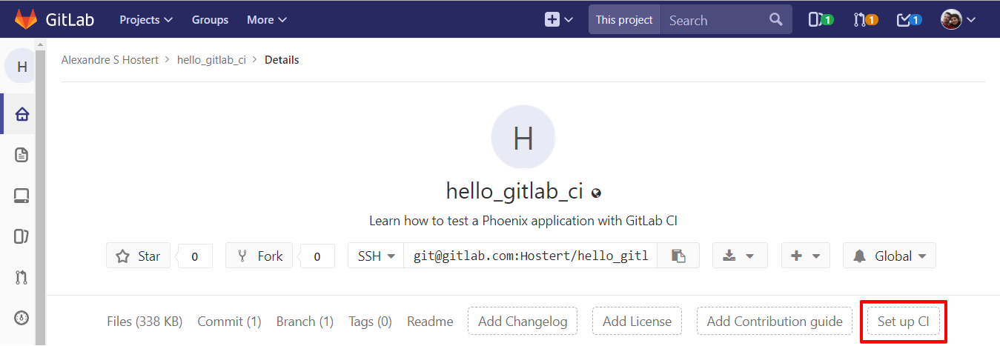
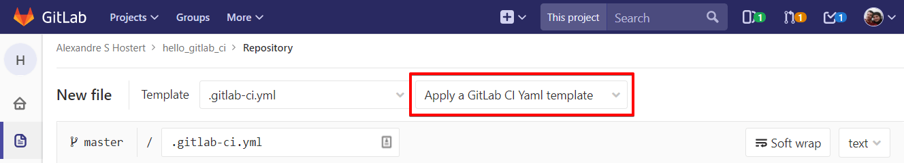
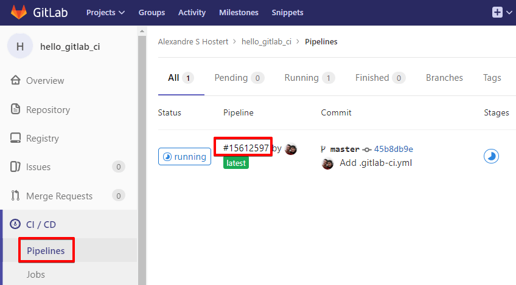

# Testing a Phoenix application with GitLab CI/CD

[Phoenix][phoenix-site] is a web development framework written in [Elixir][elixir-site], which is a
functional language designed for productivity and maintainability that runs on the
[Erlang VM][erlang-site]. Erlang VM is really really fast and can handle very large numbers of
simultaneous users.

That's why we're hearing so much about Phoenix today.

In this tutorial, we'll teach you how to set up GitLab CI/CD to build and test a Phoenix
application.

_We assume that you know how to create a Phoenix app, run tests locally, and how to work with Git
and GitLab UI._

## Introduction

### What is Phoenix?

[Phoenix][phoenix-site] is a web development framework written in [Elixir][elixir-site] very useful
 to build fast, reliable, and high-performance applications, as it uses [Erlang VM][erlang-site].

Many components and concepts are similar to Ruby on Rails or Python's Django. High developer
productivity and high application performance are only a few advantages on learning how to use it.
Working on the MVC pattern, it's was designed to be modular and flexible. Easy to mantain a growing
app is a plus.

Phoenix can run in any OS where Erlang is supported:

- Ubuntu
- CentOS
- Mac OS X
- Debian
- Windows
- Fedora
- Raspbian

Check the [Phoenix learning guide][phoenix-learning-guide] for more information.

### What is Elixir?

[Elixir][elixir-site] is a dynamic, functional language created to use all the maturity of Erlang
(30 years old!) in these days, in an easy way. It has similarities with Ruby, specially on sintax,
so Ruby developers are quite excited with the rapid growing of Elixir. A full-stack Ruby developer
can learn how to use Elixir and Phoenix in just a few weeks!

In Elixir we have a command called `mix`, which is a helper to create projects, testing, run
migrations and [much more][elixir-mix]. We'll use it later on in this tutorial.

Check the [Elixir documentation][elixir-docs] for more information.

## Requirements

To follow this tutorial, you'll need to have installed:

- Elixir [installation instructions][elixir-install]
- Phoenix Framework [installation instructions][phoenix-install]
- PostgreSQL (if you need to use MySQL server, check [Phoenix instructions][phoenix-mysql])

### Create a new Phoenix project

Open your terminal and go to the directory you wish to create your project.
You don't need to create an empty directory for the project's files, because the `mix` command will
do it for us.

When we call `mix` command, we'll pass two arguments:

- The task we want it to run: `phoenix.new`
- And the parameter `phoenix.new` requires, which is the name of the new project. In this case,
we're calling it `hello_gitlab_ci`, but you're free to set your own name:

```bash
mix phoenix.new hello_gitlab_ci
```

When asked, answer `Y` to fetch and install dependencies.

If everything went fine, you'll get an output like this:


Now, our project is located inside the directory with the same name we pass to `mix` command, for
example, `~/GitLab/hello_gitlab_ci`.
If we take a look at the directory, we'll see the Phoenix files and the dependencies needed to run.

### Initialize the PostgreSQL database

By default, Phoenix requires a PostgreSQL database to store whatever we need to store in our app. In
this case, we'll only create an empty database.

First, we need to navigate to our recently created project's directory, and then execute again
`mix`. This time, `mix` will receive the parameter `ecto.create`, which is the task to create our
new database. [Ecto][ecto] is the database wrapper for Elixir.

When we do run `mix` the first time after creating our project, it will compile our files to
bytecode, which will be interpreted by Erlang VM. In the next times, it will only compile our
changes.

Run the commands below to create our empty database:

```bash
cd hello_gitlab_ci
mix ecto.create
```

We expect to see this output at the end of the command:

```bash
Generated hello_gitlab_ci app
The database for HelloGitlabCi.Repo has been created
```

> **Note:**
Phoenix assumes that our PostgreSQL database will have a `postgres` user account with the correct
permissions and a password of `postgres`. If it's not your case, check
[Ecto's instructions][ecto-repo].

### Start Phoenix server

Now, it's time to see if everything we did until now went well. We'll call `mix` again, this time
with `phoenix.server` parameter, which will start Phoenix's HTTP Server.

```bash
mix phoenix.server
```

This will be the output to this command:

```bash
[info] Running HelloGitlabCi.Endpoint with Cowboy using http://localhost:4000
23 May 11:44:35 - info: compiling
23 May 11:44:37 - info: compiled 6 files into 2 files, copied 3 in 9.8 sec
```

Now, we have our app running locally. We can preview it directly on our browser. Let's open
[`localhost:4000`](http://localhost:4000) to see our Phoenix Framework welcome page. If the link do
not work, open [`127.0.0.1:4000`](http://127.0.0.1:4000) instead and later, configure your OS to
point `localhost` to `127.0.0.1`.


Great, now we have a local Phoenix Server running our app.

Locally, our application is running in an `iex` session. [iex][iex] stands for Interactive Elixir.
In this interactive mode, we can type any Elixir expression and get its result. To exit `iex`, we
need to press `Ctrl+C` twice. So, when we need to stop the Phoenix server, we have to hit `Ctrl+C`
twice.

## Introducing GitLab CI/CD

With GitLab, we can manage our development workflow, improve our productivity, track issues,
perform code review, and much more from a single platform. With GitLab CI/CD, we can be much more
productive, because every time we, or our co-workers push any code, GitLab CI/CD will build and
test the changes, telling us in realtime if anything goes wrong.

Certainly, when our application starts to grow, we'll need more developers working on the same
project and this process of building and testing can easely become a mess without proper management.
That's also why GitLab CI/CD is so important to our application. Every time someone pushes its code to
GitLab, we'll quickly know if their changes broke something or not. We don't need to stop everything
we're doing to test manually and locally every change our team does.

Let's see this in practice.

## Adjusting Phoenix configuration

Now, we need to adjust our Phoenix configuration before configuring GitLab CI/CD.
There is a directory (`config`) in your Phoenix project that contains a configuration file for every
environment it can run. Since we will work with a single environment, we'll edit just the test
configuration file (`test.exs`).

But, why do we need to adjust our configuration? Well, GitLab CI/CD builds and tests our code in one
isolated virtual machine, called [Runner][runner-site], using Docker technology. In this Runner,
GitLab CI/CD has access to everything our Phoenix application need to run, exactly as we have in our
`localhost`, but we have to tell GitLab CI/CD where to create and find this database using system
variables. This way, GitLab CI/CD will create our test database inside the Runner, just like we do
when running our Phoenix in our `localhost`.

- Open `hello_gitlab_ci/config/test.exs` on your favorite code editor
- Go to **Configure your database** session and edit the block to include `System.get_env`:

    ```elixir
    # Configure your database
    config :hello_gitlab_ci, HelloGitlabCi.Repo,
      adapter: Ecto.Adapters.Postgres,
      username: System.get_env("POSTGRES_USER") || "postgres",
      password: System.get_env("POSTGRES_PASSWORD") || "postgres",
      database: System.get_env("POSTGRES_DB") || "hello_gitlab_ci_test",
      hostname: System.get_env("POSTGRES_HOST") || "localhost",
      pool: Ecto.Adapters.SQL.Sandbox
    ```

    We'll need these system variables later on.

- Create an empty file named `.gitkeep` into `hello_gitlab_ci/priv/repo/migrations`

    As our project is still fresh, we don't have any data on our database, so, the `migrations`
directory will be empty.
    Without `.gitkeep`, git will not upload this empty directory and we'll got an error when running our
test on GitLab.

    > **Note:**
    If we add a folder via the GitLab UI, GitLab itself will add the `.gitkeep` to that new dir.

Now, let's run a local test and see if everything we did didn't break anything.

## Testing

Earlier, when we created our project, we ran `mix phoenix.new`.
This task created everything a Phoenix application needed, including some unit tests into
`hello_gitlab_ci/test` directory.

Let's run a new task with `mix` to run those tests for us. This time, the parameter expected is
`test`. We can add `--trace` parameter for debugging purposes.

In your terminal, navigate to the directory `hello_gitlab_ci` and run:

```bash
mix test
```

Our expected result is this:

```bash
....

Finished in 0.7 seconds
4 tests, 0 failures

Randomized with seed 610000
```

Our test was successfull. It's time to push our files to GitLab.

## Configuring CI/CD Pipeline

The first step is to create a new file called `.gitlab-ci.yml` in `hello_gitlab_ci` directory of our
project.

- The fastest and easiest way to do this, is to click on **Set up CI** on project's main page:

    

- On next screen, we can select a template ready to go. Click on **Apply a GitLab CI/CD Yaml
template** and select **Elixir**:

    

    This template file tells GitLab CI/CD about what we wish to do every time a new commit is made.
    However, we have to adapt it to run a Phoenix app.

- The first line tells GitLab what Docker image will be used.

    Remember when we learn about Runners, the isolated virtual machine where GitLab CI/CD build and test
    our application? This virtual machine must have all dependencies to run our application. This is
    where a Docker image is needed. The correct image will provide the entire system for us.

    As a suggestion, you can use [trenpixster's elixir image][docker-image], which already has all
    dependencies for Phoenix installed, such as Elixir, Erlang, NodeJS and PostgreSQL:

    ```yml
    image: trenpixster/elixir:latest
    ```

- At `services` session, we'll only use `postgres`, so we'll delete `mysql` and `redis` lines:

    ```yml
    services:
      - postgres:latest
    ```

- Now, we'll create a new entry called `variables`, before `before_script` session:

    ```yml
    variables:
      POSTGRES_DB: hello_gitlab_ci_test
      POSTGRES_HOST: postgres
      POSTGRES_USER: postgres
      POSTGRES_PASSWORD: "postgres"
      MIX_ENV: "test"
    ```

    Here, we are setting up the values for GitLab CI/CD authenticate into PostgreSQL, as we did on
    `config/test.exs` earlier.

- In `before_script` session, we'll add some commands to prepare everything to the test:

    ```yml
    before_script:
      - apt-get update && apt-get -y install postgresql-client
      - mix local.hex --force
      - mix deps.get --only test
      - mix ecto.create
      - mix ecto.migrate
    ```

    It's important to install `postgresql-client` to let GitLab CI/CD access PostgreSQL and create our
    database with the login information provided earlier. More important is to respect the identation,
    to avoid syntax errors when running the build.

- And finally, we'll let `mix` session intact.

Let's take a look at the completed file after the editions:

```yml
image: trenpixster/elixir:latest

services:
  - postgres:latest

variables:
  POSTGRES_DB: test_test
  POSTGRES_HOST: postgres
  POSTGRES_USER: postgres
  POSTGRES_PASSWORD: "postgres"
  MIX_ENV: "test"

before_script:
  - apt-get update && apt-get -y install postgresql-client
  - mix deps.get
  - mix ecto.create
  - mix ecto.migrate

mix:
  script:
  - mix test
```

For safety, we can check if we get any syntax errors before submiting this file to GitLab. Copy the
contents of `.gitlab-ci.yml` and paste it on [GitLab CI/CD Lint tool][ci-lint]. Please note that
this link will only work for logged in users.

## Watching the build

I don't know about you, but I love to watch that black screen being filled with compilation output.
With this, I can feel the happiness of something I made working correctly. On `localhost` it's easy
to watch our build, but on GitLab, is it possible? Yes!

Let's go to **Pipelines** and see GitLab doing the job. Just click on **Pipelines** to find the
actual running build job.



Click on build's ID to watch the entire process. If everything went as expected, we can wait for the
**Build succeeded** at the end of the process! :)

```
$ mix test
....

Finished in 0.3 seconds
4 tests, 0 failures

Randomized with seed 206909
Build succeeded
```

If we take a look at the project's main page on the GitLab UI, we can see the status of the last
build made by GitLab CI/CD.

Time to show the world our green build badge! Navigate to your project's **Settings > CI/CD** and
expand **General pipelines settings**. Scroll down to **Pipeline status** and copy the markdown code
for your badge. Paste it on the top of your `README.md` file, to let people outside of our project
see if our latest code is running without errors.

When we finish this edition, GitLab will start another build and show a **build running** badge. It
is expected, after all we just configured GitLab CI/CD to do this for every push! But you may think
"Why run build and tests for simple things like editing README.md?" and it is a good question.
For changes that don't affect your application, you can add the keyword [`[ci skip]`][skipping-jobs]
to commit message and the build related to that commit will be skipped.

In the end, we finally got our pretty green build succeeded badge! By outputting the result on the
README file, it shows to whoever lands on your project's page that your code is up-to-date and
working properly.

## Conclusion

When we have a growing application with many developers working on it, or when we have an open
source project being watched and contributed by the community, it is really important to have our
code permanently working. GitLab CI/CD is a time saving powerfull tool to help us mantain our code
organized and working.

As we could see in this post, GitLab CI/CD is really really easy to configure and use. We have [many
other reasons][ci-reasons] to keep using GitLab CI/CD. The benefits to our teams will be huge!

## References

- [GitLab CI/CD introductory guide][ci-guide]
- [GitLab CI/CD full Documentation][ci-docs]
- [GitLab Runners documentation][gitlab-runners]
- [Using Docker images documentation][using-docker]
- [Example project: Hello GitLab CI/CD on GitLab][hello-gitlab]

[phoenix-site]: http://phoenixframework.org/ "Phoenix Framework"
[phoenix-learning-guide]: https://hexdocs.pm/phoenix/learning.html "Phoenix Learning Guide"
[phoenix-install]: http://www.phoenixframework.org/docs/installation "Phoenix Installation"
[phoenix-mysql]: http://www.phoenixframework.org/docs/using-mysql "Phoenix with MySQL"
[elixir-site]: http://elixir-lang.org/ "Elixir"
[elixir-mix]: http://elixir-lang.org/getting-started/mix-otp/introduction-to-mix.html "Introduction to mix"
[elixir-docs]: http://elixir-lang.org/getting-started/introduction.html "Elixir Documentation"
[erlang-site]: http://erlang.org "Erlang"
[elixir-install]: https://elixir-lang.org/install.html "Elixir Installation"
[ecto]: http://hexdocs.pm/ecto "Ecto"
[ecto-repo]: https://hexdocs.pm/ecto/Ecto.html#module-repositories "Ecto Repositories"
[mix-ecto]: https://hexdocs.pm/ecto/Mix.Tasks.Ecto.Create.html "mix and Ecto"
[iex]: http://elixir-lang.org/getting-started/introduction.html#interactive-mode "Interactive Mode"
[ci-lint]: https://gitlab.com/ci/lint "CI Lint Tool"
[ci-reasons]: https://about.gitlab.com/2015/02/03/7-reasons-why-you-should-be-using-ci/ "7 Reasons Why You Should Be Using CI"
[ci-guide]: https://about.gitlab.com/2015/12/14/getting-started-with-gitlab-and-gitlab-ci/ "Getting Started With GitLab And GitLab CI/CD"
[ci-docs]: ../../README.md "GitLab CI/CD Documentation"
[skipping-jobs]: ../../yaml/README.md#skipping-jobs "Skipping Jobs"
[gitlab-runners]: ../../runners/README.md "GitLab Runners Documentation"
[runner-site]: ../../runners/README.md#runners "Runners"
[docker-image]: https://hub.docker.com/r/trenpixster/elixir/ "Elixir Docker Image"
[using-docker]: ../../docker/using_docker_images.md "Using Docker Images"
[hello-gitlab]: https://gitlab.com/Hostert/hello_gitlab_ci "Hello GitLab CI/CD"
