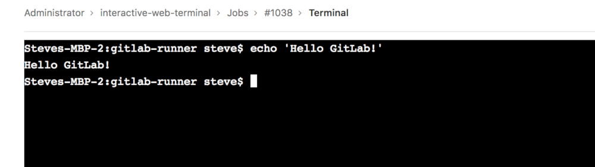
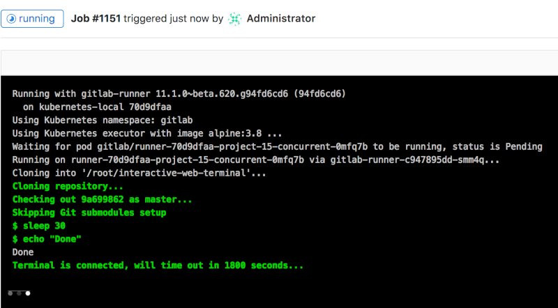

# Interactive Web Terminals

> [Introduced](https://gitlab.com/gitlab-org/gitlab-foss/-/issues/50144) in GitLab 11.3.

Interactive web terminals give the user access to a terminal in GitLab for
running one-off commands for their CI pipeline. Since this is giving the user
shell access to the environment where [GitLab Runner](https://docs.gitlab.com/runner/)
is deployed, some [security precautions](../../administration/integration/terminal.md#security) were
taken to protect the users.

NOTE:
[Shared runners on GitLab.com](../runners/index.md) do not
provide an interactive web terminal. Follow [this
issue](https://gitlab.com/gitlab-org/gitlab/-/issues/24674) for progress on
adding support. For groups and projects hosted on GitLab.com, interactive web
terminals are available when using your own group or project runner.

## Configuration

Two things need to be configured for the interactive web terminal to work:

- The runner needs to have [`[session_server]` configured
  properly](https://docs.gitlab.com/runner/configuration/advanced-configuration.html#the-session_server-section)
- If you are using a reverse proxy with your GitLab instance, web terminals need to be
  [enabled](../../administration/integration/terminal.md#enabling-and-disabling-terminal-support)

NOTE:
Interactive web terminals are not yet supported by
[`gitlab-runner` Helm chart](https://docs.gitlab.com/charts/charts/gitlab/gitlab-runner/index.html),
but support [is planned](https://gitlab.com/gitlab-org/charts/gitlab-runner/-/issues/79).

## Debugging a running job

NOTE:
Not all executors are
[supported](https://docs.gitlab.com/runner/executors/#compatibility-chart).

NOTE:
The `docker` executor does not keep running
after the build script is finished. At that point, the terminal automatically
disconnects and does not wait for the user to finish. Please follow [this
issue](https://gitlab.com/gitlab-org/gitlab-runner/-/issues/3605) for updates on
improving this behavior.

Sometimes, when a job is running, things don't go as you would expect, and it
would be helpful if one can have a shell to aid debugging. When a job is
running, on the right panel you can see a button `debug` that opens the terminal
for the current job.

When clicked, a new tab opens to the terminal page where you can access
the terminal and type commands like a normal shell.

If you have the terminal open and the job has finished with its tasks, the
terminal blocks the job from finishing for the duration configured in
[`[session_server].session_timeout`](https://docs.gitlab.com/runner/configuration/advanced-configuration.html#the-session_server-section) until you
close the terminal window.

## Interactive Web Terminals for the Web IDE

Read the Web IDE docs to learn how to run [Interactive Terminals through the Web IDE](../../user/project/web_ide/index.md#interactive-web-terminals-for-the-web-ide).
