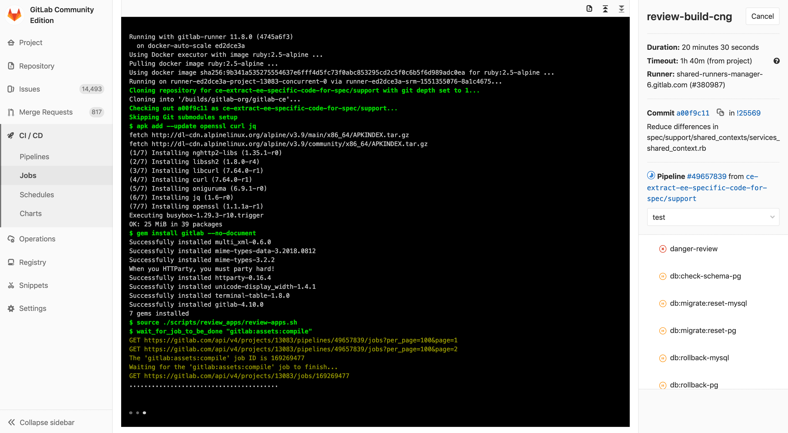
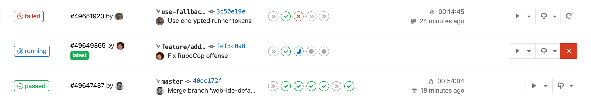
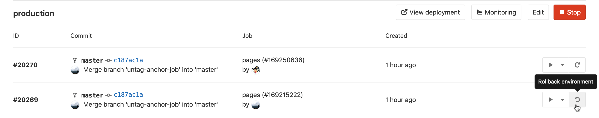

# Introduction to CI/CD with GitLab

In this document, we'll present an overview of the concepts of Continuous Integration,
Continuous Delivery, and Continuous Deployment, as well as an introduction to
GitLab CI/CD.

NOTE: **Out-of-the-box management systems can decrease hours spent on maintaining toolchains by 10% or more.**
Watch our
["Mastering continuous software development"](https://about.gitlab.com/webcast/mastering-ci-cd/)
webcast to learn about continuous methods and how GitLab’s built-in CI can help you simplify and scale software development.

## Introduction to CI/CD methodologies

The continuous methodologies of software development are based on
automating the execution of scripts to minimize the chance of
introducing errors while developing applications. They require
less human intervention or even no intervention at all, from the
development of new code until its deployment.

It involves continuously building, testing, and deploying code
changes at every small iteration, reducing the chance of developing
new code based on bugged or failed previous versions.

There are three main approaches to this methodology, each of them
to be applied according to what best suits your strategy.

### Continuous Integration

Consider an application that has its code stored in a Git
repository in GitLab. Developers push code changes every day,
multiple times a day. For every push to the repository, you
can create a set of scripts to build and test your application
automatically, decreasing the chance of introducing errors to your app.

This practice is known as [Continuous Integration](https://en.wikipedia.org/wiki/Continuous_integration);
for every change submitted to an application - even to development branches -
it's built and tested automatically and continuously, ensuring the
introduced changes pass all tests, guidelines, and code compliance
standards you established for your app.

[GitLab itself](https://gitlab.com/gitlab-org/gitlab-foss) is an
example of using Continuous Integration as a software
development method. For every push to the project, there's a set
of scripts the code is checked against.

### Continuous Delivery

[Continuous Delivery](https://continuousdelivery.com/) is a step
beyond Continuous Integration. Your application is not only
built and tested at every code change pushed to the codebase,
but, as an additional step, it's also deployed continuously, though
the deployments are triggered manually.

This method ensures the code is checked automatically but requires
human intervention to manually and strategically trigger the deployment
of the changes.

### Continuous Deployment

[Continuous Deployment](https://www.airpair.com/continuous-deployment/posts/continuous-deployment-for-practical-people)
is also a further step beyond Continuous Integration, similar to
Continuous Delivery. The difference is that instead of deploying your
application manually, you set it to be deployed automatically. It does
not require human intervention at all to have your application
deployed.

## Introduction to GitLab CI/CD

GitLab CI/CD is a powerful tool built into GitLab that allows you
to apply all the continuous methods (Continuous Integration,
Delivery, and Deployment) to your software with no third-party
application or integration needed.

### How GitLab CI/CD works

To use GitLab CI/CD, all you need is an application codebase hosted in a
Git repository, and for your build, test, and deployment
scripts to be specified in a file called [`.gitlab-ci.yml`](../yaml/README.md),
located in the root path of your repository.

In this file, you can define the scripts you want to run, define include and
cache dependencies, choose commands you want to run in sequence
and those you want to run in parallel, define where you want to
deploy your app, and specify whether you will want to run the scripts automatically
or trigger any of them manually. Once you're familiar with
GitLab CI/CD you can add more advanced steps into the configuration file.

To add scripts to that file, you'll need to organize them in a
sequence that suits your application and are in accordance with
the tests you wish to perform. To visualize the process, imagine
that all the scripts you add to the configuration file are the
same as the commands you run on a terminal on your computer.

Once you've added your `.gitlab-ci.yml` configuration file to your
repository, GitLab will detect it and run your scripts with the
tool called [GitLab Runner](https://docs.gitlab.com/runner/), which
works similarly to your terminal.

The scripts are grouped into **jobs**, and together they compose
a **pipeline**. A minimalist example of `.gitlab-ci.yml` file
could contain:

```yml
before_script:
  - apt-get install rubygems ruby-dev -y

run-test:
  script:
    - ruby --version
```

The `before_script` attribute would install the dependencies
for your app before running anything, and a  **job** called
`run-test` would print the Ruby version of the current system.
Both of them compose a **pipeline** triggered at every push
to any branch of the repository.

GitLab CI/CD not only executes the jobs you've
set but also shows you what's happening during execution, as you
would see in your terminal:



You create the strategy for your app and GitLab runs the pipeline
for you according to what you've defined. Your pipeline status is also
displayed by GitLab:



At the end, if anything goes wrong, you can easily
[roll back](../environments.md#retrying-and-rolling-back) all the changes:



### Basic CI/CD workflow

Consider the following example for how GitLab CI/CD fits in a
common development workflow.

Assume that you have discussed a code implementation in an issue
and worked locally on your proposed changes. Once you push your
commits to a feature branch in a remote repository in GitLab,
the CI/CD pipeline set for your project is triggered. By doing
so, GitLab CI/CD:

- Runs automated scripts (sequential or parallel) to:
  - Build and test your app.
  - Preview the changes per merge request with Review Apps, as you
    would see in your `localhost`.

Once you're happy with your implementation:

- Get your code reviewed and approved.
- Merge the feature branch into the default branch.
  - GitLab CI/CD deploys your changes automatically to a production environment.
- And finally, you and your team can easily roll it back if something goes wrong.


GitLab CI/CD is capable of doing a lot more, but this workflow
exemplifies GitLab's ability to track the entire process,
without the need for an external tool to deliver your software.
And, most usefully, you can visualize all the steps through
the GitLab UI.

#### A deeper look into the CI/CD basic workflow

If we take a deeper look into the basic workflow, we can see
the features available in GitLab at each stage of the DevOps
lifecycle, as shown in the illustration below.


If you look at the image from the left to the right,
you'll see some of the features available in GitLab
according to each stage (Verify, Package, Release).

1. **Verify**:
   - Automatically build and test your application with Continuous Integration.
   - Analyze your source code quality with [GitLab Code Quality](../../user/project/merge_requests/code_quality.md). **(STARTER)**
   - Determine the performance impact of code changes with [Browser Performance Testing](../../user/project/merge_requests/browser_performance_testing.md). **(PREMIUM)**
   - Perform a series of tests, such as [Container Scanning](../../user/application_security/container_scanning/index.md) **(ULTIMATE)**, [Dependency Scanning](../../user/application_security/dependency_scanning/index.md) **(ULTIMATE)**, and [JUnit tests](../junit_test_reports.md).
   - Deploy your changes with [Review Apps](../review_apps/index.md) to preview the app changes on every branch.
1. **Package**:
   - Store Docker images with [Container Registry](../../user/packages/container_registry/index.md).
   - Store NPM packages with [NPM Registry](../../user/packages/npm_registry/index.md). **(PREMIUM)**
   - Store Maven artifacts with [Maven Repository](../../user/packages/maven_repository/index.md). **(PREMIUM)**
   - Store Conan packages with [Conan Repository](../../user/packages/conan_repository/index.md). **(PREMIUM)**
1. **Release**:
   - Continuous Deployment, automatically deploying your app to production.
   - Continuous Delivery, manually click to deploy your app to production.
   - Deploy static websites with [GitLab Pages](../../user/project/pages/index.md).
   - Ship features to only a portion of your pods and let a percentage of your user base to visit the temporarily deployed feature with [Canary Deployments](../../user/project/canary_deployments.md). **(PREMIUM)**
   - Deploy your features behind [Feature Flags](../../user/project/operations/feature_flags.md). **(PREMIUM)**
   - Add release notes to any Git tag with [GitLab Releases](../../user/project/releases/index.md).
   - View of the current health and status of each CI environment running on Kubernetes with [Deploy Boards](../../user/project/deploy_boards.md). **(PREMIUM)**
   - Deploy your application to a production environment in a Kubernetes cluster with [Auto Deploy](../../topics/autodevops/index.md#auto-deploy).

With GitLab CI/CD you can also:

- Easily set up your app's entire lifecycle with [Auto DevOps](../../topics/autodevops/index.md).
- Deploy your app to different [environments](../environments.md).
- Install your own [GitLab Runner](https://docs.gitlab.com/runner/).
- [Schedule pipelines](../../user/project/pipelines/schedules.md).
- Check for app vulnerabilities with [Security Test reports](../../user/application_security/index.md). **(ULTIMATE)**

To see all CI/CD features, navigate back to the [CI/CD index](../README.md).

<i class="fa fa-youtube-play youtube" aria-hidden="true"></i>
Watch the video [GitLab CI Live Demo](https://www.youtube.com/watch?v=pBe4t1CD8Fc) with a deeper overview of GitLab CI/CD.

### Setting up GitLab CI/CD for the first time

To get started with GitLab CI/CD, you need to familiarize yourself
with the [`.gitlab-ci.yml`](../yaml/README.md) configuration file
syntax and with its attributes.

This document [introduces the concepts of GitLab CI/CD in the scope of GitLab Pages](../../user/project/pages/getting_started_part_four.md), for deploying static websites.
Although it's meant for users who want to write their own Pages
script from scratch, it also serves as an introduction to the setup process for GitLab CI/CD.
It covers the very first general steps of writing a CI/CD configuration
file, so we recommend you read through it to understand GitLab's CI/CD
logic, and learn how to write your own script (or tweak an
existing one) for any application.

For a deep view of GitLab's CI/CD configuration options, check the
[`.gitlab-ci.yml` full reference](../yaml/README.md).
