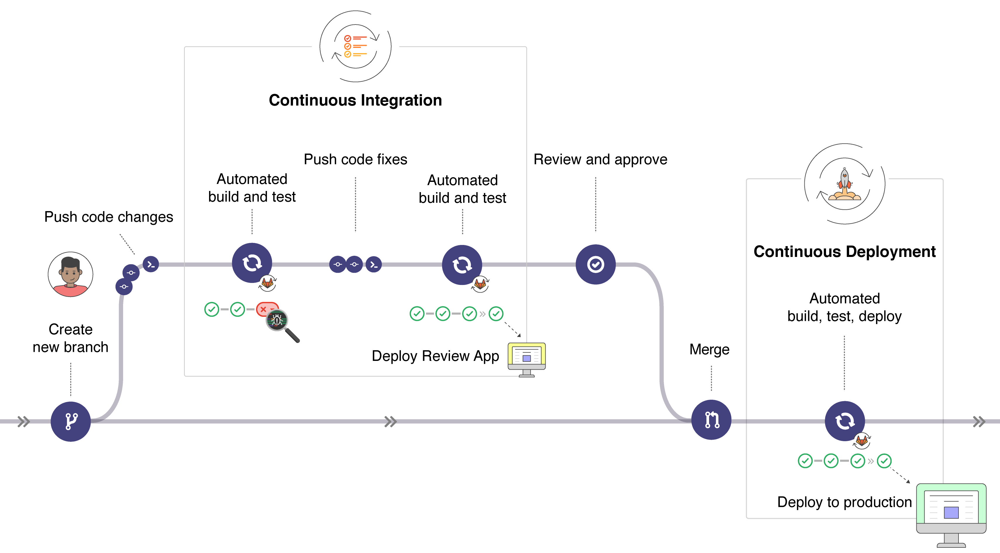
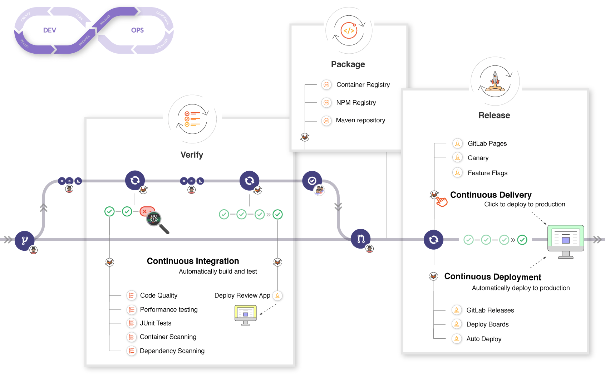

# CI/CD concepts **(FREE)**

With the continuous method of software development, you continuously build,
test, and deploy iterative code changes. This iterative process helps reduce
the chance that you develop new code based on buggy or failed previous versions.
With this method, you strive to have less human intervention or even no intervention at all,
from the development of new code until its deployment.

The three primary approaches for the continuous method are:

- [Continuous Integration](#continuous-integration)
- [Continuous Delivery](#continuous-delivery)
- [Continuous Deployment](#continuous-deployment)

NOTE:
Out-of-the-box management systems can decrease hours spent on maintaining toolchains by 10% or more.
Watch our ["Mastering continuous software development"](https://about.gitlab.com/webcast/mastering-ci-cd/)
webcast to learn about continuous methods and how built-in GitLab CI/CD can help you simplify and scale software development.

> - <i class="fa fa-youtube-play youtube" aria-hidden="true"></i>&nbsp;Learn how to [configure CI/CD](https://www.youtube.com/embed/opdLqwz6tcE).
> - [Make the case for CI/CD in your organization](https://about.gitlab.com/devops-tools/github-vs-gitlab/).
> - <i class="fa fa-youtube-play youtube" aria-hidden="true"></i>&nbsp;Learn how [Verizon reduced rebuilds](https://about.gitlab.com/blog/2019/02/14/verizon-customer-story/)
>   from 30 days to under 8 hours with GitLab.

## Continuous Integration

Consider an application that has its code stored in a Git
repository in GitLab. Developers push code changes every day,
multiple times a day. For every push to the repository, you
can create a set of scripts to build and test your application
automatically. These scripts help decrease the chances that you introduce errors in your application.

This practice is known as [Continuous Integration](https://en.wikipedia.org/wiki/Continuous_integration).
Each change submitted to an application, even to development branches,
is built and tested automatically and continuously. These tests ensure the
changes pass all tests, guidelines, and code compliance
standards you established for your application.

[GitLab itself](https://gitlab.com/gitlab-org/gitlab) is an
example of a project that uses Continuous Integration as a software
development method. For every push to the project, a set
of checks run against the code.

## Continuous Delivery

[Continuous Delivery](https://continuousdelivery.com/) is a step
beyond Continuous Integration. Not only is your application
built and tested each time a code change is pushed to the codebase,
the application is also deployed continuously. However, with continuous
delivery, you trigger the deployments manually.

Continuous Delivery checks the code automatically, but it requires
human intervention to manually and strategically trigger the deployment
of the changes.

## Continuous Deployment

[Continuous Deployment](https://www.airpair.com/continuous-deployment/posts/continuous-deployment-for-practical-people)
is another step beyond Continuous Integration, similar to
Continuous Delivery. The difference is that instead of deploying your
application manually, you set it to be deployed automatically.
Human intervention is not required.

## GitLab CI/CD

[GitLab CI/CD](../quick_start/index.md) is the part of GitLab that you use
for all of the continuous methods (Continuous Integration,
Delivery, and Deployment). With GitLab CI/CD, you can test, build,
and publish your software with no third-party application or integration needed.

<i class="fa fa-youtube-play youtube" aria-hidden="true"></i>
For an overview, see [Introduction to GitLab CI/CD](https://www.youtube.com/watch?v=l5705U8s_nQ&t=397) from an April 2020 GitLab meetup.

### GitLab CI/CD workflow

GitLab CI/CD fits in a common development workflow.

You can start by discussing a code implementation in an issue
and working locally on your proposed changes. Then you can push your
commits to a feature branch in a remote repository that's hosted in GitLab.
The push triggers the CI/CD pipeline for your project. Then, GitLab CI/CD:

- Runs automated scripts (sequentially or in parallel) to:
  - Build and test your application.
  - Preview the changes in a Review App, the same as you
    would see on your `localhost`.

After the implementation works as expected:

- Get your code reviewed and approved.
- Merge the feature branch into the default branch.
  - GitLab CI/CD deploys your changes automatically to a production environment.

If something goes wrong, you can roll back your changes.

This workflow shows the major steps in the GitLab process.
You don't need any external tools to deliver your software and
you can visualize all the steps in the GitLab UI.

### A deeper look into the CI/CD workflow

If you look deeper into the workflow, you can see
the features available in GitLab at each stage of the DevOps
lifecycle.

<i class="fa fa-youtube-play youtube" aria-hidden="true"></i>
[Get a deeper look at GitLab CI/CD](https://youtu.be/l5705U8s_nQ?t=369).
