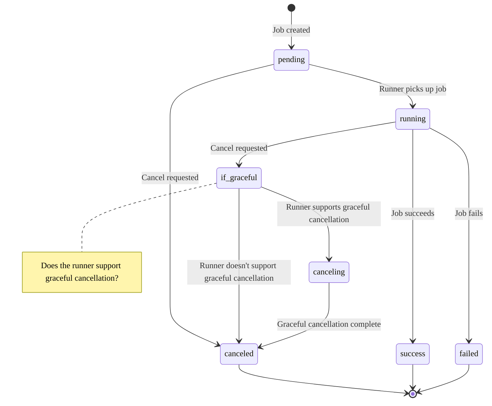



- Tier: Free, Premium, Ultimate
- Offering: GitLab.com, GitLab Self-Managed, GitLab Dedicated



CI/CD jobs are the fundamental elements of a [GitLab CI/CD pipeline](../pipelines/_index.md).
Jobs are configured in the `.gitlab-ci.yml` file with a list of commands to execute
to accomplish tasks like building, testing, or deploying code.

Jobs:

- Execute on a [runner](../runners/_index.md), for example in a Docker container.
- Run independently from other jobs.
- Have a [job log](job_logs.md) with the full execution log for the job.

Jobs are defined with [YAML keywords](../yaml/_index.md) that define all aspects
of the job's execution, including keywords that:

- Control [how](job_control.md) and [when](job_rules.md) jobs run.
- Group jobs together in collections called [stages](../yaml/_index.md#stages).
  Stages run in sequence, while all jobs in a stage can run in parallel.
- Define [CI/CD variables](../variables/_index.md) for flexible configuration.
- Define [caches](../caching/_index.md) to speed up job execution.
- Save files as [artifacts](job_artifacts.md) which can be used by other jobs.

## Add a job to a pipeline

To add a job to a pipeline, add it into your `.gitlab-ci.yml` file. The job must:

- Be defined at the top-level of the YAML configuration.
- Have a unique [job name](#job-names).
- Have either a [`script`](../yaml/_index.md#script) section defining commands to run,
  or a [`trigger`](../yaml/_index.md#trigger) section to trigger a [downstream pipeline](../pipelines/downstream_pipelines.md)
  to run.

For example:

```yaml
my-ruby-job:
  script:
    - bundle install
    - bundle exec my_ruby_command

my-shell-script-job:
  script:
    - my_shell_script.sh
```

### Job names

You can't use these keywords as job names:

- `image`
- `services`
- `stages`
- `before_script`
- `after_script`
- `variables`
- `cache`
- `include`
- `pages:deploy` configured for a `deploy` stage

Additionally, these names are valid when quoted, but are
not recommended as they can make pipeline configuration unclear:

- `"true":`
- `"false":`
- `"nil":`

Job names must be 255 characters or fewer.

Use unique names for your jobs. If multiple jobs have the same name in a file,
only one is added to the pipeline, and it's difficult to predict which one is chosen.
If the same job name is used in one or more included files,
[parameters are merged](../yaml/includes.md#override-included-configuration-values).

### Hide a job

To temporarily disable a job without deleting it from the configuration
file, add a period (`.`) to the start of the job name. Hidden jobs do not need to contain
the `script` or `trigger` keywords, but must contain valid YAML configuration.

For example:

```yaml
.hidden_job:
  script:
    - run test
```

Hidden jobs are not processed by GitLab CI/CD, but they can be used as templates
for reusable configuration with:

- The [`extends` keyword](../yaml/yaml_optimization.md#use-extends-to-reuse-configuration-sections).
- [YAML anchors](../yaml/yaml_optimization.md#anchors).

## Set default values for job keywords

You can use the `default` keyword to set default job keywords and values, which are
used by default by all jobs in a pipeline.

For example:

```yaml
default:
  image: 'ruby:2.4'
  before_script:
    - echo Hello World

rspec-job:
  script: bundle exec rspec
```

When the pipeline runs, the job uses the default keywords:

```yaml
rspec-job:
  image: 'ruby:2.4'
  before_script:
    - echo Hello World
  script: bundle exec rspec
```

### Control the inheritance of default keywords and variables

You can control the inheritance of:

- [default keywords](../yaml/_index.md#default) with [`inherit:default`](../yaml/_index.md#inheritdefault).
- [default variables](../yaml/_index.md#default) with [`inherit:variables`](../yaml/_index.md#inheritvariables).

For example:

```yaml
default:
  image: 'ruby:2.4'
  before_script:
    - echo Hello World

variables:
  DOMAIN: example.com
  WEBHOOK_URL: https://my-webhook.example.com

rubocop:
  inherit:
    default: false
    variables: false
  script: bundle exec rubocop

rspec:
  inherit:
    default: [image]
    variables: [WEBHOOK_URL]
  script: bundle exec rspec

capybara:
  inherit:
    variables: false
  script: bundle exec capybara

karma:
  inherit:
    default: true
    variables: [DOMAIN]
  script: karma
```

In this example:

- `rubocop`:
  - inherits: Nothing.
- `rspec`:
  - inherits: the default `image` and the `WEBHOOK_URL` variable.
  - does **not** inherit: the default `before_script` and the `DOMAIN` variable.
- `capybara`:
  - inherits: the default `before_script` and `image`.
  - does **not** inherit: the `DOMAIN` and `WEBHOOK_URL` variables.
- `karma`:
  - inherits: the default `image` and `before_script`, and the `DOMAIN` variable.
  - does **not** inherit: `WEBHOOK_URL` variable.

## View jobs in a pipeline

When you access a pipeline, you can see the related jobs for that pipeline.

The order of jobs in a pipeline depends on the type of pipeline graph.

- For [full pipeline graphs](../pipelines/_index.md#pipeline-details), jobs are sorted by name.
- For [pipeline mini graphs](../pipelines/_index.md#pipeline-mini-graphs), jobs are sorted by status, and then by name.
  The job status order is:

  1. failed
  1. warning
  1. pending
  1. running
  1. manual
  1. scheduled
  1. canceled
  1. success
  1. skipped
  1. created

Selecting an individual job shows you its [job log](job_logs.md), and allows you to:

- Cancel the job.
- Retry the job, if it failed.
- Run the job again, if it passed.
- Erase the job log.

### View all jobs in a project



- Offering: GitLab.com, GitLab Self-Managed





- Filtering jobs by job name [introduced](https://gitlab.com/gitlab-org/gitlab/-/issues/387547) as an [experiment](../../policy/development_stages_support.md) on GitLab.com and GitLab Self-Managed in GitLab 17.3 [with flags](../../administration/feature_flags.md) named `populate_and_use_build_names_table` for the API and `fe_search_build_by_name` for the UI. Disabled by default.





The availability of this feature is controlled by a feature flag. For more information, see the history.



Filtering jobs by name is an [experiment](../../policy/development_stages_support.md). For more information about the development of this feature, see [issue 387547](https://gitlab.com/gitlab-org/gitlab/-/issues/387547).

To view the full list of jobs that ran in a project:

1. On the left sidebar, select **Search or go to** and find your project.
1. Select **Build > Jobs**.

You can filter the list by [job status](#view-jobs-in-a-pipeline) and [job name](#job-names).

### Group similar jobs together in pipeline views

If you have many similar jobs, your [pipeline graph](../pipelines/_index.md#pipeline-details)
becomes long and hard to read.

You can automatically group similar jobs together. If the job names are formatted in a certain way,
they are collapsed into a single group in regular pipeline graphs (not the mini graphs).

You can recognize when a pipeline has grouped jobs if you see a number next to a job
name instead of the retry or cancel buttons. The number indicates the amount of grouped
jobs. Hovering over them shows you if all jobs have passed or any has failed. Select to expand them.


To create a group of jobs, in the `.gitlab-ci.yml` file,
separate each job name with a number and one of the following:

- A slash (`/`), for example, `slash-test 1/3`, `slash-test 2/3`, `slash-test 3/3`.
- A colon (`:`), for example, `colon-test 1:3`, `colon-test 2:3`, `colon-test 3:3`.
- A space, for example `space-test 0 3`, `space-test 1 3`, `space-test 2 3`.

You can use these symbols interchangeably.

In the example below, these three jobs are in a group named `build ruby`:

```yaml
build ruby 1/3:
  stage: build
  script:
    - echo "ruby1"

build ruby 2/3:
  stage: build
  script:
    - echo "ruby2"

build ruby 3/3:
  stage: build
  script:
    - echo "ruby3"
```

The pipeline graph displays a group named `build ruby` with three jobs.

The jobs are ordered by comparing the numbers from left to right. You
usually want the first number to be the index and the second number to be the total.

[This regular expression](https://gitlab.com/gitlab-org/gitlab/-/blob/2f3dc314f42dbd79813e6251792853bc231e69dd/app/models/commit_status.rb#L99)
evaluates the job names: `([\b\s:]+((\[.*\])|(\d+[\s:\/\\]+\d+))){1,3}\s*\z`.
One or more `: [...]`, `X Y`, `X/Y`, or `X\Y` sequences are removed from the **end**
of job names only. Matching substrings found at the beginning or in the middle of
job names are not removed.

## Retry a job

You can retry a job after it completes, regardless of its final state (failed, success, or canceled).

When you retry a job:

- A new job instance is created with a new job ID.
- The job runs with the same parameters and variables as the original job.
- If the job produces artifacts, new artifacts are created and stored.

Prerequisites:

- You must have at least the Developer role for the project.

To retry a job from a merge request:

1. On the left sidebar, select **Search or go to** and find your project.
1. From your merge request, do one of the following:
   - In the pipeline widget, next to the job you want to retry, select **Run again** ().
   - Select the **Pipelines** tab, next to the job you want to retry, select **Run again** ().

To retry a job from the job log:

1. Go to the job's log page.
1. In the upper-right corner, select **Run again** ().

To retry a job from a pipeline:

1. On the left sidebar, select **Search or go to** and find your project.
1. Select **Build > Pipelines**.
1. Find the pipeline that contains the job you want to retry.
1. From the pipeline graph, next to the job you want to retry, select **Run again** ().

### Retry all failed or canceled jobs in a pipeline

If a pipeline has multiple failed or canceled jobs, you can retry all of them at once:

1. On the left sidebar, select **Search or go to** and find your project.
1. Do one of the following:
   - Select **Build > Pipelines**.
   - Go to a merge request and select the **Pipelines** tab.
1. For the pipeline with failed or canceled jobs, select **Retry all failed or canceled jobs** ().

## Cancel a job

You can cancel a CI/CD job depending on its current state and the runner's capabilities.

When you cancel a job, what happens next depends on the job state and runner capabilities:

- For a `pending` job (not yet executing), the job is canceled immediately.
- For a `running` job:
  - If the runner supports graceful cancellation, the job enters the `canceling` state.
    The runner can complete its [`after_script`](../yaml/_index.md#after_script) before the job is marked as `canceled`.
  - If the runner doesn't support graceful cancellation, the job moves to the `canceled` state immediately.



Prerequisites:

- You must have at least the Developer role for the project,
  or the [minimum role required to cancel a pipeline or job](../pipelines/settings.md#restrict-roles-that-can-cancel-pipelines-or-jobs).

To cancel a job from a merge request:

1. On the left sidebar, select **Search or go to** and find your project.
1. From your merge request, do one of the following:
   - In the pipeline widget, next to the job you want to cancel, select **Cancel** ().
   - Select the **Pipelines** tab, next to the job you want to cancel, select **Cancel** ().

To cancel a job from the job log:

1. Go to the job's log page.
1. In the upper-right corner, select **Cancel** ().

To cancel a job from a pipeline:

1. On the left sidebar, select **Search or go to** and find your project.
1. Select **Build > Pipelines**.
1. Find the pipeline that contains the job you want to cancel.
1. From the pipeline graph, next to the job you want to cancel, select **Cancel** ().

### Cancel all running jobs in a pipeline

You can cancel all jobs in a running pipeline at once.

1. On the left sidebar, select **Search or go to** and find your project.
1. Do one of the following:
   - Select **Build > Pipelines**.
   - Go to a merge request and select the **Pipelines** tab.
1. For the pipeline you want to cancel, select **Cancel the running pipeline** ().

### Force cancel a job



- [Introduced](https://gitlab.com/gitlab-org/gitlab/-/issues/467107) in GitLab 17.10 [with a flag](../../administration/feature_flags.md) named `force_cancel_build`. Disabled by default. This feature is an [experiment](../../policy/development_stages_support.md).





The availability of this feature is controlled by a feature flag.
For more information, see the history.
This feature is available for testing, but not ready for production use.



If a job is stuck in the `canceling` state, you can force it to the `canceled` state.

Prerequisites:

- You must have at least the Maintainer role for the project.

To force cancel a job:

- From the job log, select **Force cancel**.



When you force cancel a job, the [job token](ci_job_token.md) is revoked.
If the runner is still trying to execute the job, it loses access to GitLab.
The runner aborts the job without waiting for `after_script` to complete.



## Troubleshoot a failed job

When a pipeline fails or is allowed to fail, there are several places where you
can find the reason:

- In the [pipeline graph](../pipelines/_index.md#pipeline-details), in the pipeline details view.
- In the pipeline widgets, in the merge requests and commit pages.
- In the job views, in the global and detailed views of a job.

In each place, if you hover over the failed job you can see the reason it failed.


You can also see the reason it failed on the Job detail page.

### With Root Cause Analysis

You can use GitLab Duo Root Cause Analysis in GitLab Duo Chat to [troubleshoot failed CI/CD jobs](../../user/gitlab_duo_chat/examples.md#troubleshoot-failed-cicd-jobs-with-root-cause-analysis).

## Deployment jobs

Deployment jobs are CI/CD jobs that use [environments](../environments/_index.md).
A deployment job is any job that uses the `environment` keyword and the [`start` environment `action`](../yaml/_index.md#environmentaction).
Deployment jobs do not need to be in the `deploy` stage. The following `deploy me`
job is an example of a deployment job. `action: start` is the default behavior and
is defined here for clarity, but you can omit it:

```yaml
deploy me:
  script:
    - deploy-to-cats.sh
  environment:
    name: production
    url: https://cats.example.com
    action: start
```

The behavior of deployment jobs can be controlled with
[deployment safety](../environments/deployment_safety.md) settings like
[preventing outdated deployment jobs](../environments/deployment_safety.md#prevent-outdated-deployment-jobs)
and [ensuring only one deployment job runs at a time](../environments/deployment_safety.md#ensure-only-one-deployment-job-runs-at-a-time).
