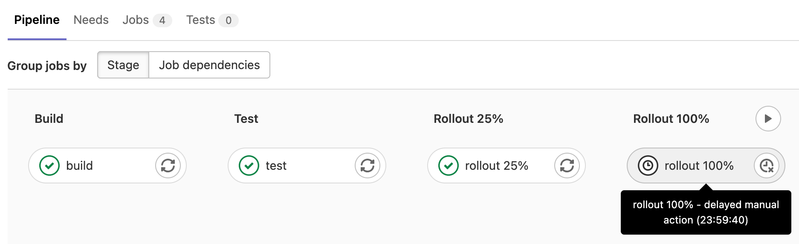
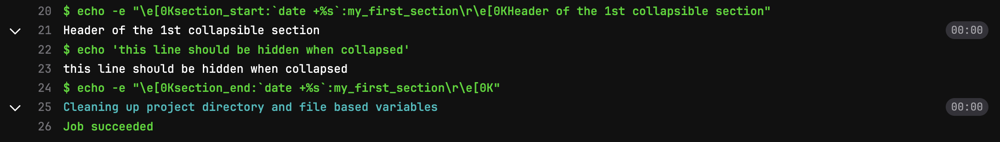

# Jobs

DETAILS:
**Tier:** Free, Premium, Ultimate
**Offering:** GitLab.com, Self-managed, GitLab Dedicated

Jobs are fundamental elements of a GitLab CI/CD pipeline. Jobs are configured in the `.gitlab-ci.yml` file
with a list of commands to run to accomplish tasks like building, testing, or deploying code.

Jobs are:

- Defined with constraints stating under what conditions they should be executed.
- Top-level elements with an arbitrary name and must contain at least the [`script`](../yaml/index.md#script) clause.
- Not limited in how many can be defined.

For example:

```yaml
job1:
  script: "execute-script-for-job1"

job2:
  script: "execute-script-for-job2"
```

The above example is the simplest possible CI/CD configuration with two separate
jobs, where each of the jobs executes a different command.
Of course a command can execute code directly (`./configure;make;make install`)
or run a script (`test.sh`) in the repository.

Jobs are picked up by [runners](../runners/index.md) and executed in the
environment of the runner. What is important is that each job is run
independently from each other.

## View jobs in a pipeline

When you access a pipeline, you can see the related jobs for that pipeline.

Selecting an individual job shows you its job log, and allows you to:

- Cancel the job.
- Retry the job, if it failed.
- Run the job again, if it passed.
- Erase the job log.

### View all jobs in a project

To view the full list of jobs that ran in a project:

1. On the left sidebar, select **Search or go to** and find your project.
1. Select **Build > Jobs**.

You can filter the list by [job status](#the-order-of-jobs-in-a-pipeline).

## See why a job failed

When a pipeline fails or is allowed to fail, there are several places where you
can find the reason:

- In the [pipeline graph](../pipelines/index.md#pipeline-details), in the pipeline details view.
- In the pipeline widgets, in the merge requests and commit pages.
- In the job views, in the global and detailed views of a job.

In each place, if you hover over the failed job you can see the reason it failed.


You can also see the reason it failed on the Job detail page.

## The order of jobs in a pipeline

The order of jobs in a pipeline depends on the type of pipeline graph.

- For [full pipeline graphs](../pipelines/index.md#pipeline-details), jobs are sorted by name.
- For [pipeline mini graphs](../pipelines/index.md#pipeline-mini-graphs), jobs are sorted by status, and then by name.

The job status order is:

- failed
- warning
- pending
- running
- manual
- scheduled
- canceled
- success
- skipped
- created

For example:


## Job name limitations

You can't use these keywords as job names:

- `image`
- `services`
- `stages`
- `before_script`
- `after_script`
- `variables`
- `cache`
- `include`
- `pages:deploy` configured for a `deploy` stage

Additionally, these names are valid when quoted, but are
not recommended as they can make pipeline configuration unclear:

- `"true":`
- `"false":`
- `"nil":`

Job names must be 255 characters or fewer.

Use unique names for your jobs. If multiple jobs have the same name in a file,
only one is added to the pipeline, and it's difficult to predict which one is chosen.
If the same job name is used in one or more included files,
[parameters are merged](../yaml/includes.md#override-included-configuration-values).

## Group jobs in a pipeline

If you have many similar jobs, your [pipeline graph](../pipelines/index.md#pipeline-details) becomes long and hard
to read.

You can automatically group similar jobs together. If the job names are formatted in a certain way,
they are collapsed into a single group in regular pipeline graphs (not the mini graphs).

You can recognize when a pipeline has grouped jobs if you don't see the retry or
cancel button inside them. Hovering over them shows the number of grouped
jobs. Select to expand them.


To create a group of jobs, in the `.gitlab-ci.yml` file,
separate each job name with a number and one of the following:

- A slash (`/`), for example, `slash-test 1/3`, `slash-test 2/3`, `slash-test 3/3`.
- A colon (`:`), for example, `colon-test 1:3`, `colon-test 2:3`, `colon-test 3:3`.
- A space, for example `space-test 0 3`, `space-test 1 3`, `space-test 2 3`.

You can use these symbols interchangeably.

In the example below, these three jobs are in a group named `build ruby`:

```yaml
build ruby 1/3:
  stage: build
  script:
    - echo "ruby1"

build ruby 2/3:
  stage: build
  script:
    - echo "ruby2"

build ruby 3/3:
  stage: build
  script:
    - echo "ruby3"
```

The pipeline graph displays a group named `build ruby` with three jobs.

The jobs are ordered by comparing the numbers from left to right. You
usually want the first number to be the index and the second number to be the total.

[This regular expression](https://gitlab.com/gitlab-org/gitlab/-/blob/2f3dc314f42dbd79813e6251792853bc231e69dd/app/models/commit_status.rb#L99)
evaluates the job names: `([\b\s:]+((\[.*\])|(\d+[\s:\/\\]+\d+))){1,3}\s*\z`.
One or more `: [...]`, `X Y`, `X/Y`, or `X\Y` sequences are removed from the **end**
of job names only. Matching substrings found at the beginning or in the middle of
job names are not removed.

## Hide jobs

To temporarily disable a job without deleting it from the configuration
file:

- Comment out the job's configuration:

  ```yaml
  # hidden_job:
  #   script:
  #     - run test
  ```

- Start the job name with a dot (`.`) and it is not processed by GitLab CI/CD:

  ```yaml
  .hidden_job:
    script:
      - run test
  ```

You can use hidden jobs that start with `.` as templates for reusable configuration with:

- The [`extends` keyword](../yaml/index.md#extends).
- [YAML anchors](../yaml/yaml_optimization.md#anchors).

## Control the inheritance of default keywords and global variables

You can control the inheritance of:

- [default keywords](../yaml/index.md#default) with [`inherit:default`](../yaml/index.md#inheritdefault).
- [global variables](../yaml/index.md#default) with [`inherit:variables`](../yaml/index.md#inheritvariables).

For example:

```yaml
default:
  image: 'ruby:2.4'
  before_script:
    - echo Hello World

variables:
  DOMAIN: example.com
  WEBHOOK_URL: https://my-webhook.example.com

rubocop:
  inherit:
    default: false
    variables: false
  script: bundle exec rubocop

rspec:
  inherit:
    default: [image]
    variables: [WEBHOOK_URL]
  script: bundle exec rspec

capybara:
  inherit:
    variables: false
  script: bundle exec capybara

karma:
  inherit:
    default: true
    variables: [DOMAIN]
  script: karma
```

In this example:

- `rubocop`:
  - inherits: Nothing.
- `rspec`:
  - inherits: the default `image` and the `WEBHOOK_URL` variable.
  - does **not** inherit: the default `before_script` and the `DOMAIN` variable.
- `capybara`:
  - inherits: the default `before_script` and `image`.
  - does **not** inherit: the `DOMAIN` and `WEBHOOK_URL` variables.
- `karma`:
  - inherits: the default `image` and `before_script`, and the `DOMAIN` variable.
  - does **not** inherit: `WEBHOOK_URL` variable.

## Specifying variables when running manual jobs

When running manual jobs you can supply additional job specific variables.

You can do this from the job page of the manual job you want to run with
additional variables. To access this page, select the **name** of the manual job in
the pipeline view, *not* **Run** (**{play}**).

Define CI/CD variables here when you want to alter the execution of a job that uses
[CI/CD variables](../variables/index.md).

If you add a variable that is already defined in the CI/CD settings or `.gitlab-ci.yml` file,
the [variable is overridden](../variables/index.md#override-a-defined-cicd-variable) with the new value.
Any variables overridden by using this process are [expanded](../variables/index.md#prevent-cicd-variable-expansion)
and not [masked](../variables/index.md#mask-a-cicd-variable).


## Delay a job

When you do not want to run a job immediately, you can use the [`when:delayed`](../jobs/job_control.md#run-a-job-after-a-delay) keyword to
delay a job's execution for a certain period.

This is especially useful for timed incremental rollout where new code is rolled out gradually.

For example, if you start rolling out new code and:

- Users do not experience trouble, GitLab can automatically complete the deployment from 0% to 100%.
- Users experience trouble with the new code, you can stop the timed incremental rollout by canceling the pipeline
  and [rolling](../environments/index.md#retry-or-roll-back-a-deployment) back to the last stable version.



## Expand and collapse job log sections

> - Support for output of multi-line command bash shell output [Introduced](https://gitlab.com/gitlab-org/gitlab-runner/-/merge_requests/3486) in GitLab 16.5 behind the [GitLab Runner feature flag](https://docs.gitlab.com/runner/configuration/feature-flags.html), `FF_SCRIPT_SECTIONS`.

Job logs are divided into sections that can be collapsed or expanded. Each section displays
the duration.

In the following example:

- Three sections have been collapsed and can be expanded.
- Three sections are expanded and can be collapsed.


### Custom collapsible sections

You can create [collapsible sections in job logs](#expand-and-collapse-job-log-sections)
by manually outputting special codes
that GitLab uses to delimit collapsible sections:

- Section start marker: `\e[0Ksection_start:UNIX_TIMESTAMP:SECTION_NAME\r\e[0K` + `TEXT_OF_SECTION_HEADER`
- Section end marker: `\e[0Ksection_end:UNIX_TIMESTAMP:SECTION_NAME\r\e[0K`

You must add these codes to the script section of the CI configuration.
For example, using `echo`:

```yaml
job1:
  script:
    - echo -e "\e[0Ksection_start:`date +%s`:my_first_section\r\e[0KHeader of the 1st collapsible section"
    - echo 'this line should be hidden when collapsed'
    - echo -e "\e[0Ksection_end:`date +%s`:my_first_section\r\e[0K"
```

The escape syntax may differ depending on the shell that your runner uses.
For example if it is using Zsh, you may need to escape the special characters
with `\\e` or `\\r`.

In the example above:

- `date +%s`: Command that produces the Unix timestamp (for example `1560896352`).
- `my_first_section`: The name given to the section. The name can only be composed
  of letters, numbers, and the `_`, `.`, or `-` characters.
- `\r\e[0K`: Escape sequence that prevents the section markers from displaying in the
  rendered (colored) job log. They are displayed when viewing the raw job log, accessed
  in the upper-right corner of the job log by selecting **Show complete raw** (**{doc-text}**).
  - `\r`: carriage return (returns the cursor to the start of the line).
  - `\e[0K`: ANSI escape code to clear the line from the cursor position to the end of the line.
    (`\e[K` alone does not work; the `0` must be included).

Sample raw job log:

```plaintext
\e[0Ksection_start:1560896352:my_first_section\r\e[0KHeader of the 1st collapsible section
this line should be hidden when collapsed
\e[0Ksection_end:1560896353:my_first_section\r\e[0K
```

Sample job console log:



#### Use a script to improve display of collapsible sections

To remove the `echo` statements that create the section markers from the job output,
you can move the job contents to a script file and invoke it from the job:

1. Create a script that can handle the section headers. For example:

   ```shell
   # function for starting the section
   function section_start () {
     local section_title="${1}"
     local section_description="${2:-$section_title}"

     echo -e "section_start:`date +%s`:${section_title}[collapsed=true]\r\e[0K${section_description}"
   }

   # Function for ending the section
   function section_end () {
     local section_title="${1}"

     echo -e "section_end:`date +%s`:${section_title}\r\e[0K"
   }

   # Create sections
   section_start "my_first_section" "Header of the 1st collapsible section"

   echo "this line should be hidden when collapsed"

   section_end "my_first_section"

   # Repeat as required
   ```

1. Add the script to the `.gitlab-ci.yml` file:

   ```yaml
   job:
     script:
       - source script.sh
   ```

### Pre-collapse sections

You can make the job log automatically collapse collapsible sections by adding the `collapsed` option to the section start.
Add `[collapsed=true]` after the section name and before the `\r`. The section end marker
remains unchanged:

- Section start marker with `[collapsed=true]`: `\e[0Ksection_start:UNIX_TIMESTAMP:SECTION_NAME[collapsed=true]\r\e[0K` + `TEXT_OF_SECTION_HEADER`
- Section end marker (unchanged): `\e[0Ksection_end:UNIX_TIMESTAMP:SECTION_NAME\r\e[0K`

Add the updated section start text to the CI configuration. For example,
using `echo`:

```yaml
job1:
  script:
    - echo -e "\e[0Ksection_start:`date +%s`:my_first_section[collapsed=true]\r\e[0KHeader of the 1st collapsible section"
    - echo 'this line should be hidden automatically after loading the job log'
    - echo -e "\e[0Ksection_end:`date +%s`:my_first_section\r\e[0K"
```

### Full screen mode

> - [Introduced](https://gitlab.com/gitlab-org/gitlab/-/issues/363617) in GitLab 16.7.

You can view the contents of a job log in full screen mode by clicking **Show full screen**.

To use full screen mode, your web browser must also support it. If your web browser does not support full screen mode, then the option is not available.

## Deployment jobs

Deployment jobs are a specific kind of CI job in that they deploy code to
[environments](../environments/index.md). A deployment job is any job that
uses the `environment` keyword and the [`start` environment `action`](../yaml/index.md#environmentaction).
Deployment jobs do not need to be in the `deploy` stage. The following `deploy me`
job is an example of a deployment job. `action: start` is the default behavior and
is defined for the sake of the example, but you can omit it:

```yaml
deploy me:
  script:
    - deploy-to-cats.sh
  environment:
    name: production
    url: https://cats.example.com
    action: start
```

The behavior of deployment jobs can be controlled with
[deployment safety](../environments/deployment_safety.md) settings like
[preventing outdated deployment jobs](../environments/deployment_safety.md#prevent-outdated-deployment-jobs)
and [ensuring only one deployment job runs at a time](../environments/deployment_safety.md#ensure-only-one-deployment-job-runs-at-a-time).

## Troubleshooting

### Job log slow to update

When you visit the job log page for a running job, there could be a delay of up to
60 seconds before a log update. The default refresh time is 60 seconds, but after
the log is viewed in the UI one time, log updates should occur every 3 seconds.

### `get_sources` job section fails because of an HTTP/2 problem

Sometimes, jobs fail with the following cURL error:

```plaintext
++ git -c 'http.userAgent=gitlab-runner <version>' fetch origin +refs/pipelines/<id>:refs/pipelines/<id> ...
error: RPC failed; curl 16 HTTP/2 send again with decreased length
fatal: ...
```

You can work around this problem by configuring Git and `libcurl` to
[use HTTP/1.1](https://git-scm.com/docs/git-config#Documentation/git-config.txt-httpversion).
The configuration can be added to:

- A job's [`pre_get_sources_script`](../yaml/index.md#hookspre_get_sources_script):

  ```yaml
  job_name:
    hooks:
      pre_get_sources_script:
        - git config --global http.version "HTTP/1.1"
  ```

- The [runner's `config.toml`](https://docs.gitlab.com/runner/configuration/advanced-configuration.html)
  with [Git configuration environment variables](https://git-scm.com/docs/git-config#ENVIRONMENT):

  ```toml
  [[runners]]
  ...
  environment = [
    "GIT_CONFIG_COUNT=1",
    "GIT_CONFIG_KEY_0=http.version",
    "GIT_CONFIG_VALUE_0=HTTP/1.1"
  ]
  ```

### Job using `resource_group` gets stuck

DETAILS:
**Tier:** Free, Premium, Ultimate
**Offering:** Self-managed, GitLab Dedicated

If a job using [`resource_group`](../yaml/index.md#resource_group) gets stuck, a
GitLab administrator can try run the following commands from the [rails console](../../administration/operations/rails_console.md#starting-a-rails-console-session):

```ruby
# find resource group by name
resource_group = Project.find_by_full_path('...').resource_groups.find_by(key: 'the-group-name')
busy_resources = resource_group.resources.where('build_id IS NOT NULL')

# identify which builds are occupying the resource
# (I think it should be 1 as of today)
busy_resources.pluck(:build_id)

# it's good to check why this build is holding the resource.
# Is it stuck? Has it been forcefully dropped by the system?
# free up busy resources
busy_resources.update_all(build_id: nil)
```
