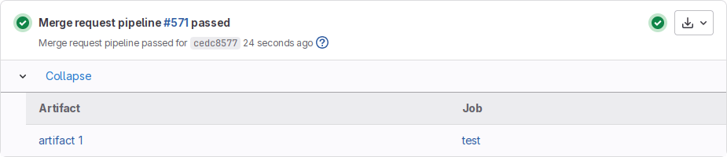



- Tier: Free, Premium, Ultimate
- Offering: GitLab.com, GitLab Self-Managed, GitLab Dedicated



Jobs can output an archive of files and directories. This output is known as a job artifact.
Artifacts can include build output or report files. By default, later jobs fetch a copy of
all artifacts from jobs in earlier stages.

For example, an early job can build a project and save the output as an artifact.
Then a later job fetches the artifact and runs tests on the saved build output.

For a full list of supported configuration for the `artifacts` keyword,
see the [GitLab CI/CD YAML syntax reference](../yaml/_index.md#artifacts).

Related topics:

- [Job artifacts API](../../api/job_artifacts.md)
- [Job artifacts administration](../../administration/cicd/job_artifacts.md)

## Create job artifacts

To create job artifacts, use the `artifacts` keyword in your `.gitlab-ci.yml` file:

```yaml
pdf:
  script: xelatex mycv.tex
  artifacts:
    paths:
      - mycv.pdf
```

In this example, a job named `pdf` calls the `xelatex` command to build a PDF file from the
LaTeX source file, `mycv.tex`.

The `paths` keyword determines which files to add to the job artifacts.
All paths to files and directories are relative to the repository where the job was created.

### With wildcards

You can use wildcards for paths and directories. For example, to create an artifact
with all the files inside the directories that end with `xyz`:

```yaml
job:
  script: echo "build xyz project"
  artifacts:
    paths:
      - path/*xyz/*
```

### With an expiry

The `expire_in` keyword determines how long GitLab keeps the artifacts defined in `artifacts:paths`. For example:

```yaml
pdf:
  script: xelatex mycv.tex
  artifacts:
    paths:
      - mycv.pdf
    expire_in: 1 week
```

If `expire_in` is not defined, the [**Default artifacts expiration**](../../administration/settings/continuous_integration.md#set-default-artifacts-expiration)
instance setting is used.

To prevent artifacts from expiring, you can select **Keep** from the job details page.
The option is not available when an artifact has no expiry set.

By default, artifacts are always kept for the most recent successful pipeline on each ref.

### With an explicitly defined artifact name

You can explicitly customize artifact names using the `artifacts:name` configuration:

```yaml
job:
  artifacts:
    name: "job1-artifacts-file"
    paths:
      - binaries/
```

### Without excluded files

Use `artifacts:exclude` to prevent files from being added to an artifacts archive.

For example, to store all files in `binaries/`, but not `*.o` files located in
subdirectories of `binaries/`:

```yaml
artifacts:
  paths:
    - binaries/
  exclude:
    - binaries/**/*.o
```

Unlike `artifacts:paths`, `exclude` paths are not recursive. To exclude all of the contents
of a directory, match them explicitly rather than matching the directory itself.

For example, to store all files in `binaries/` but nothing located in the `temp/` subdirectory:

```yaml
artifacts:
  paths:
    - binaries/
  exclude:
    - binaries/temp/**/*
```

### With untracked files

Use `artifacts:untracked` to add all Git untracked files as artifacts along with the paths
defined in `artifacts:paths`. Untracked files are those that haven't been added to the
repository but exist in the repository checkout.

For example, to save all Git untracked files and files in `binaries`:

```yaml
artifacts:
  untracked: true
  paths:
    - binaries/
```

For example, to save all untracked files but exclude `*.txt` files:

```yaml
artifacts:
  untracked: true
  exclude:
    - "*.txt"
```

### With variable expansion

Variable expansion is supported for `artifacts:name`, `artifacts:paths`, and `artifacts:exclude`.

Instead of using shell, GitLab Runner uses its internal variable expansion mechanism.
Only CI/CD variables are supported in this context.

For example, to create an archive using the current branch or tag name
including only files from a directory named after the current project:

```yaml
job:
  artifacts:
    name: "$CI_COMMIT_REF_NAME"
    paths:
      - binaries/${CI_PROJECT_NAME}/
```

When your branch name contains forward slashes (for example, `feature/my-feature`),
use `$CI_COMMIT_REF_SLUG` instead of `$CI_COMMIT_REF_NAME` to ensure proper artifact naming.

Variables are expanded before globs.

## Fetching artifacts

By default, jobs fetch all artifacts from jobs defined in previous stages. These artifacts
are downloaded into the job's working directory.

You can control which artifacts to download by using the `dependencies` or `needs:artifacts` keywords.

When you use these keywords, the default behavior changes and artifacts are fetched from
only the jobs you specify.

### Prevent a job from fetching artifacts

To prevent a job from downloading any artifacts, set `dependencies` to an empty array (`[]`):

```yaml
job:
  stage: test
  script: make build
  dependencies: []
```

## View all job artifacts in a project



- [Generally available](https://gitlab.com/gitlab-org/gitlab/-/issues/407475) in GitLab 16.0. Feature flag `artifacts_management_page` removed.



You can view all artifacts stored in a project from the **Build** > **Artifacts** page.
This list displays all jobs and their associated artifacts. Expand an entry to access
all artifacts associated with a job, including:

- Artifacts created with the `artifacts:` keyword.
- Report artifacts.
- Job logs and metadata, which are stored internally as separate artifacts.

You can download or delete individual artifacts from this list.

## Download job artifacts

You can download job artifacts by using the GitLab UI or the API.

From the GitLab UI, you can download job artifacts from:

- Any **Pipelines** list. On the right of the pipeline, select **Download artifacts** ().
- Any **Jobs** list. On the right of the job, select **Download artifacts** ().
- A job's detail page. On the right of the page, select **Download**.
- A merge request **Overview** page. On the right of the latest pipeline, select **Artifacts** ().
- The **Artifacts** page. On the right of the job, select **Download** ().
- The artifacts browser. On the top of the page, select **Download artifacts archive** ().

[Report artifacts](../yaml/artifacts_reports.md) can only be downloaded from the **Pipelines** list
or **Artifacts** page.

### From a URL

You can download the artifacts archive for a specific job with a publicly accessible URL.

For example, to download the latest artifacts of a job named `build` in the `main` branch
of a project on GitLab.com:

```plaintext
https://gitlab.com/api/v4/projects/<project-id>/jobs/artifacts/main/download?job=build
```

To download a specific file from the artifacts:

```plaintext
https://gitlab.com/api/v4/projects/<project-id>/jobs/artifacts/main/raw/review/index.html?job=build
```

Files returned by this endpoint always have the `plain/text` content type.

In both examples, replace `<project-id>` with a valid project ID. You can find the project ID
on the [project overview page](../../user/project/working_with_projects.md#find-the-project-id).

Artifacts for parent and child pipelines are searched in hierarchical order from parent to child.
For example, if both parent and child pipelines have a job with the same name, the job artifacts
from the parent pipeline are returned.

### With a CI/CD job token



- Tier: Premium, Ultimate
- Offering: GitLab.com, GitLab Self-Managed, GitLab Dedicated



You can use a CI/CD job token to authenticate with the jobs artifacts API endpoint
and fetch artifacts from a different pipeline. You must specify which job to retrieve
artifacts from, for example:

```yaml
build_submodule:
  stage: test
  script:
    - apt update && apt install -y unzip
    - curl --location --output artifacts.zip "https://gitlab.example.com/api/v4/projects/1/jobs/artifacts/main/download?job=test&job_token=$CI_JOB_TOKEN"
    - unzip artifacts.zip
```

To fetch artifacts from a job in the same pipeline, use the `needs:artifacts` keyword.

### Control who can download artifacts

To restrict who can download job artifacts, use the `artifacts:access` keyword in your `.gitlab-ci.yml` file. For example:

```yaml
job:
  artifacts:
    access: maintainer
    paths:
      - build/
```

## Browse the contents of the artifacts archive

You can browse the contents of the artifacts from the UI without downloading the artifact locally,
from:

- Any **Jobs** list. On the right of the job, select **Browse** ().
- A job's detail page. On the right of the page, select **Browse**.
- The **Artifacts** page. On the right of the job, select **Browse** ().

If GitLab Pages is enabled globally, even if it is disabled in the project settings,
you can preview some artifacts file extensions directly in your browser. If the project
is internal or private, you must enable GitLab Pages access control to enable the preview.

The following extensions are supported:

| File extension | GitLab.com                           | Linux package with built-in NGINX |
| -------------- | ------------------------------------ | --------------------------------- |
| `.html`        |  Yes |  Yes |
| `.json`        |  Yes |  Yes |
| `.xml`         |  Yes |  Yes |
| `.txt`         |  No |  Yes |
| `.log`         |  No |  Yes |

### From a URL

You can browse the job artifacts of the latest successful pipeline for a specific job
with a publicly accessible URL.

For example, to browse the latest artifacts of a job named `build` in the `main` branch
of a project on GitLab.com:

```plaintext
https://gitlab.com/<full-project-path>/-/jobs/artifacts/main/browse?job=build
```

Replace `<full-project-path>` with a valid project path, you can find it in the URL for your project.

## Delete job log and artifacts



Deleting the job log and artifacts is a destructive action that cannot be reverted. Use with caution.
Deleting certain files, including report artifacts, job logs, and metadata files, affects
GitLab features that use these files as data sources.



You can delete a job's artifacts and log.

Prerequisites:

- You must be the owner of the job or a user with at least the Maintainer role for the project.

To delete a job:

1. Go to a job's detail page.
1. In the upper-right corner of the job's log, select **Erase job log and artifacts** ().

You can also delete individual artifacts from the **Artifacts** page.

### Bulk delete artifacts



- [Introduced](https://gitlab.com/gitlab-org/gitlab/-/issues/33348) in GitLab 15.10 [with a flag](../../administration/feature_flags/_index.md) named `ci_job_artifact_bulk_destroy`. Disabled by default.
- [Generally available](https://gitlab.com/gitlab-org/gitlab/-/issues/398581) in GitLab 16.1. Feature flag `ci_job_artifact_bulk_destroy` removed.



You can delete multiple artifacts at the same time:

1. On the left sidebar, select **Search or go to** and find your project.
1. Select **Build** > **Artifacts**.
1. Select the checkboxes next to the artifacts you want to delete. You can select up to 100 artifacts.
1. Select **Delete selected**.

## Link to job artifacts in the merge request UI

Use the `artifacts:expose_as` keyword to provide direct access to artifacts from the merge request UI.

For example, for an artifact with a single file:

```yaml
test:
  script: ["echo 'test' > file.txt"]
  artifacts:
    expose_as: 'artifact 1'
    paths: ['file.txt']
```

With this configuration, the **View exposed artifact** section displays a link to `file.txt` labeled **artifact 1**.



## Keep artifacts from most recent successful jobs



- Artifacts for [blocked](https://gitlab.com/gitlab-org/gitlab/-/issues/387087) or [failed](https://gitlab.com/gitlab-org/gitlab/-/issues/266958) pipelines changed to no longer be kept indefinitely in GitLab 16.7.



By default, artifacts are always kept for the most recent successful pipeline on each ref.
Any `expire_in` configuration does not apply to the most recent artifacts.

When a new pipeline on the same ref completes successfully, the previous pipeline's artifacts
are deleted according to the `expire_in` configuration. The artifacts of the new pipeline
are kept automatically.

A pipeline's artifacts are only deleted according to the `expire_in` configuration if a
new pipeline runs for the same ref and:

- Succeeds.
- Stops running due to being blocked by a manual job.

Keeping the latest artifacts can use a large amount of storage space in projects
with a lot of jobs or large artifacts. If the latest artifacts are not needed in
a project, you can disable this behavior to save space:

1. On the left sidebar, select **Search or go to** and find your project.
1. Select **Settings** > **CI/CD**.
1. Expand **Artifacts**.
1. Clear the **Keep artifacts from most recent successful jobs** checkbox.

After disabling this setting, all new artifacts expire according to the `expire_in` configuration.
Artifacts in old pipelines continue to be kept until a new pipeline runs for the same ref.
Then the artifacts in the earlier pipeline for that ref are allowed to expire too.

You can disable this behavior for all projects on GitLab Self-Managed with the
[**Keep artifacts from latest successful pipelines**](../../administration/settings/continuous_integration.md#keep-artifacts-from-latest-successful-pipelines) instance setting.

You can disable this behavior for all projects on GitLab Self-Managed in the
[instance's CI/CD settings](../../administration/settings/continuous_integration.md#keep-artifacts-from-latest-successful-pipelines).
