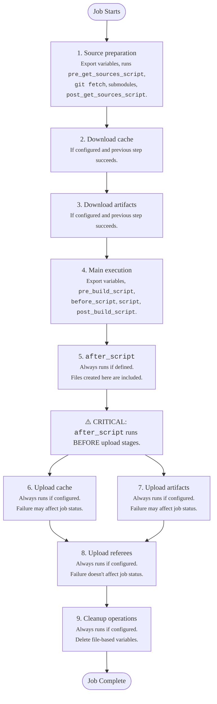



- Tier: Free, Premium, Ultimate
- Offering: GitLab.com, GitLab Self-Managed, GitLab Dedicated



The job execution flow describes how GitLab Runner processes CI/CD jobs from start to finish.

GitLab Runner executes CI/CD jobs after it receives a job, retrieves secrets from a vault
(if configured), and prepares the executor. Every CI/CD job executes as a series of sequential
steps, with each step running in a separate shell context. The runner:

1. Prepares the source code for the job:

   - Exports variables to the shell context
   - Runs `pre_get_sources_script` if it's defined in the configuration
   - Executes `git fetch` and other source handling commands, unless the `none` strategy is configured
   - Runs commands to update submodules if they exist
   - Runs `post_get_sources_script` if it's defined in the configuration

1. Downloads cached files if [cache](../yaml/_index.md#cache) is configured and the previous step succeeded:

   - Exports variables to the shell context
   - Executes commands to download cached files from previous job runs

1. Downloads [artifacts](../yaml/_index.md#artifacts) from previous jobs if artifact downloading is configured and the previous step succeeded:

   - Exports variables to the shell context
   - Executes commands to download artifact files from previous jobs

1. Executes the main job scripts if the previous step succeeded:

   - Exports variables to the shell context
   - Runs `pre_build_script` if it's defined in the configuration
   - Executes the `before_script` commands if they're defined
   - Executes the main `script` commands
   - Runs `post_build_script` if it's defined in the configuration

1. Executes `after_script` commands if they're defined, regardless of whether previous steps failed:

   - Exports variables to a new shell context
   - Executes the `after_script` commands
   - Failure of these commands doesn't influence the overall job status

1. Uploads files to cache if cache uploading is configured, regardless of whether previous steps failed:

   - Exports variables to the shell context
   - Executes commands to upload specified files to cache storage
   - Failure of this step may influence the overall job status

1. Uploads artifacts if artifact uploading is configured, regardless of whether previous steps failed:

   - Exports variables to the shell context
   - Executes commands to upload specified files as job artifacts
   - Failure of this step may influence the overall job status

1. Uploads referee data if referee uploading is configured, regardless of whether previous steps failed:

   - Exports variables to the shell context
   - Executes commands to upload referee information
   - Failure of these commands doesn't influence the overall job status

1. Performs cleanup operations if they're configured, regardless of whether previous steps failed:

   - Exports variables to the shell context
   - Executes commands to delete file-based variables from the working directory
   - Failure of these commands doesn't influence the overall job

## Shell context isolation

Each shell context is isolated by design. The only connection between contexts is the shared working directory file system.

- Manual variable exports (like `export my_variable=$(date)`) in one context are not available in other contexts
- Each script runs with `set -eo pipefail` (for Unix shells) to fail early on the first error
- The outcome of each step influences whether subsequent steps execute and affects overall job status
