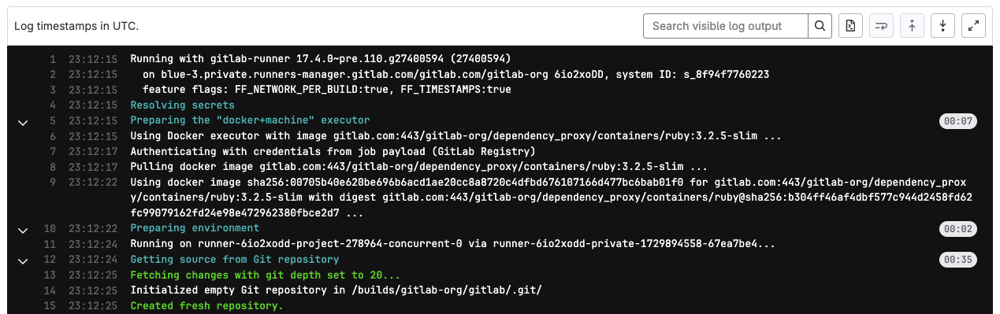

DETAILS:
**Tier:** Free, Premium, Ultimate
**Offering:** GitLab.com, GitLab Self-Managed, GitLab Dedicated

A job log displays the full execution history of a [CI/CD job](_index.md).

## View job logs

To view job logs:

1. Select the project for which you want to view job logs.
1. On the left sidebar, select **CI/CD > Pipelines**.
1. Select the pipeline you want to inspect.
1. In the pipeline view, in the list of jobs, select a job to view the job logs page.

To view detailed information about the job and its log output, scroll through the job logs page.

## View job logs in full screen mode

> - [Introduced](https://gitlab.com/gitlab-org/gitlab/-/issues/363617) in GitLab 16.7.

You can view the contents of a job log in full screen mode by clicking **Show full screen**.

To use full screen mode, your web browser must also support it. If your web browser does not support full screen mode, then the option is not available.

## Expand and collapse job log sections

> - Support for output of multi-line command bash shell output [Introduced](https://gitlab.com/gitlab-org/gitlab-runner/-/merge_requests/3486) in GitLab 16.5 behind the [GitLab Runner feature flag](https://docs.gitlab.com/runner/configuration/feature-flags.html), `FF_SCRIPT_SECTIONS`.

Job logs are divided into sections that can be collapsed or expanded. Each section displays
the duration.

In the following example:

- Three sections have been collapsed and can be expanded.
- Three sections are expanded and can be collapsed.


### Custom collapsible sections

You can create [collapsible sections in job logs](#expand-and-collapse-job-log-sections)
by manually outputting special codes
that GitLab uses to delimit collapsible sections:

- Section start marker: `\e[0Ksection_start:UNIX_TIMESTAMP:SECTION_NAME\r\e[0K` + `TEXT_OF_SECTION_HEADER`
- Section end marker: `\e[0Ksection_end:UNIX_TIMESTAMP:SECTION_NAME\r\e[0K`

You must add these codes to the script section of the CI configuration.
For example, using `echo`:

```yaml
job1:
  script:
    - echo -e "\e[0Ksection_start:`date +%s`:my_first_section\r\e[0KHeader of the 1st collapsible section"
    - echo 'this line should be hidden when collapsed'
    - echo -e "\e[0Ksection_end:`date +%s`:my_first_section\r\e[0K"
```

The escape syntax may differ depending on the shell that your runner uses.
For example if it is using Zsh, you may need to escape the special characters
with `\\e` or `\\r`.

In the example above:

- `date +%s`: Command that produces the Unix timestamp (for example `1560896352`).
- `my_first_section`: The name given to the section. The name can only be composed
  of letters, numbers, and the `_`, `.`, or `-` characters.
- `\r\e[0K`: Escape sequence that prevents the section markers from displaying in the
  rendered (colored) job log. They are displayed when viewing the raw job log, accessed
  in the upper-right corner of the job log by selecting **Show complete raw** (**{doc-text}**).
  - `\r`: carriage return (returns the cursor to the start of the line).
  - `\e[0K`: ANSI escape code to clear the line from the cursor position to the end of the line.
    (`\e[K` alone does not work; the `0` must be included).

Sample raw job log:

```plaintext
\e[0Ksection_start:1560896352:my_first_section\r\e[0KHeader of the 1st collapsible section
this line should be hidden when collapsed
\e[0Ksection_end:1560896353:my_first_section\r\e[0K
```

Sample job console log:


#### Use a script to improve display of collapsible sections

To remove the `echo` statements that create the section markers from the job output,
you can move the job contents to a script file and invoke it from the job:

1. Create a script that can handle the section headers. For example:

   ```shell
   # function for starting the section
   function section_start () {
     local section_title="${1}"
     local section_description="${2:-$section_title}"

     echo -e "section_start:`date +%s`:${section_title}[collapsed=true]\r\e[0K${section_description}"
   }

   # Function for ending the section
   function section_end () {
     local section_title="${1}"

     echo -e "section_end:`date +%s`:${section_title}\r\e[0K"
   }

   # Create sections
   section_start "my_first_section" "Header of the 1st collapsible section"

   echo "this line should be hidden when collapsed"

   section_end "my_first_section"

   # Repeat as required
   ```

1. Add the script to the `.gitlab-ci.yml` file:

   ```yaml
   job:
     script:
       - source script.sh
   ```

### Pre-collapse sections

You can make the job log automatically collapse collapsible sections by adding the `collapsed` option to the section start.
Add `[collapsed=true]` after the section name and before the `\r`. The section end marker
remains unchanged:

- Section start marker with `[collapsed=true]`: `\e[0Ksection_start:UNIX_TIMESTAMP:SECTION_NAME[collapsed=true]\r\e[0K` + `TEXT_OF_SECTION_HEADER`
- Section end marker (unchanged): `\e[0Ksection_end:UNIX_TIMESTAMP:SECTION_NAME\r\e[0K`

Add the updated section start text to the CI configuration. For example,
using `echo`:

```yaml
job1:
  script:
    - echo -e "\e[0Ksection_start:`date +%s`:my_first_section[collapsed=true]\r\e[0KHeader of the 1st collapsible section"
    - echo 'this line should be hidden automatically after loading the job log'
    - echo -e "\e[0Ksection_end:`date +%s`:my_first_section\r\e[0K"
```

## Delete job logs

When you delete a job log you also [erase the entire job](../../api/jobs.md#erase-a-job).

For more details, see [Delete job logs](../../user/storage_management_automation.md#delete-job-logs).

## Job log timestamps

DETAILS:
**Tier:** Free, Premium, Ultimate
**Offering:** GitLab.com, GitLab Self-Managed, GitLab Dedicated

> - [Introduced](https://gitlab.com/gitlab-org/gitlab/-/issues/455582) in GitLab 17.1 [with a flag](../../administration/feature_flags.md) named `parse_ci_job_timestamps`. Disabled by default.
> - Feature flag `parse_ci_job_timestamps` [removed](https://gitlab.com/gitlab-org/gitlab/-/issues/464785) in GitLab 17.2.

You can generate a timestamp in the [ISO 8601 format](https://www.iso.org/iso-8601-date-and-time-format.html)
for each line in a CI/CD job log. With job log timestamps, you can identify the duration
of a specific section in the job. By default, job logs do not include a timestamp for each log line.

When timestamps are enabled, the job log uses approximately 10% more storage space.

Prerequisites:

- You must be on GitLab Runner 17.0 or later.

To enable timestamps in job logs, add a `FF_TIMESTAMPS` [CI/CD variable](../runners/configure_runners.md#configure-runner-behavior-with-variables)
to your pipeline and set it to `true`.

For example, [add the variable to your `.gitlab-ci.yml` file](../variables/_index.md#define-a-cicd-variable-in-the-gitlab-ciyml-file):

```yaml
variables:
  FF_TIMESTAMPS: true

job:
  script:
    - echo "This job's log has ISO 8601 timestamps!"
```

Here's an example log output with `FF_TIMESTAMPS` enabled:



To provide feedback on this feature, leave a comment on [issue 463391](https://gitlab.com/gitlab-org/gitlab/-/issues/463391).

## Troubleshooting

### Job log slow to update

When you visit the job log page for a running job, there could be a delay of up to
60 seconds before a log update. The default refresh time is 60 seconds, but after
the log is viewed in the UI one time, log updates should occur every 3 seconds.
