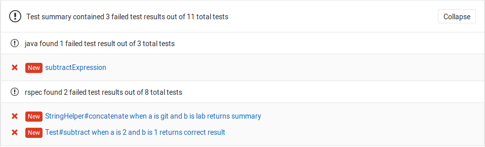
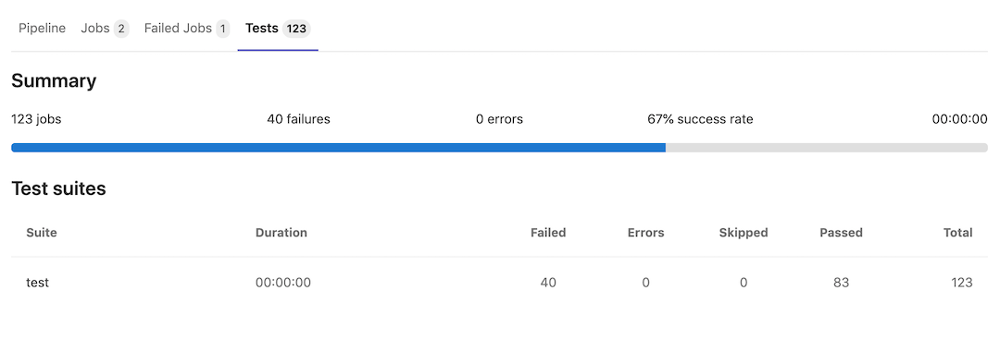

# JUnit test reports

> [Introduced](https://gitlab.com/gitlab-org/gitlab-foss/issues/45318) in GitLab 11.2.
Requires GitLab Runner 11.2 and above.

## Overview

It is very common that a [CI/CD pipeline](pipelines.md) contains a
test job that will verify your code.
If the tests fail, the pipeline fails and users get notified. The person that
works on the merge request will have to check the job logs and see where the
tests failed so that they can fix them.

You can configure your job to use JUnit test reports, and GitLab will display a
report on the merge request so that it's easier and faster to identify the
failure without having to check the entire log.

## Use cases

Consider the following workflow:

1. Your `master` branch is rock solid, your project is using GitLab CI/CD and
   your pipelines indicate that there isn't anything broken.
1. Someone from your team submits a merge request, a test fails and the pipeline
   gets the known red icon. To investigate more, you have to go through the job
   logs to figure out the cause of the failed test, which usually contain
   thousands of lines.
1. You configure the JUnit test reports and immediately GitLab collects and
   exposes them in the merge request. No more searching in the job logs.
1. Your development and debugging workflow becomes easier, faster and efficient.

## How it works

First, GitLab Runner uploads all JUnit XML files as artifacts to GitLab. Then,
when you visit a merge request, GitLab starts comparing the head and base branch's
JUnit test reports, where:

- The base branch is the target branch (usually `master`).
- The head branch is the source branch (the latest pipeline in each merge request).

The reports panel has a summary showing how many tests failed and how many were fixed.
If no comparison can be done because data for the base branch is not available,
the panel will just show the list of failed tests for head.

There are three types of results:

1. **Newly failed tests:** Test cases which passed on base branch and failed on head branch
1. **Existing failures:**  Test cases which failed on base branch and failed on head branch
1. **Resolved failures:**  Test cases which failed on base branch and passed on head branch

Each entry in the panel will show the test name and its type from the list
above. Clicking on the test name will open a modal window with details of its
execution time and the error output.



## How to set it up

NOTE: **Note:**
For a list of supported languages on JUnit tests, check the
[Wikipedia article](https://en.wikipedia.org/wiki/JUnit#Ports).

To enable the JUnit reports in merge requests, you need to add
[`artifacts:reports:junit`](yaml/README.md#artifactsreportsjunit)
in `.gitlab-ci.yml`, and specify the path(s) of the generated test reports.

In the following examples, the job in the `test` stage runs and GitLab
collects the JUnit test report from each job. After each job is executed, the
XML reports are stored in GitLab as artifacts and their results are shown in the
merge request widget.

NOTE: **Note:**
If you also want the ability to browse JUnit output files, include the
[`artifacts:paths`](yaml/README.md#artifactspaths) keyword. An example of this is shown in the Ruby example below.

### Ruby example

Use the following job in `.gitlab-ci.yml`. This includes the `artifacts:paths` keyword to provide a link to the JUnit output file.

```yaml
## Use https://github.com/sj26/rspec_junit_formatter to generate a JUnit report with rspec
ruby:
  stage: test
  script:
  - bundle install
  - rspec spec/lib/ --format RspecJunitFormatter --out rspec.xml
  artifacts:
    paths:
      - rspec.xml
    reports:
      junit: rspec.xml
```

### Go example

Use the following job in `.gitlab-ci.yml`:

```yaml
## Use https://github.com/jstemmer/go-junit-report to generate a JUnit report with go
golang:
  stage: test
  script:
  - go get -u github.com/jstemmer/go-junit-report
  - go test -v 2>&1 | go-junit-report > report.xml
  artifacts:
    reports:
      junit: report.xml
```

### Java examples

There are a few tools that can produce JUnit reports in Java.

#### Gradle

In the following example, `gradle` is used to generate the test reports.
If there are multiple test tasks defined, `gradle` will generate multiple
directories under `build/test-results/`. In that case, you can leverage glob
matching by defining the following path: `build/test-results/test/**/TEST-*.xml`:

```yaml
java:
  stage: test
  script:
  - gradle test
  artifacts:
    reports:
      junit: build/test-results/test/**/TEST-*.xml
```

#### Maven

For parsing [Surefire](https://maven.apache.org/surefire/maven-surefire-plugin/)
and [Failsafe](https://maven.apache.org/surefire/maven-failsafe-plugin/) test
reports, use the following job in `.gitlab-ci.yml`:

```yaml
java:
  stage: test
  script:
  - mvn verify
  artifacts:
    reports:
      junit:
        - target/surefire-reports/TEST-*.xml
        - target/failsafe-reports/TEST-*.xml
```

### C/C++ example

There are a few tools that can produce JUnit reports in C/C++.

#### GoogleTest

In the following example, `gtest` is used to generate the test reports.
If there are multiple gtest executables created for different architectures (`x86`, `x64` or `arm`),
you will be required to run each test providing a unique filename. The results
will then be aggregated together.

```yaml
cpp:
  stage: test
  script:
  - gtest.exe --gtest_output="xml:report.xml"
  artifacts:
    reports:
      junit: report.xml
```

### .Net example

The [JunitXML.TestLogger](https://www.nuget.org/packages/JunitXml.TestLogger/) NuGet
package can generate test reports for .Net Framework and .Net Core applications. The following
example expects a solution in the root folder of the repository, with one or more
project files in sub-folders. One result file is produced per test project, and each file
is placed in a new artifacts folder. This example includes optional formatting arguments, which
improve the readability of test data in the test widget. A full .Net Core
[example is available](https://gitlab.com/Siphonophora/dot-net-cicd-test-logging-demo).

```yaml
## Source code and documentation are here: https://github.com/spekt/junit.testlogger/

Test:
  stage: test
  script:
    - 'dotnet test --test-adapter-path:. --logger:"junit;LogFilePath=..\artifacts\{assembly}-test-result.xml;MethodFormat=Class;FailureBodyFormat=Verbose"'
  artifacts:
    when: always
    paths:
      - ./**/*test-result.xml
    reports:
      junit:
       - ./**/*test-result.xml
```

## Limitations

Currently, the following tools might not work because their XML formats are unsupported in GitLab.

|Case|Tool|Issue|
|---|---|---|
|`<testcase>` does not have `classname` attribute|ESlint, sass-lint|<https://gitlab.com/gitlab-org/gitlab-foss/issues/50964>|

## Viewing JUnit test reports on GitLab

> [Introduced](https://gitlab.com/gitlab-org/gitlab/issues/24792) in GitLab 12.5.

If JUnit XML files are generated and uploaded as part of a pipeline, these reports
can be viewed inside the pipelines details page. The **Tests** tab on this page will
display a list of test suites and cases reported from the XML file.



You can view all the known test suites and click on each of these to see further
details, including the cases that makeup the suite. Cases are ordered by status,
with failed showing at the top, skipped next and successful cases last.

### Enabling the feature

This feature comes with the `:junit_pipeline_view` feature flag disabled by default.
To enable this feature, ask a GitLab administrator with Rails console access to run the
following command:

```ruby
Feature.enable(:junit_pipeline_view)
```
