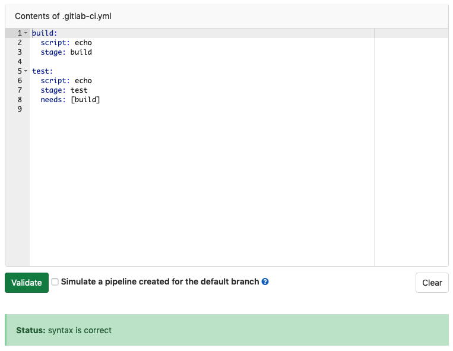
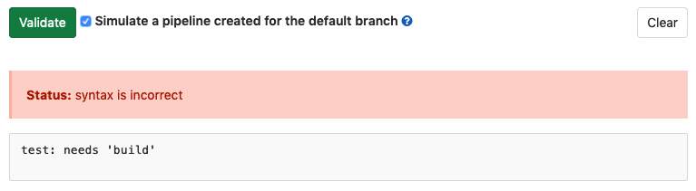

<!-- markdownlint-disable MD044 -->
<!-- vale gitlab.Spelling = NO -->
# Validate .gitlab-ci.yml syntax with the CI Lint tool
<!-- markdownlint-enable MD044 -->
<!-- vale gitlab.Spelling = YES -->

If you want to test the validity of your GitLab CI/CD configuration before committing
the changes, you can use the CI Lint tool. This tool checks for syntax and logical
errors by default, and can simulate pipeline creation to try to find more complicated
issues as well.

To access the CI Lint tool, navigate to **CI/CD > Pipelines** or **CI/CD > Jobs**
in your project and click **CI lint**.

## Validate basic logic and syntax

By default, the CI lint checks the syntax of your CI YAML configuration and also runs
some basic logical validations. Configuration added with the [`includes` keyword](yaml/index.md#include),
is also validated.

To use the CI lint, paste a complete CI configuration (`.gitlab-ci.yml` for example)
into the text box and click **Validate**:

## Pipeline simulation

> [Introduced](https://gitlab.com/gitlab-org/gitlab/-/issues/229794) in GitLab 13.3.

Not all pipeline configuration issues can be found by the [basic CI lint validation](#validate-basic-logic-and-syntax).
You can simulate the creation of a pipeline for deeper validation that can discover
more complicated issues.

To validate the configuration by running a pipeline simulation:

1. Paste the GitLab CI configuration to verify into the text box.
1. Click the **Simulate pipeline creation for the default branch** checkbox.
1. Click **Validate**.

### Pipeline simulation limitations

Simulations run as `git push` events against the default branch. You must have
[permissions](../user/permissions.md#project-members-permissions) to create pipelines
on this branch to validate with a simulation.
