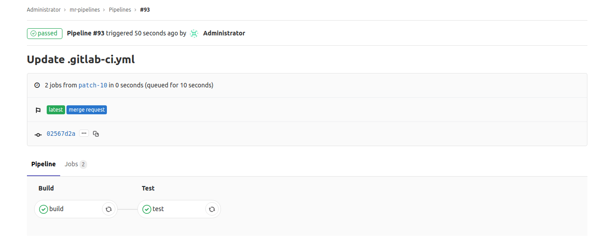

# Pipelines for merge requests

> [Introduced](https://gitlab.com/gitlab-org/gitlab-ce/issues/15310) in GitLab 11.6.

Usually, when you create a new merge request, a pipeline runs on the
new change and checks if it's qualified to be merged into a target branch. This
pipeline should contain only necessary jobs for checking the new changes.
For example, unit tests, lint checks, and [Review Apps](../review_apps/index.md)
are often used in this cycle.

With pipelines for merge requests, you can design a specific pipeline structure
for merge requests.

## Configuring pipelines for merge requests

To configure pipelines for merge request, add the `only: merge_requests` parameter to
the jobs that you want it to run only for merge requests.

Then, when developers create or update merge requests, a pipeline runs on
their new commits at every push to GitLab.

NOTE: **Note**:
If you use this feature with [merge when pipeline succeeds](../../user/project/merge_requests/merge_when_pipeline_succeeds.md),
pipelines for merge requests take precedence over the other regular pipelines.

For example, consider the following [`.gitlab-ci.yml`](../yaml/README.md):

```yaml
build:
  stage: build
  script: ./build
  only:
  - branches
  - tags
  - merge_requests

test:
  stage: test
  script: ./test
  only:
  - merge_requests

deploy:
  stage: deploy
  script: ./deploy
```

After the merge request is updated with new commits:

- GitLab detects that changes have occurred and creates a new pipeline for the merge request.
- The pipeline fetches the latest code from the source branch and run tests against it.

In the above example, the pipeline contains only `build` and `test` jobs.
Since the `deploy` job doesn't have the `only: merge_requests` rule,
deployment jobs will not happen in the merge request.

Pipelines tagged with **merge request** badge indicate that they were triggered
when a merge request was created or updated. For example:


The same tag is shown on the pipeline's details:



## Excluding certain jobs

The behavior of the `only: merge_requests` rule is such that _only_ jobs with
that rule are run in the context of a merge request; no other jobs will be run.

However, you may want to reverse this behaviour, having all of your jobs to run _except_
for one or two.

Consider the following pipeline, with jobs `A`, `B`, and `C`. Imagine you want:

- All pipelines to always run `A` and `B`
- Only want `C` to run for a merge request,

To achieve this, you can configure your `.gitlab-ci.yml` file as follows:

``` yaml
.only-default: &only-default
  only:
    - master
    - merge_requests
    - tags

A:
  <<: *only-default
  script:
    - ...

B:
  <<: *only-default
  script:
    - ...

C:
  script:
    - ...
  only:
    - merge_requests
```

Because:

- `A` and `B` are getting the `only:` rule to execute in all cases, they will always run.
- `C` specifies that it should only run for merge requests, it will not run for any pipeline
  except a merge request pipeline.

As you can see, this will help you avoid a lot of boilerplate where you'd need
to add that `only:` rule to all of your jobs in order to make them always run. You
can use this for scenarios like having only pipelines with merge requests get a
Review App set up, helping to save resources.

## Important notes about merge requests from forked projects

Note that the current behavior is subject to change. In the usual contribution
flow, external contributors follow the following steps:

1. Fork a parent project.
1. Create a merge request from the forked project that targets the `master` branch
   in the parent project.
1. A pipeline runs on the merge request.
1. A maintainer from the parent project checks the pipeline result, and merge
   into a target branch if the latest pipeline has passed.

Currently, those pipelines are created in a **forked** project, not in the
parent project. This means you cannot completely trust the pipeline result,
because, technically, external contributors can disguise their pipeline results
by tweaking their GitLab Runner in the forked project.

There are multiple reasons about why GitLab doesn't allow those pipelines to be
created in the parent project, but one of the biggest reasons is security concern.
External users could steal secret variables from the parent project by modifying
`.gitlab-ci.yml`, which could be some sort of credentials. This should not happen.

We're discussing a secure solution of running pipelines for merge requests
that submitted from forked projects,
see [the issue about the permission extension](https://gitlab.com/gitlab-org/gitlab-ce/issues/23902).
