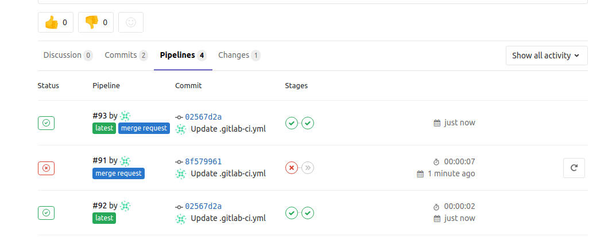

# Pipelines for Merge Requests

> [Introduced](https://gitlab.com/gitlab-org/gitlab-foss/issues/15310) in GitLab 11.6.

Usually, when you create a new merge request, a pipeline runs with the
new change and checks if it's qualified to be merged into a target branch. This
pipeline should contain only necessary jobs for validating the new changes.
For example, unit tests, lint checks, and [Review Apps](../review_apps/index.md)
are often used in this cycle.

With pipelines for merge requests, you can design a specific pipeline structure
for when you are running a pipeline in a merge request. This
could be either adding or removing steps in the pipeline, to make sure that
your pipelines are as efficient as possible.

## Requirements and limitations

Pipelines for merge requests have the following requirements and limitations:

- As of GitLab 11.10, pipelines for merge requests require GitLab Runner 11.9
  or higher due to the
  [recent refspecs changes](https://gitlab.com/gitlab-org/gitlab-foss/merge_requests/25504).
- Pipelines for merge requests are incompatible with
  [CI/CD for external repositories](../ci_cd_for_external_repos/index.md).

## Configuring pipelines for merge requests

To configure pipelines for merge requests, add the `only: [merge_requests]` parameter to
the jobs that you want to run only for merge requests.

Then, when developers create or update merge requests, a pipeline runs
every time a commit is pushed to GitLab.

NOTE: **Note**:
If you use this feature with [merge when pipeline succeeds](../../user/project/merge_requests/merge_when_pipeline_succeeds.md),
pipelines for merge requests take precedence over the other regular pipelines.

For example, consider the following [`.gitlab-ci.yml`](../yaml/README.md):

```yaml
build:
  stage: build
  script: ./build
  only:
  - master

test:
  stage: test
  script: ./test
  only:
  - merge_requests

deploy:
  stage: deploy
  script: ./deploy
  only:
  - master
```

After the merge request is updated with new commits:

- GitLab detects that changes have occurred and creates a new pipeline for the merge request.
- The pipeline fetches the latest code from the source branch and run tests against it.

In the above example, the pipeline contains only a `test` job.
Since the `build` and `deploy` jobs don't have the `only: [merge_requests]` parameter,
they will not run in the merge request.

Pipelines tagged with the **detached** badge indicate that they were triggered
when a merge request was created or updated. For example:



## Pipelines for Merged Results **(PREMIUM)**

Read the [documentation on Pipelines for Merged Results](pipelines_for_merged_results/index.md).

### Merge Trains **(PREMIUM)**

Read the [documentation on Merge Trains](pipelines_for_merged_results/merge_trains/index.md).

## Excluding certain jobs

The behavior of the `only: [merge_requests]` parameter is such that _only_ jobs with
that parameter are run in the context of a merge request; no other jobs will be run.

However, you may want to reverse this behavior, having all of your jobs to run _except_
for one or two.

Consider the following pipeline, with jobs `A`, `B`, and `C`. Imagine you want:

- All pipelines to always run `A` and `B`.
- `C` to run only for merge requests.

To achieve this, you can configure your `.gitlab-ci.yml` file as follows:

``` yaml
.only-default: &only-default
  only:
    - master
    - merge_requests
    - tags

A:
  <<: *only-default
  script:
    - ...

B:
  <<: *only-default
  script:
    - ...

C:
  script:
    - ...
  only:
    - merge_requests
```

Therefore:

- Since `A` and `B` are getting the `only:` rule to execute in all cases, they will always run.
- Since `C` specifies that it should only run for merge requests, it will not run for any pipeline
  except a merge request pipeline.

As you can see, this will help you avoid a lot of boilerplate where you'd need
to add that `only:` rule to all of your jobs in order to make them always run. You
can use this for scenarios like having only pipelines with merge requests get a
Review App set up, helping to save resources.

## Excluding certain branches

Pipelines for merge requests require special treatement when
using [`only`/`except`](../yaml/README.md#onlyexcept-basic). Unlike ordinary
branch refs (for example `refs/heads/my-feature-branch`), merge request refs
use a special Git reference that looks like `refs/merge-requests/:iid/head`. Because
of this, the following configuration will **not** work as expected:

```yaml
# Does not exclude a branch named "docs-my-fix"!
test:
  only: [merge_requests]
  except: [/^docs-/]
```

Instead, you can use the
[`$CI_COMMIT_REF_NAME` predefined environment
variable](../variables/predefined_variables.md#variables-reference) in
combination with
[`only:variables`](../yaml/README.md#onlyvariablesexceptvariables) to
accomplish this behavior:

```yaml
test:
  only: [merge_requests]
  except:
    variables:
      $CI_COMMIT_REF_NAME =~ /^docs-/
```

## Important notes about merge requests from forked projects

Note that the current behavior is subject to change. In the usual contribution
flow, external contributors follow the following steps:

1. Fork a parent project.
1. Create a merge request from the forked project that targets the `master` branch
   in the parent project.
1. A pipeline runs on the merge request.
1. A maintainer from the parent project checks the pipeline result, and merge
   into a target branch if the latest pipeline has passed.

Currently, those pipelines are created in a **forked** project, not in the
parent project. This means you cannot completely trust the pipeline result,
because, technically, external contributors can disguise their pipeline results
by tweaking their GitLab Runner in the forked project.

There are multiple reasons why GitLab doesn't allow those pipelines to be
created in the parent project, but one of the biggest reasons is security concern.
External users could steal secret variables from the parent project by modifying
`.gitlab-ci.yml`, which could be some sort of credentials. This should not happen.

We're discussing a secure solution of running pipelines for merge requests
that are submitted from forked projects,
see [the issue about the permission extension](https://gitlab.com/gitlab-org/gitlab-foss/issues/23902).

## Additional predefined variables

By using pipelines for merge requests, GitLab exposes additional predefined variables to the pipeline jobs.
Those variables contain information of the associated merge request, so that it's useful
to integrate your job with [GitLab Merge Request API](../../api/merge_requests.md).

You can find the list of available variables in [the reference sheet](../variables/predefined_variables.md).
The variable names begin with the `CI_MERGE_REQUEST_` prefix.

<!-- ## Troubleshooting

Include any troubleshooting steps that you can foresee. If you know beforehand what issues
one might have when setting this up, or when something is changed, or on upgrading, it's
important to describe those, too. Think of things that may go wrong and include them here.
This is important to minimize requests for support, and to avoid doc comments with
questions that you know someone might ask.

Each scenario can be a third-level heading, e.g. `### Getting error message X`.
If you have none to add when creating a doc, leave this section in place
but commented out to help encourage others to add to it in the future. -->
