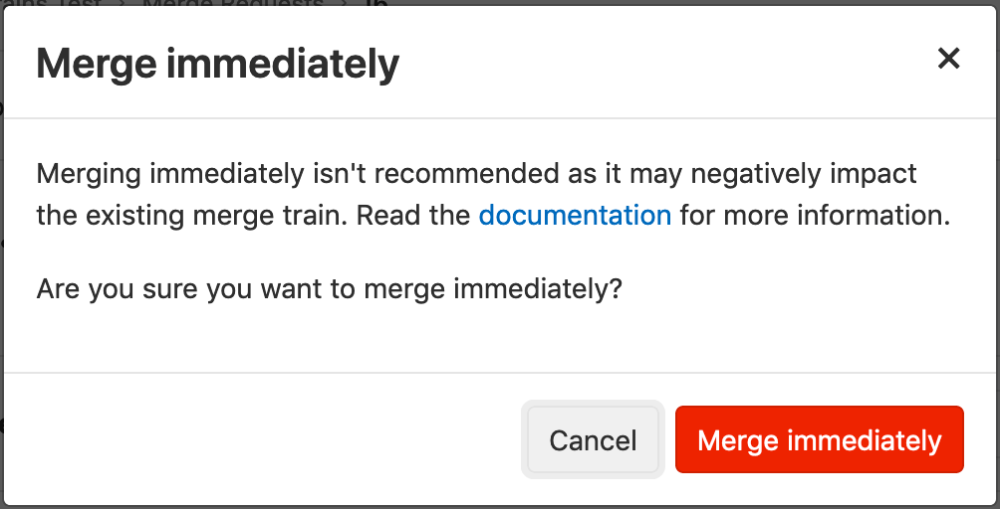

# Merge Trains **(PREMIUM)**

> - [Introduced](https://gitlab.com/gitlab-org/gitlab/issues/9186) in [GitLab Premium](https://about.gitlab.com/pricing/) 12.0.
> - [Squash and merge](../../../../user/project/merge_requests/squash_and_merge.md) support [introduced](https://gitlab.com/gitlab-org/gitlab/issues/13001) in [GitLab Premium](https://about.gitlab.com/pricing/) 12.6.

When [pipelines for merged results](../index.md#pipelines-for-merged-results-premium) are
enabled, the pipeline jobs run as if the changes from your source branch have already
been merged into the target branch.

However, the target branch may be changing rapidly. When you're ready to merge,
if you haven't run the pipeline in a while, the target branch may have already changed.
Merging now could introduce breaking changes.

*Merge trains* can prevent this from happening. A merge train is a queued list of merge
requests, each waiting to be merged into the target branch.

Each merge request on the train runs the merged results pipeline immediately before its
changes are merged into the target branch. If the pipeline fails, the breaking changes are
not merged, and the target branch is unaffected.

Many merge requests can be added to the train. Each is trying to merge into the target branch.
Each request runs its own merged results pipeline, which includes the changes from
all of the other merge requests in *front* of it on the train. All the pipelines run
in parallel, to save time.

If the pipeline for the merge request at the front of the train completes successfully,
the changes are merged into the target branch, and the other pipelines will continue to
run.

If one of the pipelines fails, it is removed from the train, and all pipelines behind
it restart, but without the changes that were removed.

Three merge requests (`A`, `B` and `C`) are added to a merge train in order, which
creates three merged results pipelines that run in parallel:

1. The first pipeline runs on the changes from `A` combined with the target branch.
1. The second pipeline runs on the changes from `A` and `B` combined with the target branch.
1. The third pipeline runs on the changes from `A`, `B`, and `C` combined with the target branch.

If the pipeline for `B` fails, it is removed from the train. The pipeline for
`C` restarts with the `A` and `C` changes, but without the `B` changes.

If `A` then completes successfully, it merges into the target branch, and `C` continues
to run. If more merge requests are added to the train, they will now include the `A`
changes that are included in the target branch, and the `C` changes that are from
the merge request already in the train.

Learn more about
[how merge trains keep your master green](https://about.gitlab.com/blog/2020/01/30/all-aboard-merge-trains/).

## Requirements and limitations

Merge trains have the following requirements and limitations:

- GitLab 12.0 and later requires [Redis](https://redis.io/) 3.2 or higher.
- [Pipelines for merged results](../index.md#pipelines-for-merged-results-premium) must be
  **configured properly**.
- Each merge train can run a maximum of **twenty** pipelines in parallel.
  If more than twenty merge requests are added to the merge train, the merge requests
  will be queued until a slot in the merge train is free. There is no limit to the
  number of merge requests that can be queued.

<i class="fa fa-youtube-play youtube" aria-hidden="true"></i>
Watch this video for a demonstration on [how parallel execution
of Merge Trains can prevent commits from breaking the default
branch](https://www.youtube.com/watch?v=D4qCqXgZkHQ).

## How to add a merge request to a merge train

To add a merge request to a merge train:

1. Visit a merge request.
1. Click the **Start/Add to merge train** button.


## How to remove a merge request from a merge train

1. Visit a merge request.
1. Click the **Remove from merge train** button.


## How to view a merge request's current position on the merge train

After a merge request has been added to the merge train, the merge request's
current position will be displayed under the pipeline widget:


## Start/Add to merge train when pipeline succeeds

You can add a merge request to a merge train only when the latest pipeline in the
merge request is finished. While the pipeline is running or pending, you cannot add
the merge request to a train because the current change of the merge request may
be broken thus it could affect the following merge requests.

In this case, you can schedule to add the merge request to a merge train **when the latest
pipeline succeeds** (This pipeline is [Pipelines for merged results](../index.md), not Pipelines for merge train).
You can see the following button instead of the regular **Start/Add to merge train**
button while the latest pipeline is running.


## Immediately merge a merge request with a merge train

In the case where you have a high-priority merge request (for example, a critical patch) to be merged urgently,
you can use **Merge Immediately** option for bypassing the merge train.
This is the fastest option to get the change merged into the target branch.


However, every time you merge a merge request immediately, it could affect the
existing merge train to be reconstructed, specifically, it regenerates expected
merge commits and pipelines. This means, merging immediately essentially wastes
CI resources. Because of these downsides, you will be asked to confirm before
the merge is initiated:



## Troubleshooting

### Merge request dropped from the merge train immediately

If a merge request is not mergeable (for example, it's WIP, there is a merge
conflict, etc), your merge request will be dropped from the merge train automatically.

In these cases, the reason for dropping the merge request is in the **system notes**.

To check the reason:

1. Open the merge request that was dropped from the merge train.
1. Open the **Discussion** tab.
1. Find a system note that includes either:
   - The text **... removed this merge request from the merge train because ...**
   - **... aborted this merge request from the merge train because ...**
   The reason is given in the text after the **because ...** phrase.


### Merge When Pipeline Succeeds cannot be chosen

[Merge When Pipeline Succeeds](../../../../user/project/merge_requests/merge_when_pipeline_succeeds.md)
is unavailable when
[Pipelines for Merged Results is enabled](../index.md#enabling-pipelines-for-merged-results).

Follow [this issue](https://gitlab.com/gitlab-org/gitlab/issues/12267) to
track progress on this issue.

### Merge Train Pipeline cannot be retried

A Merge Train pipeline cannot be retried because the merge request is dropped from the merge train upon failure. For this reason, the retry button does not appear next to the pipeline icon.

In the case of pipeline failure, you should [re-enqueue](#how-to-add-a-merge-request-to-a-merge-train) the merge request to the merge train, which will then initiate a new pipeline.

### Merge Train disturbs your workflow

First of all, please check if [merge immediately](#immediately-merge-a-merge-request-with-a-merge-train)
is available as a workaround in your workflow. This is the most recommended
workaround you'd be able to take immediately. If it's not available or acceptable,
please read through this section.

Merge train is enabled by default when you enable [Pipelines for merged results](../index.md),
however, you can disable this feature by setting the `:disable_merge_trains` feature flag to `enable`.
When you disable this feature, all existing merge trains are aborted and
the **Start/Add Merge Train** button no longer appears in merge requests.

To check if the feature flag is enabled on your GitLab instance,
please ask an administrator to execute the following commands **(CORE ONLY)**:

```shell
> sudo gitlab-rails console                         # Login to Rails console of GitLab instance.
> Feature.enabled?(:disable_merge_trains)           # Check if it's disabled or not.
> Feature.enable(:disable_merge_trains)             # Disable Merge Trains.
```
