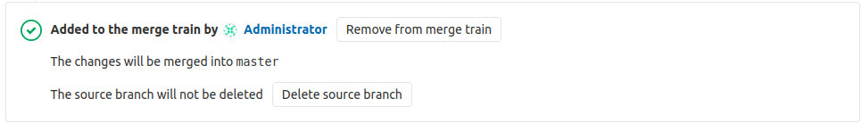
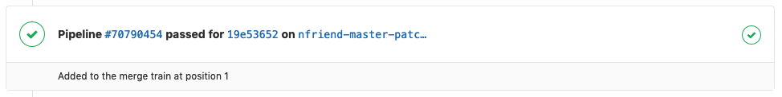
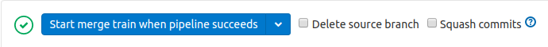

# Merge Trains **(PREMIUM)**

> [Introduced](https://gitlab.com/gitlab-org/gitlab-ee/issues/9186) in [GitLab Premium](https://about.gitlab.com/pricing/) 12.0.

[Pipelines for merged results](../index.md#pipelines-for-merged-results-premium) introduces
running a build on the result of the merged code prior to merging, as a way to keep master green.

There's a scenario, however, for teams with a high number of changes in the target branch (typically master) where in many or even all cases,
by the time the merged code is validated another commit has made it to master, invalidating the merged result.
You'd need some kind of queuing, cancellation or retry mechanism for these scenarios
in order to ensure an orderly flow of changes into the target branch.

Each MR that joins a merge train joins as the last item in the train,
just as it works in the current state. However, instead of queuing and waiting,
each item takes the completed state of the previous (pending) merge ref, adds its own changes,
and starts the pipeline immediately in parallel under the assumption that everything is going to pass.

In this way, if all the pipelines in the train merge successfully, no pipeline time is wasted either queuing or retrying.
If the button is subsequently pressed in a different MR, instead of creating a new pipeline for the target branch,
it creates a new pipeline targeting the merge result of the previous MR plus the target branch.
Pipelines invalidated through failures are immediately canceled and requeued.

## Requirements and limitations

Merge trains have the following requirements and limitations:

- This feature requires that
  [pipelines for merged results](../index.md#pipelines-for-merged-results-premium) are
  **configured properly**.
- Each merge train can run a maximum of **four** pipelines in parallel.
  If more than four merge requests are added to the merge train, the merge requests
  will be queued until a slot in the merge train is free. There is no limit to the
  number of merge requests that can be queued.
- This feature does not support [squash and merge](../../../../user/project/merge_requests/squash_and_merge.md).

<i class="fa fa-youtube-play youtube" aria-hidden="true"></i>
Watch this video for a demonstration on [how parallel execution
of Merge Trains can prevent commits from breaking the default
branch](https://www.youtube.com/watch?v=D4qCqXgZkHQ).

## How to add a merge request to a merge train

To add a merge request to a merge train:

1. Visit a merge request.
1. Click the **Start/Add to merge train** button.

## How to remove a merge request from a merge train

1. Visit a merge request.
1. Click the **Remove from merge train** button.

## How to view a merge request's current position on the merge train

After a merge request has been added to the merge train, the merge request's
current position will be displayed under the pipeline widget:

## Start/Add to merge train when pipeline succeeds

You can add a merge request to a merge train only when the latest pipeline in the
merge request finished. While the pipeline is running or pending, you cannot add
the merge request to a train because the current change of the merge request may
be broken thus it could affect the following merge requests.

In this case, you can schedule to add the merge request to a merge train **when the latest
pipeline succeeds** (This pipeline is [Pipelines for merged results](../index.md), not Pipelines for merge train).
You can see the following button instead of the regular **Start/Add to merge train**
button while the latest pipeline is running.

<!-- ## Troubleshooting

Include any troubleshooting steps that you can foresee. If you know beforehand what issues
one might have when setting this up, or when something is changed, or on upgrading, it's
important to describe those, too. Think of things that may go wrong and include them here.
This is important to minimize requests for support, and to avoid doc comments with
questions that you know someone might ask.

Each scenario can be a third-level heading, e.g. `### Getting error message X`.
If you have none to add when creating a doc, leave this section in place
but commented out to help encourage others to add to it in the future. -->
