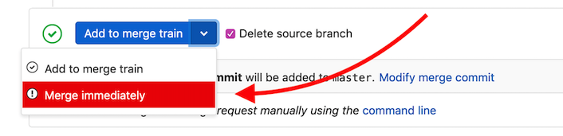
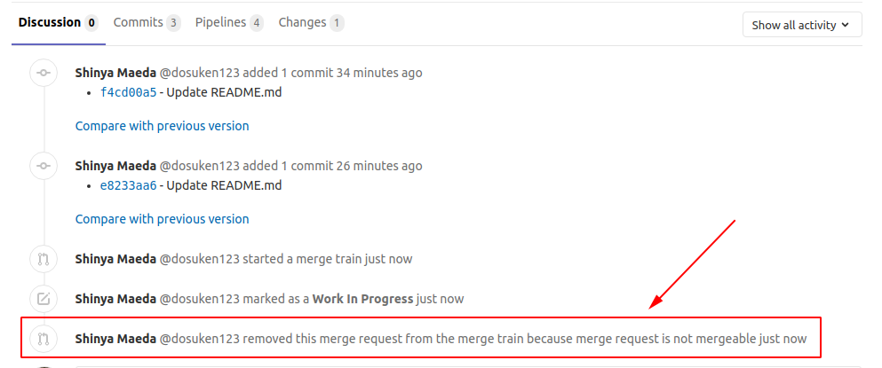

# Merge Trains **(PREMIUM)**

> - [Introduced](https://gitlab.com/gitlab-org/gitlab/issues/9186) in [GitLab Premium](https://about.gitlab.com/pricing/) 12.0.
> - [Squash and merge](../../../../user/project/merge_requests/squash_and_merge.md) support [introduced](https://gitlab.com/gitlab-org/gitlab/issues/13001) in [GitLab Premium](https://about.gitlab.com/pricing/) 12.6.

When [pipelines for merged results](../index.md#pipelines-for-merged-results-premium) are
enabled, the pipeline jobs run as if the changes from your source branch have already
been merged into the target branch.

However, the target branch may be changing rapidly. When you're ready to merge,
if you haven't run the pipeline in a while, the target branch may have already changed.
Merging now could introduce breaking changes.

*Merge trains* can prevent this from happening. A merge train is a queued list of merge
requests, each waiting to be merged into the target branch.

Many merge requests can be added to the train. Each merge request runs its own merged results pipeline,
which includes the changes from all of the other merge requests in *front* of it on the train.
All the pipelines run in parallel, to save time.

If the pipeline for a merge request fails, the breaking changes are not merged, and the target
branch is unaffected. The merge request is removed from the train, and all pipelines behind it restart.

If the pipeline for the merge request at the front of the train completes successfully,
the changes are merged into the target branch, and the other pipelines continue to
run.

## Merge train example

Three merge requests (`A`, `B` and `C`) are added to a merge train in order, which
creates three merged results pipelines that run in parallel:

1. The first pipeline runs on the changes from `A` combined with the target branch.
1. The second pipeline runs on the changes from `A` and `B` combined with the target branch.
1. The third pipeline runs on the changes from `A`, `B`, and `C` combined with the target branch.

If the pipeline for `B` fails, it is removed from the train. The pipeline for
`C` restarts with the `A` and `C` changes, but without the `B` changes.

If `A` then completes successfully, it merges into the target branch, and `C` continues
to run. If more merge requests are added to the train, they will now include the `A`
changes that are included in the target branch, and the `C` changes that are from
the merge request already in the train.

Read more about
[how merge trains keep your master green](https://about.gitlab.com/blog/2020/01/30/all-aboard-merge-trains/).

<i class="fa fa-youtube-play youtube" aria-hidden="true"></i>
Watch this video for a demonstration on [how parallel execution
of Merge Trains can prevent commits from breaking the default
branch](https://www.youtube.com/watch?v=D4qCqXgZkHQ).

## Requirements and limitations

Merge trains have the following requirements and limitations:

- Merge trains require [GitLab Runner](https://gitlab.com/gitlab-org/gitlab-runner) 11.9 or newer.
- GitLab 12.0 and later requires [Redis](https://redis.io/) 3.2 or higher.
- Each merge train can run a maximum of **twenty** pipelines in parallel.
  If more than twenty merge requests are added to the merge train, the merge requests
  will be queued until a slot in the merge train is free. There is no limit to the
  number of merge requests that can be queued.

## Enable merge trains

To enable merge trains for your project:

1. If you are on a self-managed GitLab instance, ensure the [feature flag](#merge-trains-feature-flag-premium-only) is set correctly.
1. [Configure your CI/CD configuration file](../../index.md#configuring-pipelines-for-merge-requests)
   so that the pipeline or individual jobs run for merge requests.
1. Visit your project's **Settings > General** and expand **Merge requests**.
1. Check **Merge pipelines will try to validate the post-merge result prior to merging**.
1. Click **Save changes**.

CAUTION: **Caution:**
If you select the check box but don't configure your CI/CD to use
pipelines for merge requests, your merge requests may become stuck in an
unresolved state or your pipelines may be dropped.

## Start a merge train

To start a merge train:

1. Visit a merge request.
1. Click the **Start merge train** button.


Other merge requests can now be added to the train.

## Add a merge request to a merge train

To add a merge request to a merge train:

1. Visit a merge request.
1. Click the **Add to merge train** button.

If pipelines are already running for the merge request, you cannot add the merge request
to the train. Instead, you can schedule to add the merge request to a merge train **when the latest
pipeline succeeds**.


## Remove a merge request from a merge train

1. Visit a merge request.
1. Click the **Remove from merge train** button.


If you want to add the merge request to a merge train again later, you can.

## View a merge request's current position on the merge train

After a merge request has been added to the merge train, the merge request's
current position is displayed under the pipeline widget:


## Immediately merge a merge request with a merge train

If you have a high-priority merge request (for example, a critical patch) that must
be merged urgently, you can bypass the merge train by using the **Merge Immediately** option.
This is the fastest option to get the change merged into the target branch.



CAUTION: **Caution:**
Each time you merge a merge request immediately, the current merge train
is recreated and all pipelines restart.

## Troubleshooting

### Merge request dropped from the merge train immediately

If a merge request is not mergeable (for example, it's WIP, there is a merge
conflict, etc.), your merge request will be dropped from the merge train automatically.

In these cases, the reason for dropping the merge request is in the **system notes**.

To check the reason:

1. Open the merge request that was dropped from the merge train.
1. Open the **Discussion** tab.
1. Find a system note that includes either:
   - The text **... removed this merge request from the merge train because ...**
   - **... aborted this merge request from the merge train because ...**
   The reason is given in the text after the **because ...** phrase.



### Merge When Pipeline Succeeds cannot be chosen

[Merge When Pipeline Succeeds](../../../../user/project/merge_requests/merge_when_pipeline_succeeds.md)
is currently unavailable when Merge Trains are enabled.

See [the related issue](https://gitlab.com/gitlab-org/gitlab/issues/12267)
for more information.

### Merge Train Pipeline cannot be retried

A Merge Train pipeline cannot be retried because the merge request is dropped from the merge train upon failure. For this reason, the retry button does not appear next to the pipeline icon.

In the case of pipeline failure, you should [re-enqueue](#add-a-merge-request-to-a-merge-train) the merge request to the merge train, which will then initiate a new pipeline.

### Merge Trains feature flag **(PREMIUM ONLY)**

To enable and disable the Merge Trains feature, use the `:disable_merge_trains` feature flag.

To check if the feature flag is enabled on your GitLab instance,
ask an administrator to execute the following commands:

```shell
> sudo gitlab-rails console                         # Login to Rails console of GitLab instance.
> Feature.enabled?(:disable_merge_trains)           # Check if it's disabled or not.
> Feature.enable(:disable_merge_trains)             # Disable Merge Trains.
> Feature.disable(:disable_merge_trains)            # Enable Merge Trains.
```

When you disable this feature, all existing merge trains are cancelled and
the **Start/Add to Merge Train** button no longer appears in merge requests.
