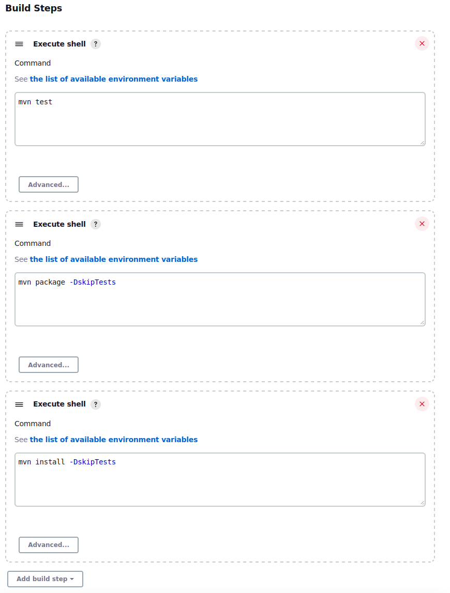
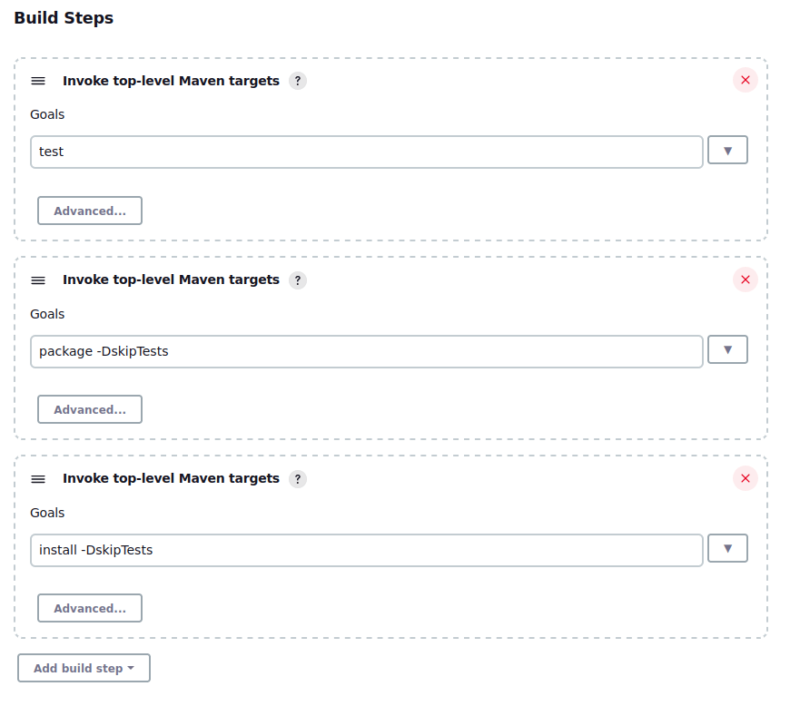

# Migrating a Maven build from Jenkins to GitLab CI

If you have a Maven build in Jenkins, you can use a [Java Spring](https://gitlab.com/gitlab-org/project-templates/spring)
project template to migrate to GitLab. The template uses Maven for its underlying dependency management.

## Jenkins job options

We are going to use three different options in Jenkins to test, build, and install the project:

- Freestyle with shell execution
- Freestyle with the Maven task plugin
- A declarative pipeline using a Jenkinsfile

All three of these options execute the same three commands:

- `mvn test`: Run any tests found in the codebase
- `mvn package -DskipTests`: Compile the code into an executable type defined in the POM and skip running any tests since we did that already
- `mvn install -DskipTests`: Install the compiled executable into the local maven `.m2` repository and skip running any tests

We are using a single, persistent Jenkins agent to handle running these three methods, which requires Maven to be pre-installed on the agent.
This method of execution is similar to a GitLab Shell runner.

### Freestyle with shell execution

This example utilizes Jenkins' built-in shell execution option so we can directly call `mvn` commands from the shell on the agent.



### Freestyle with Maven task plugin

This example utilizes the Maven plugin in Jenkins to declare and execute any specific goals in the [Maven build lifecycle](https://maven.apache.org/guides/introduction/introduction-to-the-lifecycle.html)

NOTE:
This plugin does not install Maven on the Jenkins agent, but rather provides a script wrapper around calling Maven commands. Maven must be installed before you use this method.



### Using a declarative pipeline

Finally, we can run these Maven commands through a declarative pipeline stored either in the Jenkins pipeline configuration or directly in the Git repository. By default, this file is named `Jenksinfile`.

This example uses shell execution commands instead of plugins.

```groovy
    pipeline {
        agent any
        stages {
            stage('Test') {
                steps {
                    sh "mvn test"
                }
            }
            stage('Build') {
                steps {
                    sh "mvn package -DskipTests"
                }
            }
            stage('Install') {
                steps {
                    sh "mvn install -DskipTests"
                }
            }
        }
    }
```

## Converting to GitLab CI

Now that we have seen a few examples in Jenkins, let's refactor this process into GitLab CI.

Prerequisites:

- An available runner in GitLab
- Docker installed on the runner
- The runner is registered for this project and is using the Docker executor

Instead of using a persistent machine for handling this build process, we are going to rely on an ephemeral Docker container to handle this execution. 
This removes the need for maintaining a virtual machine and the Maven version installed on the virtual machine and allows us some more flexiblity with expanding and extending the functionality of our CI pipeline.

Here is the final `.gitlab-ci.yml` file:

```yaml
image: maven:3.6.3-openjdk-11

stages:
  - test
  - build
  - install

default:
  cache:
    key: $CI_COMMIT_REF_SLUG
    paths:
      - .m2/

variables:
  MAVEN_OPTS: >-
    -Dhttps.protocols=TLSv1.2
    -Dmaven.repo.local=$CI_PROJECT_DIR/.m2/repository
  MAVEN_CLI_OPTS: >-
    -DskipTests

test code:
  stage: test
  script:
    - mvn test

build JAR:
  stage: build
  script:
    - mvn $MAVEN_CLI_OPTS package

install JAR:
  stage: install
  script:
    - mvn $MAVEN_CLI_OPTS install
```

Let's break down the sections of this YAML file:

- **Image**: The base Docker image where we execute all of our commands. In this case, it's an official Maven Docker image with everything we need already installed.
- **Stages**: Similar to the Jenkinsfile, we are defining three stages that run in order. Test jobs execute first, followed by build jobs, and finally install jobs.
- **Default**: Global default settings for the pipeline.
  - **Cache**: Any data to be cached and reused between jobs.
    - **Key**: The unique identifier for the specific cache archive. In this case, it's a shortened version of the Git commit ref.
    - **Paths**: Any specific directories or files to include in the cache. In this case, we are caching the `.m2/` directory to avoid re-installing dependencies between jobs.
- **Variables**: We are setting a few environment variables to be used by each job.
  - `MAVEN_OPTS`: These are Maven environment variables referenced whenever Maven is executed.
    - `-Dhttps.protocols=TLSv1.2` sets our TLS protocol to version 1.2 for any HTTP requests we may make in the pipeline.
    - `-Dmaven.repo.local=$CI_PROJECT_DIR/.m2/repository` sets the location of our local Maven repository to the GitLab project directory on the runner. This is to make sure we can access and modify the repository.
  - `MAVEN_CLI_OPTS`: These are specific arguments to be injected into `mvn` commands.
    - `-DskipTests` skips the 'test' stage in the Maven build lifecycle.

- **Test code**, **Build JAR**, and **Install JAR**: These are the jobs to run in the pipeline. The top line of each section is a user-defined name for the job that shows up in the pipeline. The stage clause defines which stage the job runs in. (A pipeline contains one to many stages and a stage contains one to many jobs). The script section covers commands to run in that job. In this case, each job runs a single command.
