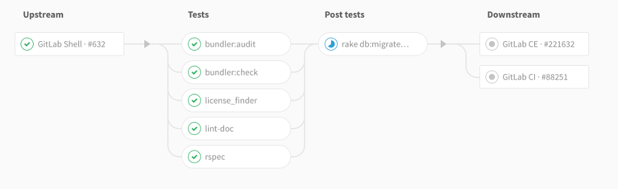

# Multi-Project Pipeline Graphs

> [Introduced](https://gitlab.com/gitlab-org/gitlab-ee/issues/2121) in [GitLab Enterprise Edition Premium 9.3](https://about.gitlab.com/2017/06/22/gitlab-9-3-released/#multi-project-pipeline-graphs).

## Overview

When you set up [GitLab CI/CD](README.md) accross multiple projects, you can visualize
the entire pipeline, including all multi-project stages.

## Use cases

Let's assume you deploy your web app from different projects in GitLab:

- One for the free version, which has its own pipeline that builds and tests your app
- One for the paid version adds-ons, which also pass through builds and tests
- One for the documentation, which also builds, tests, and deploys with an SSG

With Multi-Project Pipeline Graphs, you can visualize the entire pipeline in a
beautiful and clear chart, including all stages of builds and tests for the three projects.

## How it works

Using the [`CI_JOB_TOKEN` when triggering pipelines](triggers/README.md#ci-job-token), GitLab
recognizes the source of the job token, and thus internally ties these pipelines
together which makes it easy to start visualizing their relationships.

Those relationships are displayed in the pipeline graph by showing inbound and
outbound connections for upstream and downstream pipeline dependencies.

This is useful for larger projects, especially those adopting a micro-services
architecture, that often have a set of interdependent components which form the
complete product.
