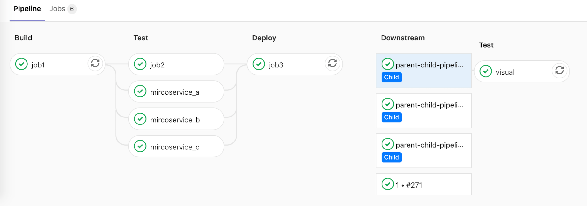

# Parent-child pipelines

> [Introduced](https://gitlab.com/gitlab-org/gitlab/issues/16094) in GitLab Starter 12.7.

As pipelines grow more complex, a few related problems start to emerge:

- The staged structure, where all steps in a stage must be completed before the first
  job in next stage begins, causes arbitrary waits, slowing things down.
- Configuration for the single global pipeline becomes very long and complicated,
  making it hard to manage.
- Imports with [`include`](yaml/README.md#include) increase the complexity of the configuration, and create the potential
  for namespace collisions where jobs are unintentionally duplicated.
- Pipeline UX can become unwieldy with so many jobs and stages to work with.

Additionally, sometimes the behavior of a pipeline needs to be more dynamic. The ability
to choose to start sub-pipelines (or not) is a powerful ability, especially if the
YAML is dynamically generated.



Similarly to [multi-project pipelines](multi_project_pipelines.md), a pipeline can trigger a
set of concurrently running child pipelines, but within the same project:

- Child pipelines still execute each of their jobs according to a stage sequence, but
  would be free to continue forward through their stages without waiting for unrelated
  jobs in the parent pipeline to finish.
- The configuration is split up into smaller child pipeline configurations, which are
  easier to understand. This reduces the cognitive load to understand the overall configuration.
- Imports are done at the child pipeline level, reducing the likelihood of collisions.
- Each pipeline has only the steps relevant steps, making it easier to understand what's going on.

Child pipelines work well with other GitLab CI features:

- Use [`only: changes`](yaml/README.md#onlychangesexceptchanges) to trigger pipelines only when
  certain files change. This is useful for monorepos, for example.
- Since the parent pipeline in `.gitlab-ci.yml` and the child pipeline run as normal
  pipelines, they can have their own behaviors and sequencing in relation to triggers.

All of this will work with [`include:`](yaml/README.md#include) feature so you can compose
the child pipeline configuration.

## Examples

The simplest case is [triggering a child pipeline](yaml/README.md#trigger-premium) using a
local YAML file to define the pipeline configuration. In this case, the parent pipeline will
trigger the child pipeline, and continue without waiting:

```yaml
microservice_a:
  trigger:
    include: path/to/microservice_a.yml
```

You can include multiple files when composing a child pipeline:

```yaml
microservice_a:
  trigger:
    include:
      - local: path/to/microservice_a.yml
      - template: SAST.gitlab-ci.yml
```

NOTE: **Note:**
The max number of entries that are accepted for `trigger:include:` is three.

Similar to [multi-project pipelines](multi_project_pipelines.md#mirroring-status-from-triggered-pipeline),
we can set the parent pipeline to depend on the status of the child pipeline upon completion:

```yaml
microservice_a:
  trigger:
    include:
      - local: path/to/microservice_a.yml
      - template: SAST.gitlab-ci.yml
    strategy: depend
```

## Limitations

A parent pipeline can trigger many child pipelines, but a child pipeline cannot trigger
further child pipelines. See the [related issue](https://gitlab.com/gitlab-org/gitlab/issues/29651) for discussion on possible future improvements.
