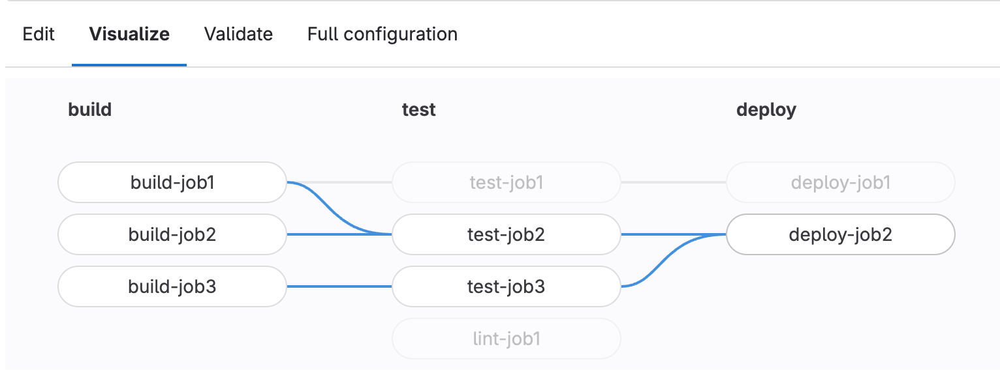
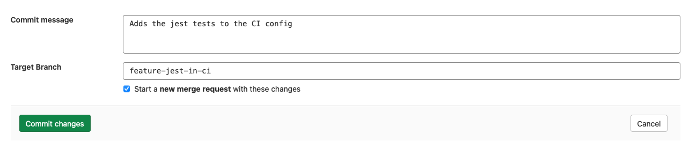

DETAILS:
**Tier:** Free, Premium, Ultimate
**Offering:** GitLab.com, GitLab Self-Managed, GitLab Dedicated

The pipeline editor is the primary place to edit the GitLab CI/CD configuration in
the `.gitlab-ci.yml` file in the root of your repository. To access the editor, go to **Build > Pipeline editor**.

From the pipeline editor page you can:

- Select the branch to work from.
- [Validate](#validate-ci-configuration) your configuration syntax while editing the file.
- Do a deeper [lint](#lint-ci-configuration) of your configuration, that verifies it with any configuration
  added with the [`include`](../yaml/_index.md#include) keyword.
- View a [list of the CI/CD configuration added with the `include` keyword](#view-included-cicd-configuration).
- See a [visualization](#visualize-ci-configuration) of the current configuration.
- View the [full configuration](#view-full-configuration), which displays the configuration with any configuration from `include` added.
- [Commit](#commit-changes-to-ci-configuration) the changes to a specific branch.

## Validate CI configuration

As you edit your pipeline configuration, it is continually validated against the GitLab CI/CD
pipeline schema. It checks the syntax of your CI YAML configuration, and also runs
some basic logical validations.

The result of this validation is shown at the top of the editor page. If the validation fails,
this section displays a tip to help you fix the problem:

## Lint CI configuration

NOTE:
The **Lint** tab is replaced with the **Validate** tab in GitLab 15.3. The lint results are included
in a successful [pipeline simulation](#simulate-a-cicd-pipeline).

To test the validity of your GitLab CI/CD configuration before committing the changes,
you can use the CI lint tool:

1. On the left sidebar, select **Search or go to** and find your project.
1. Select **Build > Pipeline editor**.
1. Select the **Validate** tab.

This tool checks for syntax and logical errors but goes into more detail than the
automatic [validation](#validate-ci-configuration) in the editor.

The results are updated in real-time. Any changes you make to the configuration are
reflected in the CI lint. It displays the same results as the existing [CI Lint tool](../yaml/lint.md).

## Simulate a CI/CD pipeline

> - [Introduced](https://gitlab.com/gitlab-org/gitlab/-/issues/337282) in GitLab 15.3.

To look for pipeline syntax and logic issues, you can simulate the creation of a
GitLab CI/CD pipeline in the **Validate** tab. A pipeline simulation can help find
problems such as incorrect `rules` and `needs` job dependencies, and is similar to
simulations in the [CI Lint tool](../yaml/lint.md#simulate-a-pipeline).

## View included CI/CD configuration

> - [Introduced](https://gitlab.com/groups/gitlab-org/-/epics/7064) in GitLab 15.0 [with a flag](../../administration/feature_flags.md) named `pipeline_editor_file_tree`. Disabled by default.
> - [Feature flag removed](https://gitlab.com/gitlab-org/gitlab/-/issues/357219) in GitLab 15.1.

You can review configuration added with the [`include`](../yaml/_index.md#include)
keyword in the pipeline editor. In the upper-right corner, select the file tree (**{file-tree}**)
to see a list of all included configuration files. Selected files open in a new tab
for review.

## Visualize CI configuration

To view a visualization of your `.gitlab-ci.yml` configuration, in your project,
go to **Build > Pipeline editor**, and then select the **Visualize** tab. The
visualization shows all stages and jobs. Any [`needs`](../yaml/_index.md#needs)
relationships are displayed as lines connecting jobs together, showing the
hierarchy of execution.

Hover over a job to highlight its `needs` relationships:



If the configuration does not have any `needs` relationships, then no lines are drawn because
each job depends only on the previous stage being completed successfully.

## View full configuration

> - **View merged YAML** tab [renamed to **Full configuration**](https://gitlab.com/gitlab-org/gitlab/-/issues/377404) in GitLab 16.0.

To view the fully expanded CI/CD configuration as one combined file, go to the
pipeline editor's **Full configuration** tab. This tab displays an expanded configuration
where:

- Configuration imported with [`include`](../yaml/_index.md#include) is copied into the view.
- Jobs that use [`extends`](../yaml/_index.md#extends) display with the
  [extended configuration merged into the job](../yaml/yaml_optimization.md#merge-details).
- [YAML anchors](../yaml/yaml_optimization.md#anchors) are replaced with the linked configuration.
- [YAML `!reference` tags](../yaml/yaml_optimization.md#reference-tags) are also replaced
  with the linked configuration.

Using `!reference` tags can cause nested configuration that display with
multiple hyphens (`-`) at the start of the line in the expanded view. This behavior is expected, and the extra
hyphens do not affect the job's execution. For example, this configuration and
fully expanded version are both valid:

- `.gitlab-ci.yml` file:

  ```yaml
  .python-req:
    script:
      - pip install pyflakes

  .rule-01:
    rules:
      - if: $CI_MERGE_REQUEST_SOURCE_BRANCH_NAME =~ /^feature/
        when: manual
        allow_failure: true
      - if: $CI_MERGE_REQUEST_SOURCE_BRANCH_NAME

  .rule-02:
    rules:
      - if: $CI_COMMIT_BRANCH == "main"
        when: manual
        allow_failure: true

  lint-python:
    image: python:latest
    script:
      - !reference [.python-req, script]
      - pyflakes python/
    rules:
      - !reference [.rule-01, rules]
      - !reference [.rule-02, rules]
  ```

- Expanded configuration in **Full configuration** tab:

  ```yaml
  ".python-req":
    script:
    - pip install pyflakes
  ".rule-01":
    rules:
    - if: "$CI_MERGE_REQUEST_SOURCE_BRANCH_NAME =~ /^feature/"
      when: manual
      allow_failure: true
    - if: "$CI_MERGE_REQUEST_SOURCE_BRANCH_NAME"
  ".rule-02":
    rules:
    - if: $CI_COMMIT_BRANCH == "main"
      when: manual
      allow_failure: true
  lint-python:
    image: python:latest
    script:
    - - pip install pyflakes                                     # <- The extra hyphens do not affect the job's execution.
    - pyflakes python/
    rules:
    - - if: "$CI_MERGE_REQUEST_SOURCE_BRANCH_NAME =~ /^feature/" # <- The extra hyphens do not affect the job's execution.
        when: manual
        allow_failure: true
      - if: "$CI_MERGE_REQUEST_SOURCE_BRANCH_NAME"               # <- No extra hyphen but aligned with previous rule
    - - if: $CI_COMMIT_BRANCH == "main"                          # <- The extra hyphens do not affect the job's execution.
        when: manual
        allow_failure: true
  ```

## Commit changes to CI configuration

The commit form appears at the bottom of each tab in the editor so you can commit
your changes at any time.

When you are satisfied with your changes, add a descriptive commit message and enter
a branch. The branch field defaults to your project's default branch.

If you enter a new branch name, the **Start a new merge request with these changes**
checkbox appears. Select it to start a new merge request after you commit the changes.



## Troubleshooting

### `Configuration validation currently not available` message

This message is caused by a problem validating the syntax in the pipeline editor.
It can happen when:

- GitLab is unable to communicate with the service that validates the syntax, so the
  information in these sections may not display properly:

  - The syntax status on the **Edit** tab (valid or invalid).
  - The **Visualize** tab.
  - The **Lint** tab.
  - The **Full configuration** tab.

  You can still work on your CI/CD configuration and commit the changes you made without
  any issues. As soon as the service becomes available again, the syntax validation
  should display immediately.

- Using [`include`](../yaml/_index.md#include), but the included configuration files create a loop.
  For example, `.gitlab-ci.yml` includes `file1.yml`, which includes `file2.yml`,
  which includes `file1.yml`, creating a loop between `file1.yml` and `file2.yml`.

  Remove one of the `include` lines to eliminate the loop and resolve the issue.
