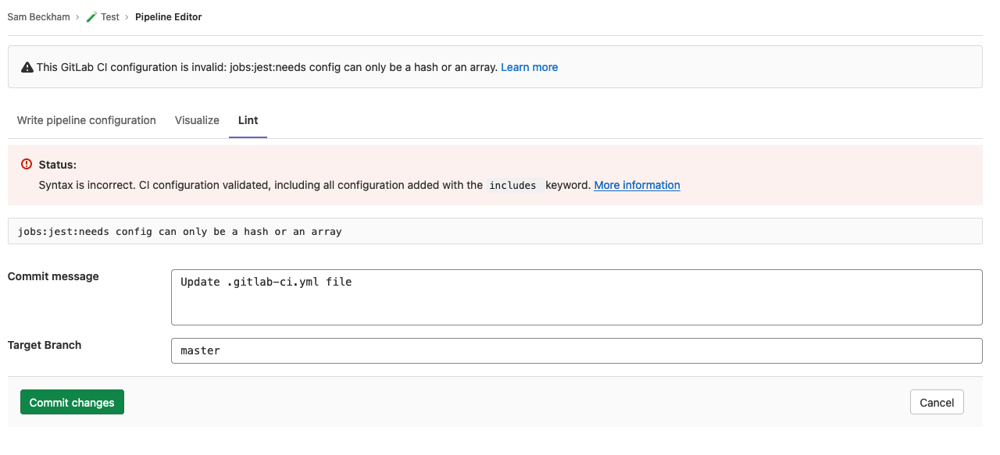
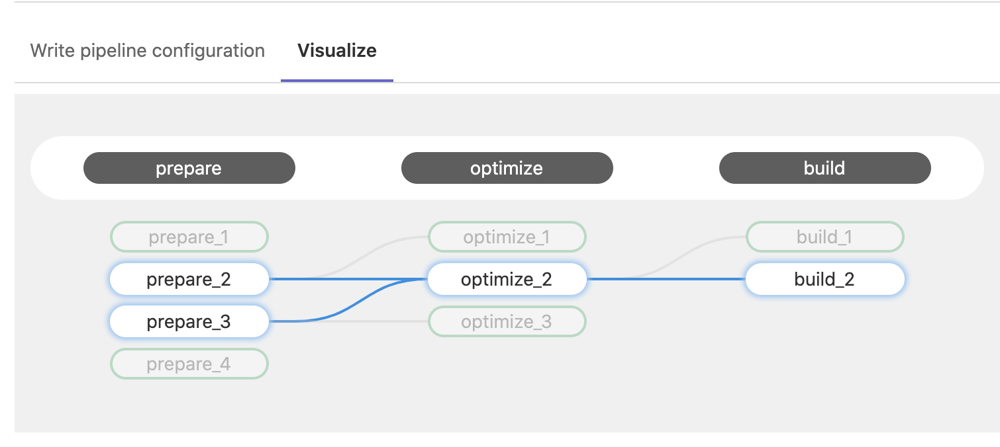

# Pipeline Editor **(FREE)**

> - [Introduced](https://gitlab.com/groups/gitlab-org/-/epics/4540) in GitLab 13.8.
> - It's [deployed behind a feature flag](../../user/feature_flags.md), enabled by default.
> - It's enabled on GitLab.com.
> - It's recommended for production use.
> - To use it in GitLab self-managed instances, ask a GitLab administrator to [enable it](#enable-or-disable-pipeline-editor). **(FREE SELF)**

WARNING:
This feature might not be available to you. Check the **version history** note above for details.

The pipeline editor is the primary place to edit the GitLab CI/CD configuration in
your `.gitlab-ci.yml` file. To access it, go to **CI/CD > Editor**.

From the pipeline editor page you can:

- [Validate](#validate-ci-configuration) your configuration syntax while editing the file.
- Do a deeper [lint](#lint-ci-configuration) of your configuration, that verifies it with any configuration
  added with the [`include`](../yaml/README.md#include) keyword.
- See a [visualization](#visualize-ci-configuration) of the current configuration.
- [Commit](#commit-changes-to-ci-configuration) the changes to a specific branch.

NOTE:
You must have already [created a CI/CD configuration file](../quick_start/README.md#create-a-gitlab-ciyml-file)
to use the editor.

## Validate CI configuration

As you edit your pipeline configuration, it is continually validated against the GitLab CI/CD
pipeline schema. It checks the syntax of your CI YAML configuration, and also runs
some basic logical validations.

The result of this validation is shown at the top of the editor page. If your configuration
is invalid, a tip is shown to help you fix the problem:


## Lint CI configuration

To test the validity of your GitLab CI/CD configuration before committing the changes,
you can use the CI lint tool. To access it, go to **CI/CD > Editor** and select the **Lint** tab.

This tool checks for syntax and logical errors but goes into more detail than the
automatic [validation](#validate-ci-configuration) in the editor.

The results are updated in real-time. Any changes you make to the configuration are
reflected in the CI lint. It displays the same results as the existing [CI Lint tool](../lint.md).



## Visualize CI configuration

> - [Introduced](https://gitlab.com/gitlab-org/gitlab/-/issues/241722) in GitLab 13.5.
> - [Moved to **CI/CD > Editor**](https://gitlab.com/gitlab-org/gitlab/-/issues/263141) in GitLab 13.7.
> - It was [deployed behind a feature flag](../../user/feature_flags.md), disabled by default.
> - [Became enabled by default](https://gitlab.com/gitlab-org/gitlab/-/issues/290117) in GitLab 13.8.
> - It's enabled on GitLab.com.
> - It's recommended for production use.
> - To use it in GitLab self-managed instances, ask a GitLab administrator to [enable it](#enable-or-disable-cicd-configuration-visualization). **(FREE SELF)**

WARNING:
This feature might not be available to you. Check the **version history** note above for details.

To see a visualization of your `gitlab-ci.yml` configuration, navigate to **CI/CD > Editor**
and select the `visualization` tab. The visualization shows all stages and jobs.
[`needs`](../yaml/README.md#needs) relationships are displayed as lines connecting jobs together, showing the hierarchy of execution:


Hovering on a job highlights its `needs` relationships:



If the configuration does not have any `needs` relationships, then no lines are drawn because
each job depends only on the previous stage being completed successfully.

### Enable or disable CI/CD configuration visualization **(FREE SELF)**

CI/CD configuration visualization is under development but ready for production use.
It is deployed behind a feature flag that is **enabled by default**.
[GitLab administrators with access to the GitLab Rails console](../../administration/feature_flags.md)
can opt to disable it.

To disable it:

```ruby
Feature.disable(:ci_config_visualization_tab)
```

To enable it:

```ruby
Feature.enable(:ci_config_visualization_tab)
```

## Commit changes to CI configuration

The commit form appears at the bottom of each tab in the editor so you can commit
your changes at any time.

When you are satisfied with your changes, add a descriptive commit message and enter
a branch. The branch field defaults to your project's default branch.

If you enter a new branch name, the **Start a new merge request with these changes**
checkbox appears. Select it to start a new merge request after you commit the changes.


## Enable or disable pipeline editor **(FREE SELF)**

The pipeline editor is under development but ready for production use. It is
deployed behind a feature flag that is **enabled by default**.
[GitLab administrators with access to the GitLab Rails console](../../administration/feature_flags.md)
can disable it.

To disable it:

```ruby
Feature.disable(:ci_pipeline_editor_page)
```

To enable it:

```ruby
Feature.enable(:ci_pipeline_editor_page)
```
