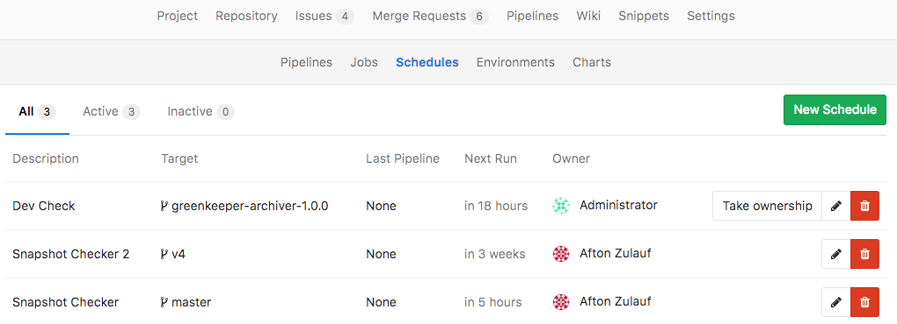

# Pipeline Schedules

> **Note**:
- This feature was introduced in 9.1 as [Trigger Schedule][ce-105533]
- In 9.2, the feature was [renamed to Pipeline Schedule][ce-10853]

Pipeline schedules can be used to run pipelines only once, or for example every
month on the 22nd for a certain branch.

## Using Pipeline Schedules

In order to schedule pipelines, navigate to your their pages **Pipelines ➔ Schedules**
and click the **New Schedule** button.

After entering the form, hit **Save Schedule** for the changes to have effect.
You can check a next execution date of the scheduled trigger, which is automatically calculated by a server.

## Taking ownership

Pipelines are executed as a user, which owns a schedule. This influences what
projects and other resources the pipeline has access to. If a user does not own
a pipeline, you can take ownership by clicking the **Take ownership** button.
The next time a pipeline is scheduled, your credentials will be used.

> **Notes**:
- Those pipelines won't be executed precicely. Because schedules are handled by
Sidekiq, which runs according to its interval. For exmaple, if you set a schedule to
create a pipeline every minute (`* * * * *`) and the Sidekiq worker performs 00:00
and 12:00 o'clock every day (`0 */12 * * *`), only 2 pipelines will be created per day.
To change the Sidekiq worker's frequency, you have to edit the `trigger_schedule_worker_cron`
value in your `gitlab.rb` and restart GitLab. The Sidekiq worker's configuration
on GiLab.com is able to be looked up at [here](https://gitlab.com/gitlab-org/gitlab-ce/blob/master/config/gitlab.yml.example#L185).
- Cron notation is parsed by [Rufus-Scheduler](https://github.com/jmettraux/rufus-scheduler).

[ce-10533]: https://gitlab.com/gitlab-org/gitlab-ce/merge_requests/10533
[ce-10853]: https://gitlab.com/gitlab-org/gitlab-ce/merge_requests/10853
