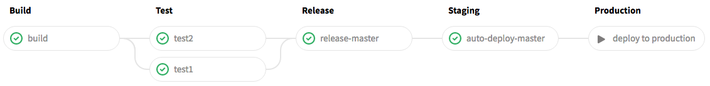
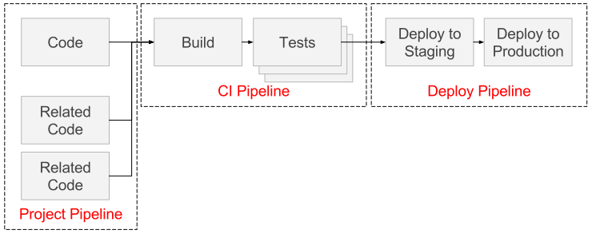
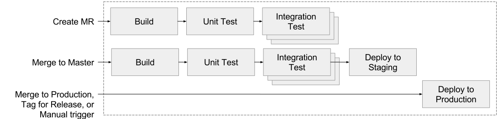
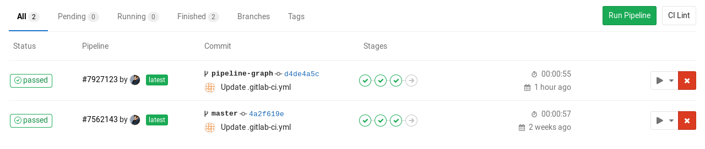
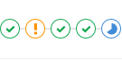
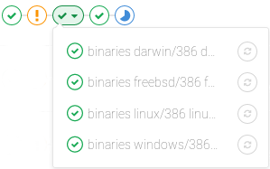
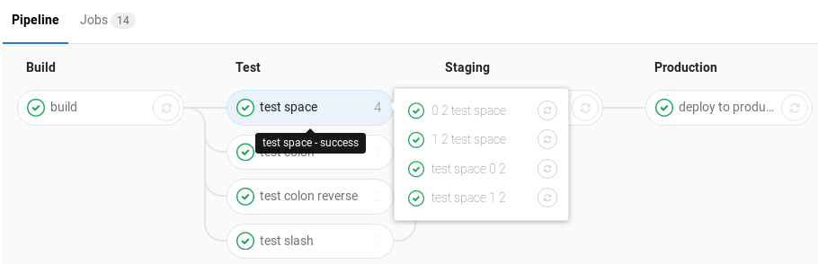

# Introduction to pipelines and jobs

> Introduced in GitLab 8.8.

## Pipelines

A pipeline is a group of [jobs][] that get executed in [stages][](batches).
All of the jobs in a stage are executed in parallel (if there are enough
concurrent [Runners]), and if they all succeed, the pipeline moves on to the
next stage. If one of the jobs fails, the next stage is not (usually)
executed. You can access the pipelines page in your project's **Pipelines** tab.

In the following image you can see that the pipeline consists of four stages
(`build`, `test`, `staging`, `production`) each one having one or more jobs.

>**Note:**
GitLab capitalizes the stages' names when shown in the [pipeline graphs](#pipeline-graphs).



## Types of pipelines

There are three types of pipelines that often use the single shorthand of "pipeline". People often talk about them as if each one is "the" pipeline, but really, they're just pieces of a single, comprehensive pipeline.



1. **CI Pipeline**: Build and test stages defined in `.gitlab-ci.yml`
2. **Deploy Pipeline**: Deploy stage(s) defined in `.gitlab-ci.yml` The flow of deploying code to servers through various stages: e.g. development to staging to production
3. **Project Pipeline**: Cross-project CI dependencies [triggered via API][triggers], particularly for micro-services, but also for complicated build dependencies: e.g. api -> front-end, ce/ee -> omnibus.

## Development workflows

Pipelines accommodate several development workflows:

1. **Branch Flow** (e.g. different branch for dev, qa, staging, production)
2. **Trunk-based Flow** (e.g. feature branches and single master branch, possibly with tags for releases)
3. **Fork-based Flow** (e.g. merge requests come from forks)

Example continuous delivery flow:



## Jobs

Jobs can be defined in the [`.gitlab-ci.yml`][jobs-yaml] file. Not to be
confused with a `build` job or `build` stage.

## Defining pipelines

Pipelines are defined in `.gitlab-ci.yml` by specifying [jobs] that run in
[stages].

See the reference [documentation for jobs](yaml/README.md#jobs).

## Seeing pipeline status

You can find the current and historical pipeline runs under your project's
**Pipelines** tab. Clicking on a pipeline will show the jobs that were run for
that pipeline.



## Seeing job status

When you visit a single pipeline you can see the related jobs for that pipeline.
Clicking on an individual job will show you its job trace, and allow you to
cancel the job, retry it, or erase the job trace.


## Pipeline graphs

> [Introduced][ce-5742] in GitLab 8.11.

Pipelines can be complex structures with many sequential and parallel jobs.
To make it a little easier to see what is going on, you can view a graph
of a single pipeline and its status.

A pipeline graph can be shown in two different ways depending on what page you
are on.

---

The regular pipeline graph that shows the names of the jobs of each stage can
be found when you are on a [single pipeline page](#seeing-pipeline-status).


Then, there is the pipeline mini graph which takes less space and can give you a
quick glance if all jobs pass or something failed. The pipeline mini graph can
be found when you visit:

- the pipelines index page
- a single commit page
- a merge request page

That way, you can see all related jobs for a single commit and the net result
of each stage of your pipeline. This allows you to quickly see what failed and
fix it. Stages in pipeline mini graphs are collapsible. Hover your mouse over
them and click to expand their jobs.

| **Mini graph** | **Mini graph expanded** |
| :------------: | :---------------------: |
|  |  |

### Grouping similar jobs in the pipeline graph

> [Introduced][ce-6242] in GitLab 8.12.

If you have many similar jobs, your pipeline graph becomes very long and hard
to read. For that reason, similar jobs can automatically be grouped together.
If the job names are formatted in certain ways, they will be collapsed into
a single group in regular pipeline graphs (not the mini graphs).
You'll know when a pipeline has grouped jobs if you don't see the retry or
cancel button inside them. Hovering over them will show the number of grouped
jobs. Click to expand them.



The basic requirements is that there are two numbers separated with one of
the following (you can even use them interchangeably):

- a space
- a forward slash (`/`)
- a colon (`:`)
- a dot (`.`)

>**Note:**
More specifically, [it uses][regexp] this regular expression: `\d+[\s:\/\\]+\d+\s*`.

The jobs will be ordered by comparing those two numbers from left to right. You
usually want the first to be the index and the second the total.

For example, the following jobs will be grouped under a job named `test`:

- `test 0 3` => `test`
- `test 1 3` => `test`
- `test 2 3` => `test`

The following jobs will be grouped under a job named `test ruby`:

- `test 1:2 ruby` => `test ruby`
- `test 2:2 ruby` => `test ruby`

The following jobs will be grouped under a job named `test ruby` as well:

- `1/3 test ruby` => `test ruby`
- `2/3 test ruby` => `test ruby`
- `3/3 test ruby` => `test ruby`

### Manual actions from the pipeline graph

> [Introduced][ce-7931] in GitLab 8.15.

[Manual actions][manual] allow you to require manual interaction before moving
forward with a particular job in CI. Your entire pipeline can run automatically,
but the actual [deploy to production][env-manual] will require a click.

You can do this straight from the pipeline graph. Just click on the play button
to execute that particular job. For example, in the image below, the `production`
stage has a job with a manual action.


### Ordering of jobs in pipeline graphs

**Regular pipeline graph**

In the single pipeline page, jobs are sorted by name.

**Mini pipeline graph**

> [Introduced][ce-9760] in GitLab 9.0.

In the pipeline mini graphs, the jobs are sorted first by severity and then
by name. The order of severity is:

- failed
- warning
- pending
- running
- manual
- canceled
- success
- skipped
- created


## How the pipeline duration is calculated

Total running time for a given pipeline would exclude retries and pending
(queue) time. We could reduce this problem down to finding the union of
periods.

So each job would be represented as a `Period`, which consists of
`Period#first` as when the job started and `Period#last` as when the
job was finished. A simple example here would be:

* A (1, 3)
* B (2, 4)
* C (6, 7)

Here A begins from 1, and ends to 3. B begins from 2, and ends to 4.
C begins from 6, and ends to 7. Visually it could be viewed as:

```
0  1  2  3  4  5  6  7
   AAAAAAA
      BBBBBBB
                  CCCC
```

The union of A, B, and C would be (1, 4) and (6, 7), therefore the
total running time should be:

```
(4 - 1) + (7 - 6) => 4
```

## Badges

Pipeline status and test coverage report badges are available. You can find their
respective link in the [Pipelines settings] page.

## Security on protected branches

A strict security model is enforced when pipelines are executed on
[protected branches](../user/project/protected_branches.md).

The following actions are allowed on protected branches only if the user is
[allowed to merge or push](../user/project/protected_branches.md#using-the-allowed-to-merge-and-allowed-to-push-settings)
on that specific branch:
- run **manual pipelines** (using Web UI or Pipelines API)
- run **scheduled pipelines**
- run pipelines using **triggers**
- trigger **manual actions** on existing pipelines
- **retry/cancel** existing jobs (using Web UI or Pipelines API)

**Secret variables** marked as **protected** are accessible only to jobs that
run on protected branches, avoiding untrusted users to get unintended access to
sensitive information like deployment credentials and tokens.

**Runners** marked as **protected** can run jobs only on protected
branches, avoiding untrusted code to be executed on the protected runner and
preserving deployment keys and other credentials from being unintentionally
accessed. In order to ensure that jobs intended to be executed on protected
runners will not use regular runners, they must be tagged accordingly.

[jobs]: #jobs
[jobs-yaml]: yaml/README.md#jobs
[manual]: yaml/README.md#manual
[env-manual]: environments.md#manually-deploying-to-environments
[stages]: yaml/README.md#stages
[runners]: runners/README.html
[pipelines settings]: ../user/project/pipelines/settings.md
[triggers]: triggers/README.md
[ce-5742]: https://gitlab.com/gitlab-org/gitlab-ce/merge_requests/5742
[ce-6242]: https://gitlab.com/gitlab-org/gitlab-ce/merge_requests/6242
[ce-7931]: https://gitlab.com/gitlab-org/gitlab-ce/merge_requests/7931
[ce-9760]: https://gitlab.com/gitlab-org/gitlab-ce/merge_requests/9760
[regexp]: https://gitlab.com/gitlab-org/gitlab-ce/blob/2f3dc314f42dbd79813e6251792853bc231e69dd/app/models/commit_status.rb#L99
