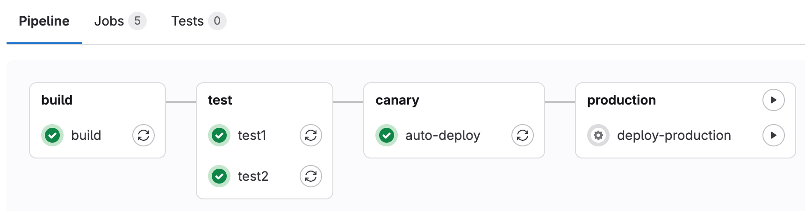
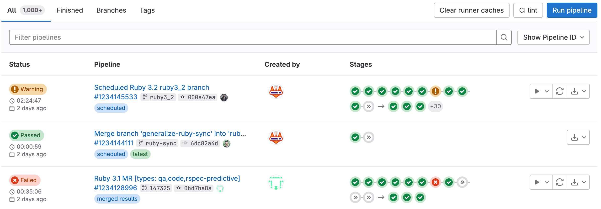
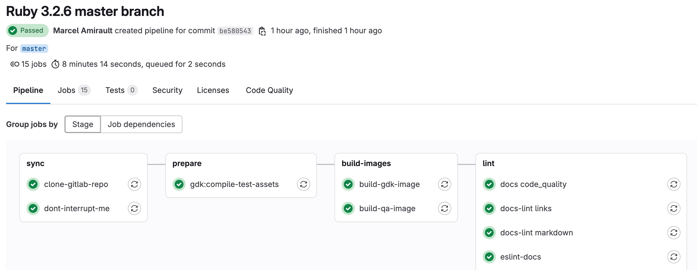
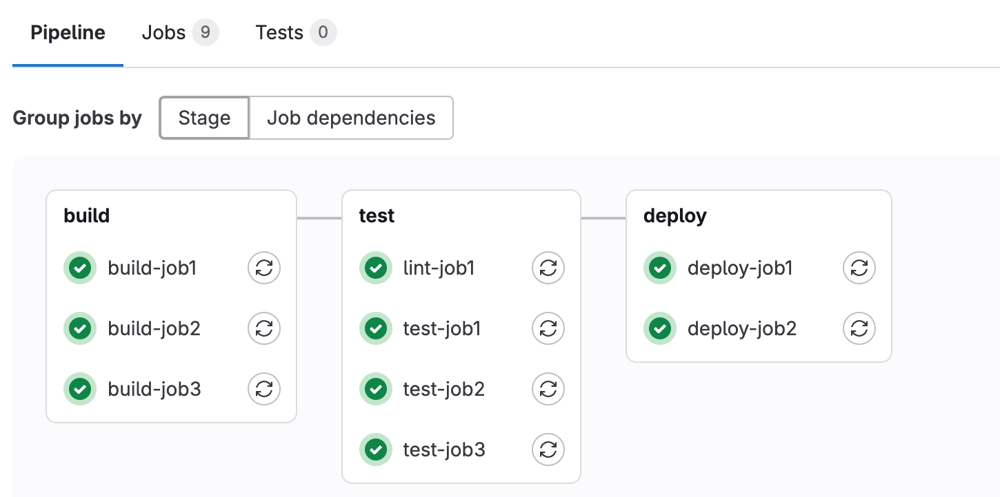
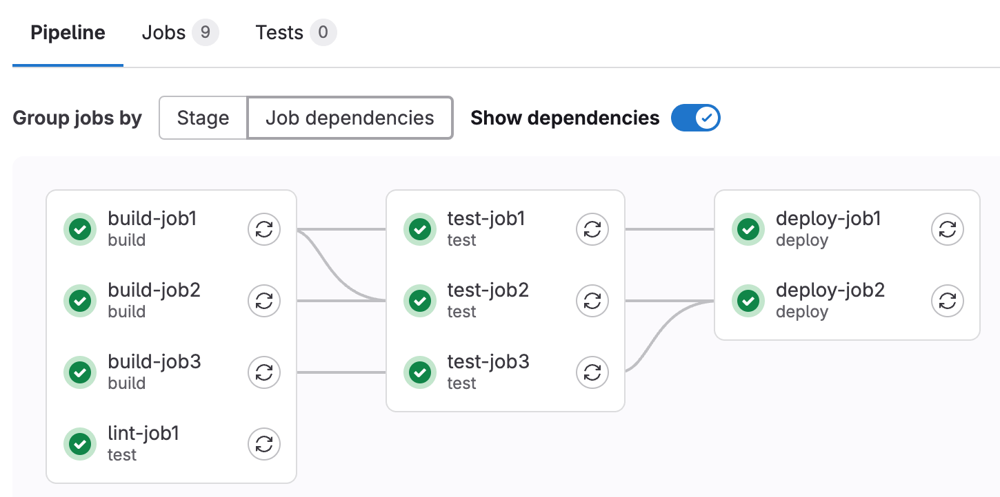
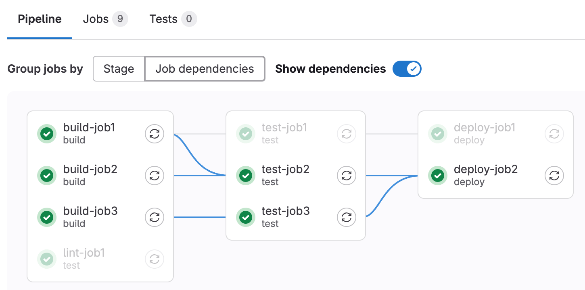
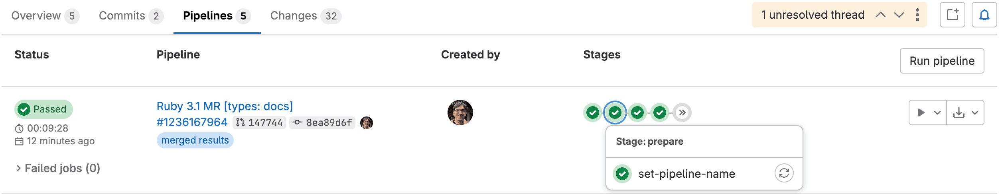

DETAILS:
**Tier:** Free, Premium, Ultimate
**Offering:** GitLab.com, GitLab Self-Managed, GitLab Dedicated

CI/CD pipelines are the fundamental component of GitLab CI/CD. Pipelines are configured
in a `.gitlab-ci.yml` file by using [YAML keywords](../yaml/_index.md).

Pipelines can run automatically for specific events, like when pushing to a branch,
creating a merge request, or on a schedule. When needed, you can also run pipelines manually.

Pipelines are composed of:

- [Global YAML keywords](../yaml/_index.md#global-keywords) that control the overall
  behavior of the project's pipelines.
- [Jobs](../jobs/_index.md) that execute commands to accomplish a task. For example,
  a job could compile, test, or deploy code. Jobs run independently from each other,
  and are executed by [runners](../runners/_index.md).
- Stages, which define how to group jobs together. Stages run in sequence, while the jobs
  in a stage run in parallel. For example, an early stage could have jobs that lint and compile
  code, while later stages could have jobs that test and deploy code. If all jobs in a stage succeed,
  the pipeline moves on to the next stage. If any job in a stage fails, the next stage
  is not (usually) executed and the pipeline ends early.

A small pipeline could consist of three stages, executed in the following order:

- A `build` stage, with a job called `compile` that compiles the project's code.
- A `test` stage, with two jobs called `test1` and `test2` that run various tests on the code.
  These tests would only run if the `compile` job completed successfully.
- A `deploy` stage, with a job called `deploy-to-production`. This job would only run
  if both jobs in the `test` stage started and completed successfully.

To get started with your first pipeline, see [Create and run your first GitLab CI/CD pipeline](../quick_start/_index.md).

## Types of pipelines

Pipelines can be configured in many different ways:

- [Basic pipelines](pipeline_architectures.md#basic-pipelines) run everything in each stage concurrently,
  followed by the next stage.
- [Pipelines that use the `needs` keyword](../yaml/needs.md) run based on dependencies
  between jobs and can run more quickly than basic pipelines.
- [Merge request pipelines](../pipelines/merge_request_pipelines.md) run for merge
  requests only (rather than for every commit).
- [Merged results pipelines](../pipelines/merged_results_pipelines.md)
  are merge request pipelines that act as though the changes from the source branch have
  already been merged into the target branch.
- [Merge trains](../pipelines/merge_trains.md)
  use merged results pipelines to queue merges one after the other.
- [Parent-child pipelines](downstream_pipelines.md#parent-child-pipelines) break down complex pipelines
  into one parent pipeline that can trigger multiple child sub-pipelines, which all
  run in the same project and with the same SHA. This pipeline architecture is commonly used for mono-repos.
- [Multi-project pipelines](downstream_pipelines.md#multi-project-pipelines) combine pipelines for different projects together.

## Configure a pipeline

Pipelines and their component jobs and stages are defined with [YAML keywords](../yaml/_index.md)
in the CI/CD pipeline configuration file for each project. When editing CI/CD configuration
in GitLab, you should use the [pipeline editor](../pipeline_editor/_index.md).

You can also configure specific aspects of your pipelines through the GitLab UI:

- [Pipeline settings](settings.md) for each project.
- [Pipeline schedules](schedules.md).
- [Custom CI/CD variables](../variables/_index.md#for-a-project).

If you use VS Code to edit your GitLab CI/CD configuration, the [GitLab Workflow extension for VS Code](../../editor_extensions/visual_studio_code/_index.md)
helps you [validate your configuration](https://marketplace.visualstudio.com/items?itemName=GitLab.gitlab-workflow#validate-gitlab-ci-configuration)
and [view your pipeline status](https://marketplace.visualstudio.com/items?itemName=GitLab.gitlab-workflow#information-about-your-branch-pipelines-mr-closing-issue).

### Run a pipeline manually

> - **Run pipeline** name [updated](https://gitlab.com/gitlab-org/gitlab/-/issues/482718) to **New pipeline** in GitLab 17.7.

Pipelines can be manually executed, with predefined or manually-specified [variables](../variables/_index.md).

You might do this if the results of a pipeline (for example, a code build) are required outside the standard
operation of the pipeline.

To execute a pipeline manually:

1. On the left sidebar, select **Search or go to** and find your project.
1. Select **Build > Pipelines**.
1. Select **New pipeline**.
1. In the **Run for branch name or tag** field, select the branch or tag to run the pipeline for.
1. Enter any [CI/CD variables](../variables/_index.md) required for the pipeline to run.
   You can set specific variables to have their [values prefilled in the form](#prefill-variables-in-manual-pipelines).
1. Select **New pipeline**.

The pipeline now executes the jobs as configured.

#### Prefill variables in manual pipelines

You can use the [`description` and `value`](../yaml/_index.md#variablesdescription)
keywords to [define pipeline-level (global) variables](../variables/_index.md#define-a-cicd-variable-in-the-gitlab-ciyml-file)
that are prefilled when running a pipeline manually. Use the description to explain
information such as what the variable is used for, and what the acceptable values are.

Job-level variables cannot be pre-filled.

In manually-triggered pipelines, the **New pipeline** page displays all pipeline-level variables
that have a `description` defined in the `.gitlab-ci.yml` file. The description displays
below the variable.

You can change the prefilled value, which [overrides the value](../variables/_index.md#use-pipeline-variables) for that single pipeline run.
Any variables overridden by using this process are [expanded](../variables/_index.md#prevent-cicd-variable-expansion)
and not [masked](../variables/_index.md#mask-a-cicd-variable).
If you do not define a `value` for the variable in the configuration file, the variable name is still listed,
but the value field is blank.

For example:

```yaml
variables:
  DEPLOY_CREDENTIALS:
    description: "The deployment credentials."
  DEPLOY_ENVIRONMENT:
    description: "Select the deployment target. Valid options are: 'canary', 'staging', 'production', or a stable branch of your choice."
    value: "canary"
```

In this example:

- `DEPLOY_CREDENTIALS` is listed in the **New pipeline** page, but with no value set.
  The user is expected to define the value each time the pipeline is run manually.
- `DEPLOY_ENVIRONMENT` is pre-filled in the **New pipeline** page with `canary` as the default value,
  and the message explains the other options.

NOTE:
Because of a [known issue](https://gitlab.com/gitlab-org/gitlab/-/issues/382857), projects that use [compliance pipelines](../../user/group/compliance_pipelines.md) can have prefilled variables not appear
when running a pipeline manually. To workaround this issue,
[change the compliance pipeline configuration](../../user/group/compliance_pipelines.md#prefilled-variables-are-not-shown).

#### Configure a list of selectable prefilled variable values

> - [Introduced](https://gitlab.com/gitlab-org/gitlab/-/issues/363660) in GitLab 15.5 [with a flag](../../administration/feature_flags.md) named `run_pipeline_graphql`. Disabled by default.
> - The `options` keyword was [introduced](https://gitlab.com/gitlab-org/gitlab/-/merge_requests/105502) in GitLab 15.7.
> - [Generally available](https://gitlab.com/gitlab-org/gitlab/-/merge_requests/106038) in GitLab 15.7. Feature flag `run_pipeline_graphql` removed.
> - The variables list sometimes did not populate correctly due to [a bug](https://gitlab.com/gitlab-org/gitlab/-/issues/386245), which was resolved in GitLab 15.9.

You can define an array of CI/CD variable values the user can select from when running a pipeline manually.
These values are in a dropdown list in the **New pipeline** page. Add the list of
value options to `options` and set the default value with `value`. The string in `value`
must also be included in the `options` list.

For example:

```yaml
variables:
  DEPLOY_ENVIRONMENT:
    value: "staging"
    options:
      - "production"
      - "staging"
      - "canary"
    description: "The deployment target. Set to 'staging' by default."
```

### Run a pipeline by using a URL query string

You can use a query string to pre-populate the **New pipeline** page. For example, the query string
`.../pipelines/new?ref=my_branch&var[foo]=bar&file_var[file_foo]=file_bar` pre-populates the
**New pipeline** page with:

- **Run for** field: `my_branch`.
- **Variables** section:
  - Variable:
    - Key: `foo`
    - Value: `bar`
  - File:
    - Key: `file_foo`
    - Value: `file_bar`

The format of the `pipelines/new` URL is:

```plaintext
.../pipelines/new?ref=<branch>&var[<variable_key>]=<value>&file_var[<file_key>]=<value>
```

The following parameters are supported:

- `ref`: specify the branch to populate the **Run for** field with.
- `var`: specify a `Variable` variable.
- `file_var`: specify a `File` variable.

For each `var` or `file_var`, a key and value are required.

### Add manual interaction to your pipeline

[Manual jobs](../jobs/job_control.md#create-a-job-that-must-be-run-manually),
allow you to require manual interaction before moving forward in the pipeline.

You can do this straight from the pipeline graph. Select **Run** (**{play}**) to execute that particular job.

For example, your pipeline can start automatically, but require a manual action to
[deploy to production](../environments/deployments.md#configure-manual-deployments).
In the example below, the `production` stage has a job with a manual action:



#### Start all manual jobs in a stage

If a stage contains only manual jobs, you can start all the jobs at the same time
by selecting **Run all manual** (**{play}**) above the stage. If the stage contains
non-manual jobs, the option is not displayed.

### Skip a pipeline

To push a commit without triggering a pipeline, add `[ci skip]` or `[skip ci]`, using any
capitalization, to your commit message.

Alternatively, with Git 2.10 or later, use the `ci.skip` [Git push option](../../topics/git/commit.md#push-options-for-gitlab-cicd).
The `ci.skip` push option does not skip merge request pipelines.

### Delete a pipeline

Users with the Owner role for a project can delete a pipeline:

1. On the left sidebar, select **Search or go to** and find your project.
1. Select **Build > Pipelines**.
1. Select either the pipeline ID (for example `#123456789`) or the pipeline status icon
   (for example **Passed**) of the pipeline to delete.
1. In the top right of the pipeline details page, select **Delete**.

Deleting a pipeline does not automatically delete its [child pipelines](downstream_pipelines.md#parent-child-pipelines).
See [issue 39503](https://gitlab.com/gitlab-org/gitlab/-/issues/39503) for more details.

WARNING:
Deleting a pipeline expires all pipeline caches, and deletes all immediately
related objects, such as jobs, logs, artifacts, and triggers.
**This action cannot be undone.**

### Pipeline security on protected branches

A strict security model is enforced when pipelines are executed on
[protected branches](../../user/project/repository/branches/protected.md).

The following actions are allowed on protected branches if the user is
[allowed to merge or push](../../user/project/repository/branches/protected.md)
to that specific branch:

- Run manual pipelines (using the [Web UI](#run-a-pipeline-manually) or [pipelines API](#pipelines-api)).
- Run scheduled pipelines.
- Run pipelines using triggers.
- Run on-demand DAST scan.
- Trigger manual actions on existing pipelines.
- Retry or cancel existing jobs (using the Web UI or pipelines API).

**Variables** marked as **protected** are accessible to jobs that run in pipelines for protected branches. Only assign users the right to merge to protected branches if they have permission to access sensitive information like deployment credentials and tokens.

**Runners** marked as **protected** can run jobs only on protected
branches, preventing untrusted code from executing on the protected runner and
preserving deployment keys and other credentials from being unintentionally
accessed. To ensure that jobs intended to be executed on protected
runners do not use regular runners, they must be [tagged](../yaml/_index.md#tags) accordingly.

Review the [deployment safety](../environments/deployment_safety.md)
page for additional security recommendations for securing your pipelines.

<!--- start_remove The following content will be removed on remove_date: '2025-08-15' -->

## Trigger a pipeline when an upstream project is rebuilt (deprecated)

DETAILS:
**Tier:** Premium, Ultimate
**Offering:** GitLab.com, GitLab Self-Managed, GitLab Dedicated

WARNING:
This feature was [deprecated](https://gitlab.com/gitlab-org/gitlab/-/issues/501460) in GitLab 17.6
and is planned for removal in 19.0. Use [CI/CD jobs with pipeline trigger tokens](../triggers/_index.md#use-a-cicd-job) instead.
This is a breaking change.

You can set up your project to automatically trigger a pipeline based on tags in a different project.
When a new tag pipeline in the subscribed project finishes, it triggers a pipeline on your project's default branch,
regardless of the tag pipeline's success, failure, or cancellation.

Prerequisites:

- The upstream project must be [public](../../user/public_access.md).
- The user must have the Developer role
  in the upstream project.

To trigger the pipeline when the upstream project is rebuilt:

1. On the left sidebar, select **Search or go to** and find your project.
1. Select **Settings > CI/CD**.
1. Expand **Pipeline subscriptions**.
1. Select **Add project**.
1. Enter the project you want to subscribe to, in the format `<namespace>/<project>`.
   For example, if the project is `https://gitlab.com/gitlab-org/gitlab`, use `gitlab-org/gitlab`.
1. Select **Subscribe**.

The maximum number of upstream pipeline subscriptions is 2 by default, for both the upstream and
downstream projects. On GitLab Self-Managed, an administrator can change this
[limit](../../administration/instance_limits.md#number-of-cicd-subscriptions-to-a-project).

<!--- end_remove -->

## How pipeline duration is calculated

The total running time for a given pipeline excludes:

- The duration of the initial run for any job that is retried or manually re-run.
- Any pending (queue) time.

That means that if a job is retried or manually re-run, only the duration of the latest run is included in the total running time.

Each job is represented as a `Period`, which consists of:

- `Period#first` (when the job started).
- `Period#last` (when the job finished).

A simple example is:

- A (0, 2)
- A' (2, 4)
  - This is retrying A
- B (1, 3)
- C (6, 7)

In the example:

- A begins at 0 and ends at 2.
- A' begins at 2 and ends at 4.
- B begins at 1 and ends at 3.
- C begins at 6 and ends at 7.

Visually, it can be viewed as:

```plaintext
0  1  2  3  4  5  6  7
AAAAAAA
   BBBBBBB
      A'A'A'A
                  CCCC
```

Because A is retried, we ignore it and count only job A'.
The union of B, A', and C is (1, 4) and (6, 7). Therefore, the total
running time is:

```plaintext
(4 - 1) + (7 - 6) => 4
```

## View pipelines

To view all the pipelines that ran for your project:

1. On the left sidebar, select **Search or go to** and find your project.
1. Select **Build > Pipelines**.

You can filter the **Pipelines** page by:

- Trigger author
- Branch name
- Status
- Tag
- Source

Select **Pipeline ID** in the dropdown list in the top right to display the pipeline IDs
(unique ID across the instance).
Select **pipeline IID** to display the pipeline IIDs (internal ID, unique across the project only).

For example:



To view the pipelines that relate to a specific merge request, go to the **Pipelines** tab
in the merge request.

### Pipeline details

> - Pipeline detail view [updated](https://gitlab.com/gitlab-org/gitlab/-/issues/424403) in GitLab 16.6 [with a flag](../../administration/feature_flags.md) named `new_pipeline_graph`. Disabled by default.
> - Updated pipeline detail view [enabled on GitLab.com](https://gitlab.com/gitlab-org/gitlab/-/issues/426902) in GitLab 16.8.

Select a pipeline to open the pipeline details page which shows every job in the pipeline.
From this page you can cancel a running pipeline, retry failed jobs, or [delete a pipeline](#delete-a-pipeline).

The pipeline details page displays a graph of all the jobs in the pipeline:



You can use a standard URL to access the details for specific pipelines:

- `gitlab.example.com/my-group/my-project/-/pipelines/pipelines/latest`: The details page
  for the latest pipeline for the most recent commit on the default branch in the project.
- `gitlab.example.com/my-group/my-project/-/pipelines/<branch>/latest`: The details page
  for the latest pipeline for the most recent commit on branch `<branch>` in the project.

#### Group jobs by stage or `needs` configuration

When you configure jobs with the [`needs`](../yaml/_index.md#needs) keyword, you have
two options for how to group the jobs in the pipeline details page. To group the jobs
by stage configuration, select **stage** in the **Group jobs by** section:



To group the jobs by [`needs`](../yaml/_index.md#needs) configuration, select **Job dependencies**.
You can optionally select **Show dependencies** to render lines between dependent jobs.



Jobs in the leftmost column run first, and jobs that depend on them are grouped in the next columns.
In this example:

- `lint-job` is configured with `needs: []` and depends on no jobs, so it displays in the first column,
  despite being in the `test` stage.
- `test-job1` depends on `build-job1`, and `test-job2` depends on both `build-job1` and `build-job2`,
  so both test jobs display in the second column.
- Both `deploy` jobs depend on jobs in second column (which themselves depend on other earlier jobs),
  so the deploy jobs display in the third column.

When you hover over a job in the **Job dependencies** view, every job that must run
before the selected job is highlighted:



### Pipeline mini graphs

Pipeline mini graphs take less space and can tell you at a quick glance if all jobs passed
or something failed. They show all related jobs for a single commit and the net result
of each stage of your pipeline. You can quickly see what failed and fix it.

The pipeline mini graph always group jobs by stage, and display throughout GitLab
when displaying pipeline or commit details.



Stages in pipeline mini graphs are expandable. Hover your mouse over each stage
to see the name and status, and select a stage to expand its jobs list.

### Downstream pipeline graphs

When a pipeline contains a job that triggers a [downstream pipeline](downstream_pipelines.md),
you can see the downstream pipeline in the pipeline details view and mini graphs.

In the pipeline details view, a card displays for every triggered downstream pipeline
on the right of the pipeline graph. Hover over a card to see which job triggered the
downstream pipeline. Select a card to display the downstream pipeline to the right
of the pipeline graph.

In the pipeline mini graph, the status of every triggered downstream pipeline displays
as additional status icons to the right of the mini graph. Select a downstream pipeline
status icon to go to the detail page of that downstream pipeline.

## Pipeline success and duration charts

Pipeline analytics are available on the [**CI/CD Analytics** page](../../user/analytics/ci_cd_analytics.md#pipeline-success-and-duration-charts).

## Pipeline badges

Pipeline status and test coverage report badges are available and configurable for each project.
For information on adding pipeline badges to projects, see [Pipeline badges](settings.md#pipeline-badges).

## Pipelines API

GitLab provides API endpoints to:

- Perform basic functions. For more information, see [Pipelines API](../../api/pipelines.md).
- Maintain pipeline schedules. For more information, see [Pipeline schedules API](../../api/pipeline_schedules.md).
- Trigger pipeline runs. For more information, see:
  - [Triggering pipelines through the API](../triggers/_index.md).
  - [Pipeline triggers API](../../api/pipeline_triggers.md).

## Ref specs for runners

When a runner picks a pipeline job, GitLab provides that job's metadata. This includes the [Git refspecs](https://git-scm.com/book/en/v2/Git-Internals-The-Refspec),
which indicate which ref (such as branch or tag) and commit (SHA1) are checked out from your
project repository.

This table lists the refspecs injected for each pipeline type:

| Pipeline type                                                     | Refspecs |
|-------------------------------------------------------------------|----------|
| pipeline for branches                                             | `+<sha>:refs/pipelines/<id>` and `+refs/heads/<name>:refs/remotes/origin/<name>` |
| pipeline for tags                                                 | `+<sha>:refs/pipelines/<id>` and `+refs/tags/<name>:refs/tags/<name>` |
| [merge request pipeline](../pipelines/merge_request_pipelines.md) | `+refs/pipelines/<id>:refs/pipelines/<id>` |

The refs `refs/heads/<name>` and `refs/tags/<name>` exist in your
project repository. GitLab generates the special ref `refs/pipelines/<id>` during a
running pipeline job. This ref can be created even after the associated branch or tag has been
deleted. It's therefore useful in some features such as [automatically stopping an environment](../environments/_index.md#stopping-an-environment),
and [merge trains](../pipelines/merge_trains.md) that might run pipelines after branch deletion.

<!--- start_remove The following content will be removed on remove_date: '2025-08-15' -->

## Troubleshooting

### Pipeline subscriptions continue after user deletion

When a user [deletes their GitLab.com account](../../user/profile/account/delete_account.md#delete-your-own-account),
the deletion does not occur for seven days. During this period, any [pipeline subscriptions created by that user](#trigger-a-pipeline-when-an-upstream-project-is-rebuilt-deprecated)
continue to run with the user's original permissions. To prevent unauthorized pipeline executions,
immediately update pipeline subscription settings for the deleted user.

<!--- end_remove -->
