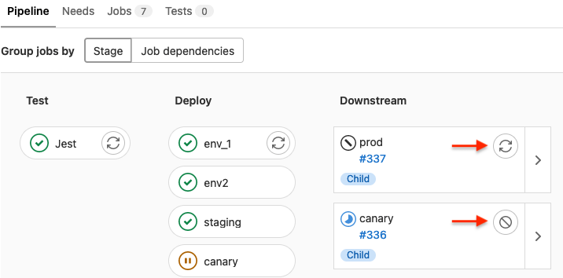

# Downstream pipelines **(FREE)**

A downstream pipeline is any GitLab CI/CD pipeline triggered by another pipeline.
A downstream pipeline can be either:

- A [parent-child pipeline](parent_child_pipelines.md), which is a downstream pipeline triggered
  in the same project as the first pipeline.
- A [multi-project pipeline](multi_project_pipelines.md), which is a downstream pipeline triggered
  in a different project than the first pipeline.

Parent-child pipelines and multi-project pipelines can sometimes be used for similar purposes,
but there are some key differences.

Parent-child pipelines:

- Run under the same project, ref, and commit SHA as the parent pipeline.
- Affect the overall status of the ref the pipeline runs against. For example,
  if a pipeline fails for the main branch, it's common to say that "main is broken".
  The status of child pipelines don't directly affect the status of the ref, unless the child
  pipeline is triggered with [`strategy:depend`](../yaml/index.md#triggerstrategy).
- Are automatically canceled if the pipeline is configured with [`interruptible`](../yaml/index.md#interruptible)
  when a new pipeline is created for the same ref.
- Display only the parent pipelines in the pipeline index page. Child pipelines are
  visible when visiting their parent pipeline's page.
- Are limited to 2 levels of nesting. A parent pipeline can trigger multiple child pipelines,
  and those child pipeline can trigger multiple child pipelines (`A -> B -> C`).

Multi-project pipelines:

- Are triggered from another pipeline, but the upstream (triggering) pipeline does
  not have much control over the downstream (triggered) pipeline. However, it can
  choose the ref of the downstream pipeline, and pass CI/CD variables to it.
- Affect the overall status of the ref of the project it runs in, but does not
  affect the status of the triggering pipeline's ref, unless it was triggered with
  [`strategy:depend`](../yaml/index.md#triggerstrategy).
- Are not automatically canceled in the downstream project when using [`interruptible`](../yaml/index.md#interruptible)
  if a new pipeline runs for the same ref in the upstream pipeline. They can be
  automatically canceled if a new pipeline is triggered for the same ref on the downstream project.
- Multi-project pipelines are standalone pipelines because they are normal pipelines
  that happened to be triggered by an external project. They are all visible on the pipeline index page.
- Are independent, so there are no nesting limits.

## View a downstream pipeline

In the [pipeline graph view](index.md#view-full-pipeline-graph), downstream pipelines display
as a list of cards on the right of the graph.

### Cancel or retry downstream pipelines from the graph view

> - [Introduced](https://gitlab.com/gitlab-org/gitlab/-/issues/354974) in GitLab 15.0 [with a flag](../../administration/feature_flags.md) named `downstream_retry_action`. Disabled by default.
> - [Generally available and feature flag removed](https://gitlab.com/gitlab-org/gitlab/-/issues/357406) in GitLab 15.1.

To cancel a downstream pipeline that is still running, select **Cancel** (**{cancel}**)
on the pipeline's card.

To retry a failed downstream pipeline, select **Retry** (**{retry}**)
on the pipeline's card.

