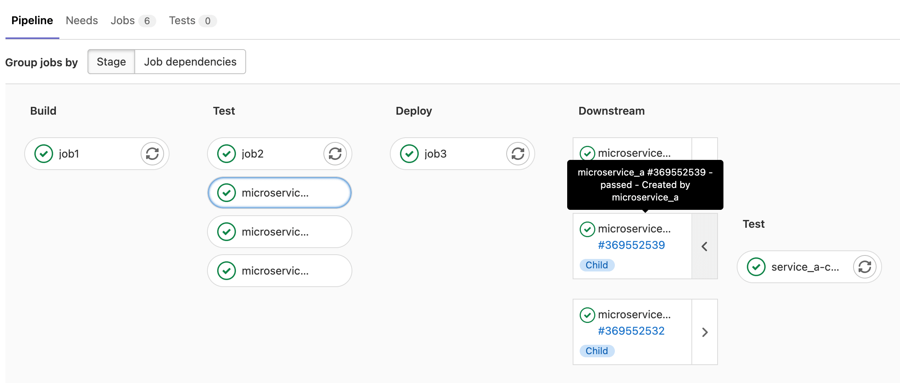
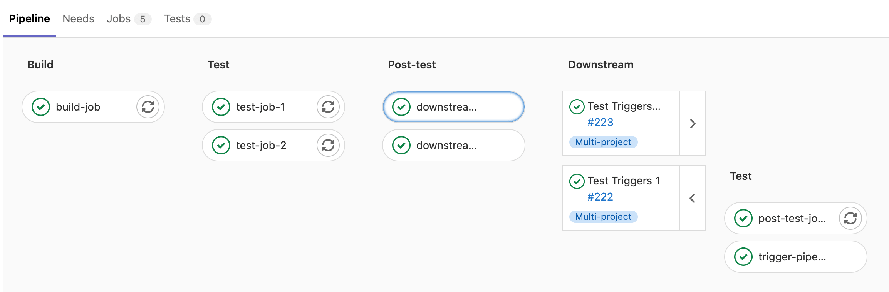

# Downstream pipelines **(FREE)**

A downstream pipeline is any GitLab CI/CD pipeline triggered by another pipeline.
A downstream pipeline can be either:

- A [parent-child pipeline](downstream_pipelines.md#parent-child-pipelines), which is a downstream pipeline triggered
  in the same project as the first pipeline.
- A [multi-project pipeline](#multi-project-pipelines), which is a downstream pipeline triggered
  in a different project than the first pipeline.

Parent-child pipelines and multi-project pipelines can sometimes be used for similar purposes,
but there are some key differences.

Parent-child pipelines:

- Run under the same project, ref, and commit SHA as the parent pipeline.
- Affect the overall status of the ref the pipeline runs against. For example,
  if a pipeline fails for the main branch, it's common to say that "main is broken".
  The status of child pipelines don't directly affect the status of the ref, unless the child
  pipeline is triggered with [`strategy:depend`](../yaml/index.md#triggerstrategy).
- Are automatically canceled if the pipeline is configured with [`interruptible`](../yaml/index.md#interruptible)
  when a new pipeline is created for the same ref.
- Display only the parent pipelines in the pipeline index page. Child pipelines are
  visible when visiting their parent pipeline's page.
- Are limited to 2 levels of nesting. A parent pipeline can trigger multiple child pipelines,
  and those child pipeline can trigger multiple child pipelines (`A -> B -> C`).

Multi-project pipelines:

- Are triggered from another pipeline, but the upstream (triggering) pipeline does
  not have much control over the downstream (triggered) pipeline. However, it can
  choose the ref of the downstream pipeline, and pass CI/CD variables to it.
- Affect the overall status of the ref of the project it runs in, but does not
  affect the status of the triggering pipeline's ref, unless it was triggered with
  [`strategy:depend`](../yaml/index.md#triggerstrategy).
- Are not automatically canceled in the downstream project when using [`interruptible`](../yaml/index.md#interruptible)
  if a new pipeline runs for the same ref in the upstream pipeline. They can be
  automatically canceled if a new pipeline is triggered for the same ref on the downstream project.
- Multi-project pipelines are standalone pipelines because they are normal pipelines
  that happened to be triggered by an external project. They are all visible on the pipeline index page.
- Are independent, so there are no nesting limits.

## Multi-project pipelines

> [Moved](https://gitlab.com/gitlab-org/gitlab/-/issues/199224) to GitLab Free in 12.8.

You can set up [GitLab CI/CD](../index.md) across multiple projects, so that a pipeline
in one project can trigger a downstream pipeline in another project. You can visualize the entire pipeline
in one place, including all cross-project interdependencies.

For example, you might deploy your web application from three different projects in GitLab.
Each project has its own build, test, and deploy process. With multi-project pipelines you can
visualize the entire pipeline, including all build and test stages for all three projects.

<i class="fa fa-youtube-play youtube" aria-hidden="true"></i>
For an overview, see the [Multi-project pipelines demo](https://www.youtube.com/watch?v=g_PIwBM1J84).

Multi-project pipelines are also useful for larger products that require cross-project interdependencies, like those
with a [microservices architecture](https://about.gitlab.com/blog/2016/08/16/trends-in-version-control-land-microservices/).
Learn more in the [Cross-project Pipeline Triggering and Visualization demo](https://about.gitlab.com/learn/)
at GitLab@learn, in the Continuous Integration section.

If you trigger a pipeline in a downstream private project, on the upstream project's pipelines page,
you can view:

- The name of the project.
- The status of the pipeline.

If you have a public project that can trigger downstream pipelines in a private project,
make sure there are no confidentiality problems.

### Trigger a multi-project pipeline from a job in your `.gitlab-ci.yml` file

> [Moved](https://gitlab.com/gitlab-org/gitlab/-/issues/199224) to GitLab Free in 12.8.

When you use the [`trigger`](../yaml/index.md#trigger) keyword to create a multi-project
pipeline in your `.gitlab-ci.yml` file, you create what is called a *trigger job*. For example:

```yaml
rspec:
  stage: test
  script: bundle exec rspec

staging:
  variables:
    ENVIRONMENT: staging
  stage: deploy
  trigger: my/deployment
```

In this example, after the `rspec` job succeeds in the `test` stage,
the `staging` trigger job starts. The initial status of this
job is `pending`.

GitLab then creates a downstream pipeline in the
`my/deployment` project and, as soon as the pipeline is created, the
`staging` job succeeds. The full path to the project is `my/deployment`.

You can view the status for the pipeline, or you can display
[the downstream pipeline's status instead](#mirror-the-status-of-a-downstream-pipeline-in-the-trigger-job).

The user that creates the upstream pipeline must be able to create pipelines in the
downstream project (`my/deployment`) too. If the downstream project is not found,
or the user does not have [permission](../../user/permissions.md) to create a pipeline there,
the `staging` job is marked as _failed_.

#### Specify a downstream pipeline branch

You can specify a branch name for the downstream pipeline to use.
GitLab uses the commit on the head of the branch to
create the downstream pipeline.

```yaml
rspec:
  stage: test
  script: bundle exec rspec

staging:
  stage: deploy
  trigger:
    project: my/deployment
    branch: stable-11-2
```

Use:

- The `project` keyword to specify the full path to a downstream project.
  In [GitLab 15.3 and later](https://gitlab.com/gitlab-org/gitlab/-/issues/367660), variable expansion is
  supported.
- The `branch` keyword to specify the name of a branch in the project specified by `project`.
  In [GitLab 12.4 and later](https://gitlab.com/gitlab-org/gitlab/-/issues/10126), variable expansion is
  supported.

Pipelines triggered on a protected branch in a downstream project use the [role](../../user/permissions.md)
of the user that ran the trigger job in the upstream project. If the user does not
have permission to run CI/CD pipelines against the protected branch, the pipeline fails. See
[pipeline security for protected branches](index.md#pipeline-security-on-protected-branches).

#### Use `rules` or `only`/`except` with multi-project pipelines

You can use CI/CD variables or the [`rules`](../yaml/index.md#rulesif) keyword to
[control job behavior](../jobs/job_control.md) for multi-project pipelines. When a
downstream pipeline is triggered with the [`trigger`](../yaml/index.md#trigger) keyword,
the value of the [`$CI_PIPELINE_SOURCE` predefined variable](../variables/predefined_variables.md)
is `pipeline` for all its jobs.

If you use [`only/except`](../yaml/index.md#only--except) to control job behavior, use the
[`pipelines`](../yaml/index.md#onlyrefs--exceptrefs) keyword.

### Trigger a multi-project pipeline by using the API

> [Moved](https://gitlab.com/gitlab-org/gitlab/-/issues/31573) to GitLab Free in 12.4.

When you use the [`CI_JOB_TOKEN` to trigger pipelines](../jobs/ci_job_token.md),
GitLab recognizes the source of the job token. The pipelines become related,
so you can visualize their relationships on pipeline graphs.

These relationships are displayed in the pipeline graph by showing inbound and
outbound connections for upstream and downstream pipeline dependencies.

When using:

- CI/CD variables or [`rules`](../yaml/index.md#rulesif) to control job behavior, the value of
  the [`$CI_PIPELINE_SOURCE` predefined variable](../variables/predefined_variables.md) is
  `pipeline` for multi-project pipeline triggered through the API with `CI_JOB_TOKEN`.
- [`only/except`](../yaml/index.md#only--except) to control job behavior, use the
  `pipelines` keyword.

## Parent-child pipelines

> [Introduced](https://gitlab.com/gitlab-org/gitlab/-/issues/16094) in GitLab 12.7.

As pipelines grow more complex, a few related problems start to emerge:

- The staged structure, where all steps in a stage must be completed before the first
  job in next stage begins, causes arbitrary waits, slowing things down.
- Configuration for the single global pipeline becomes very long and complicated,
  making it hard to manage.
- Imports with [`include`](../yaml/index.md#include) increase the complexity of the configuration, and create the potential
  for namespace collisions where jobs are unintentionally duplicated.
- Pipeline UX can become unwieldy with so many jobs and stages to work with.

Additionally, sometimes the behavior of a pipeline needs to be more dynamic. The ability
to choose to start sub-pipelines (or not) is a powerful ability, especially if the
YAML is dynamically generated.



Similarly to [multi-project pipelines](#multi-project-pipelines), a pipeline can trigger a
set of concurrently running downstream child pipelines, but in the same project:

- Child pipelines still execute each of their jobs according to a stage sequence, but
  would be free to continue forward through their stages without waiting for unrelated
  jobs in the parent pipeline to finish.
- The configuration is split up into smaller child pipeline configurations. Each child pipeline contains only relevant steps which are
  easier to understand. This reduces the cognitive load to understand the overall configuration.
- Imports are done at the child pipeline level, reducing the likelihood of collisions.

Child pipelines work well with other GitLab CI/CD features:

- Use [`rules: changes`](../yaml/index.md#ruleschanges) to trigger pipelines only when
  certain files change. This is useful for monorepos, for example.
- Since the parent pipeline in `.gitlab-ci.yml` and the child pipeline run as normal
  pipelines, they can have their own behaviors and sequencing in relation to triggers.

See the [`trigger`](../yaml/index.md#trigger) keyword documentation for full details on how to
include the child pipeline configuration.

<i class="fa fa-youtube-play youtube" aria-hidden="true"></i>
For an overview, see [Parent-Child Pipelines feature demo](https://youtu.be/n8KpBSqZNbk).

NOTE:
The artifact containing the generated YAML file must not be [larger than 5MB](https://gitlab.com/gitlab-org/gitlab/-/issues/249140).

### Trigger a parent-child pipeline

The simplest case is [triggering a child pipeline](../yaml/index.md#trigger) using a
local YAML file to define the pipeline configuration. In this case, the parent pipeline
triggers the child pipeline, and continues without waiting:

```yaml
microservice_a:
  trigger:
    include: path/to/microservice_a.yml
```

You can include multiple files when defining a child pipeline. The child pipeline's
configuration is composed of all configuration files merged together:

```yaml
microservice_a:
  trigger:
    include:
      - local: path/to/microservice_a.yml
      - template: Security/SAST.gitlab-ci.yml
```

In [GitLab 13.5 and later](https://gitlab.com/gitlab-org/gitlab/-/issues/205157),
you can use [`include:file`](../yaml/index.md#includefile) to trigger child pipelines
with a configuration file in a different project:

```yaml
microservice_a:
  trigger:
    include:
      - project: 'my-group/my-pipeline-library'
        ref: 'main'
        file: '/path/to/child-pipeline.yml'
```

The maximum number of entries that are accepted for `trigger:include` is three.

### Merge request child pipelines

To trigger a child pipeline as a [merge request pipeline](merge_request_pipelines.md) we need to:

- Set the trigger job to run on merge requests:

```yaml
# parent .gitlab-ci.yml
microservice_a:
  trigger:
    include: path/to/microservice_a.yml
  rules:
    - if: $CI_MERGE_REQUEST_ID
```

- Configure the child pipeline by either:

  - Setting all jobs in the child pipeline to evaluate in the context of a merge request:

    ```yaml
    # child path/to/microservice_a.yml
    workflow:
      rules:
        - if: $CI_MERGE_REQUEST_ID

    job1:
      script: ...

    job2:
      script: ...
    ```

  - Alternatively, setting the rule per job. For example, to create only `job1` in
    the context of merge request pipelines:

    ```yaml
    # child path/to/microservice_a.yml
    job1:
      script: ...
      rules:
        - if: $CI_MERGE_REQUEST_ID

    job2:
      script: ...
    ```

### Dynamic child pipelines

> [Introduced](https://gitlab.com/gitlab-org/gitlab/-/issues/35632) in GitLab 12.9.

Instead of running a child pipeline from a static YAML file, you can define a job that runs
your own script to generate a YAML file, which is then used to trigger a child pipeline.

This technique can be very powerful in generating pipelines targeting content that changed or to
build a matrix of targets and architectures.

<i class="fa fa-youtube-play youtube" aria-hidden="true"></i>
For an overview, see [Create child pipelines using dynamically generated configurations](https://youtu.be/nMdfus2JWHM).

We also have an example project using
[Dynamic Child Pipelines with Jsonnet](https://gitlab.com/gitlab-org/project-templates/jsonnet)
which shows how to use a data templating language to generate your `.gitlab-ci.yml` at runtime.
You could use a similar process for other templating languages like
[Dhall](https://dhall-lang.org/) or [ytt](https://get-ytt.io/).

The artifact path is parsed by GitLab, not the runner, so the path must match the
syntax for the OS running GitLab. If GitLab is running on Linux but using a Windows
runner for testing, the path separator for the trigger job would be `/`. Other CI/CD
configuration for jobs, like scripts, that use the Windows runner would use `\`.

For example, to trigger a child pipeline from a dynamically generated configuration file:

```yaml
generate-config:
  stage: build
  script: generate-ci-config > generated-config.yml
  artifacts:
    paths:
      - generated-config.yml

child-pipeline:
  stage: test
  trigger:
    include:
      - artifact: generated-config.yml
        job: generate-config
```

The `generated-config.yml` is extracted from the artifacts and used as the configuration
for triggering the child pipeline.

In GitLab 12.9, the child pipeline could fail to be created in certain cases, causing the parent pipeline to fail.
This is [resolved](https://gitlab.com/gitlab-org/gitlab/-/issues/209070) in GitLab 12.10.

### Nested child pipelines

> - [Introduced](https://gitlab.com/gitlab-org/gitlab/-/issues/29651) in GitLab 13.4.
> - [Feature flag removed](https://gitlab.com/gitlab-org/gitlab/-/issues/243747) in GitLab 13.5.

Parent and child pipelines were introduced with a maximum depth of one level of child
pipelines, which was later increased to two. A parent pipeline can trigger many child
pipelines, and these child pipelines can trigger their own child pipelines. It's not
possible to trigger another level of child pipelines.

<i class="fa fa-youtube-play youtube" aria-hidden="true"></i>
For an overview, see [Nested Dynamic Pipelines](https://youtu.be/C5j3ju9je2M).

## View a downstream pipeline

In the [pipeline graph view](index.md#view-full-pipeline-graph), downstream pipelines display
as a list of cards on the right of the graph.

### Retry a downstream pipeline

> - Retry from graph view [introduced](https://gitlab.com/gitlab-org/gitlab/-/issues/354974) in GitLab 15.0 [with a flag](../../administration/feature_flags.md) named `downstream_retry_action`. Disabled by default.
> - Retry from graph view [generally available and feature flag removed](https://gitlab.com/gitlab-org/gitlab/-/issues/357406) in GitLab 15.1.

To retry a completed downstream pipeline, select **Retry** (**{retry}**):

- From the downstream pipeline's details page.
- On the pipeline's card in the [pipeline graph view](index.md#view-full-pipeline-graph).

### Cancel a downstream pipeline

> - Retry from graph view [introduced](https://gitlab.com/gitlab-org/gitlab/-/issues/354974) in GitLab 15.0 [with a flag](../../administration/feature_flags.md) named `downstream_retry_action`. Disabled by default.
> - Retry from graph view [generally available and feature flag removed](https://gitlab.com/gitlab-org/gitlab/-/issues/357406) in GitLab 15.1.

To cancel a downstream pipeline that is still running, select **Cancel** (**{cancel}**):

- From the downstream pipeline's details page.
- On the pipeline's card in the [pipeline graph view](index.md#view-full-pipeline-graph).

### Mirror the status of a downstream pipeline in the trigger job

> - [Introduced](https://gitlab.com/gitlab-org/gitlab/-/issues/11238) in GitLab Premium 12.3.
> - [Moved](https://gitlab.com/gitlab-org/gitlab/-/issues/199224) to GitLab Free in 12.8.

You can mirror the pipeline status from the triggered pipeline to the source trigger job
by using [`strategy: depend`](../yaml/index.md#triggerstrategy):

::Tabs

:::TabTitle Multi-project pipeline

```yaml
trigger_job:
  trigger:
    project: my/project
    strategy: depend
```

:::TabTitle Parent-child pipeline

```yaml
trigger_job:
  trigger:
    include:
      - local: path/to/child-pipeline.yml
    strategy: depend
```

::EndTabs

### View multi-project pipelines in pipeline graphs **(PREMIUM)**

When you trigger a multi-project pipeline, the downstream pipeline displays
to the right of the [pipeline graph](index.md#visualize-pipelines).



In [pipeline mini graphs](index.md#pipeline-mini-graphs), the downstream pipeline
displays to the right of the mini graph.


## Pass artifacts to a downstream pipeline

You can pass artifacts to a downstream pipeline by using [`needs:project`](../yaml/index.md#needsproject).

1. In a job in the upstream pipeline, save the artifacts using the [`artifacts`](../yaml/index.md#artifacts) keyword.
1. Trigger the downstream pipeline with a trigger job:

   ```yaml
   build_artifacts:
     stage: build
     script:
       - echo "This is a test artifact!" >> artifact.txt
     artifacts:
       paths:
         - artifact.txt

   deploy:
     stage: deploy
     trigger: my/downstream_project
   ```

1. In a job in the downstream pipeline, fetch the artifacts from the upstream pipeline
   by using `needs:project`. Set `job` to the job in the upstream pipeline to fetch artifacts from,
   `ref` to the branch, and `artifacts: true`.

   ```yaml
   test:
     stage: test
     script:
       - cat artifact.txt
     needs:
       - project: my/upstream_project
         job: build_artifacts
         ref: main
         artifacts: true
   ```

### Pass artifacts from a Merge Request pipeline

When you use `needs:project` to [pass artifacts to a downstream pipeline](#pass-artifacts-to-a-downstream-pipeline),
the `ref` value is usually a branch name, like `main` or `development`.

For merge request pipelines, the `ref` value is in the form of `refs/merge-requests/<id>/head`,
where `id` is the merge request ID. You can retrieve this ref with the [`CI_MERGE_REQUEST_REF_PATH`](../variables/predefined_variables.md#predefined-variables-for-merge-request-pipelines)
CI/CD variable. Do not use a branch name as the `ref` with merge request pipelines,
because the downstream pipeline attempts to fetch artifacts from the latest branch pipeline.

To fetch the artifacts from the upstream `merge request` pipeline instead of the `branch` pipeline,
pass this variable to the downstream pipeline using variable inheritance:

1. In a job in the upstream pipeline, save the artifacts using the [`artifacts`](../yaml/index.md#artifacts) keyword.
1. In the job that triggers the downstream pipeline, pass the `$CI_MERGE_REQUEST_REF_PATH` variable by using
   [variable inheritance](#pass-yaml-defined-cicd-variables):

   ```yaml
   build_artifacts:
     stage: build
     script:
       - echo "This is a test artifact!" >> artifact.txt
     artifacts:
       paths:
         - artifact.txt

   upstream_job:
     variables:
       UPSTREAM_REF: $CI_MERGE_REQUEST_REF_PATH
     trigger:
       project: my/downstream_project
       branch: my-branch
   ```

1. In a job in the downstream pipeline, fetch the artifacts from the upstream pipeline
   by using `needs:project`. Set the `ref` to the `UPSTREAM_REF` variable, and `job`
   to the job in the upstream pipeline to fetch artifacts from:

   ```yaml
   test:
     stage: test
     script:
       - cat artifact.txt
     needs:
       - project: my/upstream_project
         job: build_artifacts
         ref: $UPSTREAM_REF
         artifacts: true
   ```

This method works for fetching artifacts from a regular merge request parent pipeline,
but fetching artifacts from [merge results](merged_results_pipelines.md) pipelines is not supported.

## Pass CI/CD variables to a downstream pipeline

You can pass CI/CD variables to a downstream pipeline with a few different methods,
based on where the variable is created or defined.

### Pass YAML-defined CI/CD variables

You can use the `variables` keyword to pass CI/CD variables to a downstream pipeline,
just like you would for any other job.

For example, in a [multi-project pipeline](#multi-project-pipelines):

```yaml
rspec:
  stage: test
  script: bundle exec rspec

staging:
  variables:
    ENVIRONMENT: staging
  stage: deploy
  trigger: my/deployment
```

The `ENVIRONMENT` variable is passed to every job defined in a downstream
pipeline. It is available as a variable when GitLab Runner picks a job.

In the following configuration, the `MY_VARIABLE` variable is passed to the downstream pipeline
that is created when the `trigger-downstream` job is queued. This is because `trigger-downstream`
job inherits variables declared in global variables blocks, and then we pass these variables to a downstream pipeline.

```yaml
variables:
  MY_VARIABLE: my-value

trigger-downstream:
  variables:
    ENVIRONMENT: something
  trigger: my/project
```

### Prevent global variables from being passed

You can stop global variables from reaching the downstream pipeline by using the [`inherit:variables` keyword](../yaml/index.md#inheritvariables).
For example, in a [multi-project pipeline](#multi-project-pipelines):

```yaml
variables:
  MY_GLOBAL_VAR: value

trigger-downstream:
  inherit:
    variables: false
  variables:
    MY_LOCAL_VAR: value
  trigger: my/project
```

In this example, the `MY_GLOBAL_VAR` variable is not available in the triggered pipeline.

### Pass a predefined variable

You might want to pass some information about the upstream pipeline using predefined variables.
To do that, you can use interpolation to pass any variable. For example,
in a [multi-project pipeline](#multi-project-pipelines):

```yaml
downstream-job:
  variables:
    UPSTREAM_BRANCH: $CI_COMMIT_REF_NAME
  trigger: my/project
```

In this scenario, the `UPSTREAM_BRANCH` variable with the value of the upstream pipeline's
`$CI_COMMIT_REF_NAME` is passed to `downstream-job`. It is available in the
context of all downstream builds.

You cannot use this method to forward [job-level persisted variables](../variables/where_variables_can_be_used.md#persisted-variables)
to a downstream pipeline, as they are not available in trigger jobs.

Upstream pipelines take precedence over downstream ones. If there are two
variables with the same name defined in both upstream and downstream projects,
the ones defined in the upstream project take precedence.

### Pass dotenv variables created in a job **(PREMIUM)**

You can pass variables to a downstream pipeline with [`dotenv` variable inheritance](../variables/index.md#pass-an-environment-variable-to-another-job)
and [`needs:project`](../yaml/index.md#needsproject).

For example, in a [multi-project pipeline](#multi-project-pipelines):

1. Save the variables in a `.env` file.
1. Save the `.env` file as a `dotenv` report.
1. Trigger the downstream pipeline.

   ```yaml
   build_vars:
     stage: build
     script:
       - echo "BUILD_VERSION=hello" >> build.env
     artifacts:
       reports:
         dotenv: build.env

   deploy:
     stage: deploy
     trigger: my/downstream_project
   ```

1. Set the `test` job in the downstream pipeline to inherit the variables from the `build_vars`
   job in the upstream project with `needs`. The `test` job inherits the variables in the
   `dotenv` report and it can access `BUILD_VERSION` in the script:

   ```yaml
   test:
     stage: test
     script:
       - echo $BUILD_VERSION
     needs:
       - project: my/upstream_project
         job: build_vars
         ref: master
         artifacts: true
   ```
