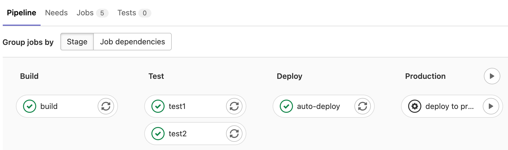
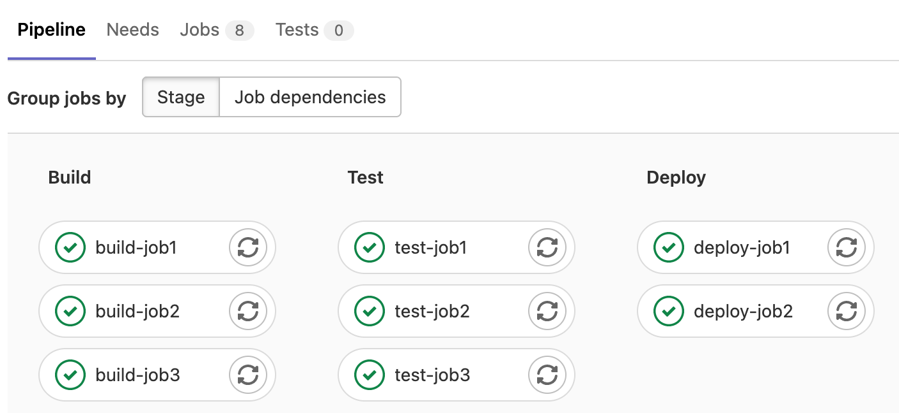
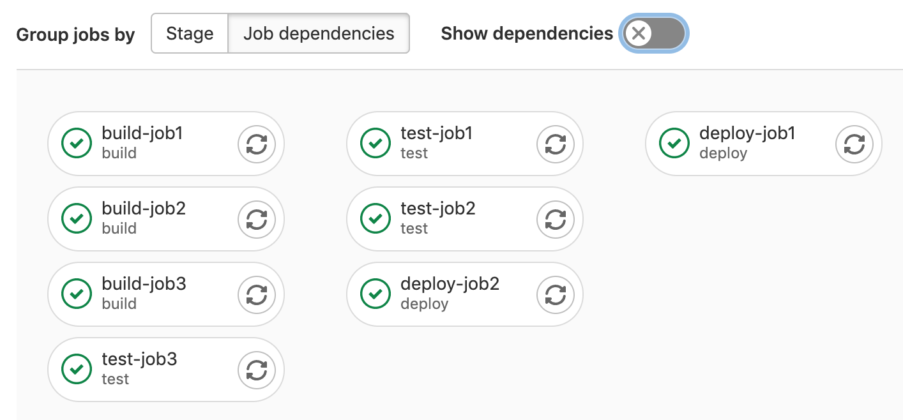
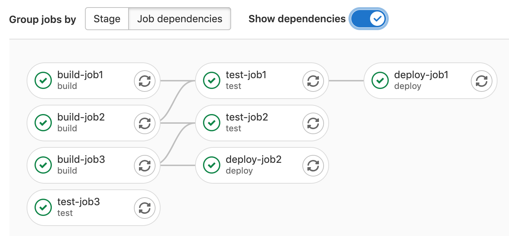
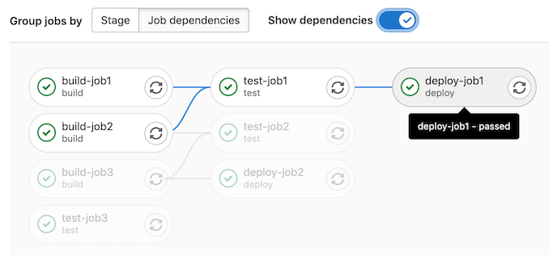

# CI/CD pipelines **(FREE)**

NOTE:
Watch the
["Mastering continuous software development"](https://about.gitlab.com/webcast/mastering-ci-cd/)
webcast to see a comprehensive demo of a GitLab CI/CD pipeline.

Pipelines are the top-level component of continuous integration, delivery, and deployment.

Pipelines comprise:

- Jobs, which define *what* to do. For example, jobs that compile or test code.
- Stages, which define *when* to run the jobs. For example, stages that run tests after stages that compile the code.

Jobs are executed by [runners](../runners/index.md). Multiple jobs in the same stage are executed in parallel,
if there are enough concurrent runners.

If *all* jobs in a stage succeed, the pipeline moves on to the next stage.

If *any* job in a stage fails, the next stage is not (usually) executed and the pipeline ends early.

In general, pipelines are executed automatically and require no intervention once created. However, there are
also times when you can manually interact with a pipeline.

A typical pipeline might consist of four stages, executed in the following order:

- A `build` stage, with a job called `compile`.
- A `test` stage, with two jobs called `test1` and `test2`.
- A `staging` stage, with a job called `deploy-to-stage`.
- A `production` stage, with a job called `deploy-to-prod`.

NOTE:
If you have a [mirrored repository that GitLab pulls from](../../user/project/repository/mirror/pull.md),
you may need to enable pipeline triggering in your project's
**Settings > Repository > Mirroring repositories > Trigger pipelines for mirror updates**.

## Types of pipelines

Pipelines can be configured in many different ways:

- [Basic pipelines](pipeline_architectures.md#basic-pipelines) run everything in each stage concurrently,
  followed by the next stage.
- [Directed Acyclic Graph Pipeline (DAG) pipelines](../directed_acyclic_graph/index.md) are based on relationships
  between jobs and can run more quickly than basic pipelines.
- [Merge request pipelines](../pipelines/merge_request_pipelines.md) run for merge
  requests only (rather than for every commit).
- [Merged results pipelines](../pipelines/merged_results_pipelines.md)
  are merge request pipelines that act as though the changes from the source branch have
  already been merged into the target branch.
- [Merge trains](../pipelines/merge_trains.md)
  use merged results pipelines to queue merges one after the other.
- [Parent-child pipelines](downstream_pipelines.md#parent-child-pipelines) break down complex pipelines
  into one parent pipeline that can trigger multiple child sub-pipelines, which all
  run in the same project and with the same SHA. This pipeline architecture is commonly used for mono-repos.
- [Multi-project pipelines](downstream_pipelines.md#multi-project-pipelines) combine pipelines for different projects together.

## Configure a pipeline

Pipelines and their component jobs and stages are defined in the CI/CD pipeline configuration file for each project.

- [Jobs](../jobs/index.md) are the basic configuration component.
- Stages are defined by using the [`stages`](../yaml/index.md#stages) keyword.

For a list of configuration options in the CI pipeline file, see the [GitLab CI/CD Pipeline Configuration Reference](../yaml/index.md).

You can also configure specific aspects of your pipelines through the GitLab UI. For example:

- [Pipeline settings](settings.md) for each project.
- [Pipeline schedules](schedules.md).
- [Custom CI/CD variables](../variables/index.md#for-a-project).

### Ref specs for runners

When a runner picks a pipeline job, GitLab provides that job's metadata. This includes the [Git refspecs](https://git-scm.com/book/en/v2/Git-Internals-The-Refspec),
which indicate which ref (such as branch or tag) and commit (SHA1) are checked out from your
project repository.

This table lists the refspecs injected for each pipeline type:

| Pipeline type                                                      | Refspecs                                                                                       |
|---------------                                                     |----------------------------------------                                                        |
| pipeline for branches                                              | `+<sha>:refs/pipelines/<id>` and `+refs/heads/<name>:refs/remotes/origin/<name>` |
| pipeline for tags                                                  | `+<sha>:refs/pipelines/<id>` and `+refs/tags/<name>:refs/tags/<name>`            |
| [merge request pipeline](../pipelines/merge_request_pipelines.md) | `+<sha>:refs/pipelines/<id>`                                                     |

The refs `refs/heads/<name>` and `refs/tags/<name>` exist in your
project repository. GitLab generates the special ref `refs/pipelines/<id>` during a
running pipeline job. This ref can be created even after the associated branch or tag has been
deleted. It's therefore useful in some features such as [automatically stopping an environment](../environments/index.md#stopping-an-environment),
and [merge trains](../pipelines/merge_trains.md)
that might run pipelines after branch deletion.

### View pipelines

You can find the current and historical pipeline runs under your project's
**CI/CD > Pipelines** page. You can also access pipelines for a merge request by navigating
to its **Pipelines** tab.


Select a pipeline to open the **Pipeline Details** page and show
the jobs that were run for that pipeline. From here you can cancel a running pipeline,
retry jobs on a failed pipeline, or [delete a pipeline](#delete-a-pipeline).

[Starting in GitLab 12.3](https://gitlab.com/gitlab-org/gitlab-foss/-/issues/50499), a link to the
latest pipeline for the last commit of a given branch is available at `/project/pipelines/[branch]/latest`.
Also, `/project/pipelines/latest` redirects you to the latest pipeline for the last commit
on the project's default branch.

[Starting in GitLab 13.0](https://gitlab.com/gitlab-org/gitlab/-/issues/215367),
you can filter the pipeline list by:

- Trigger author
- Branch name
- Status ([GitLab 13.1 and later](https://gitlab.com/gitlab-org/gitlab/-/issues/217617))
- Tag ([GitLab 13.1 and later](https://gitlab.com/gitlab-org/gitlab/-/issues/217617))
- Source ([GitLab 14.3 and later](https://gitlab.com/gitlab-org/gitlab/-/issues/338347))

[Starting in GitLab 14.2](https://gitlab.com/gitlab-org/gitlab/-/issues/26621), you can change the
pipeline column to display the pipeline ID or the pipeline IID.

If you use VS Code to edit your GitLab CI/CD configuration, the
[GitLab Workflow VS Code extension](../../user/project/repository/vscode.md) helps you
[validate your configuration](https://marketplace.visualstudio.com/items?itemName=GitLab.gitlab-workflow#validate-gitlab-ci-configuration)
and [view your pipeline status](https://marketplace.visualstudio.com/items?itemName=GitLab.gitlab-workflow#information-about-your-branch-pipelines-mr-closing-issue).

### Run a pipeline manually

Pipelines can be manually executed, with predefined or manually-specified [variables](../variables/index.md).

You might do this if the results of a pipeline (for example, a code build) are required outside the standard
operation of the pipeline.

To execute a pipeline manually:

1. On the top bar, select **Main menu > Projects** and find your project.
1. On the left sidebar, select **CI/CD > Pipelines**.
1. Select **Run pipeline**.
1. In the **Run for branch name or tag** field, select the branch or tag to run the pipeline for.
1. Enter any [CI/CD variables](../variables/index.md) required for the pipeline to run.
   You can set specific variables to have their [values prefilled in the form](#prefill-variables-in-manual-pipelines).
1. Select **Run pipeline**.

The pipeline now executes the jobs as configured.

#### Prefill variables in manual pipelines

> [Introduced](https://gitlab.com/gitlab-org/gitlab/-/issues/30101) in GitLab 13.7.

You can use the [`description` and `value`](../yaml/index.md#variablesdescription)
keywords to [define pipeline-level (global) variables](../variables/index.md#define-a-cicd-variable-in-the-gitlab-ciyml-file)
that are prefilled when running a pipeline manually. Use the description to explain
information such as what the variable is used for, and what the acceptable values are.

Job-level variables cannot be pre-filled.

In manually-triggered pipelines, the **Run pipeline** page displays all pipeline-level variables
that have a `description` defined in the `.gitlab-ci.yml` file. The description displays
below the variable.

You can change the prefilled value, which [overrides the value](../variables/index.md#override-a-defined-cicd-variable) for that single pipeline run.
Any variables overridden by using this process are [expanded](../variables/index.md#prevent-cicd-variable-expansion)
and not [masked](../variables/index.md#mask-a-cicd-variable).
If you do not define a `value` for the variable in the configuration file, the variable name is still listed,
but the value field is blank.

For example:

```yaml
variables:
  DEPLOY_CREDENTIALS:
    description: "The deployment credentials."
  DEPLOY_ENVIRONMENT:
    description: "Select the deployment target. Valid options are: 'canary', 'staging', 'production', or a stable branch of your choice."
    value: "canary"
```

In this example:

- `DEPLOY_CREDENTIALS` is listed in the **Run pipeline** page, but with no value set.
  The user is expected to define the value each time the pipeline is run manually.
- `DEPLOY_ENVIRONMENT` is pre-filled in the **Run pipeline** page with `canary` as the default value,
  and the message explains the other options.

#### Configure a list of selectable prefilled variable values

> - [Introduced](https://gitlab.com/gitlab-org/gitlab/-/issues/363660) in GitLab 15.5 [with a flag](../../administration/feature_flags.md) named `run_pipeline_graphql`. Disabled by default.
> - The `options` keyword was [introduced](https://gitlab.com/gitlab-org/gitlab/-/merge_requests/105502) in GitLab 15.7.
> - [Generally available](https://gitlab.com/gitlab-org/gitlab/-/merge_requests/106038) in GitLab 15.7. Feature flag `run_pipeline_graphql` removed.
> - The variables list sometimes did not populate correctly due to [a bug](https://gitlab.com/gitlab-org/gitlab/-/issues/386245), which was resolved in GitLab 15.9.

You can define an array of CI/CD variable values the user can select from when running a pipeline manually.
These values are in a dropdown list in the **Run pipeline** page. Add the list of
value options to `options` and set the default value with `value`. The string in `value`
must also be included in the `options` list.

For example:

```yaml
variables:
  DEPLOY_ENVIRONMENT:
    value: "staging"
    options:
      - "production"
      - "staging"
      - "canary"
    description: "The deployment target. Set to 'staging' by default."
```

### Run a pipeline by using a URL query string

> [Introduced](https://gitlab.com/gitlab-org/gitlab/-/issues/24146) in GitLab 12.5.

You can use a query string to pre-populate the **Run Pipeline** page. For example, the query string
`.../pipelines/new?ref=my_branch&var[foo]=bar&file_var[file_foo]=file_bar` pre-populates the
**Run Pipeline** page with:

- **Run for** field: `my_branch`.
- **Variables** section:
  - Variable:
    - Key: `foo`
    - Value: `bar`
  - File:
    - Key: `file_foo`
    - Value: `file_bar`

The format of the `pipelines/new` URL is:

```plaintext
.../pipelines/new?ref=<branch>&var[<variable_key>]=<value>&file_var[<file_key>]=<value>
```

The following parameters are supported:

- `ref`: specify the branch to populate the **Run for** field with.
- `var`: specify a `Variable` variable.
- `file_var`: specify a `File` variable.

For each `var` or `file_var`, a key and value are required.

### Add manual interaction to your pipeline

[Manual jobs](../jobs/job_control.md#create-a-job-that-must-be-run-manually),
allow you to require manual interaction before moving forward in the pipeline.

You can do this straight from the pipeline graph. Just select the play button
to execute that particular job.

For example, your pipeline can start automatically, but require a manual action to
[deploy to production](../environments/index.md#configure-manual-deployments).
In the example below, the `production` stage has a job with a manual action:



#### Start multiple manual actions in a stage

> [Introduced](https://gitlab.com/gitlab-org/gitlab-foss/-/merge_requests/27188) in GitLab 11.11.

Multiple manual actions in a single stage can be started at the same time using the "Play all manual"
After you select this action, each individual manual action is triggered and refreshed
to an updated status.

This functionality is only available:

- For users with at least the Developer role.
- If the stage contains [manual actions](#add-manual-interaction-to-your-pipeline).

### Skip a pipeline

To push a commit without triggering a pipeline, add `[ci skip]` or `[skip ci]`, using any
capitalization, to your commit message.

Alternatively, if you are using Git 2.10 or later, use the `ci.skip` [Git push option](../../user/project/push_options.md#push-options-for-gitlab-cicd).
The `ci.skip` push option does not skip merge request
pipelines.

### Delete a pipeline

> [Introduced](https://gitlab.com/gitlab-org/gitlab/-/issues/24851) in GitLab 12.7.

Users with the Owner role for a project can delete a pipeline
by selecting the pipeline in the **CI/CD > Pipelines** to get to the **Pipeline Details**
page, then selecting **Delete**.


Deleting a pipeline does not automatically delete its
[child pipelines](downstream_pipelines.md#parent-child-pipelines).
See the [related issue](https://gitlab.com/gitlab-org/gitlab/-/issues/39503)
for details.

WARNING:
Deleting a pipeline expires all pipeline caches, and deletes all immediately
related objects, such as builds, logs, artifacts, and triggers.
**This action cannot be undone.**

### Pipeline security on protected branches

A strict security model is enforced when pipelines are executed on
[protected branches](../../user/project/protected_branches.md).

The following actions are allowed on protected branches only if the user is
[allowed to merge or push](../../user/project/protected_branches.md)
on that specific branch:

- Run manual pipelines (using the [Web UI](#run-a-pipeline-manually) or [pipelines API](#pipelines-api)).
- Run scheduled pipelines.
- Run pipelines using triggers.
- Run on-demand DAST scan.
- Trigger manual actions on existing pipelines.
- Retry or cancel existing jobs (using the Web UI or pipelines API).

**Variables** marked as **protected** are accessible only to jobs that
run on protected branches, preventing untrusted users getting unintended access to
sensitive information like deployment credentials and tokens.

**Runners** marked as **protected** can run jobs only on protected
branches, preventing untrusted code from executing on the protected runner and
preserving deployment keys and other credentials from being unintentionally
accessed. To ensure that jobs intended to be executed on protected
runners do not use regular runners, they must be tagged accordingly.

Review the [deployment safety](../environments/deployment_safety.md)
page for additional security recommendations for securing your pipelines.

## Trigger a pipeline when an upstream project is rebuilt **(PREMIUM)**

> [Introduced](https://gitlab.com/gitlab-org/gitlab/-/issues/9045) in GitLab 12.8.

You can trigger a pipeline in your project whenever a pipeline finishes for a new
tag in a different project.

Prerequisites:

- The upstream project must be [public](../../user/public_access.md).
- The user must have the Developer role
  in the upstream project.

To trigger the pipeline when the upstream project is rebuilt:

1. On the top bar, select **Main menu > Projects** and find your project.
1. On the left sidebar, select **Settings > CI/CD**.
1. Expand **Pipeline subscriptions**.
1. Enter the project you want to subscribe to, in the format `<namespace>/<project>`.
   For example, if the project is `https://gitlab.com/gitlab-org/gitlab`, use `gitlab-org/gitlab`.
1. Select **Subscribe**.

Any pipelines that complete successfully for new tags in the subscribed project
now trigger a pipeline on the current project's default branch. The maximum
number of upstream pipeline subscriptions is 2 by default, for both the upstream and
downstream projects. On self-managed instances, an administrator can change this
[limit](../../administration/instance_limits.md#number-of-cicd-subscriptions-to-a-project).

### How pipeline duration is calculated

Total running time for a given pipeline excludes retries and pending
(queued) time.

Each job is represented as a `Period`, which consists of:

- `Period#first` (when the job started).
- `Period#last` (when the job finished).

A simple example is:

- A (1, 3)
- B (2, 4)
- C (6, 7)

In the example:

- A begins at 1 and ends at 3.
- B begins at 2 and ends at 4.
- C begins at 6 and ends at 7.

Visually, it can be viewed as:

```plaintext
0  1  2  3  4  5  6  7
   AAAAAAA
      BBBBBBB
                  CCCC
```

The union of A, B, and C is (1, 4) and (6, 7). Therefore, the total running time is:

```plaintext
(4 - 1) + (7 - 6) => 4
```

## Visualize pipelines

Pipelines can be complex structures with many sequential and parallel jobs.

To make it easier to understand the flow of a pipeline, GitLab has pipeline graphs for viewing pipelines
and their statuses.

Pipeline graphs can be displayed as a large graph or a miniature representation, depending on the page you
access the graph from.

GitLab capitalizes the stages' names in the pipeline graphs.

### View full pipeline graph

> Visualization improvements [introduced](https://gitlab.com/gitlab-org/gitlab/-/issues/276949) in GitLab 13.11.

The [pipeline details page](#view-pipelines) displays the full pipeline graph of
all the jobs in the pipeline.

You can group the jobs by:

- Stage, which arranges jobs in the same stage together in the same column:

  

- [Job dependencies](#view-job-dependencies-in-the-pipeline-graph), which arranges
  jobs based on their [`needs`](../yaml/index.md#needs) dependencies.

Multi-project pipeline graphs help you visualize the entire pipeline, including all cross-project inter-dependencies.

If a stage contains more than 100 jobs, only the first 100 jobs are listed in the
pipeline graph. The remaining jobs still run as usual. To see the jobs:

- Select the pipeline, and the jobs are listed on the right side of the pipeline details page.
- On the left sidebar, select **CI/CD > Jobs**.

### View job dependencies in the pipeline graph

> - [Introduced](https://gitlab.com/gitlab-org/gitlab/-/issues/298973) in GitLab 13.12.
> - [Enabled by default](https://gitlab.com/gitlab-org/gitlab/-/issues/328538) in GitLab 14.0.
> - [Feature flag removed](https://gitlab.com/gitlab-org/gitlab/-/issues/328538) in GitLab 14.2.

To arrange jobs in the pipeline graph based on their [`needs`](../yaml/index.md#needs)
dependencies, select **Job dependencies** in the **Group jobs by** section. This option
is available for pipelines with 3 or more jobs with `needs` job dependencies.

Jobs in the leftmost column run first, and jobs that depend on them are grouped in the next columns.

For example, `test-job1` depends only on jobs in the first column, so it displays
in the second column from the left. `deploy-job1` depends on jobs in both the first
and second column and displays in the third column:



To add lines that show the `needs` relationships between jobs, select the **Show dependencies** toggle.
These lines are similar to the [needs visualization](../directed_acyclic_graph/index.md#needs-visualization):



To see the full `needs` dependency tree for a job, hover over it:



### Pipeline mini graphs

Pipeline mini graphs take less space and can tell you at a
quick glance if all jobs passed or something failed. The pipeline mini graph can
be found when you go to:

- The pipelines index page.
- A single commit page.
- A merge request page.
- The [pipeline editor](../pipeline_editor/index.md), [in GitLab 14.5](https://gitlab.com/gitlab-org/gitlab/-/issues/337514) and later.

Pipeline mini graphs allow you to see all related jobs for a single commit and the net result
of each stage of your pipeline. This allows you to quickly see what failed and
fix it.

Pipeline mini graphs only display jobs by stage.

Stages in pipeline mini graphs are expandable. Hover your mouse over each stage to see the name and status, and select a stage to expand its jobs list.

| Mini graph                                                   | Mini graph expanded                                            |
|:-------------------------------------------------------------|:---------------------------------------------------------------|
|  |  |

### Pipeline success and duration charts

Pipeline analytics are available on the [**CI/CD Analytics** page](../../user/analytics/ci_cd_analytics.md#pipeline-success-and-duration-charts).

### Pipeline badges

Pipeline status and test coverage report badges are available and configurable for each project.
For information on adding pipeline badges to projects, see [Pipeline badges](settings.md#pipeline-badges).

## Pipelines API

GitLab provides API endpoints to:

- Perform basic functions. For more information, see [Pipelines API](../../api/pipelines.md).
- Maintain pipeline schedules. For more information, see [Pipeline schedules API](../../api/pipeline_schedules.md).
- Trigger pipeline runs. For more information, see:
  - [Triggering pipelines through the API](../triggers/index.md).
  - [Pipeline triggers API](../../api/pipeline_triggers.md).
