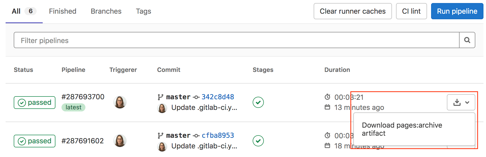
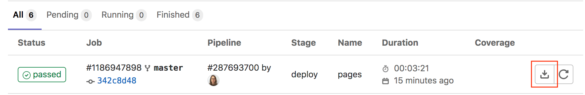
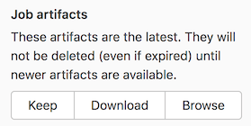
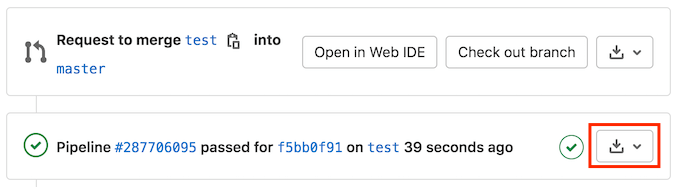
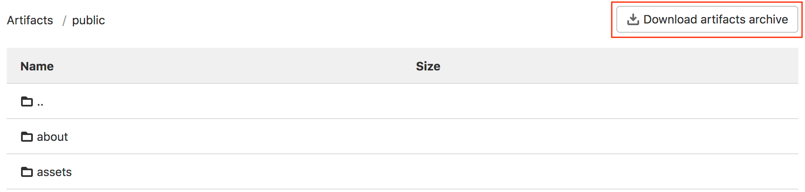

# Job artifacts **(FREE)**

> Introduced in [GitLab 12.4](https://gitlab.com/gitlab-org/gitlab/-/merge_requests/16675), artifacts in internal and private projects can be previewed when [GitLab Pages access control](../../administration/pages/index.md#access-control) is enabled.

Jobs can output an archive of files and directories. This output is known as a job artifact.

You can download job artifacts by using the GitLab UI or the [API](../../api/job_artifacts.md#get-job-artifacts).

<i class="fa fa-youtube-play youtube" aria-hidden="true"></i>
For an overview of job artifacts, watch the video [GitLab CI pipelines, artifacts, and environments](https://www.youtube.com/watch?v=PCKDICEe10s).
Or, for an introduction, watch [GitLab CI pipeline tutorial for beginners](https://www.youtube.com/watch?v=Jav4vbUrqII).

For administrator information about job artifact storage, see [administering job artifacts](../../administration/job_artifacts.md).

## Create job artifacts

To create job artifacts, use the `artifacts` keyword in your `.gitlab-ci.yml` file:

```yaml
pdf:
  script: xelatex mycv.tex
  artifacts:
    paths:
      - mycv.pdf
    expire_in: 1 week
```

In this example, a job named `pdf` calls the `xelatex` command to build a PDF file from the
LaTeX source file, `mycv.tex`.

The `paths` keyword determines which files to add to the job artifacts.
All paths to files and directories are relative to the repository where the job was created.

The `expire_in` keyword determines how long GitLab keeps the job artifacts.
You can also [use the UI to keep job artifacts from expiring](#download-job-artifacts).
If `expire_in` is not defined, the
[instance-wide setting](../../user/admin_area/settings/continuous_integration.md#default-artifacts-expiration)
is used.

If you run two types of pipelines (like branch and scheduled) for the same ref,
the pipeline that finishes later creates the job artifact.

For more examples, view the [keyword reference for the `.gitlab-ci.yml` file](../yaml/index.md#artifacts).

## Download job artifacts

You can download job artifacts or view the job archive:

- On the **Pipelines** page, to the right of the pipeline:

  

- On the **Jobs** page, to the right of the job:

  

- On a job's detail page. The **Keep** button indicates an `expire_in` value was set:

  

- On a merge request, by the pipeline details:

  

- When browsing an archive:

  

  If [GitLab Pages](../../administration/pages/index.md) is enabled in the project, you can preview
  HTML files in the artifacts directly in your browser. If the project is internal or private, you must
  enable [GitLab Pages access control](../../administration/pages/index.md#access-control) to preview
  HTML files.

## View failed job artifacts

If the latest job has failed to upload the artifacts, you can see that
information in the UI.


## Delete job artifacts

WARNING:
This is a destructive action that leads to data loss. Use with caution.

You can delete a single job, which also removes the job's
artifacts and log. You must be:

- The owner of the job.
- A [maintainer](../../user/permissions.md#gitlab-cicd-permissions) of the project.

To delete a job:

1. Go to a job's detail page.
1. At the top right of the job's log, select the trash icon.
1. Confirm the deletion.

## Retrieve job artifacts for other projects

To retrieve a job artifact from a different project, you might need to use a
private token to [authenticate and download](../../api/job_artifacts.md#get-job-artifacts)
the artifact.

## How searching for job artifacts works

In [GitLab 13.5](https://gitlab.com/gitlab-org/gitlab/-/issues/201784) and later, artifacts
for [parent and child pipelines](parent_child_pipelines.md) are searched in hierarchical
order from parent to child. For example, if both parent and child pipelines have a
job with the same name, the job artifact from the parent pipeline is returned.

## Access the latest job artifacts by URL

You can download job artifacts from the latest successful pipeline by using a URL.

To download the whole artifacts archive:

```plaintext
https://example.com/<namespace>/<project>/-/jobs/artifacts/<ref>/download?job=<job_name>
```

To download a single file from the artifacts:

```plaintext
https://example.com/<namespace>/<project>/-/jobs/artifacts/<ref>/raw/<path_to_file>?job=<job_name>
```

For example, to download the latest artifacts of the job named `coverage` in
the `main` branch of the `gitlab` project in the `gitlab-org`
namespace:

```plaintext
https://gitlab.com/gitlab-org/gitlab/-/jobs/artifacts/main/download?job=coverage
```

To download the file `review/index.html` from the same artifacts:

```plaintext
https://gitlab.com/gitlab-org/gitlab/-/jobs/artifacts/main/raw/review/index.html?job=coverage
```

To browse the latest job artifacts:

```plaintext
https://example.com/<namespace>/<project>/-/jobs/artifacts/<ref>/browse?job=<job_name>
```

For example:

```plaintext
https://gitlab.com/gitlab-org/gitlab/-/jobs/artifacts/main/browse?job=coverage
```

To download specific files, including HTML files that
are shown in [GitLab Pages](../../administration/pages/index.md):

```plaintext
https://example.com/<namespace>/<project>/-/jobs/artifacts/<ref>/file/<path>?job=<job_name>
```

For example, when a job `coverage` creates the artifact `htmlcov/index.html`:

```plaintext
https://gitlab.com/gitlab-org/gitlab/-/jobs/artifacts/main/file/htmlcov/index.html?job=coverage
```

## When job artifacts are deleted

See the [`expire_in`](../yaml/index.md#artifactsexpire_in) documentation for information on when
job artifacts are deleted.

### Keep artifacts from most recent successful jobs

> - [Introduced](https://gitlab.com/gitlab-org/gitlab/-/issues/16267) in GitLab 13.0.
> - [Feature flag removed](https://gitlab.com/gitlab-org/gitlab/-/issues/229936) in GitLab 13.4.
> - [Made optional with a CI/CD setting](https://gitlab.com/gitlab-org/gitlab/-/issues/241026) in GitLab 13.8.

Keeping the latest artifacts can use a large amount of storage space in projects
with a lot of jobs or large artifacts. If the latest artifacts are not needed in
a project, you can disable this behavior to save space:

1. Go to the project's **Settings > CI/CD > Artifacts**.
1. Clear the **Keep artifacts from most recent successful jobs** checkbox.

You can disable this behavior for all projects on a self-managed instance in the
[instance's CI/CD settings](../../user/admin_area/settings/continuous_integration.md#keep-the-latest-artifacts-for-all-jobs-in-the-latest-successful-pipelines).

When you disable the feature, the latest artifacts do not immediately expire.
A new pipeline must run before the latest artifacts can expire and be deleted.

## Troubleshooting job artifacts

### Error message `No files to upload`

This message is often preceded by other errors or warnings that specify the filename and why it wasn't
generated. Check the job log for these messages.

If you find no helpful messages, retry the failed job after activating
[CI/CD debug logging](../variables/index.md#debug-logging).
This logging should provide information to help you investigate further.
