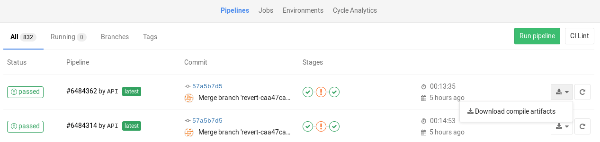

# Job artifacts

> - Introduced in GitLab 8.2 and GitLab Runner 0.7.0.
> - Starting with GitLab 8.4 and GitLab Runner 1.0, the artifacts archive format changed to `ZIP`, and it's now possible to browse its contents, with the added ability of downloading the files separately.
> - In GitLab 8.17, builds were renamed to jobs.
> - The artifacts browser is available only for new artifacts that are sent to GitLab using GitLab Runner version 1.0 and up. You cannot browse old artifacts already uploaded to GitLab.

Job artifacts are a list of files and directories created by a job
once it finishes. This feature is [enabled by default](../../administration/job_artifacts.md) in all
GitLab installations.

Job artifacts created by GitLab Runner are uploaded to GitLab and are downloadable as a single archive using the GitLab UI or the [GitLab API](../../api/job_artifacts.md#get-job-artifacts).

<i class="fa fa-youtube-play youtube" aria-hidden="true"></i>
For an overview, watch the video [GitLab CI Pipeline, Artifacts, and Environments](https://www.youtube.com/watch?v=PCKDICEe10s).
Watch also [GitLab CI pipeline tutorial for beginners](https://www.youtube.com/watch?v=Jav4vbUrqII).

## Defining artifacts in `.gitlab-ci.yml`

A simple example of using the artifacts definition in `.gitlab-ci.yml` would be
the following:

```yaml
pdf:
  script: xelatex mycv.tex
  artifacts:
    paths:
      - mycv.pdf
    expire_in: 1 week
```

A job named `pdf` calls the `xelatex` command to build a PDF file from the
latex source file `mycv.tex`. We then define the `artifacts` paths which in
turn are defined with the `paths` keyword. All paths to files and directories
are relative to the repository that was cloned during the build.

By default, the artifacts upload when the job succeeds. You can also set artifacts to upload
when the job fails, or always, by using [`artifacts:when`](../yaml/README.md#artifactswhen)
keyword. GitLab keeps these uploaded artifacts for 1 week, as defined
by the `expire_in` definition. You can keep the artifacts from expiring
via the [web interface](#browsing-artifacts). If the expiry time is not defined, it defaults
to the [instance wide setting](../../user/admin_area/settings/continuous_integration.md#default-artifacts-expiration).

For more examples on artifacts, follow the [artifacts reference in
`.gitlab-ci.yml`](../yaml/README.md#artifacts).

### `artifacts:reports`

> - [Introduced](https://gitlab.com/gitlab-org/gitlab-foss/-/merge_requests/20390) in GitLab 11.2.
> - Requires GitLab Runner 11.2 and above.

The `artifacts:reports` keyword is used for collecting test reports, code quality
reports, and security reports from jobs. It also exposes these reports in GitLab's
UI (merge requests, pipeline views, and security dashboards).

The test reports are collected regardless of the job results (success or failure).
You can use [`artifacts:expire_in`](../yaml/README.md#artifactsexpire_in) to set up an expiration
date for their artifacts.

If you also want the ability to browse the report output files, include the
[`artifacts:paths`](../yaml/README.md#artifactspaths) keyword.

#### `artifacts:reports:junit`

> - [Introduced](https://gitlab.com/gitlab-org/gitlab-foss/-/merge_requests/20390) in GitLab 11.2.
> - Requires GitLab Runner 11.2 and above.

The `junit` report collects [JUnit report format XML files](https://www.ibm.com/support/knowledgecenter/en/SSQ2R2_14.1.0/com.ibm.rsar.analysis.codereview.cobol.doc/topics/cac_useresults_junit.html)
as artifacts. Although JUnit was originally developed in Java, there are many
third party ports for other
languages like JavaScript, Python, Ruby, and so on.

See [Unit test reports](../unit_test_reports.md) for more details and examples.
Below is an example of collecting a JUnit report format XML file from Ruby's RSpec test tool:

```yaml
rspec:
  stage: test
  script:
    - bundle install
    - rspec --format RspecJunitFormatter --out rspec.xml
  artifacts:
    reports:
      junit: rspec.xml
```

The collected Unit test reports upload to GitLab as an artifact and display in merge requests.

If the JUnit tool you use exports to multiple XML files, specify
multiple test report paths within a single job to
concatenate them into a single file. Use a filename pattern (`junit: rspec-*.xml`),
an array of filenames (`junit: [rspec-1.xml, rspec-2.xml, rspec-3.xml]`), or a
combination thereof (`junit: [rspec.xml, test-results/TEST-*.xml]`).

#### `artifacts:reports:dotenv`

> - [Introduced](https://gitlab.com/gitlab-org/gitlab/-/issues/17066) in GitLab 12.9.
> - Requires GitLab Runner 11.5 and later.

The `dotenv` report collects a set of environment variables as artifacts.

The collected variables are registered as runtime-created variables of the job,
which is useful to [set dynamic environment URLs after a job finishes](../environments/index.md#set-dynamic-environment-urls-after-a-job-finishes).

There are a couple of exceptions to the [original dotenv rules](https://github.com/motdotla/dotenv#rules):

- The variable key can contain only letters, digits, and underscores (`_`).
- The maximum size of the `.env` file is 5 KB.
- In GitLab 13.5 and older, the maximum number of inherited variables is 10.
- In [GitLab 13.6 and later](https://gitlab.com/gitlab-org/gitlab/-/issues/247913),
  the maximum number of inherited variables is 20.
- Variable substitution in the `.env` file is not supported.
- The `.env` file can't have empty lines or comments (starting with `#`).
- Key values in the `env` file cannot have spaces or newline characters (`\n`), including when using single or double quotes.
- Quote escaping during parsing (`key = 'value'` -> `{key: "value"}`) is not supported.

#### `artifacts:reports:cobertura`

> - [Introduced](https://gitlab.com/gitlab-org/gitlab/-/issues/3708) in GitLab 12.9.
> - Requires [GitLab Runner](https://docs.gitlab.com/runner/) 11.5 and above.

The `cobertura` report collects [Cobertura coverage XML files](../../user/project/merge_requests/test_coverage_visualization.md).
The collected Cobertura coverage reports upload to GitLab as an artifact
and display in merge requests.

Cobertura was originally developed for Java, but there are many
third party ports for other languages like JavaScript, Python, Ruby, and so on.

#### `artifacts:reports:terraform`

> - [Introduced](https://gitlab.com/gitlab-org/gitlab/-/issues/207528) in GitLab 13.0.
> - Requires [GitLab Runner](https://docs.gitlab.com/runner/) 11.5 and above.

The `terraform` report obtains a Terraform `tfplan.json` file. [JQ processing required to remove credentials](../../user/infrastructure/mr_integration.md#setup). The collected Terraform
plan report uploads to GitLab as an artifact and displays
in merge requests. For more information, see
[Output `terraform plan` information into a merge request](../../user/infrastructure/mr_integration.md).

#### `artifacts:reports:codequality`

> - Introduced in [GitLab Starter](https://about.gitlab.com/pricing/) 11.5.
> - Made [available in all tiers](https://gitlab.com/gitlab-org/gitlab/-/issues/212499) in GitLab 13.2.
> - Requires GitLab Runner 11.5 and above.

The `codequality` report collects [CodeQuality issues](../../user/project/merge_requests/code_quality.md)
as artifacts.

The collected Code Quality report uploads to GitLab as an artifact and is summarized in merge requests.

#### `artifacts:reports:sast` **(ULTIMATE)**

> - Introduced in GitLab 11.5.
> - Requires GitLab Runner 11.5 and above.

The `sast` report collects [SAST vulnerabilities](../../user/application_security/sast/index.md)
as artifacts.

The collected SAST report uploads to GitLab as an artifact and is summarized
in merge requests and the pipeline view. It's also used to provide data for security
dashboards.

#### `artifacts:reports:secret_detection` **(ULTIMATE)**

> - Introduced in GitLab 13.1.
> - Requires GitLab Runner 11.5 and above.

The `secret-detection` report collects [detected secrets](../../user/application_security/secret_detection/index.md)
as artifacts.

The collected Secret Detection report is uploaded to GitLab as an artifact and summarized
in the merge requests and pipeline view. It's also used to provide data for security
dashboards.

#### `artifacts:reports:dependency_scanning` **(ULTIMATE)**

> - Introduced in GitLab 11.5.
> - Requires GitLab Runner 11.5 and above.

The `dependency_scanning` report collects [Dependency Scanning vulnerabilities](../../user/application_security/dependency_scanning/index.md)
as artifacts.

The collected Dependency Scanning report uploads to GitLab as an artifact and is summarized in merge requests and the pipeline view. It's also used to provide data for security
dashboards.

#### `artifacts:reports:container_scanning` **(ULTIMATE)**

> - Introduced in GitLab 11.5.
> - Requires GitLab Runner 11.5 and above.

The `container_scanning` report collects [Container Scanning vulnerabilities](../../user/application_security/container_scanning/index.md)
as artifacts.

The collected Container Scanning report uploads to GitLab as an artifact and
is summarized in merge requests and the pipeline view. It's also used to provide data for security
dashboards.

#### `artifacts:reports:dast` **(ULTIMATE)**

> - Introduced in GitLab 11.5.
> - Requires GitLab Runner 11.5 and above.

The `dast` report collects [DAST vulnerabilities](../../user/application_security/dast/index.md)
as artifacts.

The collected DAST report uploads to GitLab as an artifact and is summarized in merge requests and the pipeline view. It's also used to provide data for security
dashboards.

#### `artifacts:reports:coverage_fuzzing` **(ULTIMATE)**

> - Introduced in GitLab 13.4.
> - Requires GitLab Runner 13.4 or later.

The `coverage_fuzzing` report collects [coverage fuzzing bugs](../../user/application_security/coverage_fuzzing/index.md)
as artifacts.

The collected coverage fuzzing report uploads to GitLab as an artifact and is summarized in merge
requests and the pipeline view. It's also used to provide data for security dashboards.

#### `artifacts:reports:license_management` **(ULTIMATE)**

> - Introduced in GitLab 11.5.
> - Requires GitLab Runner 11.5 and above.

CAUTION: **Warning:**
This artifact is still valid but is **deprecated** in favor of the
[artifacts:reports:license_scanning](../pipelines/job_artifacts.md#artifactsreportslicense_scanning)
introduced in GitLab 12.8.

The `license_management` report collects [Licenses](../../user/compliance/license_compliance/index.md)
as artifacts.

The collected License Compliance report uploads to GitLab as an artifact and is summarized in merge requests and the pipeline view. It's also used to provide data for security
dashboards.

#### `artifacts:reports:license_scanning` **(ULTIMATE)**

> - Introduced in GitLab 12.8.
> - Requires GitLab Runner 11.5 and above.

The `license_scanning` report collects [Licenses](../../user/compliance/license_compliance/index.md)
as artifacts.

The License Compliance report uploads to GitLab as an artifact and displays automatically in merge requests and the pipeline view, and provide data for security
dashboards.

#### `artifacts:reports:performance` **(PREMIUM)**

> - Introduced in GitLab 11.5.
> - Requires GitLab Runner 11.5 and above.

The `performance` report collects [Browser Performance Testing metrics](../../user/project/merge_requests/browser_performance_testing.md)
as artifacts.

The collected Browser Performance report uploads to GitLab as an artifact and displays in merge requests.

#### `artifacts:reports:load_performance` **(PREMIUM)**

> - Introduced in [GitLab 13.2](https://gitlab.com/gitlab-org/gitlab/-/merge_requests/35260) in [GitLab Premium](https://about.gitlab.com/pricing/) 13.2.
> - Requires GitLab Runner 11.5 and above.

The `load_performance` report collects [Load Performance Testing metrics](../../user/project/merge_requests/load_performance_testing.md)
as artifacts.

The report is uploaded to GitLab as an artifact and is
shown in merge requests automatically.

#### `artifacts:reports:metrics` **(PREMIUM)**

> Introduced in GitLab 11.10.

The `metrics` report collects [Metrics](../metrics_reports.md)
as artifacts.

The collected Metrics report uploads to GitLab as an artifact and displays in merge requests.

#### `artifacts:reports:requirements` **(ULTIMATE)**

> - [Introduced](https://gitlab.com/groups/gitlab-org/-/epics/2859) in GitLab 13.1.
> - Requires GitLab Runner 11.5 and above.

The `requirements` report collects `requirements.json` files as artifacts.

The collected Requirements report uploads to GitLab as an artifact and
existing [requirements](../../user/project/requirements/index.md) are
marked as Satisfied.

## Browsing artifacts

> - From GitLab 9.2, PDFs, images, videos, and other formats can be previewed directly in the job artifacts browser without the need to download them.
> - Introduced in [GitLab 10.1](https://gitlab.com/gitlab-org/gitlab-foss/-/merge_requests/14399), HTML files in a public project can be previewed directly in a new tab without the need to download them when [GitLab Pages](../../administration/pages/index.md) is enabled. The same applies for textual formats (currently supported extensions: `.txt`, `.json`, and `.log`).
> - Introduced in [GitLab 12.4](https://gitlab.com/gitlab-org/gitlab/-/merge_requests/16675), artifacts in internal and private projects can be previewed when [GitLab Pages access control](../../administration/pages/index.md#access-control) is enabled.

After a job finishes, if you visit the job's specific page, there are three
buttons. You can download the artifacts archive or browse its contents, whereas
the **Keep** button appears only if you've set an [expiry date](../yaml/README.md#artifactsexpire_in) to the
artifacts in case you changed your mind and want to keep them.


The archive browser shows the name and the actual file size of each file in the
archive. If your artifacts contained directories, then you're also able to
browse inside them.

Below you can see what browsing looks like. In this case we have browsed inside
the archive and at this point there is one directory, a couple files, and
one HTML file that you can view directly online when
[GitLab Pages](../../administration/pages/index.md) is enabled (opens in a new tab).
Select artifacts in internal and private projects can only be previewed when
[GitLab Pages access control](../../administration/pages/index.md#access-control) is enabled.


## Downloading artifacts

If you need to download an artifact or the whole archive, there are buttons in various places
in the GitLab UI to do this:

1. While on the pipelines page, you can see the download icon for each job's
   artifacts and archive in the right corner:

   

1. While on the **Jobs** page, you can see the download icon for each job's
   artifacts and archive in the right corner:

   

1. While inside a specific job, you're presented with a download button
   along with the one that browses the archive:

   

1. And finally, when browsing an archive you can see the download button at
   the top right corner:

   

## Downloading the latest artifacts

It's possible to download the latest artifacts of a job via a well known URL
so you can use it for scripting purposes.

NOTE: **Note:**
The latest artifacts are created by jobs in the **most recent** successful pipeline
for the specific ref. If you run two types of pipelines for the same ref, timing determines the latest
artifact. For example, if a merge request creates a branch pipeline at the same time as a scheduled pipeline, the pipeline that completed most recently creates the latest artifact.

In [GitLab 13.5](https://gitlab.com/gitlab-org/gitlab/-/issues/201784) and later, artifacts
for [parent and child pipelines](../parent_child_pipelines.md) are searched in hierarchical
order from parent to child. For example, if both parent and child pipelines have a
job with the same name, the artifact from the parent pipeline is returned.

Artifacts for other pipelines can be accessed with direct access to them.

The structure of the URL to download the whole artifacts archive is the following:

```plaintext
https://example.com/<namespace>/<project>/-/jobs/artifacts/<ref>/download?job=<job_name>
```

To download a single file from the artifacts use the following URL:

```plaintext
https://example.com/<namespace>/<project>/-/jobs/artifacts/<ref>/raw/<path_to_file>?job=<job_name>
```

For example, to download the latest artifacts of the job named `coverage` of
the `master` branch of the `gitlab` project that belongs to the `gitlab-org`
namespace, the URL would be:

```plaintext
https://gitlab.com/gitlab-org/gitlab/-/jobs/artifacts/master/download?job=coverage
```

To download the file `coverage/index.html` from the same
artifacts use the following URL:

```plaintext
https://gitlab.com/gitlab-org/gitlab/-/jobs/artifacts/master/raw/coverage/index.html?job=coverage
```

There is also a URL to browse the latest job artifacts:

```plaintext
https://example.com/<namespace>/<project>/-/jobs/artifacts/<ref>/browse?job=<job_name>
```

For example:

```plaintext
https://gitlab.com/gitlab-org/gitlab/-/jobs/artifacts/master/browse?job=coverage
```

There is also a URL to specific files, including HTML files that
are shown in [GitLab Pages](../../administration/pages/index.md):

```plaintext
https://example.com/<namespace>/<project>/-/jobs/artifacts/<ref>/file/<path>?job=<job_name>
```

For example, when a job `coverage` creates the artifact `htmlcov/index.html`,
you can access it at:

```plaintext
https://gitlab.com/gitlab-org/gitlab/-/jobs/artifacts/master/file/htmlcov/index.html?job=coverage
```

The latest builds are also exposed in the UI in various places. Specifically,
look for the download button in:

- The main project's page
- The branches page
- The tags page

If the latest job has failed to upload the artifacts, you can see that
information in the UI.


## Erasing artifacts

DANGER: **Warning:**
This is a destructive action that leads to data loss. Use with caution.

You can erase a single job via the UI, which also removes the job's
artifacts and trace, if you are:

- The owner of the job.
- A [Maintainer](../../user/permissions.md#gitlab-cicd-permissions) of the project.

To erase a job:

1. Navigate to a job's page.
1. Click the trash icon at the top right of the job's trace.
1. Confirm the deletion.

## Retrieve artifacts of private projects when using GitLab CI

To retrieve a job artifact from a different project, you might need to use a
private token to [authenticate and download](../../api/job_artifacts.md#get-job-artifacts)
the artifact.

## Troubleshooting

### Error message `No files to upload`

This is often preceded by other errors or warnings that specify the filename and why it wasn't
generated in the first place. Please check the entire job log for such messages.

If you find no helpful messages, please retry the failed job after activating
[CI debug logging](../variables/README.md#debug-logging).
This provides useful information to investigate further.

<!-- ## Troubleshooting

Include any troubleshooting steps that you can foresee. If you know beforehand what issues
one might have when setting this up, or when something is changed, or on upgrading, it's
important to describe those, too. Think of things that may go wrong and include them here.
This is important to minimize requests for support, and to avoid doc comments with
questions that you know someone might ask.

Each scenario can be a third-level heading, e.g. `### Getting error message X`.
If you have none to add when creating a doc, leave this section in place
but commented out to help encourage others to add to it in the future. -->
